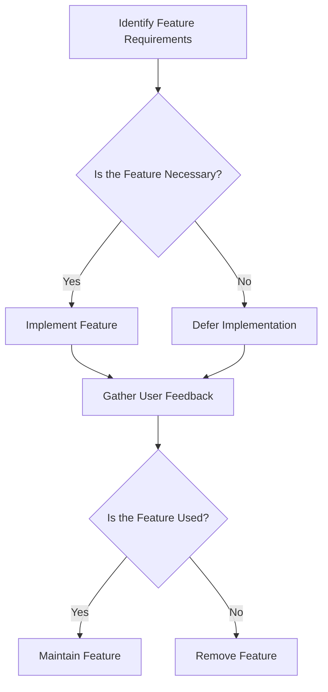

## 2.4 YAGNI (You Aren't Gonna Need It)

In the realm of software development, the YAGNI principle—short for "You Aren't Gonna Need It"—serves as a guiding beacon for developers striving to maintain simplicity and efficiency in their codebases. Originating from agile development practices, YAGNI encourages developers to implement only the features that are necessary at the moment, rather than anticipating future needs that may never materialize. This principle is a cornerstone of lean software development, focusing on delivering value by avoiding unnecessary complexity and resource waste.

### Understanding the YAGNI Principle

The YAGNI principle is rooted in the agile manifesto, which emphasizes responding to change over following a plan. It advises developers to resist the temptation to add functionality until it is absolutely required. This approach not only streamlines the development process but also helps in maintaining a clean and manageable codebase.

#### Origins in Agile Development

YAGNI is closely associated with Extreme Programming (XP), a methodology within the agile framework. XP advocates for practices that enhance software quality and responsiveness to changing customer requirements. By adhering to YAGNI, developers can focus on delivering the most critical features first, ensuring that the software evolves based on actual user feedback rather than speculative future needs.

### The Pitfalls of Premature Feature Implementation

Implementing features before they are needed can lead to several issues, including increased complexity, resource waste, and maintenance challenges. Let's explore these pitfalls in more detail:

#### Increased Complexity

Adding features prematurely can introduce unnecessary complexity into the codebase. This complexity often manifests as convoluted logic, redundant code paths, and a higher likelihood of bugs. As a result, the software becomes harder to understand, modify, and extend.

#### Resource Waste

Developing features that are not immediately needed consumes valuable resources, including time, effort, and budget. These resources could be better utilized to enhance existing features or address critical issues. By focusing on what is necessary, teams can allocate their resources more effectively.

#### Maintenance Challenges

Code that includes unnecessary features is more challenging to maintain. It requires additional testing, documentation, and debugging efforts. Moreover, as the software evolves, these unused features may become obsolete, leading to technical debt that must be addressed in future development cycles.

### Examples of YAGNI in Practice

To illustrate the impact of ignoring the YAGNI principle, consider the following examples where anticipating future requirements led to bloated or harder-to-maintain code:

#### Example 1: Over-Engineering a User Authentication System

A development team working on a simple web application decides to implement a complex user authentication system, anticipating future needs for multi-factor authentication, social media logins, and biometric verification. However, the current requirements only call for basic username and password authentication. As a result, the team spends significant time and resources building features that are not immediately needed, complicating the codebase and delaying the project's release.

#### Example 2: Implementing a Complex Reporting Module

In another scenario, a team is tasked with developing a reporting module for an enterprise application. Instead of starting with the essential reports required by the stakeholders, the team decides to build a comprehensive reporting engine capable of generating any report imaginable. This decision leads to a bloated codebase with numerous unused features, making it difficult to maintain and extend the module as new requirements emerge.

### Benefits of Adhering to YAGNI

By embracing the YAGNI principle, development teams can achieve more efficient development cycles and cleaner codebases. Here are some of the key benefits:

#### Efficient Development Cycles

Focusing on immediate needs allows teams to deliver features more quickly and respond to user feedback in real-time. This iterative approach ensures that the software evolves based on actual usage patterns, leading to a more user-centric product.

#### Cleaner Codebases

By avoiding unnecessary features, developers can maintain a cleaner and more manageable codebase. This simplicity makes it easier to understand, modify, and extend the software, reducing the likelihood of bugs and technical debt.

#### Enhanced Focus on Value Delivery

YAGNI encourages teams to prioritize features that deliver the most value to users. By concentrating on what is truly important, developers can ensure that their efforts align with the project's goals and stakeholder expectations.

### Balancing YAGNI with Scalability and Extensibility

While the YAGNI principle advocates for simplicity, it's important to balance this approach with the need for scalable and extensible designs. Here are some strategies to achieve this balance:

#### Iterative Development

Adopt an iterative development approach, where features are built incrementally based on user feedback and evolving requirements. This approach allows teams to adapt to changes without overcomplicating the initial implementation.

#### Refactoring

Regularly refactor the codebase to improve its structure and maintainability. Refactoring helps eliminate technical debt and ensures that the software remains flexible and adaptable to future changes.

#### Modular Design

Design the software in a modular fashion, where components are loosely coupled and highly cohesive. This design pattern allows for easier modification and extension of individual components without affecting the entire system.

### Validating Feature Necessity

Before committing development time to a new feature, it's crucial to validate its necessity with stakeholders. Here are some practices to ensure that only essential features are implemented:

#### Stakeholder Engagement

Engage stakeholders early and often to gather feedback and understand their priorities. This collaboration helps ensure that the development team focuses on features that align with the project's goals and user needs.

#### Prototyping

Create prototypes or mockups to visualize and test new features before fully implementing them. Prototyping allows stakeholders to provide feedback and make informed decisions about the feature's importance and feasibility.

#### Cost-Benefit Analysis

Conduct a cost-benefit analysis to evaluate the potential impact of a new feature. This analysis helps determine whether the feature's benefits justify the resources required for its development.

### YAGNI and Lean Software Development

The YAGNI principle is a key component of lean software development, which emphasizes delivering value by minimizing waste and maximizing efficiency. By focusing on what is truly necessary, teams can streamline their development processes and create software that meets user needs without unnecessary complexity.

#### Delivering Value

Lean software development prioritizes delivering value to users by focusing on features that address their most pressing needs. By adhering to YAGNI, teams can ensure that their efforts are aligned with this goal, resulting in a more valuable product.

#### Minimizing Waste

By avoiding unnecessary features, teams can minimize waste in terms of time, effort, and resources. This efficiency allows developers to concentrate on what matters most, enhancing the overall quality and effectiveness of the software.

### Try It Yourself: Applying YAGNI in Your Projects

To put the YAGNI principle into practice, consider the following exercises:

1. **Identify Unused Features**: Review your current projects and identify any features that are not actively used or required. Consider removing these features to simplify the codebase.

2. **Conduct a Stakeholder Workshop**: Organize a workshop with stakeholders to prioritize features based on their importance and impact. Use this feedback to guide your development efforts.

3. **Prototype a New Feature**: Before implementing a new feature, create a prototype or mockup to gather feedback from stakeholders. Use this feedback to refine the feature's design and ensure its necessity.

4. **Refactor for Simplicity**: Choose a section of your codebase that has become overly complex and refactor it to simplify its structure. Focus on removing unnecessary code and improving readability.

### Visualizing YAGNI in Software Development

To better understand the YAGNI principle and its impact on software development, let's visualize the process using a flowchart:

**Diagram Description**: This flowchart illustrates the decision-making process for implementing features based on the YAGNI principle. It emphasizes the importance of validating feature necessity and gathering user feedback to guide development efforts.

### Conclusion: Embrace YAGNI for Efficient Development

The YAGNI principle is a powerful tool for developers seeking to streamline their development processes and maintain clean, efficient codebases. By focusing on what is truly necessary and avoiding unnecessary complexity, teams can deliver more valuable software that meets user needs and adapts to changing requirements. Remember, this is just the beginning of your journey toward more efficient development practices. Keep experimenting, stay curious, and enjoy the journey!

## Quiz Time!



### What does the YAGNI principle stand for?

- [x] You Aren't Gonna Need It
- [ ] You Always Get New Ideas
- [ ] Your Application Grows Naturally
- [ ] You Are Getting New Innovations

> **Explanation:** YAGNI stands for "You Aren't Gonna Need It," a principle that encourages developers to avoid implementing features until they are necessary.

### Which agile methodology is closely associated with the YAGNI principle?

- [x] Extreme Programming (XP)
- [ ] Scrum
- [ ] Kanban
- [ ] Lean

> **Explanation:** YAGNI is closely associated with Extreme Programming (XP), which emphasizes practices that enhance software quality and responsiveness to change.

### What is a potential risk of ignoring the YAGNI principle?

- [x] Increased complexity and maintenance challenges
- [ ] Faster development cycles
- [ ] Improved stakeholder satisfaction
- [ ] Reduced technical debt

> **Explanation:** Ignoring YAGNI can lead to increased complexity and maintenance challenges due to unnecessary features.

### How can teams validate the necessity of a feature before implementation?

- [x] Conducting stakeholder workshops
- [ ] Implementing the feature immediately
- [ ] Ignoring stakeholder feedback
- [ ] Focusing solely on technical feasibility

> **Explanation:** Conducting stakeholder workshops helps teams validate the necessity of a feature by gathering feedback and understanding priorities.

### What is a key benefit of adhering to the YAGNI principle?

- [x] Cleaner codebases
- [ ] More complex software
- [ ] Longer development cycles
- [ ] Increased resource waste

> **Explanation:** Adhering to YAGNI results in cleaner codebases by avoiding unnecessary features and complexity.

### Which practice helps balance YAGNI with scalability and extensibility?

- [x] Modular design
- [ ] Hardcoding features
- [ ] Premature optimization
- [ ] Ignoring user feedback

> **Explanation:** Modular design allows for easier modification and extension of components, balancing YAGNI with scalability and extensibility.

### What does lean software development emphasize?

- [x] Delivering value by minimizing waste
- [ ] Implementing all possible features
- [ ] Focusing on long-term planning
- [ ] Ignoring user feedback

> **Explanation:** Lean software development emphasizes delivering value by minimizing waste and focusing on essential features.

### How can YAGNI contribute to efficient development cycles?

- [x] By focusing on immediate needs and user feedback
- [ ] By implementing all requested features
- [ ] By ignoring stakeholder input
- [ ] By prioritizing technical complexity

> **Explanation:** YAGNI contributes to efficient development cycles by focusing on immediate needs and user feedback, ensuring that the software evolves based on actual usage.

### What is a common outcome of implementing features prematurely?

- [x] Increased resource waste
- [ ] Faster project completion
- [ ] Improved software quality
- [ ] Reduced technical debt

> **Explanation:** Implementing features prematurely often leads to increased resource waste, as time and effort are spent on unnecessary functionality.

### True or False: YAGNI encourages developers to anticipate all future requirements.

- [ ] True
- [x] False

> **Explanation:** False. YAGNI encourages developers to avoid anticipating future requirements and to implement only necessary features.


