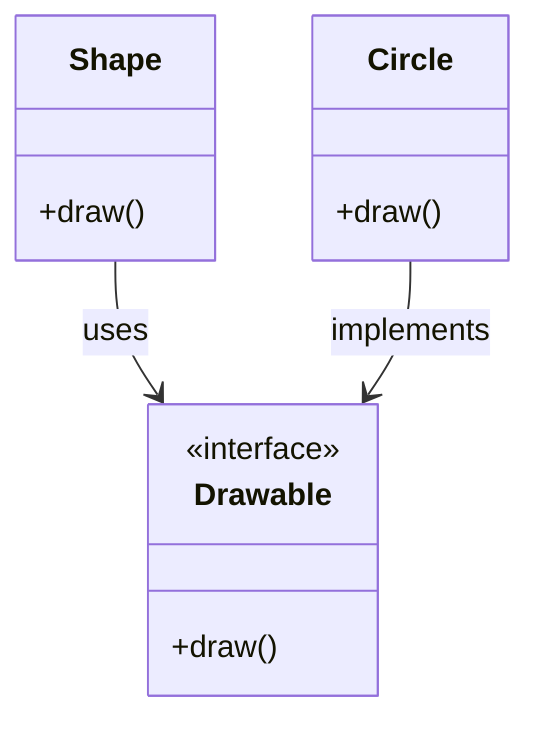

## 2.5 Composition Over Inheritance

In the realm of object-oriented design, the debate between composition and inheritance is a pivotal one. Both are fundamental concepts in Java, each with its own set of advantages and disadvantages. This section delves into why composition is often favored over inheritance, offering flexibility, maintainability, and scalability in software design.

### Understanding Inheritance and Composition

**Inheritance** is a mechanism where a new class, known as a subclass, is derived from an existing class, called a superclass. The subclass inherits fields and methods from the superclass, allowing for code reuse and the creation of hierarchical class structures. However, this can lead to tightly coupled code and inflexible designs.

**Composition**, on the other hand, involves creating classes that contain instances of other classes, thereby delegating responsibilities to these contained objects. This approach promotes loose coupling and enhances flexibility, as it allows for the dynamic composition of behaviors at runtime.

### Benefits of Favoring Composition

1. **Greater Flexibility**: Composition allows for the dynamic assembly of objects, enabling changes in behavior without altering existing code. This is particularly useful in scenarios where behavior needs to be extended or modified at runtime.

2. **Easier Code Reuse**: By composing objects, you can reuse existing components across different parts of an application without the constraints of a rigid class hierarchy.

3. **Reduced Coupling**: Composition leads to a design where components are less dependent on each other, making the system more modular and easier to maintain.

4. **Avoiding Fragile Base Class Problem**: Inheritance can lead to the fragile base class problem, where changes in a superclass can inadvertently affect subclasses. Composition mitigates this risk by encapsulating changes within individual components.

### Java Examples: Composition vs. Inheritance

Let's explore how composition can replace inheritance in Java with practical examples.

#### Inheritance Example

Consider a simple class hierarchy for shapes:

```java
// Base class
class Shape {
    public void draw() {
        System.out.println("Drawing a shape");
    }
}

// Derived class
class Circle extends Shape {
    @Override
    public void draw() {
        System.out.println("Drawing a circle");
    }
}
```

While this example is straightforward, adding more shapes would require additional subclasses, leading to a potentially bloated hierarchy.

#### Composition Example

Now, let's refactor this using composition:

```java
// Interface for drawing behavior
interface Drawable {
    void draw();
}

// Concrete implementation
class Circle implements Drawable {
    @Override
    public void draw() {
        System.out.println("Drawing a circle");
    }
}

// Client class using composition
class Shape {
    private Drawable drawable;

    public Shape(Drawable drawable) {
        this.drawable = drawable;
    }

    public void draw() {
        drawable.draw();
    }
}

// Usage
public class Main {
    public static void main(String[] args) {
        Drawable circle = new Circle();
        Shape shape = new Shape(circle);
        shape.draw(); // Outputs: Drawing a circle
    }
}
```

In this example, the `Shape` class is composed of a `Drawable` object, allowing for flexible behavior changes without modifying the `Shape` class itself.

### When to Use Inheritance vs. Composition

While composition offers numerous benefits, there are scenarios where inheritance is appropriate:

- **Is-a Relationship**: Use inheritance when there is a clear is-a relationship between classes, such as a `Dog` is a `Mammal`.
- **Shared Behavior**: When multiple subclasses share common behavior that is unlikely to change, inheritance can be a suitable choice.

However, in most cases, composition should be preferred due to its flexibility and ability to adapt to changing requirements.

### Design Patterns Utilizing Composition

Several design patterns leverage composition to solve common design issues:

#### Strategy Pattern

The Strategy Pattern defines a family of algorithms, encapsulates each one, and makes them interchangeable. This pattern uses composition to delegate behavior to strategy objects.

```java
// Strategy interface
interface PaymentStrategy {
    void pay(int amount);
}

// Concrete strategy
class CreditCardPayment implements PaymentStrategy {
    @Override
    public void pay(int amount) {
        System.out.println("Paid " + amount + " using Credit Card.");
    }
}

// Context
class ShoppingCart {
    private PaymentStrategy paymentStrategy;

    public ShoppingCart(PaymentStrategy paymentStrategy) {
        this.paymentStrategy = paymentStrategy;
    }

    public void checkout(int amount) {
        paymentStrategy.pay(amount);
    }
}

// Usage
public class Main {
    public static void main(String[] args) {
        PaymentStrategy strategy = new CreditCardPayment();
        ShoppingCart cart = new ShoppingCart(strategy);
        cart.checkout(100); // Outputs: Paid 100 using Credit Card.
    }
}
```

#### Decorator Pattern

The Decorator Pattern allows behavior to be added to individual objects, dynamically, without affecting the behavior of other objects from the same class. This pattern uses composition to wrap objects with additional functionality.

```java
// Component interface
interface Coffee {
    String getDescription();
    double getCost();
}

// Concrete component
class SimpleCoffee implements Coffee {
    @Override
    public String getDescription() {
        return "Simple coffee";
    }

    @Override
    public double getCost() {
        return 5.0;
    }
}

// Decorator
class MilkDecorator implements Coffee {
    private Coffee coffee;

    public MilkDecorator(Coffee coffee) {
        this.coffee = coffee;
    }

    @Override
    public String getDescription() {
        return coffee.getDescription() + ", milk";
    }

    @Override
    public double getCost() {
        return coffee.getCost() + 1.5;
    }
}

// Usage
public class Main {
    public static void main(String[] args) {
        Coffee coffee = new SimpleCoffee();
        System.out.println(coffee.getDescription() + " $" + coffee.getCost());

        coffee = new MilkDecorator(coffee);
        System.out.println(coffee.getDescription() + " $" + coffee.getCost());
    }
}
```

### The Pitfalls of Excessive Inheritance

Excessive inheritance can lead to several issues:

- **Fragile Base Classes**: Changes in a superclass can have unintended consequences on subclasses.
- **Tight Coupling**: Subclasses are tightly coupled to their superclasses, making changes difficult.
- **Limited Flexibility**: Inheritance hierarchies are rigid and can be challenging to modify.

### Thoughtful Design Decisions

When deciding between inheritance and composition, consider:

- **Extensibility**: Will the design need to accommodate future changes?
- **Code Clarity**: Does the design clearly express the relationships between components?
- **Maintainability**: How easy will it be to maintain and extend the codebase?

### Potential Downsides of Composition

While composition offers many advantages, it can introduce complexity in object creation. To mitigate this:

- **Use Factories**: Employ factory methods or classes to manage object creation.
- **Leverage Dependency Injection**: Use frameworks like Spring to inject dependencies, simplifying object management.

### Visualizing Composition Over Inheritance

Let's visualize the relationship between composition and inheritance using a class diagram:



In this diagram, `Shape` uses a `Drawable` interface, and `Circle` implements `Drawable`, demonstrating how composition allows for flexible behavior changes.

### Try It Yourself

Experiment with the provided examples by:

- Adding new `Drawable` implementations and using them in the `Shape` class.
- Creating additional decorators for the `Coffee` example to add more features like sugar or whipped cream.

### Knowledge Check

- How does composition enhance flexibility in software design?
- What are the key differences between inheritance and composition?
- In what scenarios is inheritance more appropriate than composition?

### Conclusion

Embracing composition over inheritance can lead to more flexible, maintainable, and scalable software designs. By understanding when to use each approach, you can make informed design decisions that enhance the quality of your Java applications. Remember, this is just the beginning. As you progress, continue to explore the rich landscape of design patterns and their applications in Java. Keep experimenting, stay curious, and enjoy the journey!

## Quiz Time!



### What is a key advantage of using composition over inheritance?

- [x] Greater flexibility and modularity
- [ ] Easier to implement
- [ ] Requires less code
- [ ] Automatically inherits behavior

> **Explanation:** Composition allows for greater flexibility and modularity by enabling dynamic behavior changes without altering existing code.

### Which design pattern is an example of using composition?

- [x] Strategy Pattern
- [ ] Singleton Pattern
- [ ] Template Method Pattern
- [ ] Factory Method Pattern

> **Explanation:** The Strategy Pattern uses composition to delegate behavior to interchangeable strategy objects.

### What problem can excessive inheritance lead to?

- [x] Fragile base class problem
- [ ] Increased performance
- [ ] Simplified codebase
- [ ] Enhanced security

> **Explanation:** Excessive inheritance can lead to the fragile base class problem, where changes in a superclass can affect subclasses unexpectedly.

### In what scenario is inheritance more appropriate than composition?

- [x] When there is a clear is-a relationship
- [ ] When behavior needs to change at runtime
- [ ] When objects need to be composed dynamically
- [ ] When code reuse is not a concern

> **Explanation:** Inheritance is more appropriate when there is a clear is-a relationship, such as a `Dog` is a `Mammal`.

### How can the complexity of object creation in composition be mitigated?

- [x] Using factory methods or classes
- [ ] Avoiding interfaces
- [ ] Relying solely on inheritance
- [ ] Ignoring dependency injection

> **Explanation:** Using factory methods or classes can help manage object creation complexity in composition.

### What is the primary focus of the Decorator Pattern?

- [x] Adding behavior to objects dynamically
- [ ] Ensuring a single instance
- [ ] Defining a family of algorithms
- [ ] Providing a simplified interface

> **Explanation:** The Decorator Pattern focuses on adding behavior to objects dynamically without affecting other objects from the same class.

### Which of the following is NOT a benefit of composition?

- [ ] Greater flexibility
- [x] Automatic behavior inheritance
- [ ] Easier code reuse
- [ ] Reduced coupling

> **Explanation:** Automatic behavior inheritance is a feature of inheritance, not composition.

### What is a potential downside of using composition?

- [x] Increased complexity in object creation
- [ ] Tight coupling
- [ ] Fragile base classes
- [ ] Limited flexibility

> **Explanation:** Composition can lead to increased complexity in object creation, which can be mitigated using design patterns like factories.

### How does the Strategy Pattern utilize composition?

- [x] By delegating behavior to strategy objects
- [ ] By inheriting from a base class
- [ ] By defining a fixed algorithm structure
- [ ] By providing a global access point

> **Explanation:** The Strategy Pattern utilizes composition by delegating behavior to interchangeable strategy objects.

### True or False: Composition should always be preferred over inheritance.

- [ ] True
- [x] False

> **Explanation:** While composition offers many benefits, there are scenarios where inheritance is more appropriate, such as when there is a clear is-a relationship.


