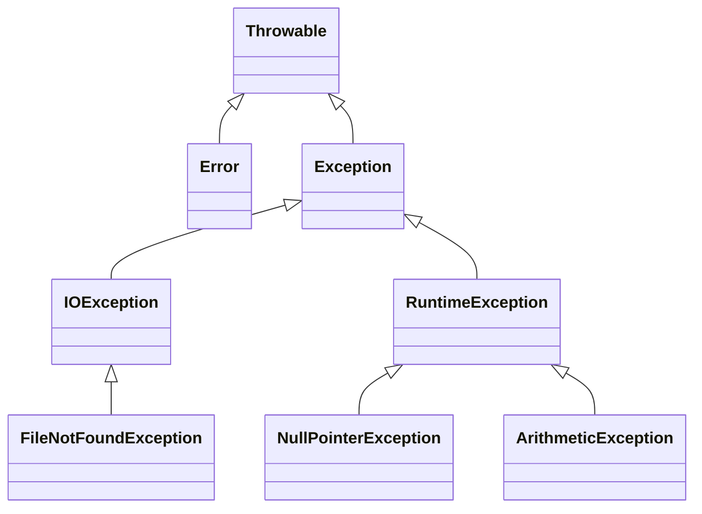

## 2.5 Exception Handling in Java

Exception handling is a critical aspect of Java programming, enabling developers to create robust and fault-tolerant applications. This section delves into the intricacies of Java's exception handling mechanism, exploring the exception hierarchy, the distinction between checked and unchecked exceptions, and the best practices for managing errors effectively.

### Understanding the Exception Hierarchy

Java's exception handling is built upon a well-defined hierarchy of classes, all of which are subclasses of `java.lang.Throwable`. This hierarchy is divided into two main branches: `Exception` and `Error`.



**Caption**: The class diagram illustrates the hierarchy of exceptions in Java, showing the relationship between `Throwable`, `Exception`, and `Error`.

- **Throwable**: The superclass for all errors and exceptions in Java.
- **Error**: Represents serious problems that applications should not attempt to catch, such as `OutOfMemoryError`.
- **Exception**: Represents conditions that applications might want to catch. It is further divided into:
  - **Checked Exceptions**: Must be declared in a method or constructor's `throws` clause if they can be thrown by the execution of the method or constructor and propagated outside the method or constructor boundary.
  - **Unchecked Exceptions**: Includes `RuntimeException` and its subclasses, which do not need to be declared or caught.

### Checked vs. Unchecked Exceptions

#### Checked Exceptions

Checked exceptions are those that the Java compiler forces you to handle. They represent conditions that a reasonable application might want to recover from, such as `IOException` or `SQLException`.

**Example**:

```java
import java.io.FileReader;
import java.io.IOException;

public class CheckedExceptionExample {
    public static void main(String[] args) {
        try {
            FileReader file = new FileReader("somefile.txt");
            file.read();
        } catch (IOException e) {
            System.out.println("An IOException was caught: " + e.getMessage());
        }
    }
}
```

**Explanation**: In this example, `IOException` is a checked exception that must be caught or declared in the method signature.

#### Unchecked Exceptions

Unchecked exceptions are those that the compiler does not require you to handle. They are subclasses of `RuntimeException` and typically indicate programming errors, such as logic errors or improper use of an API.

**Example**:

```java
public class UncheckedExceptionExample {
    public static void main(String[] args) {
        int[] numbers = {1, 2, 3};
        System.out.println(numbers[3]); // This will throw ArrayIndexOutOfBoundsException
    }
}
```

**Explanation**: `ArrayIndexOutOfBoundsException` is an unchecked exception that occurs due to accessing an invalid index of an array.

### Using Try-Catch-Finally Blocks

The `try-catch-finally` construct is the cornerstone of exception handling in Java. It allows you to catch exceptions and execute code regardless of whether an exception occurred.

**Example**:

```java
public class TryCatchFinallyExample {
    public static void main(String[] args) {
        try {
            int result = divide(10, 0);
            System.out.println("Result: " + result);
        } catch (ArithmeticException e) {
            System.out.println("Cannot divide by zero: " + e.getMessage());
        } finally {
            System.out.println("Execution completed.");
        }
    }

    public static int divide(int a, int b) {
        return a / b;
    }
}
```

**Explanation**: The `finally` block executes regardless of whether an exception is thrown, making it ideal for cleanup activities.

### Try-With-Resources Statement

Introduced in Java 7, the try-with-resources statement simplifies resource management by automatically closing resources that implement the `AutoCloseable` interface.

**Example**:

```java
import java.io.BufferedReader;
import java.io.FileReader;
import java.io.IOException;

public class TryWithResourcesExample {
    public static void main(String[] args) {
        try (BufferedReader br = new BufferedReader(new FileReader("somefile.txt"))) {
            System.out.println(br.readLine());
        } catch (IOException e) {
            System.out.println("An IOException was caught: " + e.getMessage());
        }
    }
}
```

**Explanation**: The `BufferedReader` is automatically closed at the end of the try block, even if an exception is thrown.

### Creating Custom Exceptions

Custom exceptions allow you to create meaningful and specific error messages for your application. They should extend `Exception` or `RuntimeException`.

**Example**:

```java
public class CustomException extends Exception {
    public CustomException(String message) {
        super(message);
    }
}

public class CustomExceptionExample {
    public static void main(String[] args) {
        try {
            throw new CustomException("This is a custom exception");
        } catch (CustomException e) {
            System.out.println(e.getMessage());
        }
    }
}
```

**Explanation**: Custom exceptions provide a way to encapsulate specific error conditions in your application.

### Best Practices for Exception Handling

1. **Catch Specific Exceptions**: Always catch the most specific exception first to avoid catching unexpected exceptions.
2. **Avoid Empty Catch Blocks**: Never leave catch blocks empty; always handle the exception or log it.
3. **Use Finally for Cleanup**: Use the `finally` block for cleanup activities like closing resources.
4. **Don't Swallow Exceptions**: Avoid catching exceptions without handling them, as this can hide errors.
5. **Use Custom Exceptions Judiciously**: Create custom exceptions only when they provide additional context or information.
6. **Log Exceptions**: Always log exceptions with sufficient detail to aid in debugging.
7. **Document Exceptions**: Use Javadoc to document the exceptions a method can throw.

### Exception Handling in Design Patterns

Exception handling is often integrated into design patterns to manage errors gracefully. For example, in the Command Pattern, exceptions can be handled within the `execute` method of a command.

**Example**:

```java
public interface Command {
    void execute() throws CommandException;
}

public class ConcreteCommand implements Command {
    @Override
    public void execute() throws CommandException {
        try {
            // Command logic
        } catch (Exception e) {
            throw new CommandException("Command execution failed", e);
        }
    }
}

public class CommandException extends Exception {
    public CommandException(String message, Throwable cause) {
        super(message, cause);
    }
}
```

**Explanation**: The `CommandException` encapsulates any errors that occur during command execution, allowing the client to handle them appropriately.

### Common Mistakes and How to Avoid Them

1. **Ignoring Exceptions**: Ignoring exceptions can lead to silent failures. Always handle exceptions appropriately.
2. **Overusing Checked Exceptions**: Use checked exceptions only when the caller can reasonably handle the exception.
3. **Throwing Generic Exceptions**: Avoid throwing generic exceptions like `Exception` or `Throwable`. Use specific exceptions instead.
4. **Poor Exception Messages**: Provide clear and informative exception messages to aid in debugging.
5. **Relying on Exceptions for Control Flow**: Exceptions should not be used for normal control flow, as they can degrade performance.

### Conclusion

Exception handling is a fundamental aspect of Java programming that, when done correctly, can significantly enhance the robustness and maintainability of your applications. By understanding the exception hierarchy, using try-catch-finally and try-with-resources effectively, and following best practices, you can manage errors gracefully and create more resilient software.

---

## Test Your Knowledge: Java Exception Handling Quiz



### What is the superclass of all exceptions in Java?

- [x] Throwable
- [ ] Exception
- [ ] Error
- [ ] RuntimeException

> **Explanation:** `Throwable` is the superclass of all exceptions and errors in Java.

### Which of the following is a checked exception?

- [x] IOException
- [ ] NullPointerException
- [ ] ArithmeticException
- [ ] ArrayIndexOutOfBoundsException

> **Explanation:** `IOException` is a checked exception that must be declared or caught.

### What is the purpose of the finally block?

- [x] To execute code regardless of whether an exception is thrown
- [ ] To catch exceptions
- [ ] To declare exceptions
- [ ] To throw exceptions

> **Explanation:** The `finally` block is used for cleanup activities and executes regardless of whether an exception is thrown.

### How does try-with-resources simplify resource management?

- [x] It automatically closes resources that implement AutoCloseable
- [ ] It eliminates the need for catch blocks
- [ ] It prevents exceptions from being thrown
- [ ] It improves performance

> **Explanation:** Try-with-resources automatically closes resources, reducing boilerplate code.

### When should custom exceptions be used?

- [x] When they provide additional context or information
- [ ] For every error condition
- [x] When specific error handling is required
- [ ] To replace all standard exceptions

> **Explanation:** Custom exceptions should be used when they add value by providing specific context or handling.

### What is a common mistake in exception handling?

- [x] Ignoring exceptions
- [ ] Using specific exceptions
- [ ] Logging exceptions
- [ ] Documenting exceptions

> **Explanation:** Ignoring exceptions can lead to silent failures and should be avoided.

### Which statement is true about unchecked exceptions?

- [x] They are subclasses of RuntimeException
- [ ] They must be declared in the method signature
- [x] They indicate programming errors
- [ ] They are always caught

> **Explanation:** Unchecked exceptions are subclasses of `RuntimeException` and often indicate programming errors.

### What is the benefit of logging exceptions?

- [x] It aids in debugging by providing detailed information
- [ ] It prevents exceptions from occurring
- [ ] It improves application performance
- [ ] It eliminates the need for catch blocks

> **Explanation:** Logging exceptions provides valuable information for debugging and troubleshooting.

### Why should exceptions not be used for control flow?

- [x] They can degrade performance
- [ ] They improve code readability
- [ ] They simplify error handling
- [ ] They are always caught

> **Explanation:** Using exceptions for control flow can degrade performance and is not recommended.

### True or False: The try-with-resources statement was introduced in Java 8.

- [ ] True
- [x] False

> **Explanation:** The try-with-resources statement was introduced in Java 7.


