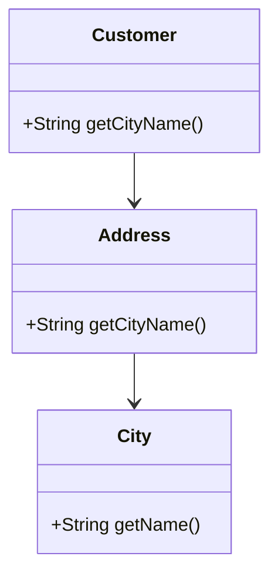

## 2.6 Law of Demeter

### Introduction to the Law of Demeter

The Law of Demeter, also known as the Principle of Least Knowledge, is a fundamental guideline in object-oriented design that aims to promote loose coupling between components of a software system. This principle suggests that a given object should have limited knowledge about other objects, interacting only with its immediate associates. By adhering to this principle, developers can create systems that are more modular, easier to maintain, and less prone to bugs.

### Defining the Law of Demeter

The Law of Demeter can be succinctly stated as: "Each unit should have only limited knowledge about other units: only units 'closely' related to the current unit." In practical terms, this means an object should only call methods on:

1. Itself.
2. Its own fields.
3. Objects passed as parameters to its methods.
4. Objects it creates.
5. Its direct component objects.

This principle discourages the practice of chaining method calls on objects returned by other methods, often referred to as "train wreck" code.

### Purpose and Benefits

The primary purpose of the Law of Demeter is to reduce coupling and increase module independence. By limiting the interactions between objects, the principle helps in:

- **Enhancing Maintainability**: Changes in one part of the system are less likely to affect other parts.
- **Improving Readability**: Code becomes easier to understand when objects communicate directly with their immediate neighbors.
- **Increasing Robustness**: Systems become more resilient to changes and errors.

### Identifying Violations: The "Train Wreck" Code

A common violation of the Law of Demeter is the "train wreck" code, characterized by long chains of method calls. This type of code exposes the internal structure of objects, leading to tight coupling and reduced encapsulation.

#### Example of "Train Wreck" Code

```java
public class TrainWreckExample {
    public static void main(String[] args) {
        Customer customer = new Customer();
        String city = customer.getAddress().getCity().getName();
        System.out.println("Customer's city: " + city);
    }
}

class Customer {
    private Address address;

    public Address getAddress() {
        return address;
    }
}

class Address {
    private City city;

    public City getCity() {
        return city;
    }
}

class City {
    private String name;

    public String getName() {
        return name;
    }
}
```

In this example, the main method accesses the `City` object through a chain of calls starting from `Customer`. This violates the Law of Demeter because `main` is interacting with objects that are not its direct associates.

### Refactoring to Comply with the Law of Demeter

To adhere to the Law of Demeter, we need to refactor the code to reduce the dependency chain and improve encapsulation.

#### Refactored Code

```java
public class LawOfDemeterExample {
    public static void main(String[] args) {
        Customer customer = new Customer();
        String city = customer.getCityName();
        System.out.println("Customer's city: " + city);
    }
}

class Customer {
    private Address address;

    public String getCityName() {
        return address.getCityName();
    }
}

class Address {
    private City city;

    public String getCityName() {
        return city.getName();
    }
}

class City {
    private String name;

    public String getName() {
        return name;
    }
}
```

In the refactored version, the `Customer` class provides a `getCityName` method, encapsulating the logic to retrieve the city name. This change ensures that the `main` method interacts only with the `Customer` object, complying with the Law of Demeter.

### Benefits of Following the Law of Demeter

Adhering to the Law of Demeter offers several advantages:

- **Reduced Coupling**: By limiting the interactions between objects, the system becomes more modular and easier to modify.
- **Improved Encapsulation**: Objects hide their internal structure, exposing only necessary information.
- **Enhanced Maintainability**: Changes to one part of the system are less likely to impact other parts, reducing the risk of introducing bugs.
- **Increased Flexibility**: Systems can evolve more easily, as components can be replaced or modified independently.

### Criticisms and Limitations

While the Law of Demeter promotes good design practices, it is not without its criticisms:

- **Increased Boilerplate Code**: Adhering strictly to the principle can result in additional methods that merely delegate calls, leading to more code.
- **Potential Overhead**: Creating many small methods can introduce overhead, especially in performance-critical applications.
- **Complexity in Large Systems**: In large systems, strict adherence can lead to a proliferation of wrapper methods, complicating the design.

Despite these criticisms, the benefits of following the Law of Demeter often outweigh the drawbacks, especially in systems where maintainability and robustness are priorities.

### Encouraging Best Practices

To effectively apply the Law of Demeter, consider the following practices:

- **Explain Intent**: Clearly document the purpose of each method, especially those that serve as wrappers.
- **Avoid Overexposure**: Limit the exposure of internal object structures by providing well-defined interfaces.
- **Focus on Direct Interactions**: Encourage objects to interact directly with their immediate neighbors, avoiding unnecessary chains of method calls.

### Visualizing the Law of Demeter

To better understand the Law of Demeter, let's visualize the interactions between objects in a system that adheres to this principle.



In this diagram, the `Customer` class interacts directly with the `Address` class, which in turn interacts with the `City` class. This structure ensures that each class only communicates with its immediate associates, adhering to the Law of Demeter.

### Try It Yourself

To reinforce your understanding of the Law of Demeter, try modifying the code examples provided:

- **Experiment with Different Structures**: Refactor the code to introduce new classes and methods, ensuring compliance with the Law of Demeter.
- **Test the Impact of Changes**: Observe how changes to one part of the system affect other parts, highlighting the benefits of reduced coupling.
- **Explore Alternative Designs**: Consider different ways to structure the code, balancing adherence to the Law of Demeter with other design considerations.

### Conclusion

The Law of Demeter is a powerful principle that promotes loose coupling and enhances the maintainability of software systems. By encouraging objects to communicate only with their immediate associates, developers can create systems that are more modular, robust, and easier to understand. While the principle has its limitations, its benefits often make it a valuable guideline in object-oriented design.

## Quiz Time!



### What is the primary purpose of the Law of Demeter?

- [x] To promote loose coupling between components
- [ ] To increase the number of method calls
- [ ] To ensure all classes are tightly integrated
- [ ] To maximize the use of inheritance

> **Explanation:** The Law of Demeter aims to promote loose coupling by limiting the interactions between objects, making systems more modular and maintainable.

### Which of the following is a violation of the Law of Demeter?

- [ ] Calling methods on its own fields
- [x] Chaining multiple method calls on returned objects
- [ ] Interacting with objects passed as parameters
- [ ] Using objects it creates internally

> **Explanation:** Chaining multiple method calls on returned objects, known as "train wreck" code, violates the Law of Demeter by exposing internal structures.

### How does the Law of Demeter improve maintainability?

- [x] By reducing dependencies between components
- [ ] By increasing the number of classes
- [ ] By enforcing strict inheritance hierarchies
- [ ] By limiting the use of interfaces

> **Explanation:** The Law of Demeter reduces dependencies between components, making it easier to modify and maintain the system without affecting unrelated parts.

### What is a common criticism of the Law of Demeter?

- [ ] It encourages tight coupling
- [x] It can lead to increased boilerplate code
- [ ] It reduces code readability
- [ ] It limits the use of polymorphism

> **Explanation:** A common criticism is that adhering strictly to the Law of Demeter can result in additional methods that merely delegate calls, increasing boilerplate code.

### Which practice helps in adhering to the Law of Demeter?

- [x] Limiting interactions to immediate neighbors
- [ ] Maximizing method chaining
- [ ] Exposing internal structures
- [ ] Using global variables extensively

> **Explanation:** Limiting interactions to immediate neighbors helps in adhering to the Law of Demeter by reducing coupling and enhancing encapsulation.

### What is the effect of "train wreck" code?

- [x] It increases coupling between classes
- [ ] It simplifies code readability
- [ ] It enhances encapsulation
- [ ] It promotes modularity

> **Explanation:** "Train wreck" code increases coupling between classes by exposing internal structures, making the system less modular and harder to maintain.

### How can you refactor code to comply with the Law of Demeter?

- [x] Introduce methods that encapsulate chained calls
- [ ] Increase the number of method parameters
- [ ] Use more inheritance
- [ ] Combine multiple classes into one

> **Explanation:** Introducing methods that encapsulate chained calls reduces dependencies and improves adherence to the Law of Demeter.

### What is an advantage of following the Law of Demeter?

- [x] Enhanced code robustness
- [ ] Increased method chaining
- [ ] More complex class hierarchies
- [ ] Greater use of global state

> **Explanation:** Following the Law of Demeter enhances code robustness by reducing dependencies and making the system more resilient to changes.

### Which of the following is NOT a benefit of the Law of Demeter?

- [ ] Reduced coupling
- [ ] Improved encapsulation
- [ ] Enhanced maintainability
- [x] Increased performance overhead

> **Explanation:** While the Law of Demeter improves maintainability and encapsulation, it does not inherently increase performance overhead.

### True or False: The Law of Demeter encourages objects to interact with as many other objects as possible.

- [ ] True
- [x] False

> **Explanation:** False. The Law of Demeter encourages objects to interact only with their immediate associates, reducing unnecessary dependencies.


