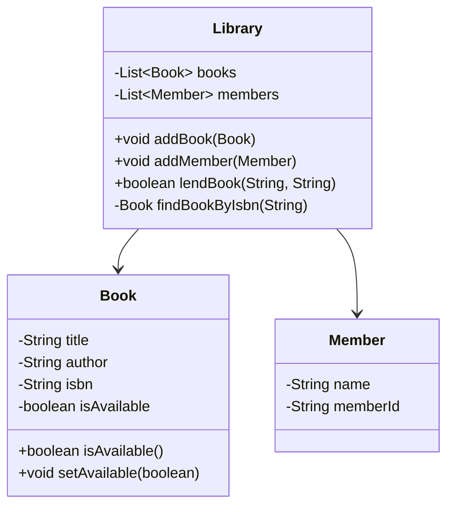

## 2.7.1 Information Expert

### Introduction to the Information Expert Principle

The Information Expert is a fundamental principle in object-oriented design, particularly within the GRASP (General Responsibility Assignment Software Patterns) framework. This principle guides us in assigning responsibilities to the classes that have the necessary information to fulfill them. By doing so, we create more cohesive and maintainable designs, where each class has a clear and logical role within the system.

### Importance of the Information Expert Principle

The Information Expert principle is crucial because it helps in organizing code in a way that is both logical and efficient. When responsibilities are assigned to the classes that have the necessary information, it minimizes the need for data sharing between classes, thereby reducing coupling and enhancing cohesion. This leads to a design where classes are more self-contained and easier to understand, test, and maintain.

### Applying the Information Expert Principle

Let's delve into how this principle can be applied in practice. Consider a simple example of a library management system. We have classes such as `Book`, `Library`, and `Member`. The `Library` class is responsible for managing the collection of books and the members who borrow them.

```java
public class Book {
    private String title;
    private String author;
    private String isbn;
    private boolean isAvailable;

    // Constructor and getters/setters omitted for brevity

    public boolean isAvailable() {
        return isAvailable;
    }

    public void setAvailable(boolean available) {
        isAvailable = available;
    }
}

public class Member {
    private String name;
    private String memberId;

    // Constructor and getters/setters omitted for brevity
}

public class Library {
    private List<Book> books;
    private List<Member> members;

    public Library() {
        books = new ArrayList<>();
        members = new ArrayList<>();
    }

    public void addBook(Book book) {
        books.add(book);
    }

    public void addMember(Member member) {
        members.add(member);
    }

    public boolean lendBook(String isbn, String memberId) {
        Book book = findBookByIsbn(isbn);
        if (book != null && book.isAvailable()) {
            book.setAvailable(false);
            // Logic to record the lending details
            return true;
        }
        return false;
    }

    private Book findBookByIsbn(String isbn) {
        for (Book book : books) {
            if (book.getIsbn().equals(isbn)) {
                return book;
            }
        }
        return null;
    }
}
```

In this example, the `Library` class is the Information Expert for managing books and members. It has the necessary information to add books, add members, and lend books. By following the Information Expert principle, we ensure that the `Library` class is cohesive and has a well-defined responsibility.

### Benefits of the Information Expert Principle

1. **Cohesion**: Classes are more cohesive as they encapsulate the data and behavior related to their responsibilities.
2. **Maintainability**: With clear responsibility boundaries, classes are easier to maintain and modify.
3. **Reusability**: Well-defined classes can be reused in different contexts without modification.
4. **Testability**: Classes with focused responsibilities are easier to test in isolation.

### Balancing Information Expert with Other Principles

While the Information Expert principle is powerful, it can sometimes conflict with other design principles such as the Single Responsibility Principle (SRP) or the Open/Closed Principle (OCP). For instance, a class might end up with too many responsibilities if it is the expert for multiple pieces of information. In such cases, it's essential to balance the principles by possibly refactoring the class into smaller, more focused classes.

### Potential Pitfalls and How to Avoid Them

One potential pitfall of the Information Expert principle is creating classes that are too large or complex. This can happen if a class becomes the expert for too many pieces of information. To avoid this, regularly review your class designs and consider splitting large classes into smaller, more focused ones.

### Practical Application in Java

Let's consider a more complex example involving a shopping cart system. Here, we have classes such as `Product`, `Cart`, and `Order`. The `Cart` class is responsible for managing the products added to the cart and calculating the total price.

```java
public class Product {
    private String name;
    private double price;

    // Constructor and getters/setters omitted for brevity
}

public class Cart {
    private List<Product> products;

    public Cart() {
        products = new ArrayList<>();
    }

    public void addProduct(Product product) {
        products.add(product);
    }

    public double calculateTotalPrice() {
        double total = 0;
        for (Product product : products) {
            total += product.getPrice();
        }
        return total;
    }
}

public class Order {
    private Cart cart;
    private String orderId;

    public Order(Cart cart) {
        this.cart = cart;
        // Generate orderId and other order-related logic
    }

    public double getOrderTotal() {
        return cart.calculateTotalPrice();
    }
}
```

In this example, the `Cart` class is the Information Expert for managing products and calculating the total price. This design ensures that the `Cart` class is cohesive and has a clear responsibility.

### Try It Yourself

To deepen your understanding, try modifying the `Cart` class to include a discount feature. Implement a method that applies a discount to the total price and observe how the Information Expert principle guides your design decisions.

### Visualizing the Information Expert Principle

To better understand the Information Expert principle, let's visualize the relationships between classes in the library management system example using a class diagram.



This diagram illustrates how the `Library` class interacts with the `Book` and `Member` classes, emphasizing its role as the Information Expert.

### Conclusion

The Information Expert principle is a powerful tool in the object-oriented designer's toolkit. By assigning responsibilities to the classes with the necessary information, we create designs that are cohesive, maintainable, and easy to understand. As you continue to develop your skills, remember to balance this principle with others to create well-rounded and efficient designs.

### Further Reading

For more information on the Information Expert principle and other GRASP principles, consider exploring the following resources:

- [GRASP Patterns on Wikipedia](https://en.wikipedia.org/wiki/GRASP_(object-oriented_design))
- [Object-Oriented Design Principles on GeeksforGeeks](https://www.geeksforgeeks.org/object-oriented-design-principles/)

## Quiz Time!



### What is the primary goal of the Information Expert principle?

- [x] Assign responsibilities to classes with the necessary information.
- [ ] Ensure classes have multiple responsibilities.
- [ ] Increase the number of classes in a design.
- [ ] Reduce the number of methods in a class.

> **Explanation:** The Information Expert principle aims to assign responsibilities to classes that have the necessary information to fulfill them, leading to more cohesive and maintainable designs.

### How does the Information Expert principle enhance cohesion?

- [x] By ensuring classes encapsulate data and behavior related to their responsibilities.
- [ ] By increasing the number of methods in a class.
- [ ] By reducing the number of classes in a design.
- [ ] By sharing data between multiple classes.

> **Explanation:** The Information Expert principle enhances cohesion by ensuring that classes encapsulate the data and behavior related to their responsibilities, making them more self-contained.

### In the library management example, which class is the Information Expert for managing books?

- [x] Library
- [ ] Book
- [ ] Member
- [ ] Order

> **Explanation:** In the library management example, the `Library` class is the Information Expert for managing books, as it has the necessary information to add books, add members, and lend books.

### What potential pitfall can occur if a class becomes the expert for too many pieces of information?

- [x] The class may become too large or complex.
- [ ] The class may have too few methods.
- [ ] The class may become too simple.
- [ ] The class may have too many constructors.

> **Explanation:** If a class becomes the expert for too many pieces of information, it may become too large or complex, which can make it difficult to maintain.

### Which principle might conflict with the Information Expert principle?

- [x] Single Responsibility Principle (SRP)
- [ ] Open/Closed Principle (OCP)
- [ ] Liskov Substitution Principle (LSP)
- [ ] Dependency Inversion Principle (DIP)

> **Explanation:** The Single Responsibility Principle (SRP) might conflict with the Information Expert principle if a class ends up with too many responsibilities.

### What is a key benefit of using the Information Expert principle?

- [x] Reducing the need for data sharing between classes.
- [ ] Increasing the number of classes in a design.
- [ ] Decreasing the number of methods in a class.
- [ ] Increasing the complexity of a class.

> **Explanation:** A key benefit of the Information Expert principle is reducing the need for data sharing between classes, which enhances cohesion and maintainability.

### How can you avoid creating classes that are too large when applying the Information Expert principle?

- [x] Regularly review class designs and consider splitting large classes into smaller ones.
- [ ] Increase the number of methods in a class.
- [ ] Reduce the number of classes in a design.
- [ ] Share data between multiple classes.

> **Explanation:** To avoid creating classes that are too large, regularly review class designs and consider splitting large classes into smaller, more focused ones.

### In the shopping cart example, which class is the Information Expert for calculating the total price?

- [x] Cart
- [ ] Product
- [ ] Order
- [ ] Member

> **Explanation:** In the shopping cart example, the `Cart` class is the Information Expert for calculating the total price, as it has the necessary information about the products.

### What is a practical exercise to deepen understanding of the Information Expert principle?

- [x] Modify the `Cart` class to include a discount feature.
- [ ] Increase the number of methods in the `Cart` class.
- [ ] Reduce the number of classes in the design.
- [ ] Share data between the `Cart` and `Order` classes.

> **Explanation:** A practical exercise to deepen understanding of the Information Expert principle is to modify the `Cart` class to include a discount feature, observing how the principle guides design decisions.

### True or False: The Information Expert principle always leads to the creation of more classes in a design.

- [ ] True
- [x] False

> **Explanation:** False. The Information Expert principle does not necessarily lead to the creation of more classes. Instead, it focuses on assigning responsibilities to existing classes that have the necessary information.


