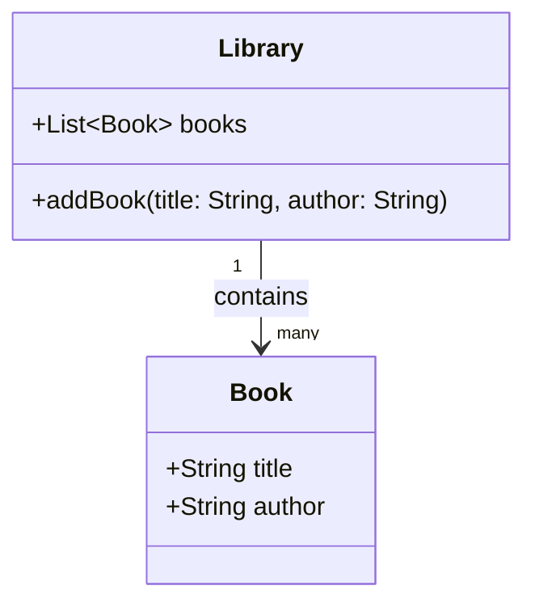

## 2.7.2 Creator

In the realm of software engineering, particularly in object-oriented design, the responsibility of object creation is a critical aspect that can significantly influence the maintainability and scalability of a system. The Creator principle, one of the GRASP (General Responsibility Assignment Software Patterns) principles, provides a structured approach to assigning this responsibility. By understanding and applying the Creator principle, developers can ensure that their code is not only logical and maintainable but also adheres to the principles of reduced coupling and encapsulation.

### Understanding the Creator Principle

The Creator principle is a guideline that helps determine which class should be responsible for creating instances of another class. It is based on the relationships and interactions between classes, ensuring that the responsibility for creating an object is assigned to a class that has a logical connection to the object being created. This principle is particularly useful in scenarios where multiple classes could potentially create an object, but only one should be responsible for it to maintain a clean and organized codebase.

### Criteria for Assigning Creation Responsibilities

When deciding which class should take on the responsibility of creating an instance of another class, several criteria can be considered:

1. **Containment**: If a class contains or aggregates instances of another class, it is a natural candidate for creating those instances. This is because the containing class has a direct relationship with the objects it contains.

2. **Aggregation**: Similar to containment, if a class aggregates another class, it often makes sense for it to be responsible for creating instances of the aggregated class.

3. **Initialization Data**: If a class has the necessary data to initialize an instance of another class, it should be responsible for creating that instance. This ensures that the creation logic is encapsulated within a class that has all the required information.

4. **Close Interaction**: If a class closely interacts with another class, it may be logical for it to create instances of that class. This can help reduce the coupling between classes by keeping the creation logic within a class that already interacts with the created object.

### Examples of the Creator Principle

Let's explore some examples to illustrate how the Creator principle can be applied in practice.

#### Example 1: Containment

Consider a `Library` class that contains a collection of `Book` objects. According to the Creator principle, the `Library` class should be responsible for creating instances of `Book`.

```java
public class Book {
    private String title;
    private String author;

    public Book(String title, String author) {
        this.title = title;
        this.author = author;
    }

    // Getters and setters
}

public class Library {
    private List<Book> books;

    public Library() {
        this.books = new ArrayList<>();
    }

    public void addBook(String title, String author) {
        Book book = new Book(title, author);
        books.add(book);
    }

    // Other library methods
}
```

In this example, the `Library` class creates `Book` objects because it contains them. This encapsulates the creation logic within the `Library` class, making the code more organized and maintainable.

#### Example 2: Aggregation

Consider a `Team` class that aggregates `Player` objects. The `Team` class should be responsible for creating instances of `Player`.

```java
public class Player {
    private String name;
    private int number;

    public Player(String name, int number) {
        this.name = name;
        this.number = number;
    }

    // Getters and setters
}

public class Team {
    private List<Player> players;

    public Team() {
        this.players = new ArrayList<>();
    }

    public void addPlayer(String name, int number) {
        Player player = new Player(name, number);
        players.add(player);
    }

    // Other team methods
}
```

Here, the `Team` class aggregates `Player` objects and is responsible for their creation, following the Creator principle.

#### Example 3: Initialization Data

Suppose we have a `ReportGenerator` class that generates `Report` objects. If the `ReportGenerator` has all the necessary data to initialize a `Report`, it should be responsible for creating `Report` instances.

```java
public class Report {
    private String content;

    public Report(String content) {
        this.content = content;
    }

    // Getters and setters
}

public class ReportGenerator {
    private String data;

    public ReportGenerator(String data) {
        this.data = data;
    }

    public Report generateReport() {
        return new Report(data);
    }

    // Other report generation methods
}
```

In this scenario, the `ReportGenerator` class creates `Report` objects because it has the necessary data to initialize them.

### Benefits of Using the Creator Principle

Applying the Creator principle offers several benefits:

- **Reduced Coupling**: By assigning creation responsibilities to classes that have a logical connection to the created objects, we reduce the coupling between classes. This makes the codebase more modular and easier to maintain.

- **Encapsulation of Creation Logic**: The creation logic is encapsulated within relevant classes, making it easier to manage and modify. This also enhances the readability of the code.

- **Logical and Maintainable Code**: The Creator principle leads to a logical distribution of responsibilities, resulting in a more maintainable codebase.

### Relation to Design Patterns

The Creator principle is closely related to several design patterns, particularly the Factory Method and Builder patterns.

- **Factory Method Pattern**: This pattern defines an interface for creating objects but allows subclasses to alter the type of objects that will be created. The Creator principle can guide the implementation of factory methods by suggesting which class should be responsible for the creation logic.

- **Builder Pattern**: The Builder pattern separates the construction of a complex object from its representation. The Creator principle can help determine which class should initiate the building process based on its relationships and interactions with the object being built.

### Java Code Examples

Let's explore some Java code examples to illustrate the correct implementation of the Creator principle, as well as some common pitfalls.

#### Good Practice

```java
public class Order {
    private List<Item> items;

    public Order() {
        this.items = new ArrayList<>();
    }

    public void addItem(String name, double price) {
        Item item = new Item(name, price);
        items.add(item);
    }

    // Other order methods
}

public class Item {
    private String name;
    private double price;

    public Item(String name, double price) {
        this.name = name;
        this.price = price;
    }

    // Getters and setters
}
```

In this example, the `Order` class is responsible for creating `Item` objects because it contains them. This follows the Creator principle and results in a clean and maintainable codebase.

#### Bad Practice

```java
public class ShoppingCart {
    private List<Item> items;

    public ShoppingCart() {
        this.items = new ArrayList<>();
    }

    public void addItem(Item item) {
        items.add(item);
    }

    // Other shopping cart methods
}

public class Item {
    private String name;
    private double price;

    public Item(String name, double price) {
        this.name = name;
        this.price = price;
    }

    // Getters and setters
}
```

In this example, the `ShoppingCart` class relies on external code to create `Item` objects and pass them to the `addItem` method. This violates the Creator principle because the `ShoppingCart` class should be responsible for creating `Item` objects, given its relationship with them.

### Cleaner Code and Future Modifications

Following the Creator principle contributes to cleaner code by ensuring that object creation responsibilities are logically assigned. This makes the code easier to understand and modify in the future. When changes are needed, they can be made within the class responsible for creation, without affecting other parts of the codebase.

### Consideration of Dependencies and Relationships

When assigning creation responsibilities, it is crucial to consider the dependencies and relationships between classes. By doing so, we can ensure that the creation logic is encapsulated within the most appropriate class, leading to a more organized and maintainable codebase.

### Visualizing the Creator Principle

To better understand the Creator principle, let's visualize the relationships and interactions that guide the assignment of creation responsibilities.



In this diagram, the `Library` class contains `Book` objects, illustrating why it is responsible for creating them according to the Creator principle.

### Try It Yourself

To deepen your understanding of the Creator principle, try modifying the code examples provided. For instance, experiment with moving the creation logic to a different class and observe how it affects the maintainability and readability of the code. Consider the relationships and interactions between classes to determine the most logical assignment of creation responsibilities.

### Knowledge Check

- Why is the Creator principle important in object-oriented design?
- How does the Creator principle reduce coupling between classes?
- What are some criteria for assigning creation responsibilities?
- How does the Creator principle relate to the Factory Method pattern?
- Provide an example of a class that should be responsible for creating another class based on containment.

### Embrace the Journey

Remember, mastering the Creator principle is just one step on your journey to becoming an expert software engineer. As you continue to explore design patterns and principles, you'll gain a deeper understanding of how to create maintainable and scalable software systems. Keep experimenting, stay curious, and enjoy the journey!

## Quiz Time!



### Which of the following is a criterion for assigning creation responsibilities according to the Creator principle?

- [x] Containment
- [ ] Inheritance
- [ ] Polymorphism
- [ ] Abstraction

> **Explanation:** Containment is one of the criteria for assigning creation responsibilities according to the Creator principle, as it indicates a direct relationship between the classes.

### How does the Creator principle help in reducing coupling between classes?

- [x] By assigning creation responsibilities to classes with logical connections
- [ ] By using inheritance to share behavior
- [ ] By implementing interfaces for all classes
- [ ] By using global variables for shared state

> **Explanation:** The Creator principle reduces coupling by ensuring that creation responsibilities are assigned to classes that have logical connections to the objects they create, thus keeping related logic encapsulated.

### Which design pattern is closely related to the Creator principle?

- [x] Factory Method
- [ ] Singleton
- [ ] Observer
- [ ] Adapter

> **Explanation:** The Factory Method pattern is closely related to the Creator principle as it provides a way to delegate the creation of objects to subclasses, aligning with the principle's guidelines.

### In the context of the Creator principle, which class should be responsible for creating an object?

- [x] A class that contains the object
- [ ] A class that inherits from the object
- [ ] A class that implements the same interface
- [ ] A class that uses the object in a single method

> **Explanation:** A class that contains the object should be responsible for its creation, as it has a direct relationship with the object, following the Creator principle.

### What is a benefit of encapsulating creation logic within relevant classes?

- [x] Enhanced maintainability
- [ ] Increased complexity
- [ ] Reduced performance
- [ ] More global variables

> **Explanation:** Encapsulating creation logic within relevant classes enhances maintainability by keeping related logic together and reducing dependencies.

### Which of the following is NOT a benefit of using the Creator principle?

- [ ] Reduced coupling
- [ ] Encapsulation of creation logic
- [x] Increased use of global variables
- [ ] Logical and maintainable code

> **Explanation:** The Creator principle does not promote the use of global variables; instead, it encourages encapsulation and reduced coupling.

### How does the Creator principle contribute to cleaner code?

- [x] By logically assigning object creation responsibilities
- [ ] By using more inheritance
- [ ] By avoiding the use of interfaces
- [ ] By increasing the number of classes

> **Explanation:** The Creator principle contributes to cleaner code by logically assigning object creation responsibilities, which leads to a more organized and maintainable codebase.

### Which of the following is an example of a class that should be responsible for creating another class based on aggregation?

- [x] A `Team` class creating `Player` objects
- [ ] A `Vehicle` class creating `Engine` objects
- [ ] A `User` class creating `Profile` objects
- [ ] A `Company` class creating `Department` objects

> **Explanation:** A `Team` class creating `Player` objects is an example of aggregation, where the `Team` class aggregates `Player` objects and should be responsible for their creation.

### What is the relationship between the Creator principle and the Builder pattern?

- [x] The Creator principle can guide which class initiates the building process
- [ ] The Creator principle dictates the exact steps of the building process
- [ ] The Creator principle is unrelated to the Builder pattern
- [ ] The Creator principle requires the use of the Builder pattern

> **Explanation:** The Creator principle can guide which class initiates the building process in the Builder pattern, based on relationships and interactions.

### True or False: The Creator principle suggests that a class with the necessary initialization data should be responsible for creating an instance of another class.

- [x] True
- [ ] False

> **Explanation:** True. The Creator principle suggests that a class with the necessary initialization data should be responsible for creating an instance of another class, as it has all the required information.


