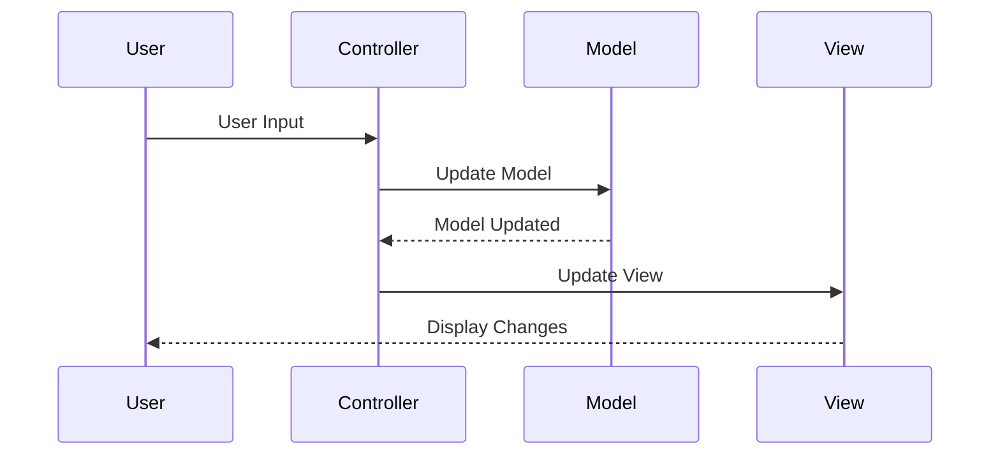

## 2.7.3 Controller

In the realm of software engineering, particularly within object-oriented design, the Controller principle plays a pivotal role in structuring the logical flow of an application. As one of the GRASP (General Responsibility Assignment Software Patterns) principles, the Controller is tasked with handling system events and delegating work to other objects, ensuring a seamless and organized flow of operations. Let's delve into the intricacies of the Controller principle, its implementation in Java, and best practices for maintaining clean and efficient code.

### Understanding the Controller Principle

The Controller is a design pattern that defines objects responsible for handling system events and delegating tasks to other objects. This principle is crucial in managing the flow of an application, ensuring that user interface logic is separated from business logic. By doing so, it maintains a clear organization and enhances the maintainability and scalability of the code.

#### Role of the Controller

The primary role of a Controller is to act as an intermediary between the user interface and the business logic. It receives input from the user, processes it (often by invoking methods on model objects), and returns the appropriate response to the user interface. This separation of concerns is essential for creating a modular and maintainable codebase.

### Choosing an Appropriate Controller Class

When implementing the Controller principle, selecting the right type of controller class is crucial. There are generally two types of controllers:

1. **Façade Controller**: This type of controller acts as a façade for a set of use cases. It is responsible for handling multiple related operations and provides a simplified interface to the client.

2. **Use-Case Controller**: This controller is dedicated to a specific use case or scenario. It manages the flow of operations for that particular use case, ensuring that all necessary tasks are completed in the correct order.

#### Factors to Consider

- **Complexity**: For complex applications with multiple use cases, a façade controller can simplify the interface and reduce the number of interactions required from the client.
- **Specificity**: If the application has distinct and well-defined use cases, a use-case controller can provide a more focused and efficient solution.
- **Reusability**: Consider how the controller will be reused across different parts of the application. A well-designed controller should be reusable and adaptable to various scenarios.

### Separating User Interface Logic from Business Logic

One of the key benefits of the Controller principle is the separation of user interface logic from business logic. This separation is crucial for maintaining a clear and organized codebase. By isolating the business logic, developers can make changes to the user interface without affecting the underlying logic, and vice versa.

#### Benefits of Separation

- **Maintainability**: Changes to the user interface or business logic can be made independently, reducing the risk of introducing errors.
- **Scalability**: The application can be scaled more easily, as changes to one part of the system do not affect others.
- **Testability**: Isolated business logic can be tested independently of the user interface, leading to more robust and reliable code.

### Examples of Controllers in Action

To illustrate the Controller principle in action, let's consider a simple Java application that manages a library system. The application allows users to search for books, borrow them, and return them.

```java
// BookController.java
public class BookController {
    private final LibraryService libraryService;

    public BookController(LibraryService libraryService) {
        this.libraryService = libraryService;
    }

    public void searchBook(String title) {
        List<Book> books = libraryService.findBooksByTitle(title);
        // Code to update the user interface with the search results
    }

    public void borrowBook(String bookId, String userId) {
        boolean success = libraryService.borrowBook(bookId, userId);
        // Code to update the user interface based on the success of the operation
    }

    public void returnBook(String bookId, String userId) {
        boolean success = libraryService.returnBook(bookId, userId);
        // Code to update the user interface based on the success of the operation
    }
}
```

In this example, the `BookController` class acts as an intermediary between the user interface and the `LibraryService`. It handles user inputs, delegates tasks to the service layer, and updates the user interface accordingly.

### Benefits of Using Controllers

The use of controllers in an application offers several benefits:

- **Code Organization**: Controllers help organize code by separating concerns and ensuring that each part of the application has a clear and distinct role.
- **Reusability**: Controllers can be reused across different parts of the application, reducing duplication and improving consistency.
- **Ease of Maintenance**: By isolating different parts of the application, controllers make it easier to maintain and update the codebase.

### Controllers and Architectural Patterns

The Controller principle is closely related to several architectural patterns, most notably the Model-View-Controller (MVC) pattern. In MVC, the controller is responsible for handling user input and updating the view and model accordingly. This separation of concerns is a hallmark of well-designed software systems.

#### Model-View-Controller (MVC)

In the MVC pattern, the controller acts as a bridge between the model and the view. It receives input from the user, updates the model based on that input, and then updates the view to reflect the changes in the model.



This diagram illustrates the flow of information in an MVC architecture, highlighting the role of the controller in managing interactions between the user, model, and view.

### Implementing Effective Controllers in Java

To implement effective controllers in Java, it's important to follow best practices and guidelines. Here are some key considerations:

#### Handling Events and Delegating Tasks

Controllers should be designed to handle events and delegate tasks to other objects. This involves listening for user input, processing that input, and invoking the appropriate methods on the model or service layer.

```java
// EventController.java
public class EventController {
    private final EventService eventService;

    public EventController(EventService eventService) {
        this.eventService = eventService;
    }

    public void handleEvent(String eventType, String eventData) {
        switch (eventType) {
            case "CREATE":
                eventService.createEvent(eventData);
                break;
            case "UPDATE":
                eventService.updateEvent(eventData);
                break;
            case "DELETE":
                eventService.deleteEvent(eventData);
                break;
            default:
                throw new IllegalArgumentException("Unknown event type: " + eventType);
        }
    }
}
```

In this example, the `EventController` class listens for different types of events and delegates the appropriate tasks to the `EventService`.

#### Best Practices for Controllers

- **Avoid Bloated Controllers**: Controllers should remain focused on coordination and delegation, avoiding the temptation to include business logic or complex processing.
- **Ensure Modularity**: Controllers should be modular and reusable, allowing them to be easily integrated into different parts of the application.
- **Maintain Clear Interfaces**: Controllers should provide clear and consistent interfaces for interacting with other parts of the application.

### Try It Yourself

To gain a deeper understanding of the Controller principle, try modifying the code examples provided. Experiment with adding new event types to the `EventController` or extending the functionality of the `BookController`. Consider how these changes affect the overall structure and flow of the application.

### Conclusion

The Controller principle is a fundamental aspect of object-oriented design, providing a structured approach to managing the flow of an application. By separating user interface logic from business logic and delegating tasks to other objects, controllers enhance code organization, reusability, and maintainability. As you continue to develop your skills, remember to apply these principles to create clean, efficient, and scalable software systems.

## Quiz Time!



### What is the primary role of a Controller in software design?

- [x] To act as an intermediary between the user interface and business logic.
- [ ] To perform complex data processing.
- [ ] To manage database connections.
- [ ] To handle network communication.

> **Explanation:** The primary role of a Controller is to act as an intermediary between the user interface and business logic, managing the flow of the application.

### Which type of controller is responsible for handling multiple related operations?

- [x] Façade Controller
- [ ] Use-Case Controller
- [ ] Service Controller
- [ ] Data Controller

> **Explanation:** A Façade Controller handles multiple related operations, providing a simplified interface to the client.

### What is a key benefit of separating user interface logic from business logic?

- [x] Maintainability
- [ ] Increased complexity
- [ ] Reduced performance
- [ ] More code duplication

> **Explanation:** Separating user interface logic from business logic enhances maintainability by allowing changes to be made independently.

### In the MVC pattern, what is the role of the controller?

- [x] To handle user input and update the view and model.
- [ ] To store data and manage business logic.
- [ ] To render the user interface.
- [ ] To manage database transactions.

> **Explanation:** In the MVC pattern, the controller handles user input and updates the view and model accordingly.

### What should controllers avoid to remain effective?

- [x] Bloated logic
- [ ] Clear interfaces
- [ ] Modularity
- [ ] Task delegation

> **Explanation:** Controllers should avoid bloated logic and remain focused on coordination and delegation.

### Which architectural pattern is closely related to the Controller principle?

- [x] Model-View-Controller (MVC)
- [ ] Singleton
- [ ] Factory Method
- [ ] Observer

> **Explanation:** The Model-View-Controller (MVC) pattern is closely related to the Controller principle, as it defines the role of the controller in managing application flow.

### What is a benefit of using controllers in an application?

- [x] Code organization
- [ ] Increased complexity
- [ ] Reduced flexibility
- [ ] More dependencies

> **Explanation:** Using controllers helps organize code by separating concerns and ensuring that each part of the application has a clear and distinct role.

### How should controllers handle events?

- [x] By delegating tasks to other objects
- [ ] By processing all events internally
- [ ] By ignoring unknown events
- [ ] By directly updating the database

> **Explanation:** Controllers should handle events by delegating tasks to other objects, maintaining a clear separation of concerns.

### What is a key consideration when choosing a controller class?

- [x] Complexity of the application
- [ ] Number of database tables
- [ ] Amount of user input
- [ ] Network latency

> **Explanation:** When choosing a controller class, consider the complexity of the application and how the controller will be reused across different parts.

### True or False: Controllers should contain business logic to improve efficiency.

- [ ] True
- [x] False

> **Explanation:** False. Controllers should not contain business logic; they should focus on coordination and delegation to maintain a clear separation of concerns.


