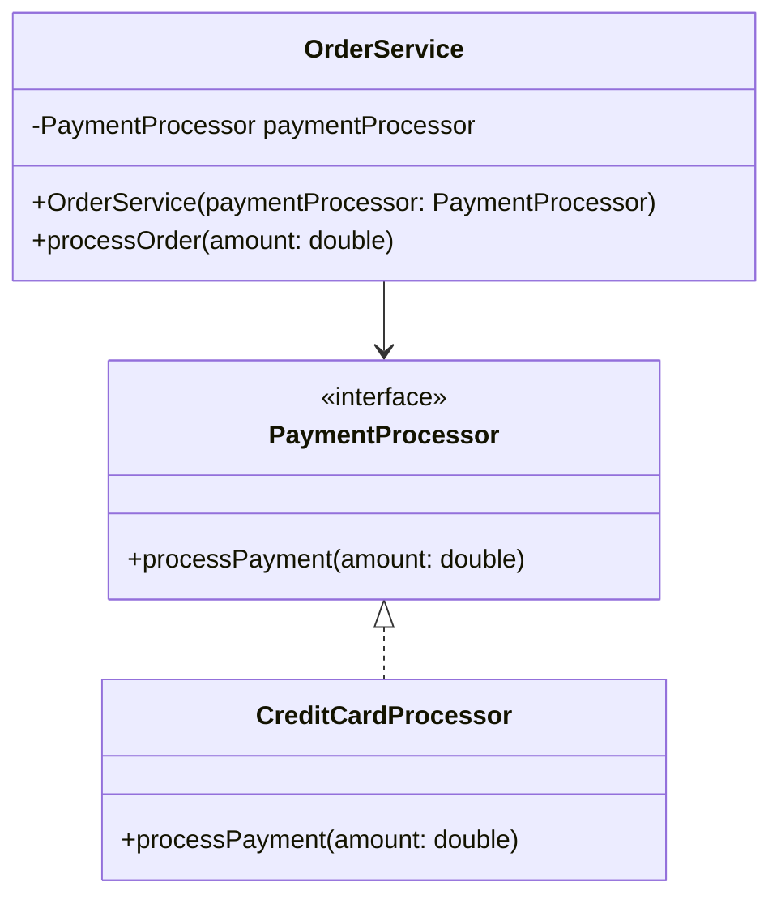

## 2.7.4 Low Coupling

In the realm of software engineering, the principle of Low Coupling is a cornerstone for creating modular, maintainable, and flexible systems. Coupling refers to the degree of direct knowledge that one module has about another. Low Coupling aims to minimize these dependencies, thereby enhancing the system's robustness and adaptability.

### Understanding Low Coupling

Low Coupling is about reducing the interdependencies between software modules. When modules are loosely coupled, changes in one module have minimal impact on others, making the system easier to understand, modify, and extend. This principle is crucial for achieving modularity, which allows individual components to be developed, tested, and maintained independently.

#### Why Low Coupling Matters

1. **Modularity**: Low Coupling facilitates modular design, where each module or component can be developed and tested in isolation. This modularity is essential for parallel development and easier maintenance.

2. **Flexibility**: Systems with low coupling are more adaptable to changes. When a module's implementation changes, the impact on other modules is minimized, allowing for easier updates and enhancements.

3. **Reusability**: Loosely coupled modules can be reused across different projects or systems without significant modification, promoting code reuse and reducing development time.

4. **Testability**: Low Coupling enhances testability by allowing modules to be tested independently. This isolation simplifies the creation of unit tests and improves test coverage.

### The Pitfalls of High Coupling

High coupling occurs when modules are heavily dependent on each other, leading to several issues:

- **Rigidity**: A change in one module necessitates changes in dependent modules, making the system rigid and difficult to modify.
- **Fragility**: Highly coupled systems are more prone to bugs, as changes can have unintended ripple effects throughout the system.
- **Limited Reusability**: Modules that are tightly coupled to specific implementations are difficult to reuse in different contexts.
- **Complexity**: High coupling increases the complexity of the system, making it harder to understand and maintain.

### Strategies for Achieving Low Coupling

Achieving low coupling involves several strategies and design practices:

#### Use Interfaces

Interfaces in Java allow you to define contracts without specifying the implementation. By programming to an interface rather than a concrete class, you reduce dependencies on specific implementations.

```java
// Define an interface
public interface PaymentProcessor {
    void processPayment(double amount);
}

// Implement the interface
public class CreditCardProcessor implements PaymentProcessor {
    @Override
    public void processPayment(double amount) {
        // Implementation for credit card processing
    }
}

// Use the interface
public class PaymentService {
    private PaymentProcessor processor;

    public PaymentService(PaymentProcessor processor) {
        this.processor = processor;
    }

    public void makePayment(double amount) {
        processor.processPayment(amount);
    }
}
```

In this example, `PaymentService` is decoupled from the specific implementation of `PaymentProcessor`, allowing for flexibility in changing or extending payment methods.

#### Dependency Injection

Dependency Injection (DI) is a design pattern that helps achieve low coupling by injecting dependencies into a class rather than having the class instantiate them. This approach decouples the creation of dependencies from their usage.

```java
public class OrderService {
    private final PaymentProcessor paymentProcessor;

    // Dependency Injection via constructor
    public OrderService(PaymentProcessor paymentProcessor) {
        this.paymentProcessor = paymentProcessor;
    }

    public void processOrder(double amount) {
        paymentProcessor.processPayment(amount);
    }
}

// Usage
PaymentProcessor processor = new CreditCardProcessor();
OrderService orderService = new OrderService(processor);
orderService.processOrder(100.0);
```

By injecting `PaymentProcessor` into `OrderService`, we can easily swap out different implementations without modifying the `OrderService` class.

#### Adhere to the Law of Demeter

The Law of Demeter, also known as the principle of least knowledge, suggests that a module should only communicate with its immediate dependencies. This principle helps reduce coupling by limiting the interactions between modules.

```java
public class Customer {
    private Address address;

    public Address getAddress() {
        return address;
    }
}

public class Address {
    private String city;

    public String getCity() {
        return city;
    }
}

public class Order {
    private Customer customer;

    public void printCustomerCity() {
        // Violates the Law of Demeter
        System.out.println(customer.getAddress().getCity());
    }
}
```

To adhere to the Law of Demeter, we can refactor the `Order` class to avoid chaining method calls:

```java
public class Customer {
    private Address address;

    public String getCity() {
        return address.getCity();
    }
}

public class Order {
    private Customer customer;

    public void printCustomerCity() {
        // Complies with the Law of Demeter
        System.out.println(customer.getCity());
    }
}
```

By providing a method in `Customer` to get the city, we reduce the coupling between `Order` and `Address`.

### Refactoring for Low Coupling

Refactoring code to achieve low coupling involves identifying tightly coupled components and decoupling them using the strategies discussed. Let's consider a before-and-after scenario to illustrate this process.

#### Before Refactoring

```java
public class ReportGenerator {
    private Database database = new Database();

    public void generateReport() {
        List<Data> data = database.getData();
        // Process and generate report
    }
}
```

In this example, `ReportGenerator` is tightly coupled to `Database`, making it difficult to test or replace the database implementation.

#### After Refactoring

```java
public interface DataSource {
    List<Data> getData();
}

public class DatabaseDataSource implements DataSource {
    @Override
    public List<Data> getData() {
        // Fetch data from the database
    }
}

public class ReportGenerator {
    private DataSource dataSource;

    public ReportGenerator(DataSource dataSource) {
        this.dataSource = dataSource;
    }

    public void generateReport() {
        List<Data> data = dataSource.getData();
        // Process and generate report
    }
}
```

By introducing the `DataSource` interface and using dependency injection, `ReportGenerator` is now decoupled from the specific database implementation.

### Relationship with Other Principles

Low Coupling is closely related to several other design principles, including:

- **Dependency Inversion Principle (DIP)**: Encourages high-level modules to depend on abstractions rather than concrete implementations, reducing coupling.
- **Single Responsibility Principle (SRP)**: By ensuring each module has a single responsibility, we naturally reduce the coupling between modules.
- **Interface Segregation Principle (ISP)**: By designing smaller, more specific interfaces, we reduce the dependencies between modules.

### Balancing Coupling and Cohesion

While low coupling is desirable, it's important to balance it with cohesion. Cohesion refers to how closely related the responsibilities of a module are. High cohesion within a module is desirable, as it indicates that the module has a well-defined purpose.

#### Example of Balancing Coupling and Cohesion

```java
public class UserProfile {
    private String name;
    private String email;

    public void updateProfile(String name, String email) {
        this.name = name;
        this.email = email;
    }

    public void sendEmailNotification() {
        // Send email notification
    }
}
```

In this example, `UserProfile` has low cohesion because it handles both profile updates and email notifications. By refactoring, we can improve cohesion and reduce coupling:

```java
public class UserProfile {
    private String name;
    private String email;

    public void updateProfile(String name, String email) {
        this.name = name;
        this.email = email;
    }
}

public class EmailNotifier {
    public void sendEmailNotification(String email) {
        // Send email notification
    }
}
```

Now, `UserProfile` is focused on managing user data, while `EmailNotifier` handles email notifications, improving cohesion and reducing coupling.

### Practical Applications in Java

Let's explore how to apply the principle of Low Coupling in Java through practical examples.

#### Designing Classes with Low Coupling

When designing classes, aim to minimize dependencies on other classes. Use interfaces and abstract classes to define contracts and reduce direct dependencies.

```java
public interface Logger {
    void log(String message);
}

public class ConsoleLogger implements Logger {
    @Override
    public void log(String message) {
        System.out.println(message);
    }
}

public class FileLogger implements Logger {
    @Override
    public void log(String message) {
        // Write message to a file
    }
}

public class Application {
    private Logger logger;

    public Application(Logger logger) {
        this.logger = logger;
    }

    public void run() {
        logger.log("Application started");
    }
}
```

In this example, `Application` is decoupled from the specific logging implementation, allowing for flexibility in choosing different logging strategies.

#### Using Dependency Injection Frameworks

Java frameworks like Spring provide powerful tools for managing dependencies and achieving low coupling through dependency injection.

```java
@Configuration
public class AppConfig {

    @Bean
    public PaymentProcessor paymentProcessor() {
        return new CreditCardProcessor();
    }

    @Bean
    public OrderService orderService() {
        return new OrderService(paymentProcessor());
    }
}
```

By defining beans in a configuration class, Spring automatically injects dependencies, promoting low coupling and enhancing testability.

### Encouraging Low Coupling in Design and Code Reviews

Maintaining low coupling requires ongoing attention during design and code reviews. Encourage the following practices:

- **Review Dependencies**: Regularly review dependencies between modules and refactor to reduce unnecessary coupling.
- **Promote Interface Usage**: Encourage the use of interfaces and abstract classes to define contracts and reduce direct dependencies.
- **Emphasize Testability**: Ensure that modules can be tested independently, which often indicates low coupling.
- **Foster Collaboration**: Encourage collaboration between developers to identify and address coupling issues early in the design process.

### Visualizing Low Coupling

To better understand the concept of Low Coupling, let's visualize the relationships between classes in a system.



This diagram illustrates how `OrderService` depends on the `PaymentProcessor` interface rather than a specific implementation, promoting low coupling.

### Try It Yourself

Experiment with the code examples provided by modifying the implementations or adding new features. For instance, try adding a new payment processor implementation and see how easily it integrates with the existing system. This hands-on approach will reinforce your understanding of Low Coupling and its benefits.

### Conclusion

Low Coupling is a fundamental principle in software design that enhances modularity, flexibility, and maintainability. By reducing dependencies between modules, we create systems that are easier to understand, modify, and extend. Remember, achieving low coupling requires ongoing attention and collaboration, but the benefits are well worth the effort.

## Quiz Time!



### What is the primary goal of Low Coupling in software design?

- [x] To reduce dependencies between modules
- [ ] To increase the number of classes in the system
- [ ] To ensure every class has multiple responsibilities
- [ ] To make modules dependent on each other

> **Explanation:** Low Coupling aims to reduce dependencies between modules, enhancing modularity and flexibility.

### Which of the following is a benefit of Low Coupling?

- [x] Easier maintenance and modification
- [ ] Increased rigidity of the system
- [ ] Higher complexity in code
- [ ] More dependencies between modules

> **Explanation:** Low Coupling makes the system easier to maintain and modify by reducing dependencies.

### What is a common strategy to achieve Low Coupling?

- [x] Using interfaces
- [ ] Hardcoding dependencies
- [ ] Increasing the number of direct dependencies
- [ ] Avoiding the use of interfaces

> **Explanation:** Using interfaces allows for defining contracts without specifying implementations, reducing coupling.

### How does Dependency Injection help achieve Low Coupling?

- [x] By injecting dependencies into a class rather than having the class instantiate them
- [ ] By hardcoding dependencies within the class
- [ ] By increasing the number of dependencies
- [ ] By avoiding the use of interfaces

> **Explanation:** Dependency Injection decouples the creation of dependencies from their usage, promoting Low Coupling.

### What principle suggests that a module should only communicate with its immediate dependencies?

- [x] Law of Demeter
- [ ] Single Responsibility Principle
- [ ] Open/Closed Principle
- [ ] Liskov Substitution Principle

> **Explanation:** The Law of Demeter, or the principle of least knowledge, suggests limiting interactions to immediate dependencies.

### What is the relationship between Low Coupling and the Dependency Inversion Principle?

- [x] Both aim to reduce dependencies on specific implementations
- [ ] They are unrelated principles
- [ ] Low Coupling increases dependencies, while Dependency Inversion reduces them
- [ ] Dependency Inversion increases coupling

> **Explanation:** Both Low Coupling and the Dependency Inversion Principle aim to reduce dependencies on specific implementations.

### What is the impact of high coupling on system flexibility?

- [x] It reduces flexibility by making changes more difficult
- [ ] It increases flexibility by making changes easier
- [ ] It has no impact on flexibility
- [ ] It makes the system more adaptable

> **Explanation:** High coupling reduces flexibility by making changes more difficult due to interdependencies.

### Which of the following is a sign of high coupling?

- [x] A change in one module necessitates changes in dependent modules
- [ ] Modules can be developed and tested independently
- [ ] Modules have minimal dependencies on each other
- [ ] Modules are easily reusable across different projects

> **Explanation:** High coupling is indicated by changes in one module necessitating changes in dependent modules.

### What is the balance between coupling and cohesion?

- [x] High cohesion within modules and low coupling between modules
- [ ] Low cohesion within modules and high coupling between modules
- [ ] High cohesion and high coupling within modules
- [ ] Low cohesion and low coupling within modules

> **Explanation:** The ideal balance is high cohesion within modules and low coupling between modules.

### True or False: Low Coupling makes it easier to test modules independently.

- [x] True
- [ ] False

> **Explanation:** Low Coupling enhances testability by allowing modules to be tested independently.


