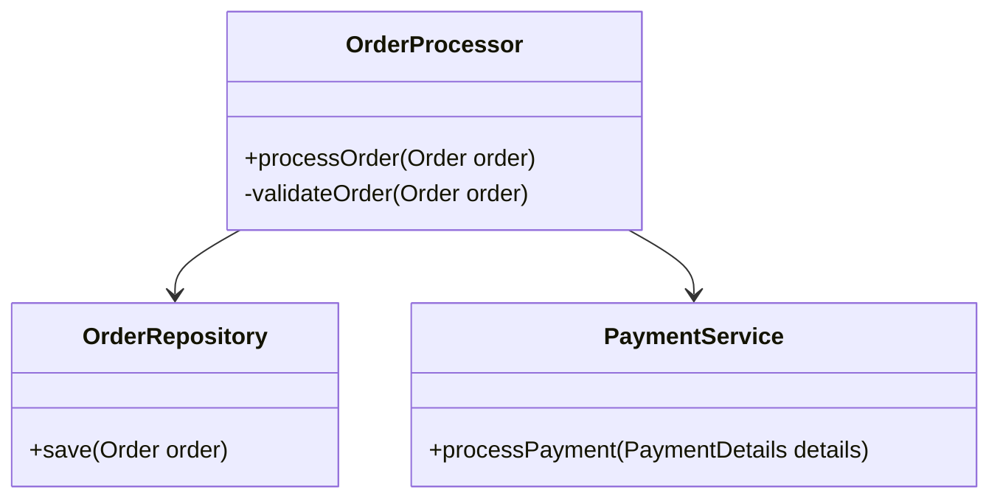

## 2.7.5 High Cohesion

In the realm of software engineering, particularly within object-oriented design, the principle of **High Cohesion** is pivotal. It ensures that classes and modules are designed with focused responsibilities, enhancing the clarity, maintainability, and reusability of the code. Let's delve into the concept of high cohesion, its significance, and how it can be effectively implemented in Java.

### Understanding High Cohesion

**High Cohesion** refers to the degree to which the elements within a module or class belong together. A highly cohesive class performs a single task or a group of related tasks, making it easier to understand, maintain, and extend. When a class has a well-defined purpose, it promotes reusability and reduces the complexity of the system.

#### Significance of High Cohesion

1. **Improved Understandability**: When a class is focused on a single responsibility, it becomes easier to understand. Developers can quickly grasp what the class does without having to sift through unrelated functionalities.

2. **Enhanced Maintainability**: High cohesion leads to simpler and more predictable code changes. When a class has a single responsibility, modifications are less likely to have unintended side effects.

3. **Increased Reusability**: Classes with focused responsibilities are more likely to be reused in different parts of an application or even in different projects.

4. **Facilitated Testing**: Testing a class with high cohesion is straightforward because the class has a clear purpose and limited interactions with other parts of the system.

### Problems with Low Cohesion

Low cohesion occurs when a class or module contains unrelated functionalities. This can lead to several issues:

- **Complexity**: Classes with multiple responsibilities become complex and difficult to understand.
- **Maintenance Challenges**: Changes in one part of the class can inadvertently affect other parts, leading to bugs.
- **Testing Difficulties**: Testing becomes challenging as the class has multiple, possibly unrelated, behaviors.
- **Reduced Reusability**: Classes with mixed responsibilities are less likely to be reused in different contexts.

### Example of Low Cohesion and Refactoring

Consider a class that handles both user authentication and logging activities. This class has low cohesion because it combines two unrelated responsibilities.

```java
public class UserManager {
    public boolean authenticate(String username, String password) {
        // Authentication logic
    }

    public void logActivity(String activity) {
        // Logging logic
    }
}
```

To improve cohesion, we can refactor this class into two separate classes, each with a single responsibility:

```java
public class Authenticator {
    public boolean authenticate(String username, String password) {
        // Authentication logic
    }
}

public class ActivityLogger {
    public void logActivity(String activity) {
        // Logging logic
    }
}
```

#### Rationale for Refactoring

- **Single Responsibility**: Each class now has a single responsibility, making them easier to understand and maintain.
- **Reusability**: The `Authenticator` and `ActivityLogger` classes can be reused independently in different parts of the application.
- **Testing**: Each class can be tested independently, simplifying the testing process.

### Connection to the Single Responsibility Principle

High cohesion is closely related to the **Single Responsibility Principle (SRP)**, which states that a class should have only one reason to change. By ensuring high cohesion, we naturally adhere to SRP, as each class focuses on a single task or responsibility.

### Balancing Cohesion with Other Design Considerations

While high cohesion is desirable, it's essential to balance it with other design considerations, such as coupling and performance:

- **Coupling**: Strive for low coupling, where classes are independent of each other. High cohesion and low coupling often go hand-in-hand, but it's crucial to ensure that increasing cohesion doesn't inadvertently increase coupling.

- **Performance**: In some cases, achieving high cohesion might lead to performance trade-offs. For instance, breaking a class into multiple smaller classes might introduce additional method calls. It's essential to evaluate the performance impact and find a balance that meets the application's needs.

### Java Examples Demonstrating High Cohesion

Let's explore a Java example that demonstrates high cohesion in class design, focusing on method and variable organization.

```java
public class OrderProcessor {
    private final OrderRepository orderRepository;
    private final PaymentService paymentService;

    public OrderProcessor(OrderRepository orderRepository, PaymentService paymentService) {
        this.orderRepository = orderRepository;
        this.paymentService = paymentService;
    }

    public void processOrder(Order order) {
        if (validateOrder(order)) {
            paymentService.processPayment(order.getPaymentDetails());
            orderRepository.save(order);
        }
    }

    private boolean validateOrder(Order order) {
        // Validation logic
        return true;
    }
}
```

#### Key Points

- **Focused Responsibility**: The `OrderProcessor` class is responsible for processing orders, including validation, payment processing, and saving the order.
- **Well-Defined Methods**: Each method within the class has a clear purpose, contributing to the overall responsibility of the class.
- **Encapsulation**: The class encapsulates its behavior, exposing only the `processOrder` method to clients.

### Practices to Maintain High Cohesion

1. **Regular Refactoring**: Continuously refactor code to ensure classes remain focused on a single responsibility. This involves splitting classes that have taken on multiple roles over time.

2. **Code Reviews**: Conduct regular code reviews to identify and address cohesion issues. Peer reviews can provide fresh perspectives and highlight areas for improvement.

3. **Design Patterns**: Utilize design patterns that promote high cohesion, such as the Factory Method or Strategy Pattern, to structure classes around specific responsibilities.

4. **Documentation**: Maintain clear documentation that outlines the purpose and responsibilities of each class. This helps developers understand the intended cohesion and identify deviations.

5. **Feedback Loops**: Establish feedback loops with stakeholders to ensure that the class design aligns with business requirements and user needs.

### Try It Yourself

To deepen your understanding of high cohesion, try refactoring a class in your current project that seems to have multiple responsibilities. Identify the distinct responsibilities and separate them into individual classes. Observe how this impacts the readability, maintainability, and testability of your code.

### Visualizing High Cohesion

Below is a diagram illustrating the concept of high cohesion in a class structure:



**Diagram Description**: This class diagram shows the `OrderProcessor` class interacting with `OrderRepository` and `PaymentService`, illustrating high cohesion by focusing on order processing tasks.

### Conclusion

High cohesion is a fundamental principle of object-oriented design that enhances the clarity, maintainability, and reusability of code. By ensuring that classes have focused responsibilities, developers can create systems that are easier to understand, test, and extend. Regular refactoring, code reviews, and adherence to design patterns are essential practices for maintaining high cohesion over time.

Remember, achieving high cohesion is an ongoing process. As your application evolves, continuously evaluate and refine your class designs to ensure they remain cohesive and aligned with the principles of good software engineering.

## Quiz Time!



### What is high cohesion in object-oriented design?

- [x] Ensuring classes have focused responsibilities
- [ ] Ensuring classes have multiple responsibilities
- [ ] Ensuring classes are tightly coupled
- [ ] Ensuring classes are loosely coupled

> **Explanation:** High cohesion refers to the degree to which the elements within a module or class belong together, focusing on a single responsibility.


### Why is high cohesion important?

- [x] It improves code maintainability and readability
- [ ] It increases code complexity
- [ ] It makes testing more difficult
- [ ] It reduces code reusability

> **Explanation:** High cohesion improves maintainability and readability by ensuring classes have focused responsibilities.


### What problem arises from low cohesion?

- [x] Classes become harder to understand and maintain
- [ ] Classes become easier to test
- [ ] Classes become more reusable
- [ ] Classes become more efficient

> **Explanation:** Low cohesion leads to classes with multiple responsibilities, making them harder to understand and maintain.


### How does high cohesion relate to the Single Responsibility Principle?

- [x] They both focus on ensuring a class has a single responsibility
- [ ] They both focus on reducing class dependencies
- [ ] They both focus on increasing class complexity
- [ ] They both focus on improving performance

> **Explanation:** High cohesion and the Single Responsibility Principle both emphasize that a class should have a single, well-defined purpose.


### Which of the following practices helps maintain high cohesion?

- [x] Regular refactoring
- [ ] Increasing class responsibilities
- [ ] Ignoring code reviews
- [ ] Avoiding design patterns

> **Explanation:** Regular refactoring helps maintain high cohesion by ensuring classes remain focused on a single responsibility.


### What is a potential trade-off when achieving high cohesion?

- [x] Performance trade-offs due to additional method calls
- [ ] Increased code complexity
- [ ] Reduced code readability
- [ ] Decreased maintainability

> **Explanation:** Achieving high cohesion might lead to performance trade-offs due to additional method calls when breaking a class into smaller, focused classes.


### How can design patterns help in achieving high cohesion?

- [x] By structuring classes around specific responsibilities
- [ ] By increasing class dependencies
- [ ] By making classes more complex
- [ ] By reducing code readability

> **Explanation:** Design patterns help achieve high cohesion by structuring classes around specific responsibilities, promoting focused and reusable code.


### What does the OrderProcessor class in the example demonstrate?

- [x] High cohesion by focusing on order processing tasks
- [ ] Low cohesion by handling multiple unrelated tasks
- [ ] High coupling with other classes
- [ ] Low maintainability

> **Explanation:** The OrderProcessor class demonstrates high cohesion by focusing on order processing tasks, including validation, payment processing, and saving orders.


### Which design consideration should be balanced with high cohesion?

- [x] Coupling
- [ ] Complexity
- [ ] Readability
- [ ] Maintainability

> **Explanation:** While high cohesion is desirable, it should be balanced with coupling to ensure classes remain independent of each other.


### True or False: High cohesion leads to classes with multiple responsibilities.

- [ ] True
- [x] False

> **Explanation:** High cohesion leads to classes with focused responsibilities, not multiple responsibilities.


