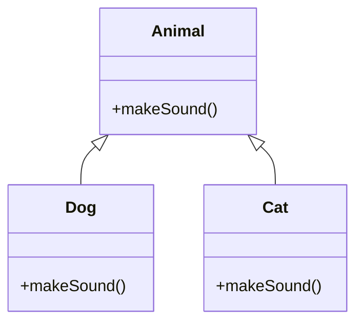

## 2.7.6 Polymorphism

Polymorphism is a cornerstone of object-oriented programming (OOP) and a key principle in designing flexible and extensible systems. It allows objects to be treated as instances of their parent class rather than their actual class. This capability is fundamental to achieving dynamic behavior in software systems, enabling developers to write more generic and reusable code.

### Understanding Polymorphism

Polymorphism in OOP refers to the ability of different classes to respond to the same method call in their own unique way. It primarily manifests in two forms: **method overriding** and **dynamic binding**.

#### Method Overriding

Method overriding occurs when a subclass provides a specific implementation for a method that is already defined in its superclass. This allows the subclass to modify or extend the behavior of that method.

```java
class Animal {
    void makeSound() {
        System.out.println("Animal makes a sound");
    }
}

class Dog extends Animal {
    @Override
    void makeSound() {
        System.out.println("Dog barks");
    }
}

class Cat extends Animal {
    @Override
    void makeSound() {
        System.out.println("Cat meows");
    }
}
```

In the example above, both `Dog` and `Cat` override the `makeSound` method of the `Animal` class to provide their specific sounds.

#### Dynamic Binding

Dynamic binding, or late binding, is the process by which a call to an overridden method is resolved at runtime rather than compile-time. This means that the method to be executed is determined based on the actual object type, not the reference type.

```java
public class Main {
    public static void main(String[] args) {
        Animal myAnimal = new Dog();
        myAnimal.makeSound(); // Outputs: Dog barks

        myAnimal = new Cat();
        myAnimal.makeSound(); // Outputs: Cat meows
    }
}
```

Here, the `makeSound` method call is resolved at runtime to the appropriate subclass implementation, demonstrating polymorphism in action.

### Designing Extensible Systems with Polymorphism

Polymorphism is crucial for designing systems that are easily extended and modified. It allows developers to add new functionality without altering existing code, adhering to the **Open/Closed Principle** (OCP) of software design, which states that software entities should be open for extension but closed for modification.

#### Eliminating Conditional Statements

Polymorphism can simplify code by eliminating complex conditional statements. Instead of using `if-else` or `switch` constructs to determine the behavior based on object types, polymorphism allows the behavior to be determined by the object itself.

```java
void handleAnimal(Animal animal) {
    animal.makeSound();
}
```

In this example, the `handleAnimal` method does not need to know the specific type of `Animal` it is dealing with. The correct `makeSound` method is called based on the actual object type, simplifying the code and making it more maintainable.

#### Supporting New Behaviors

Adding new behaviors to a system becomes straightforward with polymorphism. By simply creating a new subclass and overriding the necessary methods, new functionality can be integrated without changing existing code.

```java
class Bird extends Animal {
    @Override
    void makeSound() {
        System.out.println("Bird chirps");
    }
}
```

The `Bird` class can be added to the system without modifying the `handleAnimal` method or any other existing code that uses the `Animal` class.

### Benefits of Polymorphism

Polymorphism offers several benefits in handling variability and extending systems:

1. **Flexibility**: Code can be written to operate on the superclass type, allowing for flexibility in the types of objects that can be used.
2. **Reusability**: Common behavior can be defined in a superclass and reused by subclasses, reducing code duplication.
3. **Maintainability**: By eliminating conditional logic and relying on polymorphic behavior, code becomes easier to maintain and extend.
4. **Extensibility**: New classes can be added with minimal impact on existing code, supporting the Open/Closed Principle.

### Polymorphism and the Open/Closed Principle

Polymorphism is closely related to the Open/Closed Principle (OCP), one of the SOLID principles of object-oriented design. OCP emphasizes that software should be open for extension but closed for modification. Polymorphism enables this by allowing new functionality to be added through subclassing and method overriding, without altering existing code.

### Java Code Examples

Let's explore some Java code examples demonstrating polymorphic behavior using interfaces, abstract classes, and inheritance.

#### Using Interfaces

Interfaces in Java provide a way to achieve polymorphism by defining a contract that classes can implement.

```java
interface Shape {
    void draw();
}

class Circle implements Shape {
    @Override
    public void draw() {
        System.out.println("Drawing a circle");
    }
}

class Square implements Shape {
    @Override
    public void draw() {
        System.out.println("Drawing a square");
    }
}
```

In this example, both `Circle` and `Square` implement the `Shape` interface, providing their own implementation of the `draw` method.

#### Using Abstract Classes

Abstract classes can also be used to achieve polymorphism by defining abstract methods that subclasses must implement.

```java
abstract class Vehicle {
    abstract void startEngine();
}

class Car extends Vehicle {
    @Override
    void startEngine() {
        System.out.println("Car engine starts");
    }
}

class Motorcycle extends Vehicle {
    @Override
    void startEngine() {
        System.out.println("Motorcycle engine starts");
    }
}
```

Here, `Car` and `Motorcycle` extend the `Vehicle` abstract class and provide their specific implementations of the `startEngine` method.

### Best Practices for Designing with Polymorphism

When designing for polymorphism, consider the following best practices:

1. **Program to Interfaces**: Always program to interfaces rather than concrete implementations. This promotes flexibility and allows for easier substitution of different implementations.

2. **Favor Composition Over Inheritance**: While inheritance is a powerful tool, it can lead to tight coupling and fragile code. Consider using composition to achieve polymorphic behavior when possible.

3. **Use Abstract Classes for Shared Behavior**: When multiple classes share common behavior, use abstract classes to define shared methods and properties.

4. **Avoid Overusing Inheritance**: Inheritance can lead to complex hierarchies that are difficult to manage. Use it judiciously and prefer interfaces for defining contracts.

### Potential Pitfalls and How to Avoid Them

While polymorphism offers many benefits, there are potential pitfalls to be aware of:

- **Misuse of Inheritance**: Overusing inheritance can lead to tightly coupled code that is difficult to modify. Favor composition and interfaces to achieve polymorphism without the drawbacks of inheritance.

- **Performance Overhead**: Polymorphic calls can introduce a slight performance overhead due to dynamic binding. However, this is usually negligible compared to the benefits of maintainability and flexibility.

- **Complexity in Hierarchies**: Deep inheritance hierarchies can become complex and difficult to understand. Keep hierarchies shallow and use interfaces to define behavior.

### Visualizing Polymorphism in Java

To better understand how polymorphism works in Java, let's visualize the relationships between classes using a class diagram.



This diagram shows the `Animal` class as a superclass with `Dog` and `Cat` as subclasses, each overriding the `makeSound` method.

### Try It Yourself

To deepen your understanding of polymorphism, try modifying the code examples provided:

- Add a new subclass, such as `Fish`, and override the `makeSound` method to print "Fish makes no sound".
- Create an interface `Transport` with a method `move` and implement it in classes like `Bicycle` and `Train`.
- Experiment with abstract classes by creating an abstract class `Appliance` with a method `turnOn`, and extend it with classes like `WashingMachine` and `Refrigerator`.

### References and Links

For further reading on polymorphism and OOP principles, consider the following resources:

- [Oracle Java Tutorials: Polymorphism](https://docs.oracle.com/javase/tutorial/java/IandI/polymorphism.html)
- [GeeksforGeeks: Polymorphism in Java](https://www.geeksforgeeks.org/polymorphism-in-java/)
- [SOLID Principles Explained](https://www.baeldung.com/solid-principles)

### Knowledge Check

To reinforce your understanding of polymorphism, consider the following questions:

- How does polymorphism relate to the Open/Closed Principle?
- What are the benefits of using interfaces to achieve polymorphism?
- How can polymorphism simplify code by eliminating conditional statements?

### Embrace the Journey

Remember, mastering polymorphism is a journey. As you continue to explore and experiment with polymorphic designs, you'll gain a deeper understanding of how to create flexible and extensible software systems. Keep experimenting, stay curious, and enjoy the journey!

## Quiz Time!



### What is polymorphism in object-oriented programming?

- [x] The ability of different classes to respond to the same method call in their own unique way.
- [ ] The ability to create multiple methods with the same name but different parameters.
- [ ] The ability to define a class with multiple constructors.
- [ ] The ability to create a new class from an existing class.

> **Explanation:** Polymorphism allows different classes to respond to the same method call in their own unique way, enabling dynamic behavior in software systems.

### How does polymorphism support the Open/Closed Principle?

- [x] By allowing new functionality to be added through subclassing and method overriding without altering existing code.
- [ ] By enabling the creation of multiple methods with the same name but different parameters.
- [ ] By allowing classes to be instantiated with different constructors.
- [ ] By providing a way to define a class with multiple interfaces.

> **Explanation:** Polymorphism supports the Open/Closed Principle by enabling new functionality to be added through subclassing and method overriding without modifying existing code.

### Which of the following is a benefit of polymorphism?

- [x] Flexibility in the types of objects that can be used.
- [ ] Increased performance due to static binding.
- [ ] Reduced memory usage by eliminating object creation.
- [ ] Simplified code by using conditional statements.

> **Explanation:** Polymorphism provides flexibility in the types of objects that can be used, allowing for dynamic behavior and easier code maintenance.

### What is method overriding?

- [x] When a subclass provides a specific implementation for a method that is already defined in its superclass.
- [ ] When a class defines multiple methods with the same name but different parameters.
- [ ] When a class defines a method with the same name as a method in another class.
- [ ] When a class defines a method with the same name as a method in an interface.

> **Explanation:** Method overriding occurs when a subclass provides a specific implementation for a method that is already defined in its superclass.

### What is dynamic binding?

- [x] The process by which a call to an overridden method is resolved at runtime rather than compile-time.
- [ ] The process by which a call to a method is resolved at compile-time rather than runtime.
- [ ] The process by which a class is instantiated with different constructors.
- [ ] The process by which a method is defined with multiple parameters.

> **Explanation:** Dynamic binding is the process by which a call to an overridden method is resolved at runtime, allowing for polymorphic behavior.

### Which of the following is a best practice for designing with polymorphism?

- [x] Program to interfaces rather than concrete implementations.
- [ ] Use deep inheritance hierarchies to define behavior.
- [ ] Avoid using interfaces to define contracts.
- [ ] Use conditional statements to determine behavior.

> **Explanation:** Programming to interfaces rather than concrete implementations promotes flexibility and allows for easier substitution of different implementations.

### What is a potential pitfall of using polymorphism?

- [x] Overusing inheritance can lead to tightly coupled code.
- [ ] Polymorphism always increases performance.
- [ ] Polymorphism eliminates the need for interfaces.
- [ ] Polymorphism reduces the need for method overriding.

> **Explanation:** Overusing inheritance can lead to tightly coupled code, which is difficult to modify and maintain.

### How can polymorphism simplify code?

- [x] By eliminating complex conditional statements and relying on polymorphic behavior.
- [ ] By increasing the number of conditional statements needed.
- [ ] By reducing the need for method overriding.
- [ ] By eliminating the need for interfaces.

> **Explanation:** Polymorphism simplifies code by eliminating complex conditional statements and relying on polymorphic behavior to determine the appropriate method to call.

### What is the relationship between polymorphism and method overriding?

- [x] Polymorphism is achieved through method overriding, allowing subclasses to provide specific implementations for superclass methods.
- [ ] Polymorphism eliminates the need for method overriding.
- [ ] Method overriding is unrelated to polymorphism.
- [ ] Method overriding is only used in static binding.

> **Explanation:** Polymorphism is achieved through method overriding, allowing subclasses to provide specific implementations for superclass methods, enabling dynamic behavior.

### True or False: Polymorphism can only be achieved through inheritance.

- [ ] True
- [x] False

> **Explanation:** Polymorphism can be achieved through both inheritance and interfaces, allowing for flexible and dynamic behavior in software systems.


