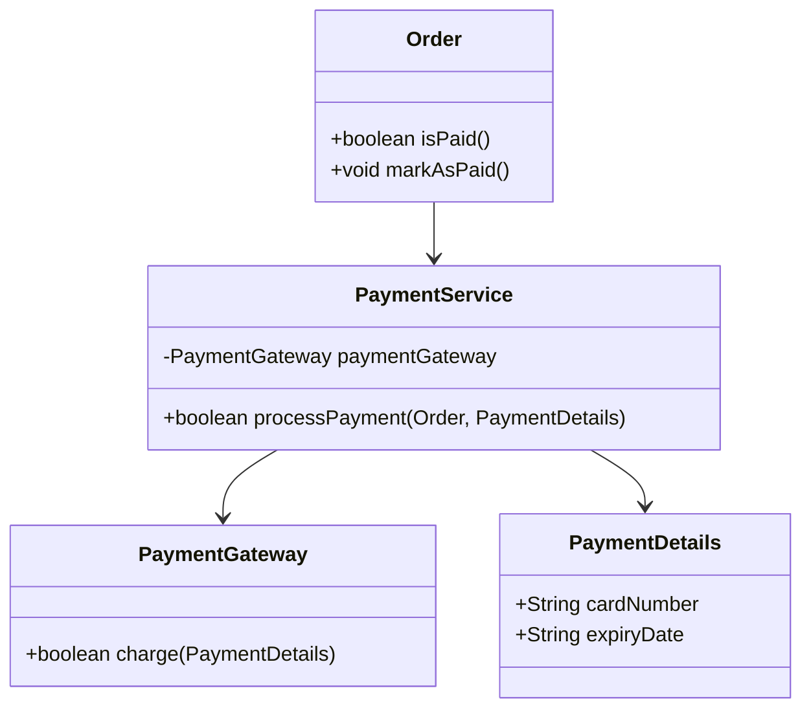

## 2.7.7 Pure Fabrication

In the realm of software engineering, particularly in object-oriented design, the GRASP (General Responsibility Assignment Software Patterns) principles provide a set of guidelines to help developers assign responsibilities to classes and objects effectively. One of these principles, Pure Fabrication, stands out as a powerful tool for achieving low coupling and high cohesion in your codebase. In this section, we will delve into the concept of Pure Fabrication, explore its necessity, and demonstrate its application in Java.

### Understanding Pure Fabrication

Pure Fabrication is a design principle that advocates for the creation of classes that do not directly correspond to concepts in the problem domain. Instead, these classes are artificially introduced to handle specific responsibilities that do not fit neatly into existing domain classes. The primary goal of Pure Fabrication is to achieve low coupling and high cohesion by isolating responsibilities that would otherwise clutter domain classes.

#### Why Introduce Artificial Classes?

In many software systems, there are operations or responsibilities that do not naturally belong to any existing domain class. Attempting to shoehorn these responsibilities into domain classes can lead to violations of other design principles, such as the Single Responsibility Principle (SRP) or the Open/Closed Principle (OCP). Pure Fabrication provides a solution by allowing developers to create new classes specifically designed to handle these responsibilities.

For example, consider a scenario where you need to perform complex calculations or data transformations that do not logically belong to any existing domain class. By introducing a fabricated class, you can encapsulate these operations, keeping your domain classes focused on their primary responsibilities.

### Benefits of Pure Fabrication

Pure Fabrication offers several benefits that contribute to better software design:

1. **Improved Cohesion**: By grouping related operations into a single class, Pure Fabrication enhances cohesion. This makes the code easier to understand and maintain, as each class has a clear and focused responsibility.

2. **Reduced Coupling**: By isolating responsibilities that do not belong to domain classes, Pure Fabrication reduces coupling between classes. This makes the system more flexible and easier to modify, as changes to one class are less likely to impact others.

3. **Enhanced Reusability**: Fabricated classes can often be reused across different parts of the application or even in different projects. This promotes code reuse and reduces duplication.

4. **Adherence to Other Principles**: By preventing domain classes from taking on unrelated responsibilities, Pure Fabrication helps maintain adherence to other design principles, such as SRP and OCP.

### Examples of Pure Fabrication

Let's explore some common scenarios where Pure Fabrication can improve design, such as utility classes or service handlers.

#### Utility Classes

Utility classes are a classic example of Pure Fabrication. These classes provide a collection of static methods that perform common operations, such as string manipulation or mathematical calculations. They do not represent any specific domain concept but serve as a convenient way to encapsulate reusable functionality.

```java
public class StringUtils {
    // A utility method to reverse a string
    public static String reverse(String input) {
        return new StringBuilder(input).reverse().toString();
    }

    // A utility method to capitalize the first letter of a string
    public static String capitalize(String input) {
        if (input == null || input.isEmpty()) {
            return input;
        }
        return input.substring(0, 1).toUpperCase() + input.substring(1);
    }
}
```

In this example, `StringUtils` is a fabricated class that provides utility methods for string manipulation. It enhances cohesion by grouping related operations and reduces coupling by providing a centralized location for these operations.

#### Service Handlers

Service handlers are another example of Pure Fabrication. These classes encapsulate business logic or operations that do not naturally belong to any domain class. They often act as intermediaries between the domain layer and external systems or services.

```java
public class PaymentService {
    private PaymentGateway paymentGateway;

    public PaymentService(PaymentGateway paymentGateway) {
        this.paymentGateway = paymentGateway;
    }

    // A method to process a payment
    public boolean processPayment(Order order, PaymentDetails paymentDetails) {
        // Business logic for processing payment
        if (order.isPaid()) {
            return false;
        }
        boolean success = paymentGateway.charge(paymentDetails);
        if (success) {
            order.markAsPaid();
        }
        return success;
    }
}
```

In this example, `PaymentService` is a fabricated class that encapsulates the logic for processing payments. It improves cohesion by keeping payment-related operations together and reduces coupling by isolating the payment logic from the `Order` class.

### Pure Fabrication and Design Patterns

Pure Fabrication is closely related to several design patterns, such as Data Access Objects (DAO), Repositories, and Service classes. These patterns often involve creating fabricated classes to handle specific responsibilities, improving the overall design of the system.

#### Data Access Objects (DAO)

The DAO pattern is a classic example of Pure Fabrication. DAOs are fabricated classes that provide an interface for accessing data from a database or other data source. They encapsulate data access logic, keeping it separate from the domain classes.

```java
public class UserDao {
    private DataSource dataSource;

    public UserDao(DataSource dataSource) {
        this.dataSource = dataSource;
    }

    // A method to retrieve a user by ID
    public User getUserById(int id) {
        // Data access logic
        // ...
        return user;
    }

    // A method to save a user
    public void saveUser(User user) {
        // Data access logic
        // ...
    }
}
```

In this example, `UserDao` is a fabricated class that encapsulates data access logic for the `User` entity. It improves cohesion by grouping related operations and reduces coupling by isolating data access logic from the domain classes.

#### Repositories

The Repository pattern is another example of Pure Fabrication. Repositories provide a collection-like interface for accessing domain objects, encapsulating data access and manipulation logic.

```java
public class UserRepository {
    private List<User> users = new ArrayList<>();

    // A method to add a user
    public void addUser(User user) {
        users.add(user);
    }

    // A method to find a user by username
    public User findByUsername(String username) {
        return users.stream()
            .filter(user -> user.getUsername().equals(username))
            .findFirst()
            .orElse(null);
    }
}
```

In this example, `UserRepository` is a fabricated class that provides a collection-like interface for managing `User` objects. It enhances cohesion by grouping related operations and reduces coupling by isolating data management logic from the domain classes.

#### Service Classes

Service classes are often used to encapsulate business logic or operations that span multiple domain classes. They provide a convenient way to organize complex logic that does not belong to any single domain class.

```java
public class OrderService {
    private OrderRepository orderRepository;
    private PaymentService paymentService;

    public OrderService(OrderRepository orderRepository, PaymentService paymentService) {
        this.orderRepository = orderRepository;
        this.paymentService = paymentService;
    }

    // A method to place an order
    public boolean placeOrder(Order order, PaymentDetails paymentDetails) {
        boolean paymentSuccess = paymentService.processPayment(order, paymentDetails);
        if (paymentSuccess) {
            orderRepository.addOrder(order);
        }
        return paymentSuccess;
    }
}
```

In this example, `OrderService` is a fabricated class that encapsulates the logic for placing an order. It improves cohesion by keeping order-related operations together and reduces coupling by isolating the order logic from the domain classes.

### Considerations for Using Pure Fabrication

While Pure Fabrication offers many benefits, it is important to use it judiciously. Introducing too many fabricated classes can lead to unnecessary complexity and make the system harder to understand and maintain. Here are some considerations to keep in mind:

1. **Avoid Over-Engineering**: Only introduce fabricated classes when there is a clear benefit, such as improved cohesion or reduced coupling. Avoid creating classes for the sake of following a pattern.

2. **Balance Domain Modeling and Fabrication**: Strive for a balance between modeling problem domain concepts and introducing fabricated classes. Use domain classes for responsibilities that naturally belong to them, and use fabricated classes for responsibilities that do not fit well into the domain model.

3. **Consider Future Changes**: When designing fabricated classes, consider how they might need to change in the future. Design them to be flexible and adaptable to evolving requirements.

4. **Document Responsibilities**: Clearly document the responsibilities of fabricated classes to ensure that their purpose is understood by other developers. This helps prevent misuse and promotes consistency.

### Try It Yourself

To better understand Pure Fabrication, try modifying the examples provided in this section. For instance, you could:

- Add additional utility methods to the `StringUtils` class.
- Implement additional business logic in the `PaymentService` class.
- Create a new fabricated class to handle logging or auditing operations.

These exercises will help reinforce the concepts discussed and give you hands-on experience with Pure Fabrication.

### Visualizing Pure Fabrication

To further illustrate the concept of Pure Fabrication, let's visualize the relationships between domain classes and fabricated classes using a class diagram.



In this diagram, we see how the `PaymentService` class acts as a fabricated class that encapsulates payment processing logic. It interacts with the `Order`, `PaymentDetails`, and `PaymentGateway` classes, isolating the payment logic from the domain classes.

### Conclusion

Pure Fabrication is a valuable principle in object-oriented design that allows developers to introduce artificial classes to achieve low coupling and high cohesion. By isolating responsibilities that do not naturally belong to domain classes, Pure Fabrication improves the design of software systems, making them more maintainable, flexible, and reusable.

As you continue to design and develop software, keep Pure Fabrication in mind as a tool for organizing responsibilities and improving the overall quality of your code. Remember to use it thoughtfully, balancing domain modeling with fabrication to create systems that are both robust and adaptable.

## Quiz Time!



### What is the primary goal of Pure Fabrication in software design?

- [x] To achieve low coupling and high cohesion by introducing artificial classes
- [ ] To represent every concept in the problem domain with a class
- [ ] To increase the number of classes in a system
- [ ] To ensure all classes have multiple responsibilities

> **Explanation:** Pure Fabrication aims to achieve low coupling and high cohesion by introducing classes that do not directly correspond to problem domain concepts.

### Which of the following is an example of a Pure Fabrication class?

- [x] Utility class
- [ ] Domain entity class
- [ ] Data Transfer Object (DTO)
- [ ] Singleton class

> **Explanation:** Utility classes are examples of Pure Fabrication as they encapsulate reusable functionality without representing a domain concept.

### How does Pure Fabrication relate to the Single Responsibility Principle (SRP)?

- [x] It helps maintain SRP by isolating unrelated responsibilities into separate classes
- [ ] It violates SRP by combining multiple responsibilities into one class
- [ ] It has no relation to SRP
- [ ] It enforces SRP by reducing the number of classes

> **Explanation:** Pure Fabrication supports SRP by ensuring that each class has a single, focused responsibility.

### What is a potential downside of overusing Pure Fabrication?

- [x] Unnecessary complexity
- [ ] Increased coupling
- [ ] Reduced cohesion
- [ ] Violating the Open/Closed Principle

> **Explanation:** Overusing Pure Fabrication can lead to unnecessary complexity by introducing too many classes.

### Which design pattern is closely related to Pure Fabrication?

- [x] Data Access Object (DAO)
- [ ] Singleton
- [ ] Observer
- [ ] Factory Method

> **Explanation:** The DAO pattern is closely related to Pure Fabrication as it involves creating fabricated classes for data access responsibilities.

### What is a key benefit of using fabricated classes?

- [x] Enhanced reusability
- [ ] Increased coupling
- [ ] Reduced number of classes
- [ ] Direct representation of domain concepts

> **Explanation:** Fabricated classes can be reused across different parts of an application, enhancing reusability.

### When should you consider using Pure Fabrication?

- [x] When responsibilities do not fit well into existing domain classes
- [ ] When you want to reduce the number of classes
- [ ] When every domain concept needs a corresponding class
- [ ] When you want to increase coupling

> **Explanation:** Pure Fabrication is useful when responsibilities do not naturally belong to existing domain classes.

### What is an example of a fabricated class in a payment processing system?

- [x] PaymentService
- [ ] Order
- [ ] Customer
- [ ] PaymentDetails

> **Explanation:** `PaymentService` is a fabricated class that encapsulates payment processing logic, isolating it from domain classes.

### How does Pure Fabrication improve cohesion?

- [x] By grouping related operations into a single class
- [ ] By increasing the number of responsibilities per class
- [ ] By reducing the number of classes
- [ ] By directly representing domain concepts

> **Explanation:** Pure Fabrication improves cohesion by grouping related operations into a single class, making the code easier to understand and maintain.

### True or False: Pure Fabrication classes should always represent a concept in the problem domain.

- [ ] True
- [x] False

> **Explanation:** Pure Fabrication classes do not represent a concept in the problem domain; they are introduced to handle specific responsibilities.


