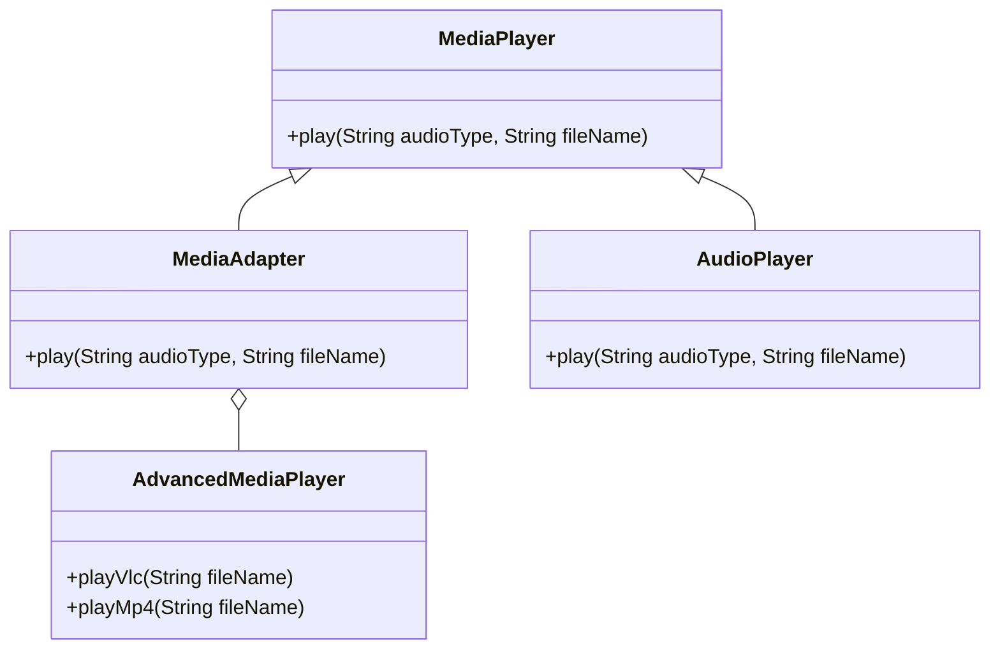

## 2.7.8 Indirection

In the realm of software engineering, achieving a balance between flexibility and complexity is crucial. The principle of **Indirection** plays a pivotal role in this balancing act by introducing intermediary objects to reduce direct coupling between components. This principle is a cornerstone of many design patterns, enabling developers to create systems that are both modular and adaptable to change.

### Understanding the Indirection Principle

The Indirection principle is about inserting an intermediary layer between components to manage their interactions. This approach reduces the direct dependencies between components, promoting a more modular and flexible architecture. By decoupling components, you can change one part of the system without significantly impacting others, facilitating easier maintenance and scalability.

#### Role in Decoupling Components

Indirection serves as a buffer that isolates components from each other. By doing so, it:

- **Reduces Dependencies**: Components are less reliant on each other's implementation details, allowing for independent development and testing.
- **Enhances Modularity**: Systems can be broken down into smaller, interchangeable parts, making them easier to understand and modify.
- **Facilitates Reusability**: Components can be reused in different contexts without modification, as they interact through a common interface or intermediary.

### Implementing Indirection in Java

Let's delve into how indirection can be implemented in Java using various design patterns. We'll explore examples that demonstrate the practical application of this principle.

#### Example: Using an Adapter Pattern

The Adapter pattern is a classic example of indirection. It allows incompatible interfaces to work together by introducing an adapter class that acts as an intermediary.

```java
// Target interface
interface MediaPlayer {
    void play(String audioType, String fileName);
}

// Adaptee class
class AdvancedMediaPlayer {
    void playVlc(String fileName) {
        System.out.println("Playing vlc file. Name: " + fileName);
    }

    void playMp4(String fileName) {
        System.out.println("Playing mp4 file. Name: " + fileName);
    }
}

// Adapter class
class MediaAdapter implements MediaPlayer {
    AdvancedMediaPlayer advancedMusicPlayer;

    MediaAdapter(String audioType) {
        if (audioType.equalsIgnoreCase("vlc")) {
            advancedMusicPlayer = new AdvancedMediaPlayer();
        } else if (audioType.equalsIgnoreCase("mp4")) {
            advancedMusicPlayer = new AdvancedMediaPlayer();
        }
    }

    @Override
    public void play(String audioType, String fileName) {
        if (audioType.equalsIgnoreCase("vlc")) {
            advancedMusicPlayer.playVlc(fileName);
        } else if (audioType.equalsIgnoreCase("mp4")) {
            advancedMusicPlayer.playMp4(fileName);
        }
    }
}

// Client class
class AudioPlayer implements MediaPlayer {
    MediaAdapter mediaAdapter;

    @Override
    public void play(String audioType, String fileName) {
        if (audioType.equalsIgnoreCase("mp3")) {
            System.out.println("Playing mp3 file. Name: " + fileName);
        } else if (audioType.equalsIgnoreCase("vlc") || audioType.equalsIgnoreCase("mp4")) {
            mediaAdapter = new MediaAdapter(audioType);
            mediaAdapter.play(audioType, fileName);
        } else {
            System.out.println("Invalid media. " + audioType + " format not supported");
        }
    }
}

// Usage
public class AdapterPatternDemo {
    public static void main(String[] args) {
        AudioPlayer audioPlayer = new AudioPlayer();

        audioPlayer.play("mp3", "beyond_the_horizon.mp3");
        audioPlayer.play("mp4", "alone.mp4");
        audioPlayer.play("vlc", "far_far_away.vlc");
        audioPlayer.play("avi", "mind_me.avi");
    }
}
```

In this example, the `MediaAdapter` class acts as an intermediary, allowing the `AudioPlayer` to play different audio formats without needing to know the specifics of each format.

#### Example: Proxy Pattern

The Proxy pattern is another form of indirection, where a proxy object controls access to another object.

```java
// Subject interface
interface Image {
    void display();
}

// RealSubject class
class RealImage implements Image {
    private String fileName;

    RealImage(String fileName) {
        this.fileName = fileName;
        loadFromDisk(fileName);
    }

    private void loadFromDisk(String fileName) {
        System.out.println("Loading " + fileName);
    }

    @Override
    public void display() {
        System.out.println("Displaying " + fileName);
    }
}

// Proxy class
class ProxyImage implements Image {
    private RealImage realImage;
    private String fileName;

    ProxyImage(String fileName) {
        this.fileName = fileName;
    }

    @Override
    public void display() {
        if (realImage == null) {
            realImage = new RealImage(fileName);
        }
        realImage.display();
    }
}

// Usage
public class ProxyPatternDemo {
    public static void main(String[] args) {
        Image image = new ProxyImage("test_10mb.jpg");

        // Image will be loaded from disk
        image.display();
        // Image will not be loaded from disk
        image.display();
    }
}
```

Here, the `ProxyImage` class acts as an intermediary, controlling access to the `RealImage` object. This can be useful for lazy loading, access control, or logging.

### Trade-offs of Using Indirection

While indirection offers significant benefits, it also introduces certain trade-offs:

- **Increased Complexity**: Adding layers of indirection can make the system more complex and harder to understand.
- **Performance Overhead**: Each layer of indirection can introduce latency, which may impact performance, especially in time-sensitive applications.

### Design Patterns Utilizing Indirection

Several design patterns leverage the principle of indirection to achieve decoupling and flexibility:

- **Facade Pattern**: Provides a simplified interface to a complex subsystem, reducing the number of objects that clients interact with.
- **Adapter Pattern**: Allows incompatible interfaces to work together by introducing an adapter.
- **Mediator Pattern**: Centralizes complex communications and control logic between related objects.
- **Observer Pattern**: Defines a one-to-many dependency between objects, allowing observers to be notified of state changes.

### When to Use Indirection

Indirection is particularly beneficial in scenarios where:

- **External Systems**: You need to interact with external systems or third-party libraries, and you want to minimize dependencies.
- **Anticipating Changes**: The system is expected to evolve, and you want to isolate changes to specific components.
- **Complex Interactions**: There are complex interactions between components that need to be managed centrally.

### Mindful Use of Indirection

While indirection can greatly enhance the design of a system, it's important to use it judiciously. Ensure that each layer of indirection adds value and simplifies the overall architecture rather than complicating it.

### Visualizing Indirection

To better understand how indirection works, let's visualize the interaction between components using a class diagram.



In this diagram, the `MediaAdapter` serves as an intermediary between `AudioPlayer` and `AdvancedMediaPlayer`, demonstrating the indirection principle.

### Try It Yourself

To deepen your understanding of indirection, try modifying the examples provided:

- **Experiment with Different Formats**: Extend the `MediaAdapter` to support additional audio formats.
- **Implement a New Proxy**: Create a proxy for a different type of resource, such as a network connection or database access.
- **Visualize with Mermaid.js**: Use Mermaid.js to create your own diagrams, visualizing the relationships in your code.

### Conclusion

The Indirection principle is a powerful tool in the software engineer's arsenal, enabling the creation of flexible, modular systems. By introducing intermediary objects, we can decouple components, enhance reusability, and facilitate easier maintenance. However, it's important to balance the benefits of indirection with the potential for increased complexity and performance impacts. As you continue to design and develop software, consider how indirection can be applied to improve your systems, and always strive for clarity and simplicity in your designs.

## Quiz Time!



### What is the primary benefit of using the Indirection principle in software design?

- [x] Reducing direct coupling between components
- [ ] Increasing the speed of execution
- [ ] Simplifying the code structure
- [ ] Enhancing data security

> **Explanation:** The Indirection principle primarily aims to reduce direct coupling between components, promoting flexibility and modularity.

### Which design pattern is an example of using indirection to allow incompatible interfaces to work together?

- [x] Adapter Pattern
- [ ] Singleton Pattern
- [ ] Factory Pattern
- [ ] Builder Pattern

> **Explanation:** The Adapter Pattern uses indirection to allow incompatible interfaces to work together by introducing an adapter class.

### What is a potential trade-off when using indirection in a system?

- [x] Increased complexity
- [ ] Reduced flexibility
- [ ] Decreased modularity
- [ ] Improved performance

> **Explanation:** While indirection can enhance flexibility and modularity, it can also increase the complexity of the system.

### Which pattern centralizes complex communications and control logic between related objects?

- [x] Mediator Pattern
- [ ] Observer Pattern
- [ ] Facade Pattern
- [ ] Proxy Pattern

> **Explanation:** The Mediator Pattern centralizes complex communications and control logic between related objects, reducing direct dependencies.

### In the provided Java example, what role does the `MediaAdapter` class play?

- [x] It acts as an intermediary between `AudioPlayer` and `AdvancedMediaPlayer`
- [ ] It directly plays audio files
- [ ] It stores audio files
- [ ] It converts audio files to a different format

> **Explanation:** The `MediaAdapter` class acts as an intermediary, allowing `AudioPlayer` to play different audio formats by interacting with `AdvancedMediaPlayer`.

### When is indirection particularly beneficial?

- [x] When dealing with external systems
- [ ] When performance is the top priority
- [ ] When the system is static and unchanging
- [ ] When there are no complex interactions

> **Explanation:** Indirection is beneficial when dealing with external systems, anticipating changes, or managing complex interactions.

### Which pattern provides a simplified interface to a complex subsystem?

- [x] Facade Pattern
- [ ] Adapter Pattern
- [ ] Observer Pattern
- [ ] Singleton Pattern

> **Explanation:** The Facade Pattern provides a simplified interface to a complex subsystem, reducing the number of objects that clients interact with.

### What is a common use case for the Proxy Pattern?

- [x] Lazy loading
- [ ] Sorting algorithms
- [ ] Data binding
- [ ] Event handling

> **Explanation:** The Proxy Pattern is commonly used for lazy loading, access control, and logging.

### How does indirection enhance reusability?

- [x] By allowing components to be reused in different contexts without modification
- [ ] By making components more complex
- [ ] By reducing the number of components
- [ ] By increasing direct dependencies

> **Explanation:** Indirection enhances reusability by allowing components to be reused in different contexts without modification, as they interact through a common interface or intermediary.

### True or False: Indirection always improves system performance.

- [ ] True
- [x] False

> **Explanation:** Indirection can introduce performance overhead due to additional layers, so it does not always improve system performance.


