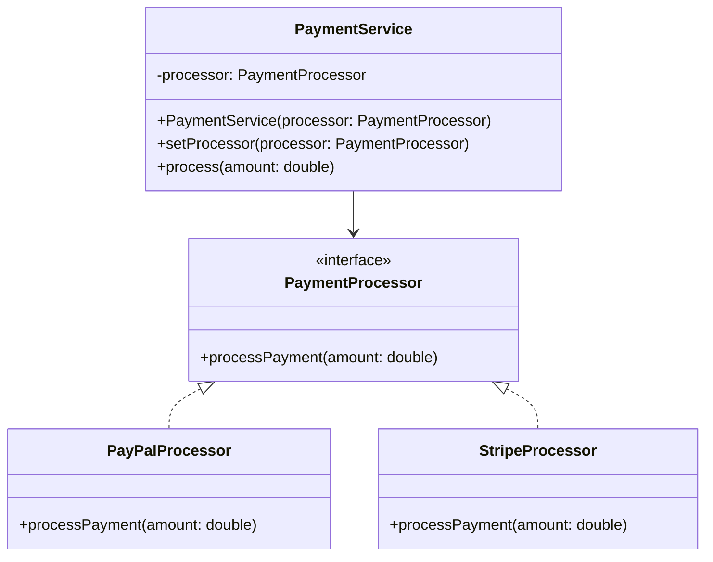

## 2.7.9 Protected Variations

In the ever-evolving landscape of software development, change is the only constant. As systems grow and adapt to new requirements, the ability to manage and accommodate change without introducing instability becomes crucial. This is where the Protected Variations principle comes into play. As one of the GRASP (General Responsibility Assignment Software Patterns) principles, Protected Variations focuses on shielding elements of a system from the impact of variations in other elements, thereby enhancing the system's stability and adaptability.

### Understanding Protected Variations

Protected Variations is a design principle that aims to identify points of potential instability or change—known as variation points—and protect other parts of the system from these changes. By doing so, it minimizes the ripple effects that changes can have throughout a codebase. This principle is particularly important in large, complex systems where changes in one part can have unintended consequences elsewhere.

#### Importance of Protected Variations

- **System Stability**: By isolating changes, Protected Variations helps maintain system stability, ensuring that modifications in one area do not adversely affect others.
- **Adaptability**: Systems designed with Protected Variations in mind can more easily adapt to new requirements or changes in technology.
- **Reduced Maintenance Costs**: By minimizing the impact of changes, Protected Variations reduces the time and effort required for maintenance and updates.

### Identifying Variation Points

The first step in applying the Protected Variations principle is to identify potential variation points within a system. These are areas where changes are likely to occur due to evolving requirements, technological advancements, or other factors. Common variation points include:

- **Business Rules**: These are often subject to change as business needs evolve.
- **External Interfaces**: Changes in third-party APIs or services can necessitate updates.
- **Algorithms**: As performance requirements change, algorithms may need to be optimized or replaced.

### Strategies for Protecting Variation Points

Once variation points are identified, the next step is to protect them using various strategies. These strategies often involve the use of interfaces, abstractions, and design patterns to encapsulate variability.

#### Using Interfaces and Abstractions

Interfaces and abstractions are powerful tools for encapsulating variability. By defining an interface for a variation point, you can decouple the implementation from the rest of the system. This allows you to change the implementation without affecting other parts of the system.

```java
// Define an interface for a payment processor
public interface PaymentProcessor {
    void processPayment(double amount);
}

// Implement the interface for a specific payment gateway
public class PayPalProcessor implements PaymentProcessor {
    @Override
    public void processPayment(double amount) {
        // PayPal-specific payment processing logic
    }
}

// Another implementation for a different payment gateway
public class StripeProcessor implements PaymentProcessor {
    @Override
    public void processPayment(double amount) {
        // Stripe-specific payment processing logic
    }
}
```

In this example, the `PaymentProcessor` interface acts as a protective barrier, allowing the payment processing logic to change without affecting the rest of the system.

#### Leveraging Design Patterns

Several design patterns are particularly useful for implementing Protected Variations, including the Strategy, Observer, and Factory Method patterns.

- **Strategy Pattern**: This pattern allows you to define a family of algorithms, encapsulate each one, and make them interchangeable. It is particularly useful for protecting variation points related to algorithms.

```java
// Define a strategy interface for sorting
public interface SortingStrategy {
    void sort(int[] numbers);
}

// Implement a concrete strategy for bubble sort
public class BubbleSortStrategy implements SortingStrategy {
    @Override
    public void sort(int[] numbers) {
        // Bubble sort logic
    }
}

// Implement another strategy for quick sort
public class QuickSortStrategy implements SortingStrategy {
    @Override
    public void sort(int[] numbers) {
        // Quick sort logic
    }
}

// Context class that uses a sorting strategy
public class Sorter {
    private SortingStrategy strategy;

    public Sorter(SortingStrategy strategy) {
        this.strategy = strategy;
    }

    public void setStrategy(SortingStrategy strategy) {
        this.strategy = strategy;
    }

    public void sort(int[] numbers) {
        strategy.sort(numbers);
    }
}
```

- **Observer Pattern**: This pattern is useful for protecting variation points related to state changes. It allows an object to notify other objects about changes in its state, without them being tightly coupled.

```java
import java.util.ArrayList;
import java.util.List;

// Subject interface
interface Subject {
    void attach(Observer o);
    void detach(Observer o);
    void notifyObservers();
}

// Concrete subject
class WeatherStation implements Subject {
    private List<Observer> observers = new ArrayList<>();
    private int temperature;

    public void setTemperature(int temperature) {
        this.temperature = temperature;
        notifyObservers();
    }

    @Override
    public void attach(Observer o) {
        observers.add(o);
    }

    @Override
    public void detach(Observer o) {
        observers.remove(o);
    }

    @Override
    public void notifyObservers() {
        for (Observer o : observers) {
            o.update(temperature);
        }
    }
}

// Observer interface
interface Observer {
    void update(int temperature);
}

// Concrete observer
class Display implements Observer {
    @Override
    public void update(int temperature) {
        System.out.println("Temperature updated to: " + temperature);
    }
}
```

- **Factory Method Pattern**: This pattern provides an interface for creating objects in a superclass, but allows subclasses to alter the type of objects that will be created.

```java
// Abstract product
abstract class Document {
    public abstract void open();
}

// Concrete product
class WordDocument extends Document {
    @Override
    public void open() {
        System.out.println("Opening Word document.");
    }
}

// Creator class
abstract class Application {
    public abstract Document createDocument();
}

// Concrete creator
class WordApplication extends Application {
    @Override
    public Document createDocument() {
        return new WordDocument();
    }
}
```

### Benefits of Anticipating Changes

By anticipating changes and designing systems that can accommodate them, you can achieve several benefits:

- **Flexibility**: Systems become more flexible and can adapt to new requirements without significant rework.
- **Reduced Risk**: By isolating changes, you reduce the risk of introducing bugs or instability.
- **Improved Maintainability**: Code is easier to maintain and update, as changes are localized to specific areas.

### Preventing Ripple Effects

One of the key advantages of Protected Variations is its ability to prevent ripple effects throughout the codebase when changes occur. By encapsulating variability, you ensure that changes in one part of the system do not cascade into other areas, leading to a more stable and reliable system.

### Relationship with Other Principles

Protected Variations is closely related to other design principles, such as the Open/Closed Principle and Dependency Inversion Principle.

- **Open/Closed Principle**: This principle states that software entities should be open for extension but closed for modification. Protected Variations supports this by allowing systems to be extended with new functionality without modifying existing code.
- **Dependency Inversion Principle**: This principle emphasizes the importance of depending on abstractions rather than concrete implementations. By using interfaces and abstractions, Protected Variations aligns with this principle, promoting decoupled and flexible systems.

### Java Code Snippets for Protected Variations

Let's explore some Java code snippets that demonstrate how to implement Protected Variations in practice.

#### Example: Payment Processing System

Consider a payment processing system where different payment gateways can be used. By using the Strategy pattern, we can protect the system from changes in payment gateway implementations.

```java
// PaymentProcessor interface
public interface PaymentProcessor {
    void processPayment(double amount);
}

// PayPalProcessor implementation
public class PayPalProcessor implements PaymentProcessor {
    @Override
    public void processPayment(double amount) {
        System.out.println("Processing payment through PayPal: " + amount);
    }
}

// StripeProcessor implementation
public class StripeProcessor implements PaymentProcessor {
    @Override
    public void processPayment(double amount) {
        System.out.println("Processing payment through Stripe: " + amount);
    }
}

// PaymentService class
public class PaymentService {
    private PaymentProcessor processor;

    public PaymentService(PaymentProcessor processor) {
        this.processor = processor;
    }

    public void setProcessor(PaymentProcessor processor) {
        this.processor = processor;
    }

    public void process(double amount) {
        processor.processPayment(amount);
    }
}

// Main class to test the payment processing system
public class Main {
    public static void main(String[] args) {
        PaymentService service = new PaymentService(new PayPalProcessor());
        service.process(100.0);

        // Switch to a different payment processor
        service.setProcessor(new StripeProcessor());
        service.process(200.0);
    }
}
```

In this example, the `PaymentService` class is protected from changes in payment gateway implementations by using the `PaymentProcessor` interface. This allows the system to switch between different processors without affecting the rest of the code.

### Encouraging Proactive Design Thinking

To build resilient and adaptable software systems, it is essential to adopt a proactive design mindset. This involves:

- **Anticipating Change**: Consider potential changes and design systems that can accommodate them with minimal disruption.
- **Encapsulating Variability**: Use interfaces, abstractions, and design patterns to encapsulate areas of variability.
- **Promoting Decoupling**: Strive for decoupled systems where components can evolve independently.

### Visualizing Protected Variations

To better understand the concept of Protected Variations, let's visualize how it works using a class diagram.



In this diagram, the `PaymentService` class depends on the `PaymentProcessor` interface, which is implemented by both `PayPalProcessor` and `StripeProcessor`. This encapsulation of variability allows the `PaymentService` to remain unaffected by changes in payment processor implementations.

### Try It Yourself

To reinforce your understanding of Protected Variations, try modifying the code examples provided:

1. **Add a New Payment Processor**: Implement a new payment processor class, such as `SquareProcessor`, and integrate it into the `PaymentService`.
2. **Enhance the Sorting Strategy**: Implement additional sorting strategies, such as merge sort or heap sort, and test them using the `Sorter` class.
3. **Extend the Observer Pattern**: Add more observers to the `WeatherStation` example and test how they respond to temperature changes.

### Conclusion

Protected Variations is a powerful principle that helps manage change within software systems by shielding elements from the impact of variations. By identifying variation points and encapsulating variability using interfaces, abstractions, and design patterns, you can build systems that are stable, adaptable, and easy to maintain. Embrace proactive design thinking to anticipate changes and create resilient software that can evolve with the demands of the future.

## Quiz Time!



### What is the primary goal of the Protected Variations principle?

- [x] To shield elements from the impact of variations in other elements.
- [ ] To increase the complexity of the system.
- [ ] To reduce the number of classes in a system.
- [ ] To ensure all classes are tightly coupled.

> **Explanation:** The primary goal of Protected Variations is to protect elements from the impact of changes, enhancing system stability and adaptability.

### Which design pattern is particularly useful for protecting variation points related to algorithms?

- [x] Strategy Pattern
- [ ] Observer Pattern
- [ ] Factory Method Pattern
- [ ] Singleton Pattern

> **Explanation:** The Strategy Pattern is useful for protecting variation points related to algorithms by allowing them to be interchangeable.

### What is a variation point in the context of Protected Variations?

- [x] An area where changes are likely to occur.
- [ ] A point where all classes are tightly coupled.
- [ ] A fixed part of the system that never changes.
- [ ] A location where exceptions are handled.

> **Explanation:** A variation point is an area in the system where changes are likely to occur, such as business rules or external interfaces.

### How does the Observer Pattern help in implementing Protected Variations?

- [x] By allowing an object to notify other objects about changes in its state.
- [ ] By reducing the number of classes in a system.
- [ ] By ensuring all classes are tightly coupled.
- [ ] By making all classes implement the same interface.

> **Explanation:** The Observer Pattern helps by allowing objects to be notified of changes without being tightly coupled, thus protecting against variations.

### Which principle is closely related to Protected Variations and emphasizes depending on abstractions?

- [x] Dependency Inversion Principle
- [ ] Single Responsibility Principle
- [ ] Liskov Substitution Principle
- [ ] Interface Segregation Principle

> **Explanation:** The Dependency Inversion Principle emphasizes depending on abstractions, which aligns with the goals of Protected Variations.

### What is the benefit of using interfaces in Protected Variations?

- [x] They decouple the implementation from the rest of the system.
- [ ] They increase the number of classes in a system.
- [ ] They ensure all classes are tightly coupled.
- [ ] They make the system more complex.

> **Explanation:** Interfaces decouple the implementation from the rest of the system, allowing changes without affecting other parts.

### How does the Factory Method Pattern support Protected Variations?

- [x] By providing an interface for creating objects, allowing subclasses to alter the type of objects created.
- [ ] By reducing the number of classes in a system.
- [ ] By ensuring all classes are tightly coupled.
- [ ] By making all classes implement the same interface.

> **Explanation:** The Factory Method Pattern supports Protected Variations by allowing subclasses to alter object creation, protecting against changes.

### What is a key advantage of Protected Variations?

- [x] It prevents ripple effects throughout the codebase when changes occur.
- [ ] It increases the complexity of the system.
- [ ] It reduces the number of classes in a system.
- [ ] It ensures all classes are tightly coupled.

> **Explanation:** A key advantage of Protected Variations is preventing ripple effects, maintaining stability when changes occur.

### Which Java code construct is often used to encapsulate variability?

- [x] Interfaces
- [ ] Arrays
- [ ] Loops
- [ ] Exceptions

> **Explanation:** Interfaces are often used to encapsulate variability, allowing different implementations without affecting the system.

### True or False: Protected Variations is unrelated to the Open/Closed Principle.

- [ ] True
- [x] False

> **Explanation:** False. Protected Variations is related to the Open/Closed Principle, as both aim to protect against changes by using abstractions.


