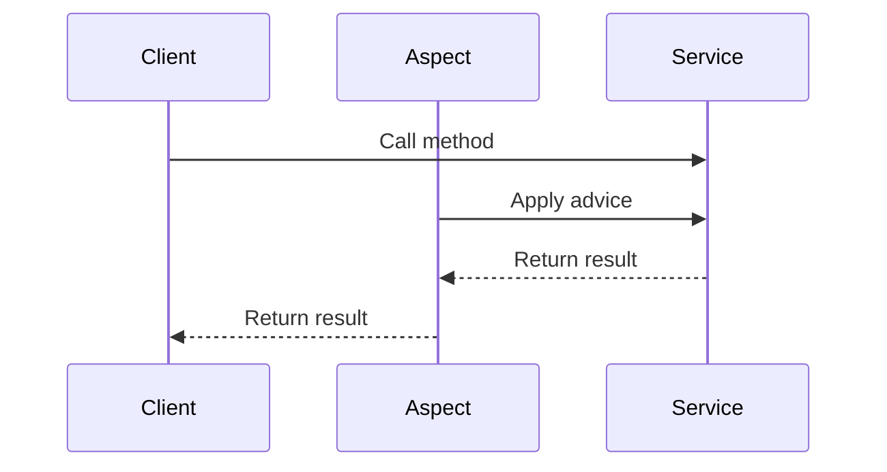

## 21.1.2 Cross-Cutting Concerns

In the realm of software development, **cross-cutting concerns** are aspects of a program that affect multiple modules but do not fit neatly into the primary business logic. These concerns often include functionalities such as logging, authentication, caching, and error handling. While traditional Object-Oriented Programming (OOP) provides a robust framework for organizing code into classes and objects, it often struggles to modularize these cross-cutting concerns effectively. This is where **Aspect-Oriented Programming (AOP)** comes into play, offering a paradigm that allows for the clean separation of these concerns from the core business logic.

### Understanding Cross-Cutting Concerns

#### Definition and Examples

Cross-cutting concerns are aspects of a program that affect multiple parts of an application and cannot be cleanly decomposed from the rest of the system. They are typically orthogonal to the main business logic, meaning they span across various modules and components. Common examples include:

- **Logging**: Capturing and recording application events for debugging and monitoring purposes.
- **Authentication and Authorization**: Verifying user identities and controlling access to resources.
- **Caching**: Storing frequently accessed data in memory to improve performance.
- **Transaction Management**: Ensuring data integrity by managing transactions across multiple operations.
- **Error Handling**: Managing exceptions and errors in a consistent manner across the application.

#### Challenges in Traditional OOP

In traditional OOP, cross-cutting concerns often lead to code scattering and tangling:

- **Code Scattering**: The same concern is implemented in multiple places, leading to duplication and maintenance challenges.
- **Code Tangling**: Business logic becomes intertwined with cross-cutting concerns, making the codebase harder to understand and modify.

For instance, consider a logging requirement that needs to be implemented across various methods in different classes. In OOP, this would typically involve adding logging statements within each method, resulting in scattered and tangled code.

### Aspect-Oriented Programming (AOP) to the Rescue

#### Introduction to AOP

Aspect-Oriented Programming is a programming paradigm that aims to increase modularity by allowing the separation of cross-cutting concerns. It introduces the concept of **aspects**, which encapsulate behaviors that affect multiple classes into reusable modules.

- **Aspect**: A module that encapsulates a cross-cutting concern.
- **Join Point**: A point in the execution of the program, such as method calls or object instantiations, where an aspect can be applied.
- **Advice**: Code that is executed at a particular join point. It defines what and when an aspect should be applied.
- **Pointcut**: An expression that matches join points and determines where advice should be executed.

#### Benefits of AOP

- **Separation of Concerns**: AOP allows developers to separate cross-cutting concerns from the main business logic, leading to cleaner and more maintainable code.
- **Reusability**: Aspects can be reused across different parts of the application, reducing code duplication.
- **Flexibility**: Changes to cross-cutting concerns can be made in one place without affecting the core business logic.

### Implementing Cross-Cutting Concerns with AOP

#### Example: Logging with AOP

Let's explore how AOP can be used to implement logging in a Java application using the Spring AOP framework.

##### Step 1: Define the Aspect

Create an aspect that encapsulates the logging logic.

```java
import org.aspectj.lang.JoinPoint;
import org.aspectj.lang.annotation.Aspect;
import org.aspectj.lang.annotation.Before;
import org.slf4j.Logger;
import org.slf4j.LoggerFactory;
import org.springframework.stereotype.Component;

@Aspect
@Component
public class LoggingAspect {

    private static final Logger logger = LoggerFactory.getLogger(LoggingAspect.class);

    @Before("execution(* com.example.service.*.*(..))")
    public void logBefore(JoinPoint joinPoint) {
        logger.info("Executing method: " + joinPoint.getSignature().getName());
    }
}
```

- **Aspect Annotation**: Marks the class as an aspect.
- **Before Advice**: Executes the logging logic before the matched method execution.
- **Pointcut Expression**: Matches all methods in the `com.example.service` package.

##### Step 2: Configure Spring AOP

Ensure that Spring AOP is enabled in your application configuration.

```xml
<!-- Enable AspectJ auto proxying -->
<beans xmlns="http://www.springframework.org/schema/beans"
       xmlns:xsi="http://www.w3.org/2001/XMLSchema-instance"
       xmlns:aop="http://www.springframework.org/schema/aop"
       xsi:schemaLocation="http://www.springframework.org/schema/beans
           http://www.springframework.org/schema/beans/spring-beans.xsd
           http://www.springframework.org/schema/aop
           http://www.springframework.org/schema/aop/spring-aop.xsd">

    <aop:aspectj-autoproxy/>
</beans>
```

##### Step 3: Test the Logging Aspect

Invoke methods in the `com.example.service` package and observe the logging output.

```java
@Service
public class ExampleService {

    public void performTask() {
        System.out.println("Task performed");
    }
}

// In the main application or test class
public static void main(String[] args) {
    ApplicationContext context = new AnnotationConfigApplicationContext(AppConfig.class);
    ExampleService service = context.getBean(ExampleService.class);
    service.performTask();
}
```

- **Output**: The console will display log messages before the execution of `performTask`.

#### Example: Caching with AOP

AOP can also be used to implement caching, improving application performance by storing frequently accessed data.

##### Step 1: Define the Aspect

Create an aspect that handles caching logic.

```java
import org.aspectj.lang.ProceedingJoinPoint;
import org.aspectj.lang.annotation.Around;
import org.aspectj.lang.annotation.Aspect;
import org.springframework.stereotype.Component;

import java.util.HashMap;
import java.util.Map;

@Aspect
@Component
public class CachingAspect {

    private Map<String, Object> cache = new HashMap<>();

    @Around("execution(* com.example.service.DataService.getData(..))")
    public Object cacheData(ProceedingJoinPoint joinPoint) throws Throwable {
        String key = joinPoint.getSignature().toShortString();
        if (cache.containsKey(key)) {
            return cache.get(key);
        }
        Object result = joinPoint.proceed();
        cache.put(key, result);
        return result;
    }
}
```

- **Around Advice**: Executes before and after the matched method, allowing control over method execution.
- **Cache Map**: Stores method results for reuse.

##### Step 2: Test the Caching Aspect

Invoke the `getData` method and observe caching behavior.

```java
@Service
public class DataService {

    public String getData() {
        return "Data from service";
    }
}

// In the main application or test class
public static void main(String[] args) {
    ApplicationContext context = new AnnotationConfigApplicationContext(AppConfig.class);
    DataService dataService = context.getBean(DataService.class);
    System.out.println(dataService.getData()); // First call, fetches from service
    System.out.println(dataService.getData()); // Second call, fetches from cache
}
```

- **Output**: The second call to `getData` retrieves the result from the cache, demonstrating the caching aspect.

### Visualizing AOP with Diagrams

To further understand how AOP works, let's visualize the interaction between aspects and business logic using a sequence diagram.



**Diagram Explanation**: The sequence diagram illustrates how an aspect intercepts a method call to a service, applies advice, and returns the result to the client.

### Historical Context and Evolution

The concept of AOP emerged in the late 1990s as a response to the limitations of OOP in handling cross-cutting concerns. Gregor Kiczales and his team at Xerox PARC introduced AOP as a way to improve modularity and separation of concerns. Over the years, AOP has evolved, with frameworks like AspectJ and Spring AOP making it accessible to Java developers.

### Practical Applications and Real-World Scenarios

AOP is widely used in enterprise applications to address various cross-cutting concerns:

- **Security**: Implementing security checks and access control across multiple layers of an application.
- **Performance Monitoring**: Collecting performance metrics and profiling application behavior.
- **Data Validation**: Ensuring data integrity by applying validation rules consistently.

### Conclusion

Aspect-Oriented Programming provides a powerful mechanism for handling cross-cutting concerns in Java applications. By separating these concerns from the core business logic, AOP enhances code modularity, maintainability, and reusability. As Java developers and software architects, embracing AOP can lead to cleaner and more efficient software designs.

### Key Takeaways

- Cross-cutting concerns are aspects that affect multiple modules and are challenging to modularize in traditional OOP.
- AOP allows for the separation of these concerns through aspects, join points, advice, and pointcuts.
- Implementing cross-cutting concerns with AOP leads to cleaner, more maintainable code.
- AOP is applicable in various scenarios, including logging, caching, security, and performance monitoring.

### Encouragement for Further Exploration

Consider how AOP can be applied to your current projects. Identify cross-cutting concerns in your codebase and experiment with implementing them using aspects. Reflect on the impact of AOP on code quality and maintainability.

For more information on AOP and its applications, refer to the [Oracle Java Documentation](https://docs.oracle.com/en/java/) and explore open-source projects that leverage AOP.

---

## Test Your Knowledge: Cross-Cutting Concerns in AOP Quiz



### What are cross-cutting concerns in software development?

- [x] Aspects that affect multiple modules and cannot be cleanly decomposed from the rest of the system.
- [ ] Core business logic that is central to the application's functionality.
- [ ] Features that are unique to a single module or component.
- [ ] Concerns that are only relevant during the initial development phase.

> **Explanation:** Cross-cutting concerns are aspects that affect multiple parts of an application and cannot be cleanly decomposed from the rest of the system, such as logging and authentication.

### How does traditional OOP struggle with cross-cutting concerns?

- [x] It leads to code scattering and tangling.
- [ ] It completely isolates cross-cutting concerns from business logic.
- [ ] It automatically handles cross-cutting concerns without additional code.
- [ ] It provides built-in support for modularizing cross-cutting concerns.

> **Explanation:** Traditional OOP struggles with cross-cutting concerns because it often results in code scattering and tangling, where the same concern is implemented in multiple places and intertwined with business logic.

### What is an aspect in Aspect-Oriented Programming?

- [x] A module that encapsulates a cross-cutting concern.
- [ ] A point in the execution of the program where an aspect can be applied.
- [ ] Code that is executed at a particular join point.
- [ ] An expression that matches join points.

> **Explanation:** An aspect is a module that encapsulates a cross-cutting concern, allowing it to be separated from the main business logic.

### What is the role of advice in AOP?

- [x] Code that is executed at a particular join point.
- [ ] A point in the execution of the program where an aspect can be applied.
- [ ] An expression that matches join points.
- [ ] A module that encapsulates a cross-cutting concern.

> **Explanation:** Advice is the code that is executed at a particular join point, defining what and when an aspect should be applied.

### Which of the following is a benefit of using AOP?

- [x] Separation of concerns
- [ ] Increased code duplication
- [x] Reusability
- [ ] Tangled business logic

> **Explanation:** AOP provides benefits such as separation of concerns and reusability, reducing code duplication and preventing tangled business logic.

### How does AOP improve code maintainability?

- [x] By separating cross-cutting concerns from business logic.
- [ ] By integrating cross-cutting concerns directly into each module.
- [ ] By eliminating the need for cross-cutting concerns.
- [ ] By duplicating cross-cutting concerns across the codebase.

> **Explanation:** AOP improves code maintainability by separating cross-cutting concerns from business logic, leading to cleaner and more modular code.

### What is a pointcut in AOP?

- [x] An expression that matches join points.
- [ ] A module that encapsulates a cross-cutting concern.
- [ ] Code that is executed at a particular join point.
- [ ] A point in the execution of the program where an aspect can be applied.

> **Explanation:** A pointcut is an expression that matches join points, determining where advice should be executed.

### In the provided logging example, what does the pointcut expression match?

- [x] All methods in the `com.example.service` package.
- [ ] Only the `performTask` method.
- [ ] Methods in any package.
- [ ] Only methods with a specific return type.

> **Explanation:** The pointcut expression `execution(* com.example.service.*.*(..))` matches all methods in the `com.example.service` package.

### What is the purpose of the `@Before` annotation in the logging aspect?

- [x] To execute the logging logic before the matched method execution.
- [ ] To execute the logging logic after the matched method execution.
- [ ] To execute the logging logic around the matched method execution.
- [ ] To disable logging for the matched method execution.

> **Explanation:** The `@Before` annotation is used to execute the logging logic before the matched method execution.

### True or False: AOP can be used to implement caching in a Java application.

- [x] True
- [ ] False

> **Explanation:** True. AOP can be used to implement caching by creating an aspect that handles caching logic, improving application performance.



---
