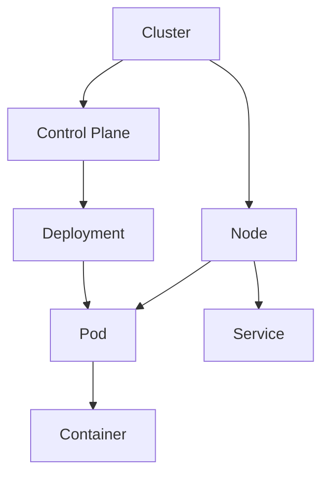

## 21.3.4.3 Orchestration with Kubernetes

Kubernetes has emerged as a leading platform for managing containerized applications in a clustered environment. It provides a robust framework for deploying, scaling, and managing applications, making it an essential tool for modern Java developers and software architects. This section delves into Kubernetes' architecture, deployment strategies for Java applications, advanced features, best practices, and tools that enhance its capabilities.

### Understanding Kubernetes Architecture

Kubernetes, often abbreviated as K8s, orchestrates containerized applications across a cluster of machines. It abstracts the underlying infrastructure, allowing developers to focus on application logic rather than deployment details. Here are the key components of Kubernetes architecture:

#### Clusters

A **cluster** is the heart of Kubernetes, consisting of a set of worker machines, called nodes, that run containerized applications. Each cluster has at least one control plane and multiple nodes.

#### Nodes

A **node** is a worker machine in Kubernetes, which can be a virtual or physical machine, depending on the cluster. Each node contains the services necessary to run pods and is managed by the control plane.

#### Pods

A **pod** is the smallest deployable unit in Kubernetes. It encapsulates one or more containers, storage resources, a unique network IP, and options for how the container(s) should run. Pods are ephemeral and can be replaced by new instances.

#### Services

A **service** in Kubernetes is an abstraction that defines a logical set of pods and a policy by which to access them. Services enable communication between different parts of an application and can expose pods to the outside world.

#### Deployments

A **deployment** provides declarative updates to applications. It manages the creation and scaling of pods and ensures that a specified number of pod replicas are running at any given time.



*Diagram: Kubernetes Architecture showing the relationship between clusters, nodes, pods, services, and deployments.*

### Deploying Java Applications

Deploying Java applications on Kubernetes involves creating container images, defining deployment configurations, and managing services. Here's a step-by-step guide:

#### Containerizing Java Applications

1. **Create a Dockerfile**: Define a Dockerfile to package your Java application into a container image.

    ```dockerfile
    FROM openjdk:11-jre-slim
    COPY target/myapp.jar /usr/app/myapp.jar
    WORKDIR /usr/app
    ENTRYPOINT ["java", "-jar", "myapp.jar"]
    ```

2. **Build the Docker Image**: Use Docker CLI to build the image.

    ```bash
    docker build -t myapp:1.0 .
    ```

3. **Push the Image to a Registry**: Push the image to a container registry like Docker Hub or a private registry.

    ```bash
    docker push myapp:1.0
    ```

#### Configuring Kubernetes Deployments

1. **Create a Deployment YAML**: Define a YAML file for the deployment.

    ```yaml
    apiVersion: apps/v1
    kind: Deployment
    metadata:
      name: myapp-deployment
    spec:
      replicas: 3
      selector:
        matchLabels:
          app: myapp
      template:
        metadata:
          labels:
            app: myapp
        spec:
          containers:
          - name: myapp
            image: myapp:1.0
            ports:
            - containerPort: 8080
    ```

2. **Apply the Deployment**: Use `kubectl` to apply the deployment.

    ```bash
    kubectl apply -f myapp-deployment.yaml
    ```

#### Exposing the Application

1. **Create a Service YAML**: Define a service to expose the application.

    ```yaml
    apiVersion: v1
    kind: Service
    metadata:
      name: myapp-service
    spec:
      type: LoadBalancer
      ports:
      - port: 80
        targetPort: 8080
      selector:
        app: myapp
    ```

2. **Apply the Service**: Use `kubectl` to apply the service.

    ```bash
    kubectl apply -f myapp-service.yaml
    ```

### Advanced Features

Kubernetes offers advanced features that enhance application management and deployment strategies.

#### ConfigMaps and Secrets

- **ConfigMaps**: Store configuration data in key-value pairs. Use ConfigMaps to decouple configuration artifacts from image content.

    ```yaml
    apiVersion: v1
    kind: ConfigMap
    metadata:
      name: myapp-config
    data:
      application.properties: |
        key=value
    ```

- **Secrets**: Store sensitive information, such as passwords and API keys, securely.

    ```yaml
    apiVersion: v1
    kind: Secret
    metadata:
      name: myapp-secret
    type: Opaque
    data:
      password: cGFzc3dvcmQ=
    ```

#### Ingress Controllers

Ingress controllers manage external access to services, typically HTTP. They provide load balancing, SSL termination, and name-based virtual hosting.

```yaml
apiVersion: networking.k8s.io/v1
kind: Ingress
metadata:
  name: myapp-ingress
spec:
  rules:
  - host: myapp.example.com
    http:
      paths:
      - path: /
        pathType: Prefix
        backend:
          service:
            name: myapp-service
            port:
              number: 80
```

#### Autoscaling and Rolling Updates

- **Autoscaling**: Automatically adjust the number of pod replicas based on CPU utilization or other select metrics.

    ```bash
    kubectl autoscale deployment myapp-deployment --cpu-percent=50 --min=1 --max=10
    ```

- **Rolling Updates**: Update applications without downtime by incrementally updating pods with new versions.

    ```bash
    kubectl set image deployment/myapp-deployment myapp=myapp:2.0
    ```

### Best Practices

Implementing best practices ensures efficient resource management and application stability.

#### Resource Management

- **Requests and Limits**: Define resource requests and limits for CPU and memory to ensure pods have the necessary resources.

    ```yaml
    resources:
      requests:
        memory: "64Mi"
        cpu: "250m"
      limits:
        memory: "128Mi"
        cpu: "500m"
    ```

- **Namespace Segmentation**: Use namespaces to separate environments (e.g., development, staging, production).

#### Monitoring and Logging

- **Monitoring**: Use tools like Prometheus and Grafana for monitoring Kubernetes clusters.
- **Logging**: Implement centralized logging with tools like Fluentd and Elasticsearch.

### Tools and Extensions

Enhance Kubernetes capabilities with additional tools and extensions.

#### Helm

[Helm](https://helm.sh/) is a package manager for Kubernetes, simplifying the deployment and management of applications.

- **Install Helm**: Follow the official [Helm installation guide](https://helm.sh/docs/intro/install/).
- **Create a Helm Chart**: Package your application as a Helm chart for easy deployment.

#### Kubernetes Official Resources

- **Kubernetes Official Website**: [Kubernetes.io](https://kubernetes.io/)
- **Kubernetes Documentation**: [Kubernetes Docs](https://kubernetes.io/docs/)

### Conclusion

Kubernetes provides a powerful platform for orchestrating Java applications in a cloud-native environment. By understanding its architecture, deploying applications effectively, leveraging advanced features, and following best practices, developers can harness the full potential of Kubernetes. As you explore Kubernetes, consider how these concepts can be applied to your own projects to enhance scalability, reliability, and efficiency.

## Test Your Knowledge: Kubernetes Orchestration for Java Applications Quiz



### What is the primary function of a Kubernetes cluster?

- [x] To manage and orchestrate containerized applications across multiple nodes.
- [ ] To store application data.
- [ ] To compile Java applications.
- [ ] To provide a user interface for application management.

> **Explanation:** A Kubernetes cluster orchestrates containerized applications across a set of nodes, managing deployment, scaling, and operations.

### Which Kubernetes component is responsible for managing the lifecycle of pods?

- [x] Deployment
- [ ] Service
- [ ] Node
- [ ] ConfigMap

> **Explanation:** A Deployment manages the lifecycle of pods, ensuring the desired state is maintained.

### What is the purpose of a ConfigMap in Kubernetes?

- [x] To store non-sensitive configuration data in key-value pairs.
- [ ] To store sensitive information securely.
- [ ] To manage external access to services.
- [ ] To define resource limits for pods.

> **Explanation:** ConfigMaps store configuration data that can be consumed by pods, decoupling configuration from container images.

### How does Kubernetes achieve zero-downtime updates?

- [x] By performing rolling updates.
- [ ] By deleting all pods and creating new ones.
- [ ] By using ConfigMaps.
- [ ] By scaling down to zero replicas.

> **Explanation:** Rolling updates allow Kubernetes to update applications incrementally, ensuring zero downtime.

### Which tool is used for package management in Kubernetes?

- [x] Helm
- [ ] Docker
- [ ] Prometheus
- [ ] Fluentd

> **Explanation:** Helm is a package manager for Kubernetes, simplifying application deployment and management.

### What is the role of an Ingress controller in Kubernetes?

- [x] To manage external access to services, typically HTTP.
- [ ] To store application logs.
- [ ] To scale applications automatically.
- [ ] To monitor application performance.

> **Explanation:** Ingress controllers manage external access, providing load balancing and SSL termination.

### What is the benefit of using namespaces in Kubernetes?

- [x] To separate environments and manage resources efficiently.
- [ ] To store sensitive information securely.
- [ ] To compile Java applications.
- [ ] To provide a user interface for application management.

> **Explanation:** Namespaces allow for environment segmentation and efficient resource management.

### How can you automatically scale a Kubernetes deployment based on CPU utilization?

- [x] By using the `kubectl autoscale` command.
- [ ] By manually increasing the number of replicas.
- [ ] By creating a new deployment.
- [ ] By updating the Docker image.

> **Explanation:** The `kubectl autoscale` command configures autoscaling based on CPU utilization.

### What is the purpose of resource requests and limits in Kubernetes?

- [x] To ensure pods have the necessary resources and prevent overconsumption.
- [ ] To store application data.
- [ ] To manage external access to services.
- [ ] To compile Java applications.

> **Explanation:** Resource requests and limits define the minimum and maximum resources a pod can use, ensuring efficient resource management.

### True or False: Kubernetes can only be used with Java applications.

- [ ] True
- [x] False

> **Explanation:** Kubernetes is language-agnostic and can orchestrate any containerized application, not just Java.



By mastering Kubernetes orchestration, Java developers can build scalable, resilient, and efficient applications that meet the demands of modern cloud-native environments.
