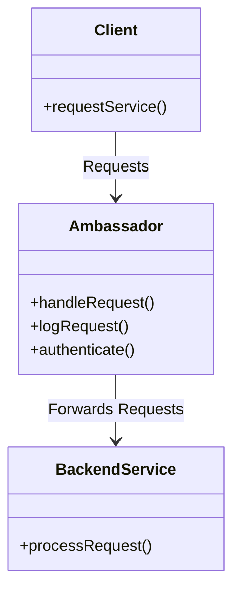

## 21.3.4.5 Ambassador Pattern

### Introduction

In the realm of cloud-native applications and distributed systems, the **Ambassador Pattern** emerges as a pivotal design strategy. This pattern involves deploying an intermediary service, known as an ambassador, which acts as a bridge between a client and backend services. The ambassador handles various network-related functions such as monitoring, logging, routing, authentication, and more. This pattern is particularly beneficial in microservices architectures, where it can offload common tasks from the main application logic, thereby enhancing modularity and maintainability.

### Intent

- **Description**: The Ambassador Pattern aims to abstract network-related concerns away from the core application logic by introducing an intermediary service that manages these concerns. This pattern is especially useful in cloud-native architectures, where services often need to interact with external systems or other microservices.

### Also Known As

- **Alternate Names**: Proxy Pattern, Sidecar Pattern (when implemented using sidecar containers).

### Motivation

The Ambassador Pattern is crucial in scenarios where applications need to interact with external services or other microservices in a consistent and reliable manner. By centralizing network-related functionalities, the pattern simplifies the application code and enhances its focus on business logic. This separation of concerns is vital in distributed systems, where network interactions can be complex and error-prone.

### Applicability

- **Guidelines**: Use the Ambassador Pattern when:
  - You need to decouple network-related concerns from business logic.
  - You want to implement cross-cutting concerns like logging, monitoring, or authentication.
  - You are working in a microservices architecture and need to manage service-to-service communication efficiently.

### Structure



- **Caption**: The diagram illustrates the Ambassador Pattern structure, where the Ambassador acts as an intermediary between the Client and Backend Service.

### Participants

- **Client**: The entity that initiates a request to the backend service.
- **Ambassador**: The intermediary service that handles network-related concerns and forwards requests to the backend service.
- **Backend Service**: The actual service that processes the client's request.

### Collaborations

- **Interactions**: The Client sends a request to the Ambassador, which performs necessary network-related tasks such as logging or authentication before forwarding the request to the Backend Service. The Backend Service processes the request and returns the response through the Ambassador.

### Consequences

- **Analysis**: 
  - **Benefits**: 
    - **Modularity**: Separates network concerns from business logic.
    - **Reusability**: Common functionalities can be reused across different services.
    - **Scalability**: Simplifies scaling of services by offloading network tasks.
  - **Drawbacks**: 
    - **Overhead**: Introduces additional latency and complexity.
    - **Maintenance**: Requires managing additional components in the architecture.

### Implementation

#### Implementation Guidelines

To implement the Ambassador Pattern in Java, consider using sidecar containers or proxies. These components can be deployed alongside your Java services to handle network-related tasks.

#### Sample Code Snippets

```java
// Java code example implementing the Ambassador Pattern

public class Ambassador {
    private final BackendService backendService;

    public Ambassador(BackendService backendService) {
        this.backendService = backendService;
    }

    public String handleRequest(String request) {
        logRequest(request);
        authenticate();
        return backendService.processRequest(request);
    }

    private void logRequest(String request) {
        System.out.println("Logging request: " + request);
    }

    private void authenticate() {
        System.out.println("Authenticating request...");
    }
}

public class BackendService {
    public String processRequest(String request) {
        return "Processed: " + request;
    }
}

public class Client {
    public static void main(String[] args) {
        BackendService backendService = new BackendService();
        Ambassador ambassador = new Ambassador(backendService);
        String response = ambassador.handleRequest("Sample Request");
        System.out.println(response);
    }
}
```

- **Explanation**: In this example, the `Ambassador` class acts as an intermediary between the `Client` and `BackendService`. It logs and authenticates requests before forwarding them to the backend service.

#### Sample Use Cases

- **Real-world Scenarios**: 
  - **Authentication**: Use the Ambassador Pattern to handle authentication for microservices, ensuring consistent security policies.
  - **Rate Limiting**: Implement rate limiting at the ambassador level to control the flow of requests to backend services.
  - **Protocol Translation**: Translate protocols (e.g., from HTTP to gRPC) using an ambassador to facilitate communication between services using different protocols.

### Integration with Infrastructure

#### Kubernetes

In Kubernetes, the Ambassador Pattern can be implemented using sidecar containers. These containers run alongside the main application container within the same pod, handling network-related tasks.

#### API Gateways

API gateways can also serve as ambassadors, managing cross-cutting concerns for multiple services. They provide a centralized point for implementing functionalities like authentication, logging, and routing.

### Benefits and Trade-offs

#### Benefits

- **Abstraction**: Provides a clear separation of concerns, allowing developers to focus on business logic.
- **Flexibility**: Easily adapt to changes in network policies or protocols without modifying the core application.

#### Trade-offs

- **Overhead**: Introduces additional components and potential latency.
- **Complexity**: Requires careful management and configuration of ambassadors.

### Resources

- **Ambassador API Gateway**: [Ambassador API Gateway](https://www.getambassador.io/) is a popular open-source implementation of the Ambassador Pattern, providing a robust platform for managing microservices traffic.

### Related Patterns

- **Proxy Pattern**: Similar to the Ambassador Pattern, but typically used for different purposes such as caching or access control.
- **Sidecar Pattern**: Often used in conjunction with the Ambassador Pattern in Kubernetes environments.

### Known Uses

- **Examples in Libraries or Frameworks**: 
  - **Istio**: A service mesh that uses the Ambassador Pattern to manage service-to-service communication in Kubernetes.
  - **Envoy**: A high-performance proxy that can be used as an ambassador to handle network-related tasks.

### Conclusion

The Ambassador Pattern is a powerful tool in the arsenal of cloud-native application design. By abstracting network-related concerns, it allows developers to build more modular, maintainable, and scalable applications. While it introduces some overhead and complexity, the benefits of clear separation of concerns and enhanced flexibility often outweigh these drawbacks. As cloud-native architectures continue to evolve, the Ambassador Pattern will remain a key strategy for managing service interactions in distributed systems.

---

## Test Your Knowledge: Ambassador Pattern in Java Applications



### What is the primary role of the Ambassador Pattern in cloud-native applications?

- [x] To act as an intermediary handling network-related functions.
- [ ] To directly process business logic.
- [ ] To store application data.
- [ ] To manage user interfaces.

> **Explanation:** The Ambassador Pattern serves as an intermediary, managing network-related tasks such as logging, monitoring, and authentication.

### Which of the following is a common implementation method for the Ambassador Pattern in Kubernetes?

- [x] Sidecar containers
- [ ] Monolithic applications
- [ ] Standalone databases
- [ ] Client-side scripts

> **Explanation:** Sidecar containers are commonly used in Kubernetes to implement the Ambassador Pattern, running alongside the main application container to handle network tasks.

### What is a potential drawback of using the Ambassador Pattern?

- [x] It introduces additional latency and complexity.
- [ ] It simplifies network interactions.
- [ ] It reduces the need for authentication.
- [ ] It eliminates the need for logging.

> **Explanation:** While the Ambassador Pattern provides many benefits, it can introduce additional latency and complexity due to the extra layer of abstraction.

### How does the Ambassador Pattern enhance modularity in applications?

- [x] By separating network concerns from business logic.
- [ ] By combining all functionalities into a single service.
- [ ] By eliminating the need for backend services.
- [ ] By integrating user interfaces with network logic.

> **Explanation:** The Ambassador Pattern enhances modularity by separating network-related concerns from the core business logic, allowing for more focused and maintainable code.

### Which of the following is a real-world use case for the Ambassador Pattern?

- [x] Authentication
- [ ] User interface design
- [x] Rate limiting
- [ ] Data storage

> **Explanation:** The Ambassador Pattern is often used for authentication and rate limiting, managing these cross-cutting concerns at the network level.

### What is a key benefit of using API gateways as ambassadors?

- [x] They provide a centralized point for implementing cross-cutting concerns.
- [ ] They directly handle user input.
- [ ] They store application data.
- [ ] They eliminate the need for backend services.

> **Explanation:** API gateways serve as ambassadors by providing a centralized point for managing cross-cutting concerns like authentication, logging, and routing.

### Which pattern is often used in conjunction with the Ambassador Pattern in Kubernetes environments?

- [x] Sidecar Pattern
- [ ] Singleton Pattern
- [x] Proxy Pattern
- [ ] Factory Pattern

> **Explanation:** The Sidecar Pattern is often used alongside the Ambassador Pattern in Kubernetes, where sidecar containers handle network-related tasks.

### What is the main advantage of using the Ambassador Pattern for protocol translation?

- [x] It facilitates communication between services using different protocols.
- [ ] It simplifies user interface design.
- [ ] It reduces the need for backend services.
- [ ] It eliminates the need for authentication.

> **Explanation:** The Ambassador Pattern is advantageous for protocol translation, allowing services using different protocols to communicate effectively.

### Which of the following is a well-known implementation of the Ambassador Pattern?

- [x] Istio
- [ ] Spring Boot
- [ ] Hibernate
- [ ] React

> **Explanation:** Istio is a service mesh that implements the Ambassador Pattern to manage service-to-service communication in Kubernetes.

### True or False: The Ambassador Pattern is primarily used to manage user interfaces.

- [ ] True
- [x] False

> **Explanation:** False. The Ambassador Pattern is primarily used to manage network-related concerns, not user interfaces.



---
