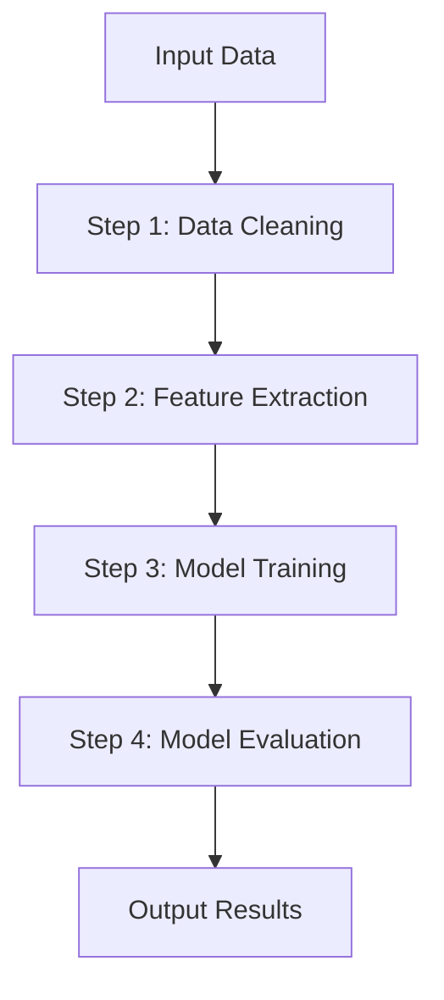

## 21.4.4.1 Pipeline Pattern for Data Processing

### Introduction

In the realm of machine learning and data science, the **Pipeline Pattern** emerges as a crucial design pattern for organizing and streamlining data processing tasks. This pattern is particularly beneficial in structuring machine learning workflows, where data transformation and model training are pivotal. By employing the Pipeline Pattern, developers can achieve modularity, reusability, and maintainability in their code, facilitating efficient and scalable machine learning applications.

### Understanding the Pipeline Pattern

#### Intent

The Pipeline Pattern is designed to process data in a series of steps, where each step performs a specific operation on the data. This pattern is akin to an assembly line in a factory, where each station (or step) adds value to the product (or data) as it moves along the line. In the context of machine learning, these steps can include data cleaning, feature extraction, model training, and evaluation.

#### Motivation

The motivation behind the Pipeline Pattern is to simplify complex data processing tasks by breaking them down into smaller, manageable steps. This approach not only enhances code readability and maintainability but also allows for the reuse of individual components across different projects. Moreover, it facilitates parallel processing and optimization, as each step can be independently developed and tested.

#### Applicability

The Pipeline Pattern is applicable in scenarios where:

- Data processing tasks are complex and involve multiple steps.
- There is a need for modular and reusable code components.
- The workflow requires flexibility to add, remove, or modify processing steps.
- Performance optimization through parallel processing is desired.

### Structure of the Pipeline Pattern

#### Diagram



**Caption**: The diagram illustrates a typical pipeline structure in a machine learning workflow, where data flows through a series of processing steps.

#### Participants

- **Input Data**: The raw data that needs to be processed.
- **Processing Steps**: Individual operations that transform the data, such as cleaning, feature extraction, and model training.
- **Output Results**: The final output after all processing steps are completed.

#### Collaborations

Each processing step in the pipeline collaborates with the subsequent step by passing its output as the input for the next step. This sequential flow ensures that data is progressively transformed and refined.

### Implementation in Java

#### Implementation Guidelines

To implement the Pipeline Pattern in Java, follow these guidelines:

1. **Define Interfaces for Steps**: Create interfaces that define the contract for each processing step.
2. **Implement Concrete Steps**: Develop concrete classes that implement the interfaces and perform specific data transformations.
3. **Assemble the Pipeline**: Create a pipeline class that manages the sequence of steps and facilitates data flow between them.
4. **Execute the Pipeline**: Provide a method to execute the pipeline, processing the input data through each step.

#### Sample Code Snippets

```java
// Define an interface for pipeline steps
interface PipelineStep<T> {
    T process(T input);
}

// Implement a concrete step for data cleaning
class DataCleaningStep implements PipelineStep<String> {
    @Override
    public String process(String input) {
        // Perform data cleaning operations
        return input.trim().toLowerCase();
    }
}

// Implement a concrete step for feature extraction
class FeatureExtractionStep implements PipelineStep<String> {
    @Override
    public String process(String input) {
        // Extract features from the data
        return "Features extracted from: " + input;
    }
}

// Implement a concrete step for model training
class ModelTrainingStep implements PipelineStep<String> {
    @Override
    public String process(String input) {
        // Train the model with the features
        return "Model trained with: " + input;
    }
}

// Assemble the pipeline
class DataProcessingPipeline {
    private List<PipelineStep<String>> steps = new ArrayList<>();

    public void addStep(PipelineStep<String> step) {
        steps.add(step);
    }

    public String execute(String input) {
        String result = input;
        for (PipelineStep<String> step : steps) {
            result = step.process(result);
        }
        return result;
    }
}

// Demonstrate the pipeline
public class PipelineDemo {
    public static void main(String[] args) {
        DataProcessingPipeline pipeline = new DataProcessingPipeline();
        pipeline.addStep(new DataCleaningStep());
        pipeline.addStep(new FeatureExtractionStep());
        pipeline.addStep(new ModelTrainingStep());

        String inputData = " Raw Data ";
        String result = pipeline.execute(inputData);
        System.out.println("Pipeline Result: " + result);
    }
}
```

**Explanation**: The code example demonstrates a simple data processing pipeline in Java. It includes steps for data cleaning, feature extraction, and model training. The `DataProcessingPipeline` class manages the sequence of steps and executes them on the input data.

#### Encouraging Experimentation

Encourage readers to experiment with the pipeline by adding new steps, modifying existing ones, or changing the order of steps. This experimentation can help in understanding the flexibility and modularity offered by the Pipeline Pattern.

### Tools and Libraries Supporting Pipeline Construction

Several Java libraries and frameworks support the construction of data processing pipelines, particularly in the context of machine learning:

- **Apache Beam**: A unified model for defining both batch and streaming data-parallel processing pipelines. It provides a rich set of APIs for building complex data processing workflows.
- **Apache Spark**: A powerful open-source processing engine that supports building pipelines for large-scale data processing and machine learning tasks.
- **TensorFlow Java**: While primarily known for its Python API, TensorFlow also provides Java bindings that can be used to construct machine learning pipelines.

### Benefits of the Pipeline Pattern

- **Modularity**: Each step in the pipeline is a self-contained unit, promoting code reuse and simplifying maintenance.
- **Reusability**: Steps can be reused across different pipelines or projects, reducing redundancy.
- **Scalability**: Pipelines can be easily scaled by adding more steps or parallelizing existing ones.
- **Flexibility**: The order of steps can be modified, or new steps can be added without affecting the overall pipeline structure.

### Real-World Scenarios

The Pipeline Pattern is widely used in various real-world applications, such as:

- **Data Preprocessing**: In machine learning projects, pipelines are used to preprocess data, including cleaning, normalization, and feature engineering.
- **ETL Processes**: Extract, Transform, Load (ETL) processes in data warehousing often employ pipelines to manage data flow and transformation.
- **Continuous Integration/Continuous Deployment (CI/CD)**: Pipelines are used to automate the build, test, and deployment processes in software development.

### Related Patterns

The Pipeline Pattern is related to other design patterns, such as:

- **Chain of Responsibility**: Both patterns involve passing data through a series of handlers or steps. However, the Pipeline Pattern focuses on data transformation, while the Chain of Responsibility is more about handling requests.
- **Decorator Pattern**: The Decorator Pattern adds behavior to objects dynamically, similar to how the Pipeline Pattern adds processing steps to data.

### Known Uses

The Pipeline Pattern is implemented in various libraries and frameworks, including:

- **Apache Flink**: A stream processing framework that uses pipelines to process data streams.
- **Scikit-learn**: A popular machine learning library in Python that provides a `Pipeline` class for chaining data processing steps.

### Conclusion

The Pipeline Pattern is an essential design pattern for organizing data processing tasks in machine learning workflows. By promoting modularity, reusability, and scalability, it enables developers to build efficient and maintainable applications. With the support of various Java libraries and frameworks, implementing the Pipeline Pattern has become more accessible, allowing developers to focus on solving complex data processing challenges.

### Key Takeaways

- The Pipeline Pattern structures data processing tasks into a series of modular steps.
- It enhances code reusability, maintainability, and scalability.
- Java libraries like Apache Beam and Apache Spark support pipeline construction.
- The pattern is applicable in machine learning, ETL processes, and CI/CD pipelines.

### Reflection

Consider how the Pipeline Pattern can be applied to your projects. What data processing tasks can be modularized using this pattern? How can you leverage existing libraries to streamline your workflow?

## Test Your Knowledge: Pipeline Pattern in Java Machine Learning



### What is the primary purpose of the Pipeline Pattern in data processing?

- [x] To organize data processing tasks into modular steps
- [ ] To increase the speed of data processing
- [ ] To reduce the amount of code required
- [ ] To eliminate the need for data validation

> **Explanation:** The Pipeline Pattern is designed to organize data processing tasks into a series of modular steps, enhancing code reusability and maintainability.

### Which Java library is known for supporting large-scale data processing pipelines?

- [x] Apache Spark
- [ ] Hibernate
- [ ] JUnit
- [ ] Spring Boot

> **Explanation:** Apache Spark is a powerful open-source processing engine that supports building pipelines for large-scale data processing and machine learning tasks.

### How does the Pipeline Pattern promote reusability?

- [x] By allowing individual steps to be reused across different projects
- [ ] By reducing the number of lines of code
- [ ] By eliminating the need for documentation
- [ ] By using a single class for all processing tasks

> **Explanation:** The Pipeline Pattern promotes reusability by allowing individual steps to be self-contained units that can be reused across different pipelines or projects.

### What is a common use case for the Pipeline Pattern in machine learning?

- [x] Data preprocessing
- [ ] User authentication
- [ ] Network communication
- [ ] GUI design

> **Explanation:** In machine learning, pipelines are commonly used for data preprocessing tasks, such as cleaning, normalization, and feature engineering.

### Which pattern is related to the Pipeline Pattern and focuses on handling requests?

- [x] Chain of Responsibility
- [ ] Singleton
- [ ] Observer
- [ ] Factory

> **Explanation:** The Chain of Responsibility pattern involves passing requests through a series of handlers, similar to how the Pipeline Pattern processes data through steps.

### What is a benefit of using the Pipeline Pattern?

- [x] Modularity
- [ ] Increased memory usage
- [ ] Reduced code readability
- [ ] Slower processing speed

> **Explanation:** The Pipeline Pattern enhances modularity by breaking down data processing tasks into smaller, manageable steps.

### Which of the following is NOT a step typically found in a machine learning pipeline?

- [x] User authentication
- [ ] Data cleaning
- [ ] Feature extraction
- [ ] Model training

> **Explanation:** User authentication is not a typical step in a machine learning pipeline, which usually involves data cleaning, feature extraction, and model training.

### What is the role of the `DataProcessingPipeline` class in the provided Java example?

- [x] To manage the sequence of steps and execute them on input data
- [ ] To store raw data
- [ ] To handle user input
- [ ] To generate random data

> **Explanation:** The `DataProcessingPipeline` class manages the sequence of processing steps and executes them on the input data.

### How can the Pipeline Pattern enhance scalability?

- [x] By allowing steps to be parallelized
- [ ] By reducing the number of steps
- [ ] By using a single-threaded approach
- [ ] By minimizing data validation

> **Explanation:** The Pipeline Pattern enhances scalability by allowing processing steps to be parallelized, improving performance.

### True or False: The Pipeline Pattern can only be used in machine learning applications.

- [ ] True
- [x] False

> **Explanation:** The Pipeline Pattern is versatile and can be used in various applications beyond machine learning, such as ETL processes and CI/CD pipelines.




