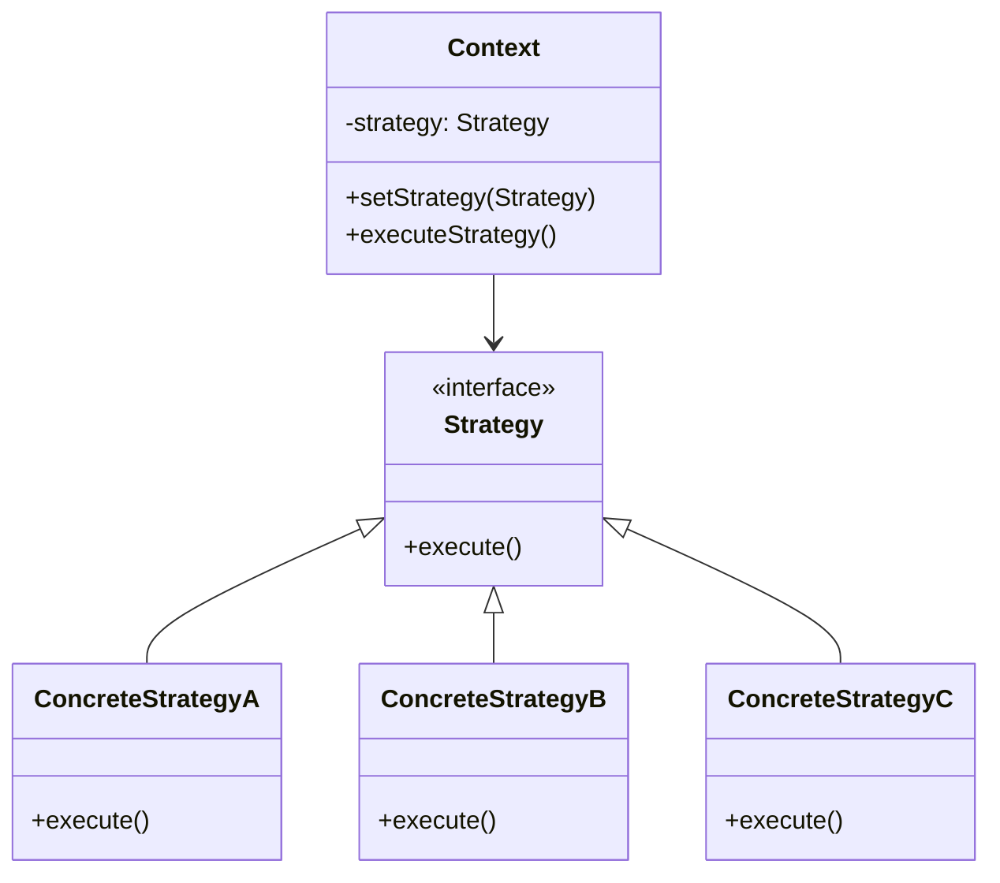

## 21.4.4.2 Strategy Pattern for Algorithm Selection

### Introduction

In the realm of software design, the **Strategy Pattern** is a behavioral design pattern that enables selecting an algorithm's behavior at runtime. It is particularly useful in scenarios where multiple algorithms can solve a problem, and the choice of algorithm may depend on the context or user input. This pattern is especially relevant in machine learning applications, where different algorithms may be employed based on data characteristics, performance requirements, or experimental needs.

### Intent

- **Description**: The Strategy Pattern defines a family of algorithms, encapsulates each one, and makes them interchangeable. It allows the algorithm to vary independently from clients that use it.
- **Purpose**: To enable dynamic selection and switching of algorithms at runtime without altering the client code.

### Also Known As

- **Policy Pattern**

### Motivation

In machine learning applications, the need to experiment with different algorithms is common. For instance, one might want to switch between a decision tree, a support vector machine, and a neural network based on the dataset's nature or the desired accuracy and performance. The Strategy Pattern facilitates this by allowing the encapsulation of each algorithm's implementation and providing a mechanism to interchange them seamlessly.

### Applicability

- **Guidelines**: Use the Strategy Pattern when:
  - You have multiple algorithms for a specific task, and you want to switch between them at runtime.
  - You want to avoid conditional statements for algorithm selection in the client code.
  - You need to provide a flexible and extensible system where new algorithms can be added with minimal changes to existing code.

### Structure



- **Caption**: The diagram illustrates the Strategy Pattern's structure, showing how different algorithms (ConcreteStrategies) can be interchanged within a Context.

### Participants

- **Context**: Maintains a reference to a Strategy object and is configured with a ConcreteStrategy object.
- **Strategy**: Declares an interface common to all supported algorithms.
- **ConcreteStrategy**: Implements the algorithm using the Strategy interface.

### Collaborations

- **Interactions**: The Context delegates the algorithm execution to the Strategy object, allowing the algorithm to be interchangeable without modifying the Context.

### Consequences

- **Benefits**:
  - **Extensibility**: New algorithms can be added without modifying existing code.
  - **Flexibility**: Algorithms can be switched at runtime, facilitating experimentation.
  - **Separation of Concerns**: The client code is decoupled from the algorithm implementations.
- **Drawbacks**:
  - **Increased Number of Classes**: Each algorithm requires a separate class, which may increase complexity.
  - **Overhead**: The pattern introduces an additional layer of abstraction, which may impact performance in resource-constrained environments.

### Implementation

#### Implementation Guidelines

1. **Define the Strategy Interface**: Create an interface that declares the algorithm's method(s).
2. **Implement Concrete Strategies**: Develop classes that implement the Strategy interface, each encapsulating a specific algorithm.
3. **Integrate with Context**: Design the Context class to hold a reference to a Strategy object and delegate algorithm execution to it.
4. **Allow Strategy Configuration**: Provide methods in the Context to set or change the Strategy at runtime.

#### Sample Code Snippets

```java
// Strategy interface
interface SortingStrategy {
    void sort(int[] numbers);
}

// Concrete Strategy A: Bubble Sort
class BubbleSortStrategy implements SortingStrategy {
    @Override
    public void sort(int[] numbers) {
        // Implementation of Bubble Sort
        for (int i = 0; i < numbers.length - 1; i++) {
            for (int j = 0; j < numbers.length - i - 1; j++) {
                if (numbers[j] > numbers[j + 1]) {
                    // Swap numbers[j] and numbers[j + 1]
                    int temp = numbers[j];
                    numbers[j] = numbers[j + 1];
                    numbers[j + 1] = temp;
                }
            }
        }
    }
}

// Concrete Strategy B: Quick Sort
class QuickSortStrategy implements SortingStrategy {
    @Override
    public void sort(int[] numbers) {
        quickSort(numbers, 0, numbers.length - 1);
    }

    private void quickSort(int[] array, int low, int high) {
        if (low < high) {
            int pi = partition(array, low, high);
            quickSort(array, low, pi - 1);
            quickSort(array, pi + 1, high);
        }
    }

    private int partition(int[] array, int low, int high) {
        int pivot = array[high];
        int i = (low - 1);
        for (int j = low; j < high; j++) {
            if (array[j] <= pivot) {
                i++;
                int temp = array[i];
                array[i] = array[j];
                array[j] = temp;
            }
        }
        int temp = array[i + 1];
        array[i + 1] = array[high];
        array[high] = temp;
        return i + 1;
    }
}

// Context class
class SortContext {
    private SortingStrategy strategy;

    public void setStrategy(SortingStrategy strategy) {
        this.strategy = strategy;
    }

    public void sortArray(int[] numbers) {
        strategy.sort(numbers);
    }
}

// Client code
public class StrategyPatternDemo {
    public static void main(String[] args) {
        SortContext context = new SortContext();

        int[] numbers = {5, 2, 9, 1, 5, 6};

        // Using Bubble Sort
        context.setStrategy(new BubbleSortStrategy());
        context.sortArray(numbers);
        System.out.println("Bubble Sorted: " + Arrays.toString(numbers));

        // Using Quick Sort
        context.setStrategy(new QuickSortStrategy());
        context.sortArray(numbers);
        System.out.println("Quick Sorted: " + Arrays.toString(numbers));
    }
}
```

- **Explanation**: The code demonstrates the Strategy Pattern by implementing two sorting algorithms, Bubble Sort and Quick Sort. The `SortContext` class allows switching between these algorithms at runtime, showcasing the pattern's flexibility.

### Sample Use Cases

- **Real-world Scenarios**:
  - **Machine Learning Model Selection**: Dynamically choose between different machine learning models (e.g., linear regression, decision trees, neural networks) based on dataset characteristics or user preferences.
  - **Payment Processing Systems**: Switch between different payment gateways or methods based on transaction type or user location.
  - **Compression Algorithms**: Select appropriate compression algorithms for files based on size or type.

### Related Patterns

- **Connections**:
  - **[Factory Pattern]( "Factory Pattern")**: Often used in conjunction with the Strategy Pattern to create instances of strategies.
  - **[Decorator Pattern]( "Decorator Pattern")**: Can be used to add responsibilities to strategies dynamically.

### Known Uses

- **Examples in Libraries or Frameworks**:
  - **Java Collections Framework**: The `Comparator` interface is a classic example of the Strategy Pattern, allowing different sorting strategies for collections.
  - **Spring Framework**: The `Strategy` design pattern is used extensively in Spring's configuration and bean instantiation processes.

### Considerations for Interface Design and Compatibility

When implementing the Strategy Pattern, careful consideration must be given to the design of the Strategy interface. It should be broad enough to accommodate various algorithms yet specific enough to ensure compatibility. Additionally, the Context class should be designed to handle any exceptions or errors that may arise from incompatible strategies.

### Conclusion

The Strategy Pattern is a powerful tool for algorithm selection in Java applications, particularly in machine learning contexts where flexibility and experimentation are paramount. By encapsulating algorithms and allowing them to be interchanged at runtime, developers can create systems that are both extensible and easy to maintain. However, it is essential to balance the benefits of flexibility with the potential complexity introduced by additional classes and interfaces.

### Exercises

1. **Implement a New Strategy**: Extend the provided example by implementing a new sorting algorithm, such as Merge Sort, and integrate it into the `SortContext`.
2. **Experiment with Different Contexts**: Modify the `SortContext` to handle additional parameters or configurations that may influence the choice of sorting strategy.
3. **Explore Real-world Applications**: Identify a real-world application in your domain where the Strategy Pattern could be applied to enhance flexibility and maintainability.

### Key Takeaways

- The Strategy Pattern promotes flexibility and extensibility by allowing algorithms to be interchanged at runtime.
- It is particularly useful in machine learning applications where different algorithms may be employed based on context or experimental needs.
- Careful design of the Strategy interface and Context class is crucial to ensure compatibility and ease of use.

### Reflection

Consider how the Strategy Pattern could be applied to your current projects. Are there areas where algorithm selection could be made more dynamic? How might this pattern improve the flexibility and maintainability of your codebase?

## Test Your Knowledge: Strategy Pattern in Java Quiz



### What is the primary benefit of using the Strategy Pattern in Java?

- [x] It allows dynamic selection of algorithms at runtime.
- [ ] It reduces the number of classes in a system.
- [ ] It improves the performance of algorithms.
- [ ] It simplifies the client code by hardcoding algorithms.

> **Explanation:** The Strategy Pattern enables dynamic selection and interchange of algorithms at runtime, enhancing flexibility and experimentation.

### Which of the following is a key component of the Strategy Pattern?

- [x] Strategy Interface
- [ ] Singleton Class
- [ ] Observer Interface
- [ ] Factory Method

> **Explanation:** The Strategy Pattern relies on a Strategy Interface to define a family of interchangeable algorithms.

### How does the Strategy Pattern enhance extensibility?

- [x] By allowing new algorithms to be added without modifying existing code.
- [ ] By reducing the number of interfaces.
- [ ] By hardcoding algorithms into the client code.
- [ ] By eliminating the need for interfaces.

> **Explanation:** The Strategy Pattern's design allows new algorithms to be added as new classes implementing the Strategy interface, without altering existing code.

### In the provided code example, what role does the `SortContext` class play?

- [x] It maintains a reference to a Strategy object and delegates algorithm execution.
- [ ] It implements the sorting algorithms directly.
- [ ] It serves as a data structure for sorting.
- [ ] It provides user input for sorting.

> **Explanation:** The `SortContext` class holds a reference to a Strategy object and delegates the sorting task to it, allowing for dynamic algorithm selection.

### Which design pattern is often used in conjunction with the Strategy Pattern?

- [x] Factory Pattern
- [ ] Observer Pattern
- [ ] Singleton Pattern
- [ ] Adapter Pattern

> **Explanation:** The Factory Pattern is often used alongside the Strategy Pattern to create instances of strategies.

### What is a potential drawback of using the Strategy Pattern?

- [x] Increased number of classes
- [ ] Reduced flexibility
- [ ] Hardcoded algorithms
- [ ] Decreased performance

> **Explanation:** The Strategy Pattern can lead to an increased number of classes, as each algorithm requires a separate class.

### How can the Strategy Pattern be applied in machine learning applications?

- [x] By dynamically selecting different machine learning models based on data characteristics.
- [ ] By hardcoding a single machine learning model.
- [ ] By eliminating the need for model training.
- [ ] By reducing the number of models available.

> **Explanation:** The Strategy Pattern allows for dynamic selection of machine learning models, facilitating experimentation and flexibility.

### What is the role of the `ConcreteStrategy` class in the Strategy Pattern?

- [x] It implements the algorithm using the Strategy interface.
- [ ] It defines the Strategy interface.
- [ ] It maintains a reference to the Context.
- [ ] It provides user input for the algorithm.

> **Explanation:** The `ConcreteStrategy` class implements the algorithm defined by the Strategy interface, allowing for interchangeable strategies.

### How does the Strategy Pattern promote separation of concerns?

- [x] By decoupling client code from algorithm implementations.
- [ ] By hardcoding algorithms into the client code.
- [ ] By reducing the number of interfaces.
- [ ] By eliminating the need for classes.

> **Explanation:** The Strategy Pattern separates the client code from algorithm implementations, promoting modularity and maintainability.

### True or False: The Strategy Pattern is also known as the Policy Pattern.

- [x] True
- [ ] False

> **Explanation:** The Strategy Pattern is sometimes referred to as the Policy Pattern, emphasizing its role in defining interchangeable policies or algorithms.



By understanding and applying the Strategy Pattern, Java developers and software architects can create systems that are both flexible and robust, capable of adapting to changing requirements and facilitating experimentation with different algorithms.
