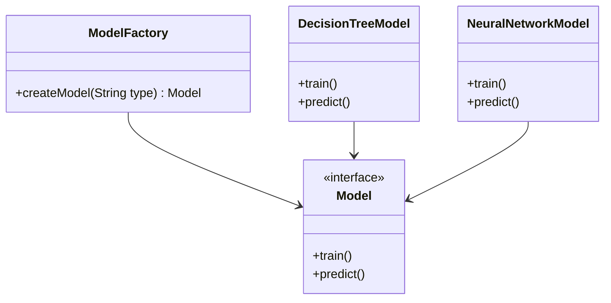

## 21.4.4.3 Factory Pattern for Model Creation

### Introduction

The Factory Pattern is a creational design pattern that provides an interface for creating objects in a superclass but allows subclasses to alter the type of objects that will be created. This pattern is particularly useful in scenarios where the exact types and dependencies of the objects are not known until runtime. In the context of machine learning applications, the Factory Pattern can be employed to instantiate different types of models based on input parameters, thereby decoupling the creation logic from the usage of these models.

### Intent

- **Description**: The Factory Pattern aims to define an interface for creating an object, but let subclasses decide which class to instantiate. It promotes loose coupling by eliminating the need to bind application-specific classes into the code.
- **Relevance in Machine Learning**: In machine learning, models can vary significantly in terms of architecture, parameters, and training data. The Factory Pattern allows for the dynamic creation of these models, facilitating experimentation and scalability.

### Motivation

Machine learning applications often require the creation of various models, each with specific configurations and parameters. The Factory Pattern provides a structured approach to handle this complexity by abstracting the instantiation process. This pattern is particularly beneficial when:

- The application needs to support multiple model types (e.g., decision trees, neural networks, support vector machines).
- The model creation process involves complex logic that should not be exposed to the client code.
- The system needs to be scalable and configurable, allowing for easy addition of new model types without modifying existing code.

### Applicability

- **Guidelines**: Use the Factory Pattern when:
  - A class cannot anticipate the class of objects it must create.
  - A class wants its subclasses to specify the objects it creates.
  - You want to localize the knowledge of which class gets created.
  - You need to provide a high level of configurability and scalability in model creation.

### Structure



**Caption**: The diagram illustrates the Factory Pattern structure for creating machine learning models. The `ModelFactory` class defines a method for creating models, while `DecisionTreeModel` and `NeuralNetworkModel` implement the `Model` interface.

### Participants

- **ModelFactory**: The creator class that declares the factory method, which returns an object of type `Model`.
- **Model**: An interface or abstract class that defines the operations that all concrete models must implement.
- **DecisionTreeModel** and **NeuralNetworkModel**: Concrete classes that implement the `Model` interface, representing specific types of machine learning models.

### Collaborations

- The client code calls the factory method on the `ModelFactory` to create a `Model` object.
- The `ModelFactory` decides which subclass to instantiate based on input parameters.
- The client interacts with the `Model` interface, unaware of the specific subclass being used.

### Consequences

- **Benefits**:
  - **Decoupling**: Separates the creation logic from the usage, promoting loose coupling.
  - **Scalability**: Easily add new model types without altering existing code.
  - **Configurability**: Dynamically configure models based on runtime parameters.
- **Drawbacks**:
  - **Complexity**: Introduces additional classes and interfaces, which can increase complexity.
  - **Overhead**: May introduce performance overhead due to the abstraction layer.

### Implementation

#### Implementation Guidelines

- Define a `Model` interface with common methods like `train()` and `predict()`.
- Create a `ModelFactory` class with a method `createModel(String type)` that returns a `Model` object.
- Implement concrete classes like `DecisionTreeModel` and `NeuralNetworkModel` that implement the `Model` interface.
- Use the factory method in client code to instantiate models based on input parameters.

#### Sample Code Snippets

```java
// Model.java
public interface Model {
    void train();
    void predict();
}

// DecisionTreeModel.java
public class DecisionTreeModel implements Model {
    @Override
    public void train() {
        System.out.println("Training Decision Tree Model");
    }

    @Override
    public void predict() {
        System.out.println("Predicting with Decision Tree Model");
    }
}

// NeuralNetworkModel.java
public class NeuralNetworkModel implements Model {
    @Override
    public void train() {
        System.out.println("Training Neural Network Model");
    }

    @Override
    public void predict() {
        System.out.println("Predicting with Neural Network Model");
    }
}

// ModelFactory.java
public class ModelFactory {
    public Model createModel(String type) {
        if (type.equalsIgnoreCase("DecisionTree")) {
            return new DecisionTreeModel();
        } else if (type.equalsIgnoreCase("NeuralNetwork")) {
            return new NeuralNetworkModel();
        }
        throw new IllegalArgumentException("Unknown model type");
    }
}

// Client.java
public class Client {
    public static void main(String[] args) {
        ModelFactory factory = new ModelFactory();
        Model model = factory.createModel("NeuralNetwork");
        model.train();
        model.predict();
    }
}
```

**Explanation**: The code demonstrates the Factory Pattern for creating machine learning models. The `ModelFactory` class encapsulates the logic for instantiating different model types based on input parameters. The client code interacts with the `Model` interface, ensuring flexibility and scalability.

### Sample Use Cases

- **Real-world Scenarios**:
  - **Data Science Platforms**: Platforms like KNIME or RapidMiner can use the Factory Pattern to allow users to select and configure different machine learning models dynamically.
  - **Automated Machine Learning (AutoML)**: AutoML systems can leverage the Factory Pattern to instantiate various models based on dataset characteristics and user preferences.

### Related Patterns

- **[6.6 Singleton Pattern]( "Singleton Pattern")**: The Singleton Pattern can be used in conjunction with the Factory Pattern to ensure that only one instance of a factory is created.
- **Abstract Factory Pattern**: Provides an interface for creating families of related or dependent objects without specifying their concrete classes, which can be useful for creating complex model configurations.

### Known Uses

- **Examples in Libraries or Frameworks**:
  - **TensorFlow**: Uses factory-like methods to create various layers and models.
  - **Scikit-learn**: Although primarily in Python, the concept of factory methods is used to instantiate different machine learning algorithms.

### Best Practices for Implementing Factories in Machine Learning Applications

- **Encapsulation**: Keep the model creation logic encapsulated within the factory class to promote maintainability.
- **Parameterization**: Use input parameters to determine the type of model to create, allowing for dynamic configuration.
- **Error Handling**: Implement robust error handling to manage unknown model types or invalid parameters.
- **Testing**: Thoroughly test factory methods to ensure they create the correct model types and handle edge cases gracefully.
- **Documentation**: Document the factory methods and the types of models they can create to aid future developers.

### Conclusion

The Factory Pattern is a powerful tool for managing the complexity of model creation in machine learning applications. By decoupling the creation logic from the usage, it enhances configurability and scalability, allowing developers to focus on building robust and flexible systems. As machine learning continues to evolve, the Factory Pattern will remain a valuable asset in the software architect's toolkit.

## Test Your Knowledge: Factory Pattern in Java Machine Learning Applications



### What is the primary purpose of the Factory Pattern in Java?

- [x] To define an interface for creating objects, allowing subclasses to decide which class to instantiate.
- [ ] To create a single instance of a class.
- [ ] To provide a way to access elements of an aggregate object sequentially.
- [ ] To define a family of algorithms.

> **Explanation:** The Factory Pattern is used to define an interface for creating objects, but allows subclasses to decide which class to instantiate, promoting loose coupling.

### How does the Factory Pattern enhance scalability in machine learning applications?

- [x] By allowing new model types to be added without modifying existing code.
- [ ] By reducing the number of classes in the application.
- [ ] By ensuring only one instance of a model is created.
- [ ] By simplifying the training process.

> **Explanation:** The Factory Pattern enhances scalability by allowing new model types to be added without altering existing code, making it easier to expand the system.

### Which of the following is a benefit of using the Factory Pattern?

- [x] Decoupling the creation logic from the usage.
- [ ] Reducing the number of interfaces in the application.
- [ ] Ensuring thread safety in model creation.
- [ ] Simplifying the user interface.

> **Explanation:** The Factory Pattern decouples the creation logic from the usage, promoting loose coupling and flexibility.

### In the provided code example, what role does the `ModelFactory` class play?

- [x] It encapsulates the logic for creating different model types.
- [ ] It defines the interface for all models.
- [ ] It trains the models.
- [ ] It predicts outcomes using the models.

> **Explanation:** The `ModelFactory` class encapsulates the logic for creating different model types based on input parameters.

### What is a potential drawback of using the Factory Pattern?

- [x] It can introduce additional complexity with more classes and interfaces.
- [ ] It limits the number of models that can be created.
- [ ] It reduces the flexibility of the application.
- [ ] It makes the code less maintainable.

> **Explanation:** The Factory Pattern can introduce additional complexity due to the increased number of classes and interfaces.

### How does the Factory Pattern support configurability in model creation?

- [x] By using input parameters to determine the type of model to create.
- [ ] By creating a single instance of each model.
- [ ] By simplifying the model training process.
- [ ] By reducing the number of classes in the application.

> **Explanation:** The Factory Pattern supports configurability by using input parameters to dynamically determine the type of model to create.

### Which design pattern can be used in conjunction with the Factory Pattern to ensure only one instance of a factory is created?

- [x] [6.6 Singleton Pattern]( "Singleton Pattern")
- [ ] Observer Pattern
- [ ] Strategy Pattern
- [ ] Decorator Pattern

> **Explanation:** The Singleton Pattern can be used with the Factory Pattern to ensure that only one instance of a factory is created.

### What is the role of the `Model` interface in the Factory Pattern?

- [x] It defines the operations that all concrete models must implement.
- [ ] It creates instances of models.
- [ ] It trains the models.
- [ ] It predicts outcomes using the models.

> **Explanation:** The `Model` interface defines the operations that all concrete models must implement, ensuring consistency across different model types.

### In what scenario is the Factory Pattern particularly beneficial?

- [x] When the application needs to support multiple model types.
- [ ] When only one model type is used.
- [ ] When the model creation logic is simple.
- [ ] When the application does not require scalability.

> **Explanation:** The Factory Pattern is beneficial when the application needs to support multiple model types, allowing for dynamic creation and scalability.

### True or False: The Factory Pattern is only applicable to machine learning applications.

- [x] False
- [ ] True

> **Explanation:** The Factory Pattern is a general design pattern applicable to various domains, not just machine learning applications.


