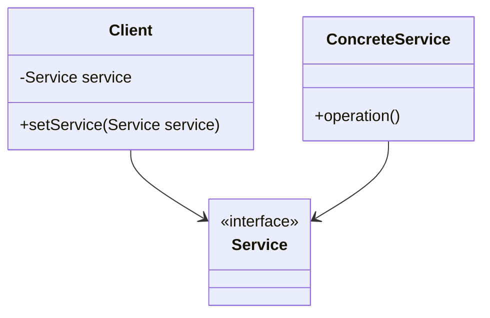
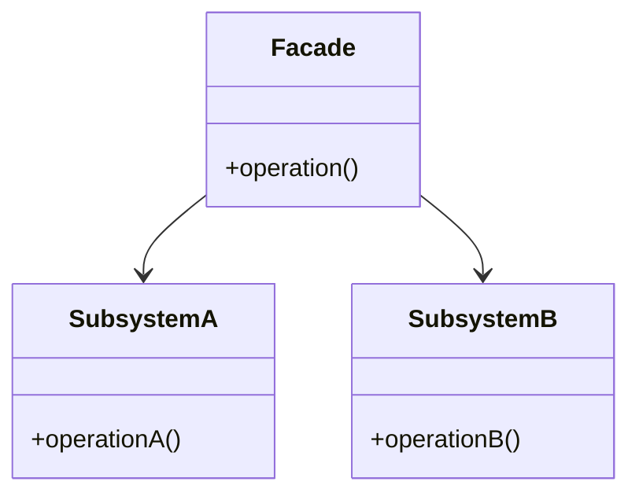
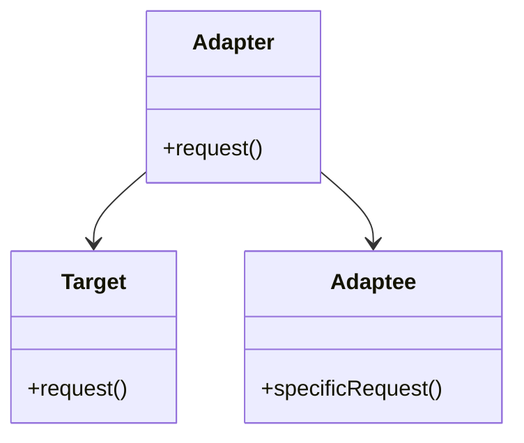

## 22.3 Design for Testability

In the realm of software development, the ability to test code effectively is paramount. Designing for testability means crafting software in a way that makes it easier to test, ensuring that defects can be identified and resolved efficiently. This section delves into the principles and design patterns that facilitate testability in Java applications, providing guidelines and examples to help developers create robust and maintainable code.

### Understanding Testability

**Testability** refers to the ease with which software can be tested to ensure it functions correctly. A testable design allows developers to write tests that are simple, fast, and reliable. Testability is influenced by several factors, including the structure of the code, the dependencies between components, and the clarity of the code's purpose.

#### Key Principles of Testable Design

1. **Loose Coupling**: Minimize dependencies between components to allow for independent testing. This can be achieved by using interfaces and dependency injection.
   
2. **High Cohesion**: Ensure that each component has a single, well-defined purpose. High cohesion makes it easier to understand and test individual components.

3. **Separation of Concerns**: Divide the system into distinct sections, each handling a specific aspect of the functionality. This separation simplifies testing by isolating different parts of the system.

### Design Patterns Promoting Testability

Several design patterns inherently promote testability by encouraging loose coupling, high cohesion, and separation of concerns. Let's explore some of these patterns:

#### Dependency Injection

- **Category**: Structural Pattern

##### Intent

- **Description**: Dependency Injection (DI) is a pattern that allows the creation of dependent objects outside of a class and provides those objects to the class in various ways. This pattern promotes loose coupling and enhances testability by allowing dependencies to be mocked or stubbed during testing.

##### Motivation

- **Explanation**: By injecting dependencies, classes become more flexible and easier to test. Instead of hardcoding dependencies, DI allows for the substitution of mock objects, facilitating unit testing.

##### Structure



- **Caption**: The Client depends on the Service interface, allowing for different implementations to be injected.

##### Implementation

```java
// Service interface
public interface Service {
    void execute();
}

// Concrete implementation of Service
public class ConcreteService implements Service {
    @Override
    public void execute() {
        System.out.println("Executing service...");
    }
}

// Client class using Dependency Injection
public class Client {
    private Service service;

    // Dependency Injection via constructor
    public Client(Service service) {
        this.service = service;
    }

    public void performTask() {
        service.execute();
    }
}

// Main class to demonstrate Dependency Injection
public class Main {
    public static void main(String[] args) {
        Service service = new ConcreteService();
        Client client = new Client(service);
        client.performTask();
    }
}
```

- **Explanation**: In this example, the `Client` class depends on the `Service` interface. The `ConcreteService` is injected into the `Client`, allowing for easy substitution with a mock service during testing.

#### Facade Pattern

- **Category**: Structural Pattern

##### Intent

- **Description**: The Facade pattern provides a simplified interface to a complex subsystem, making it easier to interact with and test.

##### Motivation

- **Explanation**: By encapsulating complex interactions within a single interface, the Facade pattern reduces the number of dependencies and simplifies testing.

##### Structure



- **Caption**: The Facade provides a unified interface to the subsystems, simplifying interactions.

##### Implementation

```java
// Subsystem classes
public class SubsystemA {
    public void operationA() {
        System.out.println("Subsystem A operation");
    }
}

public class SubsystemB {
    public void operationB() {
        System.out.println("Subsystem B operation");
    }
}

// Facade class
public class Facade {
    private SubsystemA subsystemA;
    private SubsystemB subsystemB;

    public Facade() {
        subsystemA = new SubsystemA();
        subsystemB = new SubsystemB();
    }

    public void operation() {
        subsystemA.operationA();
        subsystemB.operationB();
    }
}

// Main class to demonstrate Facade Pattern
public class Main {
    public static void main(String[] args) {
        Facade facade = new Facade();
        facade.operation();
    }
}
```

- **Explanation**: The `Facade` class provides a simple interface to the complex interactions between `SubsystemA` and `SubsystemB`, making it easier to test the overall operation.

#### Adapter Pattern

- **Category**: Structural Pattern

##### Intent

- **Description**: The Adapter pattern allows incompatible interfaces to work together, enhancing testability by enabling the use of mock objects.

##### Motivation

- **Explanation**: By adapting interfaces, the Adapter pattern allows for the substitution of components, facilitating testing with different implementations.

##### Structure



- **Caption**: The Adapter converts the interface of the Adaptee into the Target interface.

##### Implementation

```java
// Target interface
public interface Target {
    void request();
}

// Adaptee class with a different interface
public class Adaptee {
    public void specificRequest() {
        System.out.println("Specific request");
    }
}

// Adapter class
public class Adapter implements Target {
    private Adaptee adaptee;

    public Adapter(Adaptee adaptee) {
        this.adaptee = adaptee;
    }

    @Override
    public void request() {
        adaptee.specificRequest();
    }
}

// Main class to demonstrate Adapter Pattern
public class Main {
    public static void main(String[] args) {
        Adaptee adaptee = new Adaptee();
        Target target = new Adapter(adaptee);
        target.request();
    }
}
```

- **Explanation**: The `Adapter` class allows the `Adaptee` to be used where a `Target` is expected, enabling the use of mock `Adaptee` objects during testing.

### Guidelines for Writing Testable Code

1. **Use Interfaces**: Define interfaces for components to allow for easy substitution with mock implementations during testing.

2. **Avoid Static Dependencies**: Static methods and variables can make testing difficult. Use instance methods and dependency injection instead.

3. **Favor Composition Over Inheritance**: Composition allows for more flexible and testable designs by enabling the substitution of components.

4. **Write Small, Focused Methods**: Smaller methods with a single responsibility are easier to test and understand.

5. **Use Mocking Frameworks**: Leverage tools like Mockito to create mock objects and verify interactions during testing.

### Refactoring for Testability

Refactoring involves restructuring existing code without changing its external behavior to improve its design and testability. Here are some tips for refactoring code to enhance testability:

- **Identify and Isolate Dependencies**: Use dependency injection to manage dependencies, making them easier to mock during testing.

- **Extract Interfaces**: Create interfaces for classes with multiple responsibilities to separate concerns and facilitate testing.

- **Simplify Complex Methods**: Break down large methods into smaller, more focused methods to improve readability and testability.

- **Remove Global State**: Avoid using global variables or singletons that can introduce hidden dependencies and complicate testing.

### Conclusion

Designing for testability is a crucial aspect of software development that ensures code is robust, maintainable, and easy to test. By adhering to principles like loose coupling, high cohesion, and separation of concerns, and by leveraging design patterns such as Dependency Injection, Facade, and Adapter, developers can create flexible and modular code structures that facilitate effective testing. Through careful design and refactoring, testability can be significantly enhanced, leading to higher-quality software and more efficient development processes.

### Key Takeaways

- **Design for Testability**: Emphasize loose coupling, high cohesion, and separation of concerns to enhance testability.
- **Leverage Design Patterns**: Use patterns like Dependency Injection, Facade, and Adapter to promote testability.
- **Refactor for Improvement**: Continuously refactor code to isolate dependencies and simplify testing.
- **Use Mocking Tools**: Employ frameworks like Mockito to facilitate testing with mock objects.

### Reflection

Consider how you can apply these principles and patterns to your current projects. Are there areas where testability can be improved? How can design patterns be leveraged to create more testable code structures?

## Test Your Knowledge: Java Design Patterns and Testability Quiz



### What is the primary benefit of designing for testability in software development?

- [x] It ensures code is easier to test and maintain.
- [ ] It reduces the need for documentation.
- [ ] It eliminates the need for testing.
- [ ] It increases code complexity.

> **Explanation:** Designing for testability ensures that code is easier to test and maintain, leading to higher-quality software.

### Which principle emphasizes minimizing dependencies between components?

- [x] Loose Coupling
- [ ] High Cohesion
- [ ] Separation of Concerns
- [ ] Encapsulation

> **Explanation:** Loose coupling minimizes dependencies between components, allowing for independent testing and flexibility.

### Which design pattern provides a simplified interface to a complex subsystem?

- [x] Facade Pattern
- [ ] Adapter Pattern
- [ ] Singleton Pattern
- [ ] Observer Pattern

> **Explanation:** The Facade pattern provides a simplified interface to a complex subsystem, making it easier to interact with and test.

### How does the Adapter pattern enhance testability?

- [x] By allowing incompatible interfaces to work together
- [ ] By reducing the number of classes
- [ ] By increasing code complexity
- [ ] By eliminating the need for interfaces

> **Explanation:** The Adapter pattern enhances testability by allowing incompatible interfaces to work together, enabling the use of mock objects.

### What is a key guideline for writing testable code?

- [x] Use interfaces to allow for easy substitution with mock implementations.
- [ ] Use static methods for all operations.
- [ ] Avoid using dependency injection.
- [ ] Write large, complex methods.

> **Explanation:** Using interfaces allows for easy substitution with mock implementations, facilitating testing.

### Which tool can be used to create mock objects for testing in Java?

- [x] Mockito
- [ ] JUnit
- [ ] Eclipse
- [ ] NetBeans

> **Explanation:** Mockito is a popular framework used to create mock objects for testing in Java.

### What is the role of Dependency Injection in testability?

- [x] It allows for the substitution of dependencies with mock objects.
- [ ] It increases the number of dependencies.
- [ ] It eliminates the need for interfaces.
- [ ] It reduces code readability.

> **Explanation:** Dependency Injection allows for the substitution of dependencies with mock objects, enhancing testability.

### Why should static dependencies be avoided in testable code?

- [x] They make testing difficult by introducing hidden dependencies.
- [ ] They improve code performance.
- [ ] They simplify code structure.
- [ ] They reduce the need for interfaces.

> **Explanation:** Static dependencies make testing difficult by introducing hidden dependencies, complicating the testing process.

### What is a benefit of high cohesion in software design?

- [x] It ensures each component has a single, well-defined purpose.
- [ ] It increases the number of dependencies.
- [ ] It reduces code readability.
- [ ] It eliminates the need for testing.

> **Explanation:** High cohesion ensures each component has a single, well-defined purpose, making it easier to understand and test.

### True or False: The Facade pattern reduces the number of dependencies in a system.

- [x] True
- [ ] False

> **Explanation:** The Facade pattern reduces the number of dependencies by providing a unified interface to a complex subsystem.



By understanding and applying these principles and patterns, developers can significantly enhance the testability of their Java applications, leading to more reliable and maintainable software.
