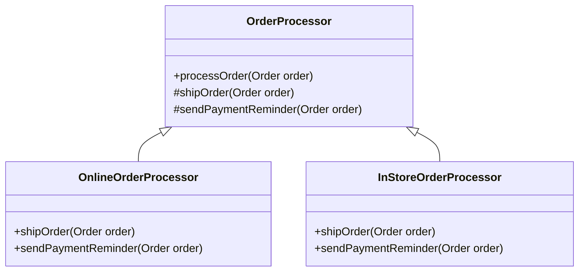

## 22.4.1 Identifying Code Smells

### Introduction to Code Smells

In the realm of software development, **code smells** are indicators of potential problems in the codebase that may hinder maintainability, readability, and scalability. Coined by Kent Beck and popularized by Martin Fowler in his book "Refactoring: Improving the Design of Existing Code," code smells are not bugs or errors but rather symptoms of deeper issues that could lead to more significant problems if left unaddressed.

#### Definition and Examples

Code smells are characteristics of the code that suggest the possibility of refactoring. They often manifest as patterns or anti-patterns that experienced developers can recognize. Here are some common examples:

- **Duplicated Code**: Repeated code blocks across the codebase, leading to maintenance challenges.
- **Long Methods**: Methods that are excessively long, making them difficult to understand and test.
- **Large Classes**: Classes that have grown too large and complex, often doing more than one thing.
- **Feature Envy**: A class that uses methods from another class excessively, indicating misplaced functionality.
- **Data Clumps**: Groups of data that frequently appear together, suggesting they should be encapsulated in a class.
- **Primitive Obsession**: Overuse of primitive data types instead of small objects for simple tasks.
- **Switch Statements**: Excessive use of switch statements, which can often be replaced with polymorphism.

### Why Code Smells Matter

Code smells are detrimental because they can lead to:

- **Reduced Maintainability**: Smelly code is harder to understand and modify, increasing the risk of introducing bugs.
- **Poor Readability**: Code that is difficult to read can slow down development and onboarding of new team members.
- **Decreased Scalability**: As the codebase grows, smells can compound, leading to a brittle architecture.
- **Increased Technical Debt**: Ignoring code smells can accumulate technical debt, requiring more effort to refactor later.

### Tools for Identifying Code Smells

Several tools can help developers identify code smells, providing insights and metrics that guide refactoring efforts. One of the most popular tools is **SonarQube**.

#### SonarQube

[SonarQube](https://www.sonarqube.org/) is an open-source platform that continuously inspects the code quality of applications. It provides detailed reports on code smells, bugs, vulnerabilities, and code duplications. SonarQube integrates with various CI/CD pipelines, making it a valuable tool for maintaining high code quality standards.

### Strategies for Prioritizing Refactoring

When faced with multiple code smells, prioritizing refactoring efforts is crucial. Consider the following strategies:

1. **Impact on Functionality**: Prioritize smells that directly affect the application's functionality or performance.
2. **Frequency of Change**: Focus on code that changes frequently, as it is more likely to introduce bugs.
3. **Complexity and Risk**: Address smells in complex areas of the codebase where errors are more likely to occur.
4. **Team Feedback**: Gather input from the development team to identify areas that are particularly troublesome.
5. **Refactoring Patterns**: Use design patterns to address specific smells, improving the overall architecture.

### Relationship Between Code Smells and Design Patterns

Design patterns can be powerful tools for addressing code smells. By applying the right pattern, developers can refactor smelly code into a more maintainable and scalable form. Here are some examples:

- **Duplicated Code**: Use the [Template Method Pattern]( "Template Method Pattern") to eliminate code duplication by defining a skeleton of an algorithm in a base class.
- **Long Methods**: Apply the [Command Pattern]( "Command Pattern") to encapsulate method logic into separate command objects.
- **Large Classes**: Implement the [Facade Pattern]( "Facade Pattern") to simplify interactions with complex subsystems.
- **Feature Envy**: Use the [Move Method Refactoring]( "Move Method Refactoring") to relocate methods to the class they most frequently interact with.
- **Data Clumps**: Introduce the [Value Object Pattern]( "Value Object Pattern") to encapsulate related data into a single object.

### Practical Examples and Code

Let's explore some practical examples of identifying and addressing code smells in Java.

#### Example 1: Duplicated Code

Consider the following Java code with duplicated logic:

```java
public class OrderProcessor {
    public void processOnlineOrder(Order order) {
        // Duplicated logic
        if (order.isPaid()) {
            shipOrder(order);
        } else {
            sendPaymentReminder(order);
        }
    }

    public void processInStoreOrder(Order order) {
        // Duplicated logic
        if (order.isPaid()) {
            shipOrder(order);
        } else {
            sendPaymentReminder(order);
        }
    }

    private void shipOrder(Order order) {
        // Shipping logic
    }

    private void sendPaymentReminder(Order order) {
        // Reminder logic
    }
}
```

**Refactoring with Template Method Pattern:**

```java
public abstract class OrderProcessor {
    public final void processOrder(Order order) {
        if (order.isPaid()) {
            shipOrder(order);
        } else {
            sendPaymentReminder(order);
        }
    }

    protected abstract void shipOrder(Order order);

    protected abstract void sendPaymentReminder(Order order);
}

public class OnlineOrderProcessor extends OrderProcessor {
    @Override
    protected void shipOrder(Order order) {
        // Online shipping logic
    }

    @Override
    protected void sendPaymentReminder(Order order) {
        // Online reminder logic
    }
}

public class InStoreOrderProcessor extends OrderProcessor {
    @Override
    protected void shipOrder(Order order) {
        // In-store shipping logic
    }

    @Override
    protected void sendPaymentReminder(Order order) {
        // In-store reminder logic
    }
}
```

#### Example 2: Long Method

Consider a long method that performs multiple tasks:

```java
public class ReportGenerator {
    public void generateReport(Data data) {
        // Data validation
        if (!validateData(data)) {
            throw new IllegalArgumentException("Invalid data");
        }

        // Data processing
        processData(data);

        // Report formatting
        formatReport(data);

        // Report printing
        printReport(data);
    }

    private boolean validateData(Data data) {
        // Validation logic
        return true;
    }

    private void processData(Data data) {
        // Processing logic
    }

    private void formatReport(Data data) {
        // Formatting logic
    }

    private void printReport(Data data) {
        // Printing logic
    }
}
```

**Refactoring with Command Pattern:**

```java
public interface ReportCommand {
    void execute(Data data);
}

public class ValidateDataCommand implements ReportCommand {
    @Override
    public void execute(Data data) {
        if (!validateData(data)) {
            throw new IllegalArgumentException("Invalid data");
        }
    }

    private boolean validateData(Data data) {
        // Validation logic
        return true;
    }
}

public class ProcessDataCommand implements ReportCommand {
    @Override
    public void execute(Data data) {
        // Processing logic
    }
}

public class FormatReportCommand implements ReportCommand {
    @Override
    public void execute(Data data) {
        // Formatting logic
    }
}

public class PrintReportCommand implements ReportCommand {
    @Override
    public void execute(Data data) {
        // Printing logic
    }
}

public class ReportGenerator {
    private List<ReportCommand> commands = new ArrayList<>();

    public ReportGenerator() {
        commands.add(new ValidateDataCommand());
        commands.add(new ProcessDataCommand());
        commands.add(new FormatReportCommand());
        commands.add(new PrintReportCommand());
    }

    public void generateReport(Data data) {
        for (ReportCommand command : commands) {
            command.execute(data);
        }
    }
}
```

### Visualizing Code Smells and Refactoring

To better understand the structure of code smells and their refactoring, consider the following class diagram illustrating the Template Method Pattern used to address duplicated code:



**Diagram Explanation**: This diagram shows the `OrderProcessor` class as an abstract base class with the `processOrder` method defining the template method. The `OnlineOrderProcessor` and `InStoreOrderProcessor` classes extend `OrderProcessor`, providing specific implementations for `shipOrder` and `sendPaymentReminder`.

### Conclusion

Identifying and addressing code smells is a critical aspect of maintaining a healthy codebase. By recognizing these indicators of potential issues, developers can refactor their code to improve maintainability, readability, and scalability. Utilizing tools like SonarQube and applying design patterns strategically can significantly enhance code quality. As you continue to develop and refactor your Java applications, keep an eye out for code smells and leverage the power of design patterns to create robust and efficient software.

### Key Takeaways

- **Code smells** are indicators of potential issues in the codebase that can affect maintainability and quality.
- **Tools like SonarQube** can help identify code smells and guide refactoring efforts.
- **Design patterns** provide structured solutions to common code smells, improving code architecture.
- **Prioritize refactoring** based on impact, frequency of change, complexity, and team feedback.
- **Continuous refactoring** is essential for maintaining a clean and efficient codebase.

### Exercises

1. Identify a code smell in your current project and refactor it using a suitable design pattern.
2. Set up SonarQube in your development environment and analyze your codebase for smells.
3. Discuss with your team the most common code smells encountered and strategies to address them.

## Test Your Knowledge: Code Smells and Refactoring in Java



### What is a code smell?

- [x] An indicator of potential issues in the codebase
- [ ] A bug in the code
- [ ] A feature request
- [ ] A performance optimization

> **Explanation:** A code smell is an indicator of potential issues in the codebase that may require refactoring.

### Which tool is commonly used to identify code smells?

- [x] SonarQube
- [ ] Eclipse
- [ ] IntelliJ IDEA
- [ ] JUnit

> **Explanation:** SonarQube is a popular tool used to identify code smells, bugs, and vulnerabilities in the codebase.

### What is the main purpose of refactoring code smells?

- [x] To improve code maintainability and quality
- [ ] To add new features
- [ ] To increase code complexity
- [ ] To remove all comments

> **Explanation:** Refactoring code smells aims to improve code maintainability and quality by addressing potential issues.

### Which design pattern can help eliminate duplicated code?

- [x] Template Method Pattern
- [ ] Singleton Pattern
- [ ] Observer Pattern
- [ ] Factory Pattern

> **Explanation:** The Template Method Pattern can help eliminate duplicated code by defining a skeleton of an algorithm in a base class.

### What is a common symptom of the "Long Method" code smell?

- [x] Methods that are excessively long and difficult to understand
- [ ] Methods that are too short
- [ ] Methods that have no parameters
- [ ] Methods that are private

> **Explanation:** A "Long Method" code smell is characterized by methods that are excessively long and difficult to understand.

### How can the Command Pattern help with long methods?

- [x] By encapsulating method logic into separate command objects
- [ ] By merging multiple methods into one
- [ ] By removing all method parameters
- [ ] By making methods static

> **Explanation:** The Command Pattern helps with long methods by encapsulating method logic into separate command objects, making the code more modular.

### What is the relationship between code smells and technical debt?

- [x] Ignoring code smells can accumulate technical debt
- [ ] Code smells eliminate technical debt
- [ ] Code smells are unrelated to technical debt
- [ ] Code smells are a type of technical debt

> **Explanation:** Ignoring code smells can accumulate technical debt, requiring more effort to refactor later.

### Which of the following is a benefit of addressing code smells?

- [x] Improved code readability
- [ ] Increased code complexity
- [ ] Reduced code functionality
- [ ] Decreased code performance

> **Explanation:** Addressing code smells improves code readability, making it easier to understand and maintain.

### What is a "Feature Envy" code smell?

- [x] A class that uses methods from another class excessively
- [ ] A class that has too many features
- [ ] A class that is too small
- [ ] A class that is not used

> **Explanation:** A "Feature Envy" code smell occurs when a class uses methods from another class excessively, indicating misplaced functionality.

### True or False: Code smells are always bugs in the code.

- [ ] True
- [x] False

> **Explanation:** False. Code smells are not bugs but indicators of potential issues that may require refactoring.


