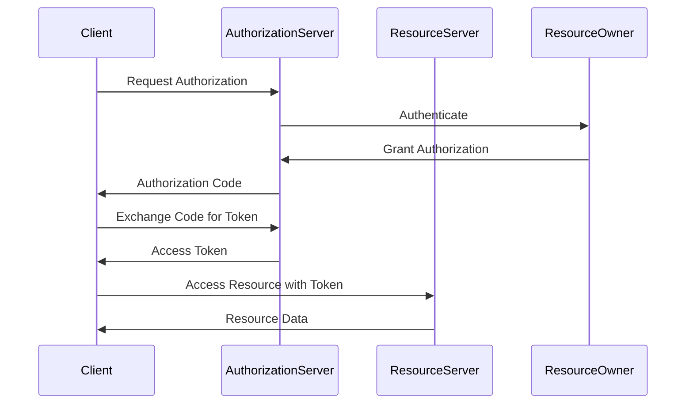
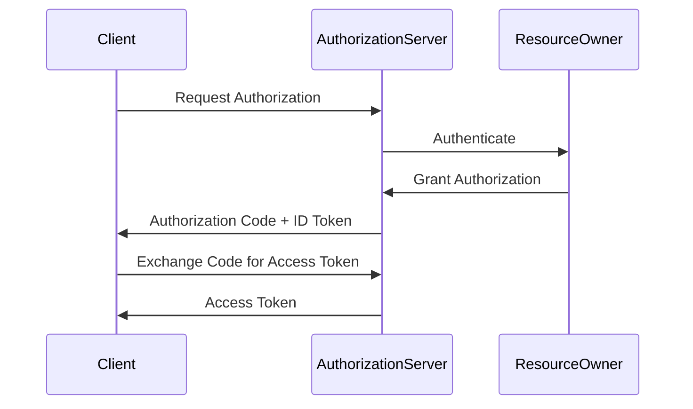

## 24.10 OAuth 2.0 and OpenID Connect Patterns

### Introduction

In the realm of modern web and mobile applications, ensuring secure access to resources is paramount. OAuth 2.0 and OpenID Connect are two protocols that have become industry standards for authorization and authentication, respectively. This section delves into these protocols, providing Java developers and software architects with the knowledge to implement secure, efficient, and scalable authentication and authorization mechanisms in their applications.

### Understanding OAuth 2.0

OAuth 2.0 is an open standard for access delegation, commonly used to grant websites or applications limited access to a user's information without exposing passwords. It is widely adopted for its simplicity and flexibility, allowing developers to implement various authorization scenarios.

#### Key Concepts of OAuth 2.0

- **Resource Owner**: The entity capable of granting access to a protected resource.
- **Client**: The application requesting access to the resource owner's data.
- **Resource Server**: The server hosting the protected resources.
- **Authorization Server**: The server issuing access tokens to the client after successfully authenticating the resource owner.

#### OAuth 2.0 Grant Types

OAuth 2.0 defines several grant types, each suited for different use cases:

1. **Authorization Code Grant**: Used for server-side applications. It involves exchanging an authorization code for an access token.
2. **Implicit Grant**: Suitable for client-side applications, where the access token is returned directly in the URL fragment.
3. **Resource Owner Password Credentials Grant**: Used when the resource owner has a trust relationship with the client, allowing the client to request access tokens using the resource owner's credentials.
4. **Client Credentials Grant**: Used for machine-to-machine communication, where the client authenticates itself to obtain an access token.

#### OAuth 2.0 Flow



*Diagram: OAuth 2.0 Authorization Code Flow*

### OpenID Connect: An Identity Layer on OAuth 2.0

OpenID Connect (OIDC) is an identity layer built on top of OAuth 2.0, providing a standardized way to authenticate users. It extends OAuth 2.0 by introducing an ID token, which contains information about the user and the authentication event.

#### Key Components of OpenID Connect

- **ID Token**: A JSON Web Token (JWT) that contains claims about the authentication event and the user.
- **UserInfo Endpoint**: An endpoint that returns additional claims about the authenticated user.
- **Discovery Document**: A JSON document containing metadata about the OpenID Provider's configuration.

#### OpenID Connect Flow

The OpenID Connect flow is similar to the OAuth 2.0 flow, with the addition of the ID token:



*Diagram: OpenID Connect Authorization Code Flow*

### Integrating OAuth 2.0 and OpenID Connect in Java Applications

Java developers can leverage libraries like Spring Security OAuth to integrate OAuth 2.0 and OpenID Connect into their applications seamlessly. Spring Security OAuth provides comprehensive support for both protocols, enabling developers to implement secure authentication and authorization with minimal effort.

#### Setting Up Spring Security OAuth

To get started with Spring Security OAuth, add the necessary dependencies to your `pom.xml`:

```xml
<dependency>
    <groupId>org.springframework.security.oauth</groupId>
    <artifactId>spring-security-oauth2</artifactId>
    <version>2.5.0.RELEASE</version>
</dependency>
```

#### Configuring OAuth 2.0 Authorization Server

Create a configuration class to set up the authorization server:

```java
@Configuration
@EnableAuthorizationServer
public class AuthorizationServerConfig extends AuthorizationServerConfigurerAdapter {

    @Override
    public void configure(ClientDetailsServiceConfigurer clients) throws Exception {
        clients.inMemory()
            .withClient("client-id")
            .secret("client-secret")
            .authorizedGrantTypes("authorization_code", "refresh_token")
            .scopes("read", "write")
            .redirectUris("http://localhost:8080/callback");
    }

    @Override
    public void configure(AuthorizationServerEndpointsConfigurer endpoints) {
        endpoints.tokenStore(tokenStore());
    }

    @Bean
    public TokenStore tokenStore() {
        return new InMemoryTokenStore();
    }
}
```

*Code: Configuring an OAuth 2.0 Authorization Server with Spring Security*

#### Implementing OpenID Connect

To implement OpenID Connect, you need to extend the OAuth 2.0 configuration to include ID token generation and user info endpoint:

```java
@Configuration
@EnableAuthorizationServer
public class OpenIDConnectConfig extends AuthorizationServerConfigurerAdapter {

    @Override
    public void configure(ClientDetailsServiceConfigurer clients) throws Exception {
        clients.inMemory()
            .withClient("client-id")
            .secret("client-secret")
            .authorizedGrantTypes("authorization_code", "refresh_token")
            .scopes("openid", "profile", "email")
            .redirectUris("http://localhost:8080/callback");
    }

    @Override
    public void configure(AuthorizationServerEndpointsConfigurer endpoints) {
        endpoints.tokenStore(tokenStore())
                 .userDetailsService(userDetailsService())
                 .approvalStore(approvalStore());
    }

    @Bean
    public TokenStore tokenStore() {
        return new JwtTokenStore(accessTokenConverter());
    }

    @Bean
    public JwtAccessTokenConverter accessTokenConverter() {
        JwtAccessTokenConverter converter = new JwtAccessTokenConverter();
        converter.setSigningKey("123");
        return converter;
    }
}
```

*Code: Configuring OpenID Connect with Spring Security*

### Security Considerations

When implementing OAuth 2.0 and OpenID Connect, it is crucial to consider several security aspects:

#### Token Storage

- **Use Secure Storage**: Store tokens securely using mechanisms like encrypted databases or secure storage APIs.
- **Avoid Storing Tokens in Local Storage**: For web applications, avoid storing tokens in local storage due to XSS vulnerabilities.

#### Token Expiration and Revocation

- **Implement Short-Lived Tokens**: Use short-lived access tokens and refresh tokens to enhance security.
- **Support Token Revocation**: Implement token revocation endpoints to allow users to revoke tokens if needed.

#### Scope Management

- **Define Minimal Scopes**: Limit the scopes requested by the client to the minimum necessary for the application's functionality.
- **Regularly Review Scopes**: Periodically review and update scopes to ensure they align with the application's requirements.

### Best Practices for Securing Applications

#### Web Applications

- **Use HTTPS**: Always use HTTPS to encrypt data in transit.
- **Implement CSRF Protection**: Protect against Cross-Site Request Forgery (CSRF) attacks by using anti-CSRF tokens.

#### Mobile Applications

- **Use Secure Storage**: Store tokens in secure storage provided by the mobile platform, such as Keychain on iOS or Keystore on Android.
- **Implement Device Binding**: Bind tokens to specific devices to prevent token theft and misuse.

### Conclusion

OAuth 2.0 and OpenID Connect are powerful protocols for securing access to resources and authenticating users in modern applications. By understanding their intricacies and implementing them using libraries like Spring Security OAuth, Java developers can build robust, secure, and scalable applications. Remember to adhere to security best practices, such as secure token storage and scope management, to protect your applications and users effectively.

### References and Further Reading

- [OAuth 2.0 Specification](https://tools.ietf.org/html/rfc6749)
- [OpenID Connect Specification](https://openid.net/specs/openid-connect-core-1_0.html)
- [Spring Security OAuth](https://projects.spring.io/spring-security-oauth/)
- [Java Documentation](https://docs.oracle.com/en/java/)

---

## Test Your Knowledge: OAuth 2.0 and OpenID Connect Quiz



### What is the primary purpose of OAuth 2.0?

- [x] To provide a secure authorization framework for granting access to resources.
- [ ] To encrypt data in transit.
- [ ] To authenticate users.
- [ ] To manage user sessions.

> **Explanation:** OAuth 2.0 is primarily used for authorization, allowing applications to access resources on behalf of users without exposing their credentials.

### Which OAuth 2.0 grant type is most suitable for server-side applications?

- [x] Authorization Code Grant
- [ ] Implicit Grant
- [ ] Resource Owner Password Credentials Grant
- [ ] Client Credentials Grant

> **Explanation:** The Authorization Code Grant is designed for server-side applications, providing a secure way to obtain access tokens.

### What additional feature does OpenID Connect provide over OAuth 2.0?

- [x] User authentication and identity verification.
- [ ] Data encryption.
- [ ] Session management.
- [ ] API rate limiting.

> **Explanation:** OpenID Connect adds an identity layer to OAuth 2.0, enabling user authentication and identity verification.

### In OAuth 2.0, what is the role of the Resource Server?

- [x] To host and protect the user's resources.
- [ ] To issue access tokens.
- [ ] To authenticate users.
- [ ] To manage client applications.

> **Explanation:** The Resource Server is responsible for hosting and protecting the user's resources, validating access tokens to grant access.

### Which of the following is a best practice for storing tokens in web applications?

- [x] Use secure, encrypted storage mechanisms.
- [ ] Store tokens in local storage.
- [x] Use session cookies with secure flags.
- [ ] Store tokens in plain text files.

> **Explanation:** Tokens should be stored securely using encrypted storage mechanisms or secure session cookies to prevent unauthorized access.

### What is the purpose of the ID Token in OpenID Connect?

- [x] To provide information about the authentication event and the user.
- [ ] To encrypt user data.
- [ ] To authorize access to resources.
- [ ] To manage user sessions.

> **Explanation:** The ID Token contains claims about the authentication event and the user, providing identity information.

### How can token revocation enhance security in OAuth 2.0?

- [x] By allowing users to invalidate tokens if they are compromised.
- [ ] By encrypting tokens.
- [x] By limiting token lifespan.
- [ ] By increasing token size.

> **Explanation:** Token revocation allows users to invalidate tokens if they are compromised, enhancing security by preventing unauthorized access.

### What is a common security consideration when using the Implicit Grant type?

- [x] Tokens are exposed in the URL fragment, making them vulnerable to interception.
- [ ] Tokens are encrypted by default.
- [ ] Tokens have a longer lifespan.
- [ ] Tokens are stored securely on the server.

> **Explanation:** The Implicit Grant type exposes tokens in the URL fragment, making them vulnerable to interception and requiring additional security measures.

### Why is it important to define minimal scopes in OAuth 2.0?

- [x] To limit access to only the necessary resources and enhance security.
- [ ] To increase the size of access tokens.
- [ ] To simplify client configuration.
- [ ] To reduce server load.

> **Explanation:** Defining minimal scopes limits access to only the necessary resources, enhancing security by reducing the potential impact of a compromised token.

### True or False: OpenID Connect can be used independently of OAuth 2.0.

- [ ] True
- [x] False

> **Explanation:** OpenID Connect is built on top of OAuth 2.0 and cannot be used independently; it relies on OAuth 2.0 for authorization.



---
