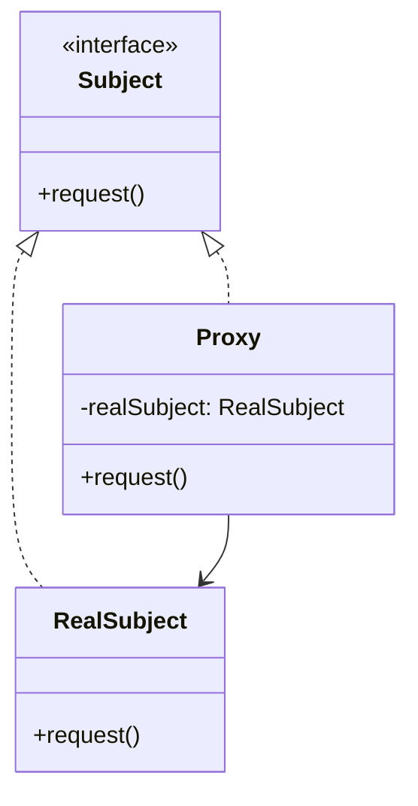

## 24.9 Secure Proxy Pattern

### Intent

- **Description**: The Secure Proxy Pattern is a structural design pattern that controls access to an object by acting as an intermediary. It enhances security by implementing access control, input validation, and auditing mechanisms before delegating requests to the actual object.

### Also Known As

- **Alternate Names**: Protection Proxy, Security Proxy

### Motivation

In modern software systems, security is paramount. Applications often need to restrict access to certain resources, validate inputs, and log activities for auditing purposes. The Secure Proxy Pattern addresses these needs by providing a layer that can enforce security policies without altering the core logic of the application. By using proxies, developers can ensure that only authorized users can access sensitive operations, inputs are validated before processing, and all actions are logged for future reference.

### Applicability

- **Guidelines**: Use the Secure Proxy Pattern when you need to:
  - Control access to sensitive objects or resources.
  - Validate inputs before they reach the core application logic.
  - Audit and log user actions for security and compliance purposes.
  - Implement security features without modifying existing code.

### Structure



- **Caption**: The diagram illustrates the structure of the Secure Proxy Pattern, where the `Proxy` class controls access to the `RealSubject` by implementing the same interface, `Subject`.

### Participants

- **Subject**: Defines the common interface for `RealSubject` and `Proxy` so that a `Proxy` can be used anywhere a `RealSubject` is expected.
- **RealSubject**: The actual object that the `Proxy` represents and controls access to.
- **Proxy**: Controls access to the `RealSubject`, performing security checks, input validation, and logging.

### Collaborations

- **Interactions**: The `Proxy` intercepts calls to the `RealSubject`, performing necessary security checks and logging before delegating the request to the `RealSubject`.

### Consequences

- **Analysis**: 
  - **Benefits**: 
    - Enhances security by centralizing access control and validation.
    - Provides a single point for logging and auditing.
    - Allows for easy modification of security policies without altering core logic.
  - **Drawbacks**: 
    - May introduce performance overhead if not implemented efficiently.
    - Can increase complexity if overused or improperly designed.

### Implementation

#### Implementation Guidelines

- Use static proxies for compile-time security checks and dynamic proxies for runtime flexibility.
- Ensure that proxies are lightweight to minimize performance impact.
- Consider using Java's `java.lang.reflect.Proxy` for creating dynamic proxies.

#### Sample Code Snippets

```java
// Define the Subject interface
interface Subject {
    void request();
}

// Implement the RealSubject class
class RealSubject implements Subject {
    @Override
    public void request() {
        System.out.println("Executing request in RealSubject.");
    }
}

// Implement the Proxy class
class SecureProxy implements Subject {
    private RealSubject realSubject;
    private String userRole;

    public SecureProxy(String userRole) {
        this.realSubject = new RealSubject();
        this.userRole = userRole;
    }

    @Override
    public void request() {
        if (checkAccess()) {
            realSubject.request();
            logAccess();
        } else {
            System.out.println("Access denied.");
        }
    }

    private boolean checkAccess() {
        // Simulate role-based access control
        return "ADMIN".equals(userRole);
    }

    private void logAccess() {
        System.out.println("Access logged for user role: " + userRole);
    }
}

// Demonstrate the Secure Proxy Pattern
public class ProxyPatternDemo {
    public static void main(String[] args) {
        Subject proxy = new SecureProxy("ADMIN");
        proxy.request();

        Subject proxy2 = new SecureProxy("USER");
        proxy2.request();
    }
}
```

- **Explanation**: In this example, the `SecureProxy` class controls access to the `RealSubject` based on the user's role. It checks if the user has the necessary permissions before allowing the request to proceed and logs the access attempt.

#### Sample Use Cases

- **Real-world Scenarios**: 
  - **Access Control**: Restricting access to administrative functions in a web application.
  - **Input Validation**: Validating user inputs in a service before processing.
  - **Auditing**: Logging all access attempts to sensitive data for compliance.

### Dynamic Proxies

Dynamic proxies in Java provide a flexible way to create proxy instances at runtime. They are particularly useful for implementing cross-cutting concerns like security, logging, and transaction management.

#### Creating Dynamic Proxies

Java's `java.lang.reflect.Proxy` class allows for the creation of dynamic proxy instances. These proxies can intercept method calls and perform additional operations such as security checks.

```java
import java.lang.reflect.InvocationHandler;
import java.lang.reflect.Method;
import java.lang.reflect.Proxy;

// Define the InvocationHandler
class SecurityHandler implements InvocationHandler {
    private Object target;

    public SecurityHandler(Object target) {
        this.target = target;
    }

    @Override
    public Object invoke(Object proxy, Method method, Object[] args) throws Throwable {
        if (checkAccess()) {
            Object result = method.invoke(target, args);
            logAccess(method.getName());
            return result;
        } else {
            throw new IllegalAccessException("Access denied");
        }
    }

    private boolean checkAccess() {
        // Implement access control logic
        return true; // Simplified for demonstration
    }

    private void logAccess(String methodName) {
        System.out.println("Method " + methodName + " accessed.");
    }
}

// Demonstrate dynamic proxy usage
public class DynamicProxyDemo {
    public static void main(String[] args) {
        RealSubject realSubject = new RealSubject();
        Subject proxyInstance = (Subject) Proxy.newProxyInstance(
                realSubject.getClass().getClassLoader(),
                realSubject.getClass().getInterfaces(),
                new SecurityHandler(realSubject)
        );

        proxyInstance.request();
    }
}
```

- **Explanation**: The `SecurityHandler` class implements `InvocationHandler` to intercept method calls on the proxy instance. It performs security checks and logs access attempts.

### Best Practices

- **Minimize Overhead**: Ensure that security checks and logging are efficient to avoid degrading performance.
- **Centralize Security Logic**: Use proxies to centralize security logic, making it easier to maintain and update.
- **Use Dynamic Proxies for Flexibility**: Leverage dynamic proxies for scenarios where security policies may change frequently or need to be applied to multiple classes.

### Related Patterns

- **Decorator Pattern**: Similar to the Proxy Pattern, but focuses on adding behavior rather than controlling access.
- **Adapter Pattern**: Transforms the interface of a class into another interface clients expect, which can also be used for security transformations.

### Known Uses

- **Examples in Libraries or Frameworks**: 
  - **Spring Security**: Uses proxies to apply security aspects to beans.
  - **EJB (Enterprise JavaBeans)**: Utilizes proxies for transaction management and security.

### Conclusion

The Secure Proxy Pattern is a powerful tool for enhancing security in Java applications. By controlling access, validating inputs, and logging actions, proxies provide a robust mechanism for enforcing security policies. Whether using static or dynamic proxies, developers can create flexible and maintainable security layers that protect sensitive resources and ensure compliance with security standards.

---

## Test Your Knowledge: Secure Proxy Pattern in Java



### What is the primary purpose of the Secure Proxy Pattern?

- [x] To control access to an object and enhance security.
- [ ] To improve the performance of an application.
- [ ] To simplify the user interface.
- [ ] To manage database connections.

> **Explanation:** The Secure Proxy Pattern is primarily used to control access to an object and enhance security by implementing checks and logging.

### How does a Secure Proxy enhance security?

- [x] By performing access control checks before delegating requests.
- [ ] By directly modifying the core logic of the application.
- [ ] By encrypting all data in the application.
- [ ] By reducing the number of classes in the application.

> **Explanation:** A Secure Proxy enhances security by performing access control checks before delegating requests to the actual object.

### What is a common use case for the Secure Proxy Pattern?

- [x] Implementing role-based access control in a web application.
- [ ] Rendering graphics in a game.
- [ ] Managing memory allocation in a system.
- [ ] Sorting data in a database.

> **Explanation:** A common use case for the Secure Proxy Pattern is implementing role-based access control in a web application.

### Which Java feature is used to create dynamic proxies?

- [x] `java.lang.reflect.Proxy`
- [ ] `java.util.concurrent`
- [ ] `java.nio.file`
- [ ] `java.awt`

> **Explanation:** Java's `java.lang.reflect.Proxy` class is used to create dynamic proxies.

### What is the role of the `InvocationHandler` in dynamic proxies?

- [x] To intercept method calls on the proxy instance.
- [ ] To manage database transactions.
- [x] To perform security checks and logging.
- [ ] To render user interfaces.

> **Explanation:** The `InvocationHandler` intercepts method calls on the proxy instance and can perform security checks and logging.

### What is a potential drawback of using the Secure Proxy Pattern?

- [x] It may introduce performance overhead.
- [ ] It simplifies the application architecture.
- [ ] It reduces the number of classes.
- [ ] It eliminates the need for interfaces.

> **Explanation:** A potential drawback of using the Secure Proxy Pattern is that it may introduce performance overhead if not implemented efficiently.

### How can performance overhead be minimized when using secure proxies?

- [x] By ensuring that security checks and logging are efficient.
- [ ] By avoiding the use of interfaces.
- [x] By using lightweight proxies.
- [ ] By increasing the number of proxy classes.

> **Explanation:** Performance overhead can be minimized by ensuring that security checks and logging are efficient and by using lightweight proxies.

### What is the difference between a Proxy and a Decorator pattern?

- [x] A Proxy controls access, while a Decorator adds behavior.
- [ ] A Proxy adds behavior, while a Decorator controls access.
- [ ] Both patterns are used for the same purpose.
- [ ] Neither pattern is used in Java.

> **Explanation:** A Proxy controls access to an object, while a Decorator adds behavior to an object.

### Which pattern is related to the Secure Proxy Pattern?

- [x] Decorator Pattern
- [ ] Singleton Pattern
- [ ] Factory Pattern
- [ ] Observer Pattern

> **Explanation:** The Decorator Pattern is related to the Secure Proxy Pattern as both involve wrapping objects, but with different intents.

### True or False: The Secure Proxy Pattern can be used to log user actions for auditing purposes.

- [x] True
- [ ] False

> **Explanation:** True. The Secure Proxy Pattern can be used to log user actions for auditing purposes, providing a record of access attempts and actions.



This comprehensive guide to the Secure Proxy Pattern in Java provides a deep dive into its implementation, benefits, and best practices. By understanding and applying this pattern, developers can enhance the security of their applications while maintaining flexibility and performance.
