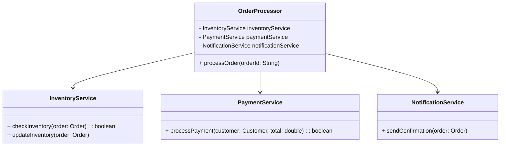

## 25.2.1 Spaghetti Code

### Introduction

In the realm of software development, the term **Spaghetti Code** is often used to describe a codebase that is tangled, unstructured, and difficult to maintain. This anti-pattern is characterized by a lack of clear structure, excessive interdependencies, and a general absence of design principles. Understanding the symptoms, causes, and consequences of Spaghetti Code is crucial for developers aiming to produce maintainable and efficient software.

### Defining Spaghetti Code

**Spaghetti Code** refers to a disorganized code structure that resembles a plate of tangled spaghetti. It is typically the result of poor planning, lack of modularity, and failure to adhere to coding standards. The code is often difficult to follow, with logic scattered across multiple locations, making it challenging to debug, extend, or refactor.

#### Symptoms of Spaghetti Code

- **Lack of Structure**: Code lacks a coherent structure, making it difficult to understand the flow of execution.
- **Excessive Interdependencies**: Components are tightly coupled, leading to a cascade of changes when modifying a single part.
- **Duplicated Code**: Repeated code blocks throughout the application, increasing maintenance overhead.
- **Inconsistent Naming Conventions**: Variables and functions are named without a consistent pattern, leading to confusion.
- **Long Methods and Classes**: Methods and classes are excessively long, handling multiple responsibilities.

### Causes of Spaghetti Code

#### Poor Planning

Failure to plan the architecture and design of an application can lead to Spaghetti Code. Without a clear blueprint, developers may resort to ad-hoc solutions that compromise the code's structure.

#### Absence of Modularity

Modularity is a key principle in software design that promotes separation of concerns. When this principle is ignored, code becomes monolithic and difficult to manage.

#### Lack of Adherence to Coding Standards

Coding standards provide guidelines for writing clean and consistent code. Ignoring these standards results in a codebase that is inconsistent and hard to follow.

### Consequences of Spaghetti Code

The presence of Spaghetti Code in a project can have several negative impacts:

- **Increased Bugs**: The tangled nature of the code makes it prone to errors and difficult to debug.
- **Difficulty in Adding Features**: Introducing new features becomes challenging due to the lack of clear structure.
- **Reduced Team Efficiency**: Team members spend more time understanding and fixing code rather than developing new features.
- **Poor Performance**: Inefficient code paths and redundant operations can degrade application performance.

### Code Snippets Illustrating Spaghetti Code

Consider the following Java code snippet that exemplifies Spaghetti Code:

```java
public class OrderProcessor {
    public void processOrder(String orderId) {
        // Fetch order details
        Order order = fetchOrder(orderId);
        if (order != null) {
            // Check inventory
            if (checkInventory(order)) {
                // Calculate total
                double total = calculateTotal(order);
                // Apply discount
                if (order.getCustomer().isPremium()) {
                    total *= 0.9; // 10% discount
                }
                // Process payment
                if (processPayment(order.getCustomer(), total)) {
                    // Update inventory
                    updateInventory(order);
                    // Send confirmation
                    sendConfirmation(order);
                } else {
                    System.out.println("Payment failed for order: " + orderId);
                }
            } else {
                System.out.println("Insufficient inventory for order: " + orderId);
            }
        } else {
            System.out.println("Order not found: " + orderId);
        }
    }
    
    // Other methods like fetchOrder, checkInventory, etc.
}
```

**Analysis**: The `processOrder` method is overly complex, handling multiple responsibilities such as fetching orders, checking inventory, processing payments, and sending confirmations. This violates the Single Responsibility Principle and makes the code difficult to maintain.

### Best Practices to Prevent Spaghetti Code

#### Embrace Modular Design

- **Decompose**: Break down large classes and methods into smaller, more manageable pieces.
- **Encapsulate**: Use encapsulation to hide implementation details and expose only necessary interfaces.

#### Apply Object-Oriented Programming (OOP) Principles

- **Single Responsibility Principle (SRP)**: Ensure each class and method has a single responsibility.
- **Open/Closed Principle (OCP)**: Design classes to be open for extension but closed for modification.
- **Liskov Substitution Principle (LSP)**: Subtypes should be substitutable for their base types without altering the correctness of the program.
- **Interface Segregation Principle (ISP)**: Prefer small, specific interfaces over large, general-purpose ones.
- **Dependency Inversion Principle (DIP)**: Depend on abstractions rather than concrete implementations.

#### Adhere to Coding Standards

- **Consistent Naming Conventions**: Use meaningful and consistent names for variables, methods, and classes.
- **Code Formatting**: Follow a consistent code formatting style to improve readability.
- **Code Reviews**: Conduct regular code reviews to ensure adherence to standards and identify potential issues early.

### Refactored Code Example

Let's refactor the previous example using these best practices:

```java
public class OrderProcessor {
    private final InventoryService inventoryService;
    private final PaymentService paymentService;
    private final NotificationService notificationService;

    public OrderProcessor(InventoryService inventoryService, PaymentService paymentService, NotificationService notificationService) {
        this.inventoryService = inventoryService;
        this.paymentService = paymentService;
        this.notificationService = notificationService;
    }

    public void processOrder(String orderId) {
        Order order = fetchOrder(orderId);
        if (order == null) {
            System.out.println("Order not found: " + orderId);
            return;
        }

        if (!inventoryService.checkInventory(order)) {
            System.out.println("Insufficient inventory for order: " + orderId);
            return;
        }

        double total = calculateTotal(order);
        if (order.getCustomer().isPremium()) {
            total *= 0.9; // 10% discount
        }

        if (!paymentService.processPayment(order.getCustomer(), total)) {
            System.out.println("Payment failed for order: " + orderId);
            return;
        }

        inventoryService.updateInventory(order);
        notificationService.sendConfirmation(order);
    }

    private Order fetchOrder(String orderId) {
        // Implementation to fetch order
        return new Order(); // Placeholder
    }

    private double calculateTotal(Order order) {
        // Implementation to calculate total
        return 100.0; // Placeholder
    }
}
```

**Explanation**: The refactored code separates concerns into different services (`InventoryService`, `PaymentService`, `NotificationService`), making the `OrderProcessor` class more focused and easier to maintain.

### Visualizing the Structure



**Caption**: The diagram illustrates the modular design of the `OrderProcessor` class, showing its dependencies on `InventoryService`, `PaymentService`, and `NotificationService`.

### Conclusion

Spaghetti Code is a common anti-pattern that can severely impact the maintainability and efficiency of a software project. By understanding its symptoms and causes, developers can take proactive steps to avoid it. Embracing modular design, adhering to OOP principles, and following coding standards are effective strategies to prevent Spaghetti Code and ensure a clean, maintainable codebase.

### References and Further Reading

- [Oracle Java Documentation](https://docs.oracle.com/en/java/)
- [Clean Code: A Handbook of Agile Software Craftsmanship by Robert C. Martin](https://www.amazon.com/Clean-Code-Handbook-Software-Craftsmanship/dp/0132350882)
- [Refactoring: Improving the Design of Existing Code by Martin Fowler](https://www.amazon.com/Refactoring-Improving-Design-Existing-Code/dp/0201485672)

## Test Your Knowledge: Spaghetti Code in Java Quiz



### What is a primary characteristic of Spaghetti Code?

- [x] Lack of clear structure
- [ ] High performance
- [ ] Modular design
- [ ] Strong encapsulation

> **Explanation:** Spaghetti Code is characterized by a lack of clear structure, making it difficult to follow and maintain.


### Which of the following contributes to Spaghetti Code?

- [x] Poor planning
- [ ] Use of design patterns
- [ ] Modular architecture
- [ ] Consistent coding standards

> **Explanation:** Poor planning can lead to Spaghetti Code as it results in ad-hoc solutions and lack of structure.


### What is a consequence of Spaghetti Code?

- [x] Increased bugs
- [ ] Improved readability
- [ ] Faster development
- [ ] Easier maintenance

> **Explanation:** Spaghetti Code often leads to increased bugs due to its tangled and unstructured nature.


### How can Spaghetti Code be prevented?

- [x] By applying OOP principles
- [ ] By avoiding code reviews
- [ ] By writing longer methods
- [ ] By ignoring coding standards

> **Explanation:** Applying OOP principles helps in organizing code and preventing Spaghetti Code.


### Which principle is violated by having long methods handling multiple responsibilities?

- [x] Single Responsibility Principle
- [ ] Open/Closed Principle
- [ ] Liskov Substitution Principle
- [ ] Interface Segregation Principle

> **Explanation:** The Single Responsibility Principle is violated when methods handle multiple responsibilities.


### What is a benefit of modular design?

- [x] Easier maintenance
- [ ] Increased complexity
- [ ] More interdependencies
- [ ] Longer development time

> **Explanation:** Modular design makes maintenance easier by breaking down the code into manageable parts.


### Which of the following is a symptom of Spaghetti Code?

- [x] Excessive interdependencies
- [ ] Strong cohesion
- [ ] Clear separation of concerns
- [ ] Consistent naming conventions

> **Explanation:** Excessive interdependencies are a symptom of Spaghetti Code, making it difficult to modify.


### What is a key practice to avoid Spaghetti Code?

- [x] Adhering to coding standards
- [ ] Writing code without comments
- [ ] Using global variables
- [ ] Avoiding encapsulation

> **Explanation:** Adhering to coding standards helps maintain consistency and avoid Spaghetti Code.


### Which OOP principle promotes the use of small, specific interfaces?

- [x] Interface Segregation Principle
- [ ] Single Responsibility Principle
- [ ] Open/Closed Principle
- [ ] Dependency Inversion Principle

> **Explanation:** The Interface Segregation Principle promotes the use of small, specific interfaces.


### True or False: Spaghetti Code improves team efficiency.

- [ ] True
- [x] False

> **Explanation:** Spaghetti Code reduces team efficiency as it makes the codebase difficult to understand and maintain.


