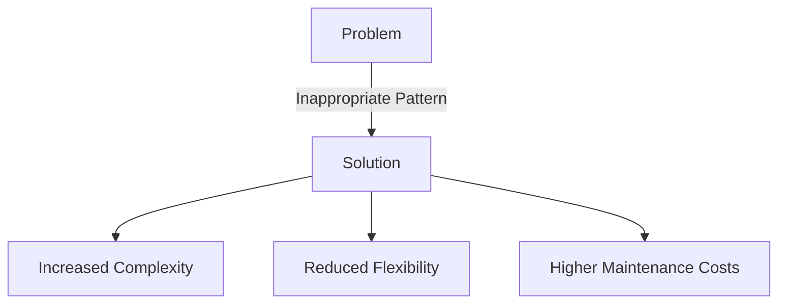

## 25.2.3 Golden Hammer

### Introduction

The Golden Hammer anti-pattern is a common pitfall in software development where a developer or team becomes overly reliant on a familiar tool, technology, or design pattern, applying it to every problem regardless of its suitability. This approach can lead to inappropriate solutions, reduced code flexibility, and increased maintenance challenges. Understanding and avoiding the Golden Hammer is crucial for creating robust and adaptable software systems.

### Defining the Golden Hammer Anti-Pattern

The term "Golden Hammer" originates from the adage, "If all you have is a hammer, everything looks like a nail." In the context of software development, it refers to the tendency to use a familiar solution for every problem, even when it is not the best fit. This anti-pattern is characterized by:

- **Over-reliance on Familiarity**: Developers may default to using a tool or pattern they are comfortable with, rather than exploring alternatives.
- **Inappropriate Application**: The chosen solution may not address the specific requirements or constraints of the problem.
- **Lack of Flexibility**: The resulting system may become rigid and difficult to adapt to changing needs.

### Historical Context and Evolution

The Golden Hammer anti-pattern has been recognized for decades, as software development has evolved from simple procedural programming to complex object-oriented and distributed systems. As new technologies and patterns emerged, developers often gravitated towards those they found effective, sometimes at the expense of more suitable solutions. The rise of design patterns in the 1990s, popularized by the "Gang of Four" book, further highlighted the risk of misapplying patterns due to over-familiarity.

### Examples of Misapplied Design Patterns

#### Singleton Pattern Misuse

The [Singleton Pattern]( "Singleton Pattern") is a classic example of a design pattern that is often overused. While it is useful for ensuring a single instance of a class, developers sometimes apply it indiscriminately, leading to:

- **Global State**: Excessive use of singletons can create hidden dependencies and global state, making the system harder to test and maintain.
- **Concurrency Issues**: In multi-threaded environments, improperly implemented singletons can lead to race conditions and synchronization problems.

#### Observer Pattern Overuse

The Observer Pattern is another design pattern that can be misapplied. It is designed for scenarios where an object needs to notify multiple observers about changes. However, overuse can result in:

- **Complex Dependencies**: A tangled web of observers and subjects can make the system difficult to understand and debug.
- **Performance Overhead**: Frequent notifications can lead to performance bottlenecks, especially if observers perform heavy computations.

### Impact on Code Flexibility and Adaptability

The Golden Hammer anti-pattern can significantly impact the flexibility and adaptability of a codebase:

- **Rigid Architecture**: Over-reliance on a single pattern or technology can lead to a rigid architecture that is difficult to modify or extend.
- **Increased Maintenance Costs**: Inappropriate solutions often require more effort to maintain and evolve, as they may not align well with changing requirements.
- **Limited Innovation**: Sticking to familiar solutions can stifle innovation and prevent the exploration of more effective approaches.

### Evaluating Problems Objectively

To avoid the Golden Hammer anti-pattern, developers should adopt a more objective approach to problem-solving:

1. **Understand the Problem Domain**: Thoroughly analyze the problem and its constraints before selecting a solution.
2. **Explore Alternatives**: Consider multiple design patterns and technologies, evaluating their pros and cons in the context of the problem.
3. **Prototype and Experiment**: Build prototypes to test different approaches and gather feedback on their effectiveness.
4. **Stay Informed**: Continuously learn about new tools, patterns, and best practices to expand your repertoire of solutions.

### Practical Applications and Real-World Scenarios

Consider a scenario where a team is developing a real-time messaging application. They might be tempted to use the Observer Pattern for all communication between components. However, this could lead to performance issues and complex dependencies. Instead, they should evaluate other patterns, such as the Publish-Subscribe or Event-Driven Architecture, to determine the best fit for their needs.

### Code Example: Avoiding the Golden Hammer

Let's explore a Java code example that demonstrates the importance of selecting the right pattern for the problem at hand.

```java
// Example of using the Strategy Pattern instead of a Singleton for flexibility

interface SortingStrategy {
    void sort(int[] numbers);
}

class BubbleSort implements SortingStrategy {
    @Override
    public void sort(int[] numbers) {
        // Bubble sort implementation
    }
}

class QuickSort implements SortingStrategy {
    @Override
    public void sort(int[] numbers) {
        // Quick sort implementation
    }
}

class SortContext {
    private SortingStrategy strategy;

    public void setStrategy(SortingStrategy strategy) {
        this.strategy = strategy;
    }

    public void executeStrategy(int[] numbers) {
        strategy.sort(numbers);
    }
}

public class StrategyPatternExample {
    public static void main(String[] args) {
        SortContext context = new SortContext();

        // Use BubbleSort strategy
        context.setStrategy(new BubbleSort());
        context.executeStrategy(new int[]{5, 3, 8, 1});

        // Switch to QuickSort strategy
        context.setStrategy(new QuickSort());
        context.executeStrategy(new int[]{5, 3, 8, 1});
    }
}
```

**Explanation**: In this example, the Strategy Pattern is used to provide flexibility in choosing different sorting algorithms. This approach avoids the Golden Hammer by allowing the selection of the most appropriate strategy for the task, rather than defaulting to a single solution.

### Visualizing the Golden Hammer

To further illustrate the concept, consider the following diagram depicting the inappropriate application of a design pattern:



**Caption**: This diagram shows how applying an inappropriate pattern can lead to increased complexity, reduced flexibility, and higher maintenance costs.

### Expert Tips and Best Practices

- **Diversify Your Toolkit**: Continuously expand your knowledge of design patterns and technologies to avoid over-reliance on familiar solutions.
- **Encourage Team Collaboration**: Foster a culture of collaboration and knowledge sharing to leverage diverse perspectives in problem-solving.
- **Conduct Regular Code Reviews**: Use code reviews to identify instances of the Golden Hammer and encourage the exploration of alternative solutions.

### Common Pitfalls and How to Avoid Them

- **Ignoring Problem-Specific Requirements**: Always tailor your solution to the specific requirements and constraints of the problem.
- **Overlooking Performance Implications**: Consider the performance implications of your chosen solution, especially in high-load scenarios.
- **Neglecting Scalability**: Ensure that your solution can scale with the growth of the system and its user base.

### Exercises and Practice Problems

1. **Identify the Pattern**: Review a piece of code and identify if a design pattern is being misapplied. Suggest a more appropriate pattern.
2. **Refactor the Code**: Take a codebase that exhibits the Golden Hammer anti-pattern and refactor it to use a more suitable solution.
3. **Design a Solution**: Given a problem statement, design a solution using multiple patterns and justify your choice.

### Summary and Key Takeaways

- The Golden Hammer anti-pattern arises from over-reliance on familiar tools or patterns, leading to inappropriate solutions.
- It impacts code flexibility, adaptability, and maintenance costs.
- Avoid it by evaluating problems objectively, exploring alternatives, and continuously expanding your knowledge.

### Reflection

Consider how you might apply the lessons learned about the Golden Hammer anti-pattern to your own projects. Are there areas where you might be over-relying on a particular tool or pattern? How can you diversify your approach to problem-solving?

### References and Further Reading

- [Java Documentation](https://docs.oracle.com/en/java/)
- [Cloud Design Patterns](https://learn.microsoft.com/en-us/azure/architecture/patterns/)
- "Design Patterns: Elements of Reusable Object-Oriented Software" by Erich Gamma, Richard Helm, Ralph Johnson, and John Vlissides

---

## Test Your Knowledge: Avoiding the Golden Hammer Anti-Pattern Quiz



### What is the Golden Hammer anti-pattern?

- [x] Over-reliance on a familiar tool or pattern for all problems
- [ ] Using a new tool for every problem
- [ ] Avoiding the use of design patterns
- [ ] Implementing multiple patterns in one solution

> **Explanation:** The Golden Hammer anti-pattern involves using a familiar tool or pattern for all problems, regardless of its suitability.

### Which design pattern is often overused, leading to global state issues?

- [x] Singleton Pattern
- [ ] Observer Pattern
- [ ] Strategy Pattern
- [ ] Factory Pattern

> **Explanation:** The Singleton Pattern is often overused, leading to global state issues and hidden dependencies.

### What is a common consequence of the Golden Hammer anti-pattern?

- [x] Reduced code flexibility
- [ ] Increased code readability
- [ ] Improved performance
- [ ] Enhanced scalability

> **Explanation:** The Golden Hammer anti-pattern often results in reduced code flexibility and adaptability.

### How can developers avoid the Golden Hammer anti-pattern?

- [x] Evaluate problems objectively and explore alternatives
- [ ] Use the same pattern for all problems
- [ ] Avoid using design patterns
- [ ] Focus solely on performance

> **Explanation:** Developers can avoid the Golden Hammer by evaluating problems objectively and exploring alternative solutions.

### What is a potential drawback of overusing the Observer Pattern?

- [x] Complex dependencies and performance overhead
- [ ] Simplified code structure
- [ ] Improved scalability
- [ ] Enhanced security

> **Explanation:** Overusing the Observer Pattern can lead to complex dependencies and performance overhead.

### Which approach helps in selecting the right pattern for a problem?

- [x] Prototyping and experimenting with different solutions
- [ ] Sticking to familiar patterns
- [ ] Avoiding new technologies
- [ ] Focusing only on code readability

> **Explanation:** Prototyping and experimenting with different solutions help in selecting the right pattern for a problem.

### What is a key benefit of using the Strategy Pattern in the provided code example?

- [x] Flexibility in choosing different algorithms
- [ ] Simplified code structure
- [ ] Reduced performance overhead
- [ ] Enhanced security

> **Explanation:** The Strategy Pattern provides flexibility in choosing different algorithms, avoiding the Golden Hammer.

### What should developers consider to avoid the Golden Hammer?

- [x] Problem-specific requirements and constraints
- [ ] Only the performance implications
- [ ] Familiarity with the tool
- [ ] The latest technology trends

> **Explanation:** Developers should consider problem-specific requirements and constraints to avoid the Golden Hammer.

### How can code reviews help in avoiding the Golden Hammer?

- [x] Identifying instances of over-reliance on familiar solutions
- [ ] Ensuring the use of the latest patterns
- [ ] Focusing on code readability
- [ ] Avoiding the use of design patterns

> **Explanation:** Code reviews can help identify instances of over-reliance on familiar solutions and encourage alternative approaches.

### True or False: The Golden Hammer anti-pattern can lead to increased maintenance costs.

- [x] True
- [ ] False

> **Explanation:** The Golden Hammer anti-pattern can lead to increased maintenance costs due to inappropriate solutions and reduced flexibility.



---
