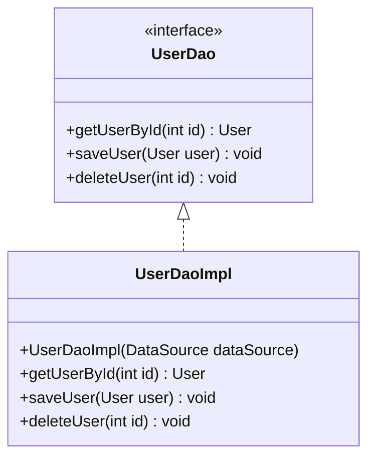

## 25.2.9 Vendor Lock-In Anti-Pattern

### Introduction

The Vendor Lock-In Anti-Pattern is a significant concern in software development, particularly in Java, where reliance on proprietary technologies can lead to costly and complex future changes. This section delves into the intricacies of vendor lock-in, its implications, and strategies to mitigate its risks.

### Understanding Vendor Lock-In

**Vendor Lock-In** occurs when a software system becomes dependent on a specific vendor's products or services, making it difficult to switch to alternative solutions without incurring substantial costs. This dependency can arise from using proprietary technologies, APIs, or platforms that are not easily replaceable or compatible with other systems.

#### Implications of Vendor Lock-In

1. **Limited Flexibility**: Once locked into a vendor's ecosystem, organizations may find it challenging to adapt to new technologies or business requirements.
2. **Increased Costs**: Transitioning away from a vendor's solution often involves significant financial and resource investments.
3. **Risk of Obsolescence**: If a vendor discontinues support or updates, the dependent software may become outdated or insecure.
4. **Reduced Bargaining Power**: Organizations may have less leverage in negotiating terms or pricing with the vendor.

### How Vendor Lock-In Occurs

Vendor lock-in typically arises from:

- **Proprietary APIs**: Using APIs that are unique to a vendor's platform can create dependencies that are hard to break.
- **Exclusive Features**: Leveraging features that are only available in a vendor's product can tie a system to that vendor.
- **Data Formats**: Storing data in proprietary formats can complicate migration to other systems.
- **Licensing Models**: Long-term contracts or licensing agreements can financially bind an organization to a vendor.

### Examples of Technologies Leading to Lock-In

1. **Cloud Platforms**: Services like AWS, Azure, and Google Cloud offer unique features that can create dependencies.
2. **Database Systems**: Proprietary databases with unique query languages or features.
3. **Enterprise Software**: ERP systems that integrate deeply with business processes.
4. **Middleware Solutions**: Proprietary middleware that facilitates communication between different software components.

### Strategies to Minimize Vendor Lock-In

#### 1. Adhere to Standards

- **Use Open Standards**: Favor technologies and protocols that are widely adopted and supported by multiple vendors.
- **Interoperability**: Ensure that systems can communicate with other systems using standard interfaces.

#### 2. Implement Abstraction Layers

- **Abstract APIs**: Create an abstraction layer over vendor-specific APIs to isolate dependencies.
- **Design Patterns**: Utilize design patterns like Adapter or Facade to encapsulate vendor-specific logic.

#### 3. Evaluate Long-Term Costs and Benefits

- **Cost-Benefit Analysis**: Consider the long-term implications of choosing a vendor-specific solution.
- **Future-Proofing**: Assess the vendor's roadmap and commitment to innovation and support.

#### 4. Modular Architecture

- **Decouple Components**: Design systems with loosely coupled components to facilitate easier replacement or integration.
- **Microservices**: Use microservices architecture to isolate vendor-specific functionality.

#### 5. Data Portability

- **Standard Data Formats**: Store data in formats that are easily exportable and compatible with other systems.
- **APIs for Data Access**: Provide APIs that allow data to be accessed and manipulated independently of the underlying storage system.

### Practical Application: Avoiding Vendor Lock-In in Java

#### Example Scenario

Consider a Java application that relies heavily on a cloud provider's proprietary database service. To avoid lock-in, the development team can:

1. **Use JDBC**: Implement data access using JDBC, which provides a standard interface for database connectivity.
2. **Abstract Data Access**: Create a data access layer that abstracts the database operations, allowing for easy switching between different database providers.
3. **Leverage ORM Tools**: Use Object-Relational Mapping (ORM) tools like Hibernate, which can work with various databases without changing the application code.

#### Code Example

```java
// Abstracting database access using a DAO pattern

public interface UserDao {
    User getUserById(int id);
    void saveUser(User user);
    void deleteUser(int id);
}

public class UserDaoImpl implements UserDao {
    private final DataSource dataSource;

    public UserDaoImpl(DataSource dataSource) {
        this.dataSource = dataSource;
    }

    @Override
    public User getUserById(int id) {
        // Implementation using JDBC or ORM
    }

    @Override
    public void saveUser(User user) {
        // Implementation using JDBC or ORM
    }

    @Override
    public void deleteUser(int id) {
        // Implementation using JDBC or ORM
    }
}
```

### Diagram: Abstraction Layer for Database Access



*Caption: The diagram illustrates the abstraction of database access using the DAO pattern, allowing for easy switching between different database implementations.*

### Conclusion

Vendor Lock-In is a critical consideration in software design, particularly in Java development. By understanding its implications and employing strategies to minimize dependency on proprietary technologies, developers can create flexible, future-proof systems. Evaluating long-term costs and benefits, adhering to standards, and implementing abstraction layers are essential practices to mitigate the risks associated with vendor lock-in.

### Key Takeaways

- **Vendor Lock-In** can lead to increased costs, limited flexibility, and reduced bargaining power.
- **Strategies** to minimize lock-in include adhering to standards, implementing abstraction layers, and evaluating long-term costs.
- **Practical Application** in Java involves using design patterns and abstraction to isolate vendor-specific dependencies.

### Further Reading

- [Oracle Java Documentation](https://docs.oracle.com/en/java/)
- [Cloud Design Patterns](https://learn.microsoft.com/en-us/azure/architecture/patterns/)

---

## Test Your Knowledge: Vendor Lock-In Anti-Pattern Quiz



### What is Vendor Lock-In?

- [x] A situation where software becomes dependent on a specific vendor's products or services.
- [ ] A method to ensure compatibility across different platforms.
- [ ] A strategy to enhance software security.
- [ ] A design pattern for optimizing performance.

> **Explanation:** Vendor Lock-In refers to the dependency on a specific vendor's products or services, making it difficult to switch to alternatives.

### Which of the following is a consequence of Vendor Lock-In?

- [x] Increased costs when switching vendors.
- [ ] Improved software flexibility.
- [ ] Enhanced security features.
- [ ] Reduced development time.

> **Explanation:** Vendor Lock-In can lead to increased costs when transitioning to a different vendor due to dependencies on proprietary technologies.

### How can abstraction layers help mitigate Vendor Lock-In?

- [x] By isolating vendor-specific dependencies.
- [ ] By increasing the complexity of the system.
- [ ] By reducing the need for documentation.
- [ ] By enhancing user interface design.

> **Explanation:** Abstraction layers help isolate vendor-specific dependencies, making it easier to switch vendors without significant changes to the system.

### Which design pattern is useful for abstracting vendor-specific logic?

- [x] Adapter Pattern
- [ ] Singleton Pattern
- [ ] Observer Pattern
- [ ] Strategy Pattern

> **Explanation:** The Adapter Pattern is useful for abstracting vendor-specific logic, allowing for easier integration with different systems.

### What is a key strategy to avoid Vendor Lock-In?

- [x] Adhering to open standards.
- [ ] Using proprietary APIs.
- [ ] Signing long-term contracts.
- [ ] Storing data in proprietary formats.

> **Explanation:** Adhering to open standards ensures compatibility with multiple vendors, reducing the risk of lock-in.

### Which of the following technologies can lead to Vendor Lock-In?

- [x] Cloud Platforms
- [ ] Open Source Libraries
- [ ] Standardized Protocols
- [ ] Public APIs

> **Explanation:** Cloud platforms often offer unique features that can create dependencies, leading to Vendor Lock-In.

### Why is it important to evaluate long-term costs when choosing technologies?

- [x] To assess the potential impact of Vendor Lock-In.
- [ ] To reduce initial development costs.
- [ ] To speed up the development process.
- [ ] To enhance user experience.

> **Explanation:** Evaluating long-term costs helps assess the potential impact of Vendor Lock-In and ensures informed decision-making.

### What role do open standards play in minimizing Vendor Lock-In?

- [x] They ensure interoperability across different systems.
- [ ] They increase dependency on a single vendor.
- [ ] They complicate system integration.
- [ ] They reduce system performance.

> **Explanation:** Open standards ensure interoperability across different systems, reducing dependency on a single vendor.

### How can modular architecture help avoid Vendor Lock-In?

- [x] By decoupling components for easier replacement.
- [ ] By increasing system complexity.
- [ ] By reducing documentation requirements.
- [ ] By enhancing user interface design.

> **Explanation:** Modular architecture decouples components, making it easier to replace or integrate different systems without vendor-specific dependencies.

### True or False: Vendor Lock-In only affects small-scale projects.

- [ ] True
- [x] False

> **Explanation:** Vendor Lock-In can affect projects of any scale, from small applications to large enterprise systems, due to dependencies on proprietary technologies.



---
