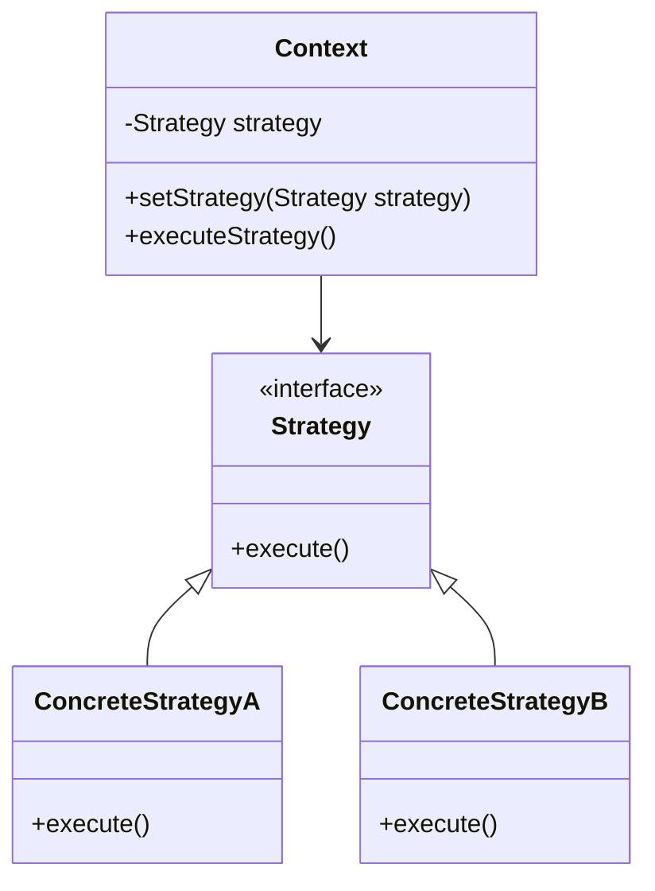
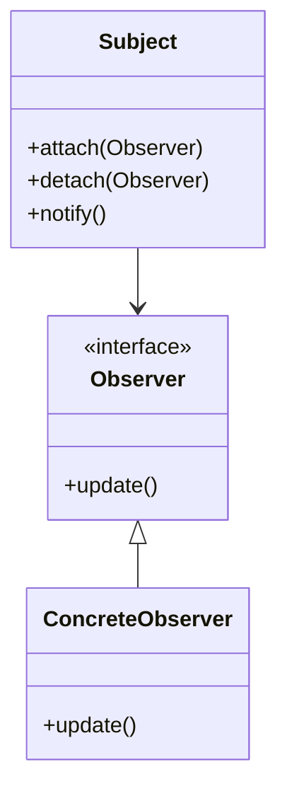
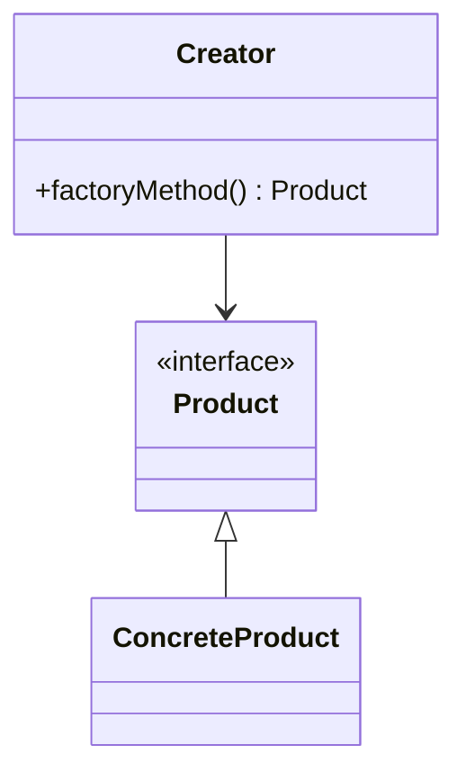

## 25.3.2 Applying Appropriate Design Patterns

In the realm of software development, anti-patterns often emerge as common pitfalls that can lead to inefficient, unmaintainable, or error-prone code. Recognizing these anti-patterns and refactoring them using appropriate design patterns is crucial for creating robust and scalable applications. This section explores how to identify common anti-patterns and apply design patterns to address their issues, aligning with SOLID principles and best practices.

### Understanding Anti-Patterns

Anti-patterns are recurring solutions to common problems that are ineffective and counterproductive. They often arise from a lack of understanding of design principles or from taking shortcuts during development. Some common anti-patterns include:

- **Spaghetti Code**: Code with a complex and tangled control structure, making it difficult to follow and maintain.
- **God Object**: A class that knows too much or does too much, violating the Single Responsibility Principle.
- **Lava Flow**: Code that is difficult to remove or refactor because it is intertwined with other parts of the system.
- **Copy-Paste Programming**: Reusing code by copying and pasting, leading to duplication and inconsistency.

### Leveraging Design Patterns

Design patterns provide proven solutions to common design problems and can be used to refactor anti-patterns effectively. By applying the right design pattern, developers can improve code readability, maintainability, and scalability. Here, we explore how to refactor some common anti-patterns using design patterns.

#### Refactoring Spaghetti Code with the Strategy Pattern

**Spaghetti Code** is characterized by a lack of structure, making it difficult to understand and modify. The Strategy Pattern can be used to refactor such code by encapsulating algorithms within classes, promoting separation of concerns and flexibility.

##### Strategy Pattern Overview

- **Category**: Behavioral Pattern

###### Intent

- **Description**: Define a family of algorithms, encapsulate each one, and make them interchangeable. Strategy lets the algorithm vary independently from clients that use it.

###### Applicability

- Use the Strategy Pattern when you have multiple algorithms for a specific task and want to switch between them easily.

###### Structure



- **Caption**: The Strategy Pattern structure showing the relationship between Context and Strategy.

###### Implementation Example

Consider a payment processing system with tangled logic for different payment methods:

```java
// Before refactoring: Spaghetti Code
public class PaymentProcessor {
    public void processPayment(String type) {
        if (type.equals("credit")) {
            // Credit card processing logic
        } else if (type.equals("paypal")) {
            // PayPal processing logic
        } else if (type.equals("bitcoin")) {
            // Bitcoin processing logic
        }
    }
}
```

Refactor using the Strategy Pattern:

```java
// Strategy interface
interface PaymentStrategy {
    void pay();
}

// Concrete strategy for credit card
class CreditCardPayment implements PaymentStrategy {
    public void pay() {
        System.out.println("Processing credit card payment.");
    }
}

// Concrete strategy for PayPal
class PayPalPayment implements PaymentStrategy {
    public void pay() {
        System.out.println("Processing PayPal payment.");
    }
}

// Concrete strategy for Bitcoin
class BitcoinPayment implements PaymentStrategy {
    public void pay() {
        System.out.println("Processing Bitcoin payment.");
    }
}

// Context class
class PaymentProcessor {
    private PaymentStrategy strategy;

    public void setStrategy(PaymentStrategy strategy) {
        this.strategy = strategy;
    }

    public void processPayment() {
        strategy.pay();
    }
}

// Client code
public class Client {
    public static void main(String[] args) {
        PaymentProcessor processor = new PaymentProcessor();
        
        processor.setStrategy(new CreditCardPayment());
        processor.processPayment();
        
        processor.setStrategy(new PayPalPayment());
        processor.processPayment();
        
        processor.setStrategy(new BitcoinPayment());
        processor.processPayment();
    }
}
```

- **Explanation**: The Strategy Pattern encapsulates payment methods, allowing easy addition of new strategies without modifying existing code.

#### Refactoring God Object with the Observer Pattern

**God Object** anti-pattern occurs when a class takes on too many responsibilities. The Observer Pattern can help distribute responsibilities by allowing objects to subscribe to events and react to changes.

##### Observer Pattern Overview

- **Category**: Behavioral Pattern

###### Intent

- **Description**: Define a one-to-many dependency between objects so that when one object changes state, all its dependents are notified and updated automatically.

###### Applicability

- Use the Observer Pattern when changes to one object require changes to others, and you don't want these objects tightly coupled.

###### Structure



- **Caption**: The Observer Pattern structure showing the relationship between Subject and Observer.

###### Implementation Example

Consider a weather monitoring system where a single class handles data collection, processing, and notification:

```java
// Before refactoring: God Object
public class WeatherStation {
    private List<Display> displays;

    public void collectData() {
        // Data collection logic
    }

    public void processData() {
        // Data processing logic
    }

    public void notifyDisplays() {
        for (Display display : displays) {
            display.update();
        }
    }
}
```

Refactor using the Observer Pattern:

```java
// Observer interface
interface Display {
    void update(float temperature, float humidity);
}

// Concrete observer
class CurrentConditionsDisplay implements Display {
    public void update(float temperature, float humidity) {
        System.out.println("Current conditions: " + temperature + "F degrees and " + humidity + "% humidity.");
    }
}

// Subject class
class WeatherData {
    private List<Display> displays = new ArrayList<>();
    private float temperature;
    private float humidity;

    public void registerDisplay(Display display) {
        displays.add(display);
    }

    public void removeDisplay(Display display) {
        displays.remove(display);
    }

    public void notifyDisplays() {
        for (Display display : displays) {
            display.update(temperature, humidity);
        }
    }

    public void setMeasurements(float temperature, float humidity) {
        this.temperature = temperature;
        this.humidity = humidity;
        notifyDisplays();
    }
}

// Client code
public class WeatherStation {
    public static void main(String[] args) {
        WeatherData weatherData = new WeatherData();
        CurrentConditionsDisplay currentDisplay = new CurrentConditionsDisplay();
        
        weatherData.registerDisplay(currentDisplay);
        weatherData.setMeasurements(80, 65);
    }
}
```

- **Explanation**: The Observer Pattern decouples the WeatherData class from the display logic, allowing for flexible addition of new display types.

#### Refactoring Lava Flow with the Factory Pattern

**Lava Flow** refers to code that is difficult to remove or refactor due to its entanglement with other parts of the system. The Factory Pattern can help by centralizing object creation, making it easier to manage dependencies.

##### Factory Pattern Overview

- **Category**: Creational Pattern

###### Intent

- **Description**: Define an interface for creating an object, but let subclasses alter the type of objects that will be created.

###### Applicability

- Use the Factory Pattern when a class can't anticipate the class of objects it must create.

###### Structure



- **Caption**: The Factory Pattern structure showing the relationship between Creator and Product.

###### Implementation Example

Consider a document management system with hardcoded document creation logic:

```java
// Before refactoring: Lava Flow
public class DocumentManager {
    public Document createDocument(String type) {
        if (type.equals("word")) {
            return new WordDocument();
        } else if (type.equals("pdf")) {
            return new PDFDocument();
        }
        return null;
    }
}
```

Refactor using the Factory Pattern:

```java
// Product interface
interface Document {
    void open();
}

// Concrete product for Word
class WordDocument implements Document {
    public void open() {
        System.out.println("Opening Word document.");
    }
}

// Concrete product for PDF
class PDFDocument implements Document {
    public void open() {
        System.out.println("Opening PDF document.");
    }
}

// Creator class
abstract class DocumentFactory {
    public abstract Document createDocument();
}

// Concrete creator for Word
class WordDocumentFactory extends DocumentFactory {
    public Document createDocument() {
        return new WordDocument();
    }
}

// Concrete creator for PDF
class PDFDocumentFactory extends DocumentFactory {
    public Document createDocument() {
        return new PDFDocument();
    }
}

// Client code
public class DocumentManager {
    public static void main(String[] args) {
        DocumentFactory wordFactory = new WordDocumentFactory();
        Document wordDoc = wordFactory.createDocument();
        wordDoc.open();

        DocumentFactory pdfFactory = new PDFDocumentFactory();
        Document pdfDoc = pdfFactory.createDocument();
        pdfDoc.open();
    }
}
```

- **Explanation**: The Factory Pattern centralizes document creation, allowing for easy addition of new document types without modifying existing code.

### Aligning with SOLID Principles

Applying design patterns to refactor anti-patterns aligns with SOLID principles, which promote better software design:

- **Single Responsibility Principle (SRP)**: Each class should have one reason to change, achieved by separating concerns using patterns like Strategy and Observer.
- **Open/Closed Principle (OCP)**: Software entities should be open for extension but closed for modification, facilitated by patterns like Factory.
- **Liskov Substitution Principle (LSP)**: Objects should be replaceable with instances of their subtypes without affecting the correctness of the program.
- **Interface Segregation Principle (ISP)**: Clients should not be forced to depend on interfaces they do not use, supported by patterns that define clear interfaces.
- **Dependency Inversion Principle (DIP)**: High-level modules should not depend on low-level modules, but both should depend on abstractions, achieved through patterns like Factory and Observer.

### Best Practices and Considerations

While design patterns offer powerful solutions, they should be applied thoughtfully:

- **Avoid Overuse**: Applying patterns indiscriminately can lead to unnecessary complexity. Evaluate the problem and choose the most suitable pattern.
- **Understand the Problem**: Clearly define the problem before selecting a pattern. Patterns are not one-size-fits-all solutions.
- **Consider Performance**: Some patterns may introduce performance overhead. Consider the trade-offs and test the impact on your application.
- **Encourage Modularity**: Patterns promote modularity, making it easier to test, maintain, and extend code.

### Conclusion

Refactoring anti-patterns using design patterns is a crucial skill for Java developers and software architects. By understanding the strengths and applicability of each pattern, developers can create more maintainable, scalable, and efficient applications. Embrace the journey of mastering design patterns, and apply them thoughtfully to enhance your software design.

### Exercises

1. Identify a piece of spaghetti code in your current project and refactor it using the Strategy Pattern.
2. Find a God Object in your codebase and apply the Observer Pattern to distribute its responsibilities.
3. Examine a section of your code that resembles Lava Flow and refactor it using the Factory Pattern.

### Reflection

Consider how applying these patterns has improved the design of your software. Reflect on the challenges you faced and how you overcame them. How might you apply these patterns to future projects?

---

## Test Your Knowledge: Applying Design Patterns to Refactor Anti-Patterns



### Which design pattern is most suitable for refactoring spaghetti code?

- [x] Strategy Pattern
- [ ] Observer Pattern
- [ ] Factory Pattern
- [ ] Singleton Pattern

> **Explanation:** The Strategy Pattern helps encapsulate algorithms, promoting separation of concerns and flexibility, making it ideal for refactoring spaghetti code.

### What problem does the Observer Pattern primarily address?

- [x] One-to-many dependency
- [ ] Object creation
- [ ] Algorithm encapsulation
- [ ] Resource management

> **Explanation:** The Observer Pattern defines a one-to-many dependency between objects, allowing changes in one object to automatically update others.

### How does the Factory Pattern help with the Lava Flow anti-pattern?

- [x] Centralizes object creation
- [ ] Encapsulates algorithms
- [ ] Defines a one-to-many dependency
- [ ] Manages resources

> **Explanation:** The Factory Pattern centralizes object creation, making it easier to manage dependencies and refactor entangled code.

### Which SOLID principle is supported by the Strategy Pattern?

- [x] Single Responsibility Principle
- [ ] Open/Closed Principle
- [ ] Liskov Substitution Principle
- [ ] Dependency Inversion Principle

> **Explanation:** The Strategy Pattern supports the Single Responsibility Principle by encapsulating algorithms and separating concerns.

### What is a common pitfall when applying design patterns?

- [x] Overuse
- [ ] Underuse
- [ ] Ignoring performance
- [ ] Focusing on modularity

> **Explanation:** Overuse of design patterns can lead to unnecessary complexity. It's important to evaluate the problem and choose the most suitable pattern.

### Which pattern is best for distributing responsibilities in a God Object?

- [x] Observer Pattern
- [ ] Strategy Pattern
- [ ] Factory Pattern
- [ ] Singleton Pattern

> **Explanation:** The Observer Pattern helps distribute responsibilities by allowing objects to subscribe to events and react to changes.

### How does the Factory Pattern align with the Open/Closed Principle?

- [x] Allows for extension without modification
- [ ] Promotes encapsulation of algorithms
- [ ] Defines a one-to-many dependency
- [ ] Manages resources efficiently

> **Explanation:** The Factory Pattern allows for easy addition of new types without modifying existing code, aligning with the Open/Closed Principle.

### What is the main benefit of using design patterns?

- [x] Improved code maintainability
- [ ] Increased code complexity
- [ ] Faster execution time
- [ ] Reduced code size

> **Explanation:** Design patterns improve code maintainability by providing proven solutions to common design problems.

### Which pattern is used to encapsulate algorithms?

- [x] Strategy Pattern
- [ ] Observer Pattern
- [ ] Factory Pattern
- [ ] Singleton Pattern

> **Explanation:** The Strategy Pattern is used to encapsulate algorithms, making them interchangeable and promoting flexibility.

### True or False: Design patterns should be applied to every part of a software system.

- [ ] True
- [x] False

> **Explanation:** Design patterns should be applied thoughtfully and only where they provide clear benefits, avoiding unnecessary complexity.



---
