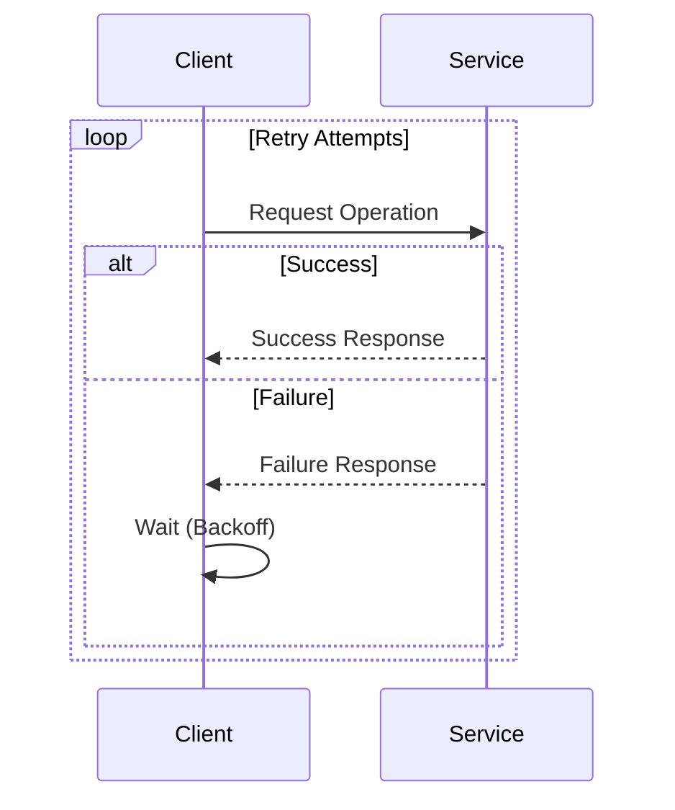

## 26.10.1 Retry Pattern

### Description

The Retry Pattern is a resilience design pattern that attempts to recover from transient failures by retrying a failed operation multiple times before giving up. This pattern is particularly useful in distributed systems where network or service interruptions are common. By implementing the Retry Pattern, developers can enhance the reliability and robustness of their applications.

### Understanding Transient Failures

Transient failures are temporary issues that can occur in distributed systems, often due to network latency, temporary unavailability of a service, or resource contention. These failures are usually short-lived and can be resolved by retrying the operation after a brief delay. Common causes of transient failures include:

- **Network Glitches**: Temporary loss of connectivity or high latency.
- **Service Overloads**: A service being temporarily overwhelmed with requests.
- **Resource Contention**: Competing processes vying for the same resources.

### Implementing the Retry Pattern in Java

To implement the Retry Pattern in Java, developers can use various approaches, ranging from simple loops to sophisticated libraries. Below, we explore different methods to implement this pattern effectively.

#### Basic Retry Implementation

A basic retry mechanism can be implemented using a simple loop that retries the operation a specified number of times.

```java
public class BasicRetryExample {

    public static void main(String[] args) {
        int maxRetries = 3;
        int attempt = 0;
        boolean success = false;

        while (attempt < maxRetries && !success) {
            try {
                // Attempt the operation
                performOperation();
                success = true; // If successful, set success to true
            } catch (Exception e) {
                attempt++;
                System.out.println("Attempt " + attempt + " failed. Retrying...");
                if (attempt >= maxRetries) {
                    System.out.println("Operation failed after " + maxRetries + " attempts.");
                }
            }
        }
    }

    private static void performOperation() throws Exception {
        // Simulate an operation that may fail
        if (Math.random() > 0.7) {
            throw new Exception("Transient failure occurred.");
        }
        System.out.println("Operation succeeded.");
    }
}
```

**Explanation**: This example demonstrates a simple retry mechanism where the operation is attempted up to three times. If the operation succeeds, the loop exits. If it fails, the exception is caught, and the operation is retried.

#### Advanced Retry with Exponential Backoff

Exponential backoff is a strategy where the delay between retries increases exponentially. This approach helps to reduce the load on the system and increases the chances of success in subsequent attempts.

```java
public class ExponentialBackoffRetry {

    public static void main(String[] args) {
        int maxRetries = 5;
        int attempt = 0;
        boolean success = false;
        long waitTime = 1000; // Initial wait time in milliseconds

        while (attempt < maxRetries && !success) {
            try {
                performOperation();
                success = true;
            } catch (Exception e) {
                attempt++;
                System.out.println("Attempt " + attempt + " failed. Retrying in " + waitTime + "ms...");
                try {
                    Thread.sleep(waitTime);
                } catch (InterruptedException ie) {
                    Thread.currentThread().interrupt();
                }
                waitTime *= 2; // Exponential backoff
                if (attempt >= maxRetries) {
                    System.out.println("Operation failed after " + maxRetries + " attempts.");
                }
            }
        }
    }

    private static void performOperation() throws Exception {
        if (Math.random() > 0.7) {
            throw new Exception("Transient failure occurred.");
        }
        System.out.println("Operation succeeded.");
    }
}
```

**Explanation**: In this example, the wait time between retries doubles after each failed attempt. This strategy helps to prevent overwhelming the system with frequent retries.

#### Using Java Libraries for Retry

Java developers can leverage libraries like **Resilience4j** to implement the Retry Pattern with more control and flexibility.

```java
import io.github.resilience4j.retry.Retry;
import io.github.resilience4j.retry.RetryConfig;
import io.github.resilience4j.retry.RetryRegistry;

import java.time.Duration;
import java.util.function.Supplier;

public class Resilience4jRetryExample {

    public static void main(String[] args) {
        RetryConfig config = RetryConfig.custom()
                .maxAttempts(3)
                .waitDuration(Duration.ofSeconds(2))
                .build();

        RetryRegistry registry = RetryRegistry.of(config);
        Retry retry = registry.retry("id");

        Supplier<String> supplier = Retry.decorateSupplier(retry, Resilience4jRetryExample::performOperation);

        try {
            String result = supplier.get();
            System.out.println(result);
        } catch (Exception e) {
            System.out.println("Operation failed after retries.");
        }
    }

    private static String performOperation() throws Exception {
        if (Math.random() > 0.7) {
            throw new Exception("Transient failure occurred.");
        }
        return "Operation succeeded.";
    }
}
```

**Explanation**: Resilience4j provides a robust framework for implementing retries with customizable configurations. In this example, the retry configuration specifies a maximum of three attempts with a two-second wait duration between retries.

### Considerations for Implementing the Retry Pattern

When implementing the Retry Pattern, consider the following factors to ensure optimal performance and reliability:

- **Maximum Retry Counts**: Define a reasonable limit for retries to prevent infinite loops and resource exhaustion.
- **Delays Between Retries**: Introduce delays to give the system time to recover and reduce the likelihood of repeated failures.
- **Exponential Backoff**: Use exponential backoff to gradually increase the delay between retries, reducing the load on the system.
- **Jitter**: Add randomness to the delay to prevent synchronized retries from multiple clients, which can lead to thundering herd problems.
- **Error Handling**: Differentiate between transient and permanent failures to avoid unnecessary retries for non-recoverable errors.

### Best Practices for the Retry Pattern

To effectively implement the Retry Pattern, adhere to the following best practices:

- **Identify Transient Failures**: Clearly identify which failures are transient and warrant retries.
- **Monitor and Log Retries**: Implement logging and monitoring to track retry attempts and identify patterns or issues.
- **Avoid Overloading Systems**: Use backoff strategies and limits to prevent overwhelming the system with retries.
- **Test and Tune**: Continuously test and tune retry configurations to balance reliability and performance.

### Visualizing the Retry Pattern

The following sequence diagram illustrates the workflow of the Retry Pattern, highlighting the retry attempts and backoff strategy.



**Caption**: This sequence diagram shows the interaction between a client and a service, with retry attempts and backoff delays in case of failure.

### Sample Use Cases

The Retry Pattern is widely used in various scenarios, including:

- **Network Requests**: Retrying HTTP requests in case of network failures.
- **Database Connections**: Re-establishing connections to a database after a transient failure.
- **Microservices Communication**: Ensuring reliable communication between microservices in a distributed system.

### Related Patterns

The Retry Pattern is often used in conjunction with other resilience patterns, such as:

- **Circuit Breaker Pattern**: Prevents repeated retries when a service is down, allowing it to recover.
- **Bulkhead Pattern**: Isolates failures to prevent them from affecting the entire system.

### Known Uses

The Retry Pattern is implemented in many popular libraries and frameworks, such as:

- **Spring Retry**: Provides a declarative approach to implementing retries in Spring applications.
- **Netflix Hystrix**: Offers resilience features, including retries, for microservices.

### Conclusion

The Retry Pattern is a powerful tool for enhancing the resilience of Java applications. By understanding transient failures and implementing effective retry strategies, developers can build robust systems that gracefully handle temporary disruptions. By following best practices and leveraging libraries like Resilience4j, developers can implement the Retry Pattern efficiently and effectively.

---

## Test Your Knowledge: Java Retry Pattern Quiz



### What is the primary purpose of the Retry Pattern?

- [x] To handle transient failures by retrying operations
- [ ] To optimize database queries
- [ ] To improve user interface responsiveness
- [ ] To enhance security protocols

> **Explanation:** The Retry Pattern is designed to handle transient failures by retrying operations that may succeed after a temporary issue is resolved.

### Which of the following is a common cause of transient failures?

- [x] Network glitches
- [ ] Syntax errors
- [ ] Hardware malfunctions
- [ ] User input errors

> **Explanation:** Transient failures are often caused by temporary issues like network glitches, which can be resolved by retrying the operation.

### What is exponential backoff?

- [x] A strategy where the delay between retries increases exponentially
- [ ] A method to decrease retry attempts over time
- [ ] A technique to prioritize certain operations
- [ ] A way to cache results for faster access

> **Explanation:** Exponential backoff is a strategy where the delay between retries increases exponentially, helping to reduce system load.

### Why is it important to differentiate between transient and permanent failures?

- [x] To avoid unnecessary retries for non-recoverable errors
- [ ] To increase the number of retries
- [ ] To improve code readability
- [ ] To enhance user experience

> **Explanation:** Differentiating between transient and permanent failures helps avoid unnecessary retries for errors that cannot be resolved by retrying.

### Which Java library provides robust support for implementing the Retry Pattern?

- [x] Resilience4j
- [ ] Apache Commons
- [ ] JUnit
- [ ] Log4j

> **Explanation:** Resilience4j is a popular library that provides robust support for implementing the Retry Pattern with customizable configurations.

### What is the benefit of adding jitter to retry delays?

- [x] To prevent synchronized retries from multiple clients
- [ ] To increase retry speed
- [ ] To simplify code logic
- [ ] To enhance security

> **Explanation:** Adding jitter to retry delays helps prevent synchronized retries from multiple clients, reducing the risk of a thundering herd problem.

### How can developers monitor retry attempts effectively?

- [x] By implementing logging and monitoring tools
- [ ] By increasing retry limits
- [ ] By reducing code complexity
- [ ] By using static analysis tools

> **Explanation:** Implementing logging and monitoring tools allows developers to track retry attempts and identify patterns or issues.

### What is a potential drawback of not using a backoff strategy in retries?

- [x] Overloading the system with frequent retries
- [ ] Reducing code maintainability
- [ ] Increasing security vulnerabilities
- [ ] Decreasing user satisfaction

> **Explanation:** Without a backoff strategy, frequent retries can overload the system, leading to performance degradation.

### In which scenario is the Retry Pattern most beneficial?

- [x] Retrying HTTP requests in case of network failures
- [ ] Optimizing database schema
- [ ] Enhancing user interface design
- [ ] Improving algorithm efficiency

> **Explanation:** The Retry Pattern is most beneficial in scenarios like retrying HTTP requests where network failures are common.

### True or False: The Retry Pattern is only applicable to network-related operations.

- [ ] True
- [x] False

> **Explanation:** The Retry Pattern is applicable to various operations, not just network-related ones, including database connections and microservices communication.



---
