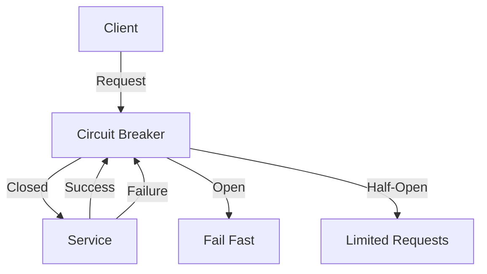

## 26.10.2 Circuit Breaker Pattern

### Intent

The **Circuit Breaker Pattern** is a design pattern used to prevent an application from repeatedly trying to execute an operation that is likely to fail. It is particularly useful in distributed systems to enhance resilience and prevent cascading failures.

### Also Known As

- **Fault Tolerance Pattern**

### Motivation

In distributed systems, services often depend on other services, databases, or external APIs. When these dependencies fail, the calling service can become overwhelmed with retries, leading to resource exhaustion and cascading failures. The Circuit Breaker Pattern helps mitigate this risk by providing a mechanism to detect failures and stop the flow of requests to a failing service, allowing it time to recover.

### Applicability

Use the Circuit Breaker Pattern when:

- You have a distributed system with multiple service dependencies.
- You need to prevent cascading failures in your application.
- You want to improve the resilience and fault tolerance of your system.
- You need to manage and monitor the health of service dependencies.

### Structure



**Caption**: The Circuit Breaker Pattern structure showing the states: Closed, Open, and Half-Open.

### Participants

- **Client**: The entity making requests to the service.
- **Circuit Breaker**: Monitors the requests and transitions between states based on success or failure.
- **Service**: The target service that the client is trying to access.
- **Fail Fast**: A mechanism to quickly return an error when the circuit is open.

### Collaborations

- The **Client** sends requests to the **Service** through the **Circuit Breaker**.
- The **Circuit Breaker** monitors the success and failure of requests.
- When failures exceed a threshold, the **Circuit Breaker** transitions to the **Open** state, preventing further requests to the **Service**.
- After a timeout, the **Circuit Breaker** transitions to the **Half-Open** state, allowing a limited number of test requests to determine if the **Service** has recovered.
- If the test requests succeed, the **Circuit Breaker** transitions back to the **Closed** state; otherwise, it returns to the **Open** state.

### Consequences

- **Benefits**: 
  - Prevents resource exhaustion by stopping repeated failed requests.
  - Allows services time to recover from failures.
  - Improves system resilience and fault tolerance.
- **Drawbacks**:
  - Adds complexity to the system.
  - Requires careful configuration and tuning of thresholds and timeouts.

### Implementation

#### Implementation Guidelines

- Define thresholds for failures and timeouts for the circuit breaker.
- Monitor the health of the service and adjust configurations as needed.
- Use libraries like Resilience4j for easy integration and configuration.

#### Sample Code Snippets

Below is an example of implementing the Circuit Breaker Pattern using the Resilience4j library in Java.

```java
import io.github.resilience4j.circuitbreaker.CircuitBreaker;
import io.github.resilience4j.circuitbreaker.CircuitBreakerConfig;
import io.github.resilience4j.circuitbreaker.CircuitBreakerRegistry;
import io.github.resilience4j.circuitbreaker.event.CircuitBreakerEvent;
import io.github.resilience4j.circuitbreaker.event.CircuitBreakerOnErrorEvent;

import java.time.Duration;
import java.util.function.Supplier;

public class CircuitBreakerExample {

    public static void main(String[] args) {
        // Create a custom configuration for a CircuitBreaker
        CircuitBreakerConfig circuitBreakerConfig = CircuitBreakerConfig.custom()
                .failureRateThreshold(50) // Percentage of failures to open the circuit
                .waitDurationInOpenState(Duration.ofSeconds(30)) // Time to wait before transitioning to Half-Open
                .ringBufferSizeInClosedState(5) // Number of calls to record in Closed state
                .ringBufferSizeInHalfOpenState(3) // Number of calls to record in Half-Open state
                .build();

        // Create a CircuitBreakerRegistry with a custom global configuration
        CircuitBreakerRegistry circuitBreakerRegistry = CircuitBreakerRegistry.of(circuitBreakerConfig);

        // Get or create a CircuitBreaker from the CircuitBreakerRegistry
        CircuitBreaker circuitBreaker = circuitBreakerRegistry.circuitBreaker("myCircuitBreaker");

        // Decorate your call to the service with the CircuitBreaker
        Supplier<String> decoratedSupplier = CircuitBreaker.decorateSupplier(circuitBreaker, CircuitBreakerExample::callService);

        // Execute the decorated supplier
        try {
            String result = decoratedSupplier.get();
            System.out.println("Service call result: " + result);
        } catch (Exception e) {
            System.out.println("Service call failed: " + e.getMessage());
        }

        // Register an event listener to listen for CircuitBreaker events
        circuitBreaker.getEventPublisher()
                .onError(event -> handleCircuitBreakerEvent(event));
    }

    private static String callService() {
        // Simulate a service call that may fail
        if (Math.random() > 0.5) {
            throw new RuntimeException("Service failure");
        }
        return "Service success";
    }

    private static void handleCircuitBreakerEvent(CircuitBreakerEvent event) {
        if (event instanceof CircuitBreakerOnErrorEvent) {
            System.out.println("CircuitBreaker error event: " + event.toString());
        }
    }
}
```

**Explanation**: This example demonstrates how to configure and use a Circuit Breaker with Resilience4j. The circuit breaker is configured with a failure rate threshold, a wait duration in the open state, and ring buffer sizes for both closed and half-open states. The service call is decorated with the circuit breaker, and events are logged to monitor the circuit breaker's behavior.

#### Sample Use Cases

- **Microservices Architecture**: Protecting microservices from failures in dependent services.
- **API Gateways**: Preventing API gateways from being overwhelmed by repeated failed requests.
- **Database Connections**: Managing database connection failures and retries.

### Related Patterns

- **[Retry Pattern]( "Retry Pattern")**: Often used in conjunction with the Circuit Breaker Pattern to handle transient failures.
- **[Bulkhead Pattern]( "Bulkhead Pattern")**: Isolates failures to prevent them from affecting the entire system.

### Known Uses

- **Netflix Hystrix**: A popular library for implementing the Circuit Breaker Pattern, although now in maintenance mode.
- **Spring Cloud Circuit Breaker**: Provides an abstraction layer for circuit breaker implementations, including Resilience4j.

### Configuration Considerations

- **Failure Threshold**: Set an appropriate failure rate threshold to trigger the circuit breaker.
- **Timeout Duration**: Configure the duration the circuit breaker remains open before transitioning to half-open.
- **Monitoring and Alerts**: Implement monitoring and alerting to track the health of the circuit breaker and service dependencies.

### Monitoring

- Use tools like Prometheus and Grafana to monitor circuit breaker metrics.
- Track the number of open, closed, and half-open states to identify patterns and potential issues.

### Conclusion

The Circuit Breaker Pattern is a vital tool for building resilient distributed systems. By preventing cascading failures and allowing services time to recover, it enhances the overall stability and reliability of your application. Implementing this pattern using libraries like Resilience4j can simplify the process and provide robust monitoring and configuration options.

---

## Test Your Knowledge: Circuit Breaker Pattern in Java Quiz



### What is the primary purpose of the Circuit Breaker Pattern?

- [x] To prevent an application from repeatedly trying to execute an operation that is likely to fail.
- [ ] To enhance the performance of a service.
- [ ] To simplify the codebase.
- [ ] To manage user authentication.

> **Explanation:** The Circuit Breaker Pattern is designed to prevent repeated failed operations, enhancing system resilience.

### Which state does the Circuit Breaker enter after a failure threshold is exceeded?

- [ ] Closed
- [x] Open
- [ ] Half-Open
- [ ] Failed

> **Explanation:** When the failure threshold is exceeded, the Circuit Breaker transitions to the Open state to prevent further requests.

### What library is commonly used in Java to implement the Circuit Breaker Pattern?

- [ ] Apache Commons
- [x] Resilience4j
- [ ] JUnit
- [ ] Log4j

> **Explanation:** Resilience4j is a popular library for implementing the Circuit Breaker Pattern in Java.

### What happens in the Half-Open state of a Circuit Breaker?

- [x] A limited number of test requests are allowed to determine if the service has recovered.
- [ ] All requests are blocked.
- [ ] All requests are allowed.
- [ ] The circuit breaker is reset.

> **Explanation:** In the Half-Open state, a limited number of requests are allowed to test if the service is healthy.

### How does the Circuit Breaker Pattern help in a microservices architecture?

- [x] It prevents cascading failures by stopping requests to failing services.
- [ ] It enhances data storage capabilities.
- [ ] It simplifies service deployment.
- [ ] It manages user sessions.

> **Explanation:** The Circuit Breaker Pattern helps prevent cascading failures, which is crucial in a microservices architecture.

### What is a key configuration consideration for a Circuit Breaker?

- [x] Failure threshold
- [ ] Database schema
- [ ] User interface design
- [ ] Logging format

> **Explanation:** Setting an appropriate failure threshold is crucial for the effective operation of a Circuit Breaker.

### Which pattern is often used in conjunction with the Circuit Breaker Pattern?

- [x] Retry Pattern
- [ ] Singleton Pattern
- [ ] Observer Pattern
- [ ] Factory Pattern

> **Explanation:** The Retry Pattern is often used with the Circuit Breaker Pattern to handle transient failures.

### What tool can be used to monitor Circuit Breaker metrics?

- [x] Prometheus
- [ ] Eclipse
- [ ] Maven
- [ ] Jenkins

> **Explanation:** Prometheus is a tool that can be used to monitor Circuit Breaker metrics.

### What is the consequence of not using a Circuit Breaker in a distributed system?

- [x] Potential cascading failures
- [ ] Improved performance
- [ ] Simplified code
- [ ] Enhanced security

> **Explanation:** Without a Circuit Breaker, a distributed system is at risk of cascading failures due to repeated failed requests.

### True or False: The Circuit Breaker Pattern can be used to manage user authentication.

- [ ] True
- [x] False

> **Explanation:** The Circuit Breaker Pattern is not used for managing user authentication; it is used for handling failures in service dependencies.


