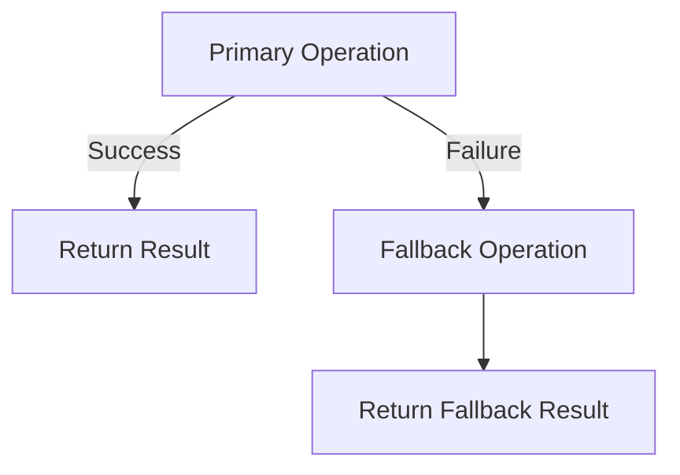

## 26.10.3 Fallback Pattern

### Introduction

In the realm of software development, ensuring system resilience and reliability is paramount. The **Fallback Pattern** is a crucial design strategy that provides alternative functionality when a primary operation fails. This pattern is particularly useful in distributed systems, microservices architectures, and any environment where network or service failures can occur. By implementing fallback mechanisms, developers can maintain a seamless user experience and ensure data consistency even in the face of unexpected failures.

### Intent

- **Description**: The Fallback Pattern aims to provide a backup plan when a primary operation cannot be completed successfully. This can involve returning cached data, default responses, or executing alternative logic to maintain system functionality.

### Also Known As

- **Alternate Names**: Graceful Degradation, Backup Strategy

### Motivation

In today's interconnected world, applications often rely on external services, databases, and APIs. These dependencies can introduce points of failure that, if not handled properly, can degrade the user experience or even bring down the entire system. The Fallback Pattern addresses this challenge by ensuring that the application can continue to operate, albeit with reduced functionality, when a failure occurs.

### Applicability

- **Guidelines**: Use the Fallback Pattern in scenarios where:
  - External services or resources are unreliable or prone to failure.
  - Maintaining a seamless user experience is critical.
  - Data consistency must be preserved even when primary operations fail.
  - Alternative data sources or logic can provide acceptable results.

### Structure



- **Caption**: This diagram illustrates the flow of the Fallback Pattern, where a primary operation attempts to execute, and upon failure, a fallback operation is triggered to provide an alternative result.

### Participants

- **Primary Operation**: The main task or service call that the application attempts to execute.
- **Fallback Operation**: The alternative logic or data source used when the primary operation fails.
- **Result Handler**: The component responsible for returning the appropriate result to the user or system.

### Collaborations

- **Interactions**: The primary operation is attempted first. If it succeeds, the result is returned. If it fails, the fallback operation is executed, and its result is returned instead.

### Consequences

- **Analysis**: 
  - **Benefits**: 
    - Enhances system resilience and reliability.
    - Improves user experience by minimizing disruptions.
    - Provides a safety net for handling failures gracefully.
  - **Drawbacks**: 
    - May introduce complexity in managing fallback logic.
    - Fallback results may not be as accurate or complete as primary results.

### Implementation

#### Implementation Guidelines

- **Identify Critical Operations**: Determine which operations require fallbacks based on their importance and failure likelihood.
- **Design Fallback Logic**: Develop alternative strategies, such as using cached data, default values, or alternative services.
- **Ensure Consistency**: Implement mechanisms to maintain data consistency across primary and fallback operations.
- **Monitor and Log**: Track fallback occurrences to identify patterns and improve primary operation reliability.

#### Sample Code Snippets

```java
import java.util.Optional;

public class FallbackExample {

    public static void main(String[] args) {
        FallbackExample example = new FallbackExample();
        String result = example.getDataWithFallback();
        System.out.println("Result: " + result);
    }

    public String getDataWithFallback() {
        try {
            // Attempt primary operation
            return fetchDataFromPrimarySource();
        } catch (Exception e) {
            // Log the failure
            System.err.println("Primary operation failed: " + e.getMessage());
            // Execute fallback operation
            return fetchDataFromFallbackSource();
        }
    }

    private String fetchDataFromPrimarySource() throws Exception {
        // Simulate a failure
        throw new Exception("Primary source unavailable");
    }

    private String fetchDataFromFallbackSource() {
        // Return fallback data
        return "Fallback data";
    }
}
```

- **Explanation**: This code demonstrates a simple implementation of the Fallback Pattern in Java. The `getDataWithFallback` method attempts to fetch data from a primary source. If an exception occurs, it logs the error and retrieves data from a fallback source instead.

#### Sample Use Cases

- **Real-world Scenarios**:
  - **E-commerce Platforms**: Use cached product information when the primary database is unavailable.
  - **Weather Applications**: Provide default weather data if the external API fails.
  - **Financial Services**: Display last known account balance when real-time data retrieval fails.

### Related Patterns

- **Connections**: The Fallback Pattern is often used in conjunction with the [Circuit Breaker Pattern]( "Circuit Breaker Pattern") to prevent repeated failures and system overload.

### Known Uses

- **Examples in Libraries or Frameworks**: 
  - **Hystrix**: A popular library for implementing the Fallback Pattern in Java applications, particularly in microservices architectures.

### Best Practices for Fallback Strategies

- **Determine Appropriate Fallbacks**: Analyze the impact of failures and choose fallback strategies that align with business goals and user expectations.
- **Prioritize User Experience**: Ensure that fallback results are meaningful and maintain a positive user experience.
- **Test Fallback Logic**: Regularly test fallback scenarios to ensure they function correctly and provide the desired results.
- **Monitor and Optimize**: Continuously monitor fallback occurrences and optimize primary operations to reduce reliance on fallbacks.

### Considerations for Data Consistency and User Experience

- **Data Consistency**: Implement mechanisms to synchronize data between primary and fallback sources to prevent inconsistencies.
- **User Experience**: Design fallback responses that are clear and informative, helping users understand the situation without causing frustration.

### Conclusion

The Fallback Pattern is an essential tool for building resilient and reliable Java applications. By providing alternative functionality when primary operations fail, developers can enhance system stability and maintain a seamless user experience. Implementing effective fallback strategies requires careful planning, testing, and monitoring, but the benefits far outweigh the challenges. As you integrate the Fallback Pattern into your projects, consider the specific needs of your application and users, and strive to create a robust and dependable system.

---

## Test Your Knowledge: Fallback Pattern in Java Quiz



### What is the primary purpose of the Fallback Pattern?

- [x] To provide alternative functionality when a primary operation fails.
- [ ] To enhance system performance during peak loads.
- [ ] To simplify code maintenance.
- [ ] To improve data storage efficiency.

> **Explanation:** The Fallback Pattern is designed to ensure system resilience by providing alternative functionality when primary operations fail.

### Which of the following is a common fallback strategy?

- [x] Returning cached data
- [ ] Increasing server capacity
- [ ] Reducing code complexity
- [ ] Enhancing user interface design

> **Explanation:** Returning cached data is a typical fallback strategy used when primary data sources are unavailable.

### In which scenarios is the Fallback Pattern most applicable?

- [x] When external services are unreliable
- [ ] When system performance is optimal
- [ ] When data storage is limited
- [ ] When user interface design is complex

> **Explanation:** The Fallback Pattern is most applicable in scenarios where external services or resources are unreliable.

### What is a potential drawback of using the Fallback Pattern?

- [x] It may introduce complexity in managing fallback logic.
- [ ] It always improves system performance.
- [ ] It simplifies code maintenance.
- [ ] It reduces the need for testing.

> **Explanation:** While the Fallback Pattern enhances resilience, it can also introduce complexity in managing fallback logic.

### How can data consistency be ensured when using the Fallback Pattern?

- [x] By implementing synchronization mechanisms
- [ ] By reducing the number of fallback operations
- [x] By testing fallback scenarios regularly
- [ ] By simplifying user interface design

> **Explanation:** Synchronization mechanisms and regular testing help ensure data consistency when using the Fallback Pattern.

### What is a key benefit of the Fallback Pattern?

- [x] It enhances system resilience and reliability.
- [ ] It reduces code complexity.
- [ ] It increases data storage capacity.
- [ ] It simplifies user interface design.

> **Explanation:** The Fallback Pattern enhances system resilience by providing alternative functionality during failures.

### Which library is commonly used for implementing the Fallback Pattern in Java?

- [x] Hystrix
- [ ] Hibernate
- [x] Spring Boot
- [ ] JUnit

> **Explanation:** Hystrix is a popular library for implementing the Fallback Pattern in Java applications.

### What should be prioritized when designing fallback responses?

- [x] User experience
- [ ] Code complexity
- [ ] Data storage efficiency
- [ ] Server capacity

> **Explanation:** Prioritizing user experience ensures that fallback responses are meaningful and maintain a positive user experience.

### What is an example of a real-world use case for the Fallback Pattern?

- [x] Displaying cached product information in e-commerce platforms
- [ ] Increasing server capacity during peak loads
- [ ] Simplifying code maintenance
- [ ] Enhancing data storage efficiency

> **Explanation:** Displaying cached product information is a real-world use case for the Fallback Pattern in e-commerce platforms.

### True or False: The Fallback Pattern is only applicable in microservices architectures.

- [x] False
- [ ] True

> **Explanation:** The Fallback Pattern is applicable in various architectures, not just microservices, wherever resilience and reliability are needed.



---

By understanding and implementing the Fallback Pattern, Java developers and software architects can create robust applications that gracefully handle failures, ensuring a reliable and consistent user experience.
