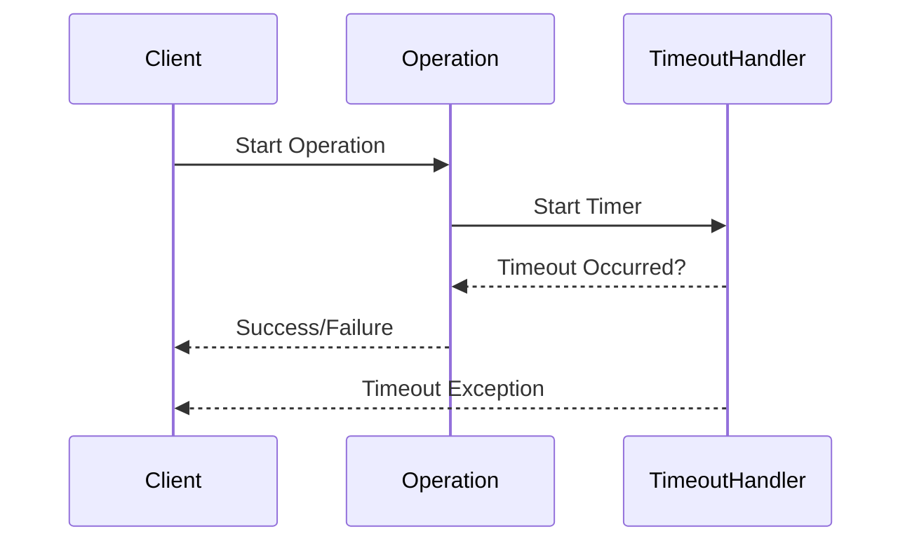

## 26.10.4 Timeout Pattern

### Intent

- **Description**: The Timeout Pattern is a design strategy used to limit the time an operation can take before it is aborted. This pattern is essential in preventing resource exhaustion and ensuring system resilience by avoiding indefinite waits for operations that may never complete.

### Also Known As

- **Alternate Names**: Time Limit Pattern, Operation Timeout

### Motivation

In modern software systems, operations such as network calls, database queries, or file I/O can sometimes take longer than expected due to various factors like network latency, server load, or resource contention. Without a mechanism to limit the duration of these operations, systems can become unresponsive or even crash due to resource exhaustion. The Timeout Pattern addresses this issue by specifying a maximum time limit for operations, allowing systems to fail gracefully and recover from potential deadlocks or bottlenecks.

### Applicability

- **Guidelines**: Use the Timeout Pattern in scenarios where operations may hang indefinitely or take longer than acceptable, such as:
  - Network requests to external services.
  - Database queries that may lock or take excessive time.
  - File operations on slow or unreliable storage.
  - Any long-running computation that could be interrupted.

### Structure

- **Diagram**:



- **Caption**: This sequence diagram illustrates the interaction between a client, an operation, and a timeout handler. The operation is initiated, and a timer is started. If the operation completes before the timeout, a success or failure is returned. If the timeout occurs first, a timeout exception is triggered.

### Participants

- **Client**: Initiates the operation and handles the result or timeout exception.
- **Operation**: The task or process that is subject to the timeout.
- **TimeoutHandler**: Monitors the operation's duration and triggers an exception if the timeout is exceeded.

### Collaborations

- **Interactions**: The client starts an operation, and the timeout handler monitors its duration. If the operation completes within the allowed time, the result is returned to the client. If the timeout is reached first, the timeout handler interrupts the operation and notifies the client of the timeout.

### Consequences

- **Analysis**: Applying the Timeout Pattern provides several benefits:
  - **Prevents Resource Exhaustion**: By limiting operation durations, it prevents system resources from being tied up indefinitely.
  - **Enhances Resilience**: Systems can recover from stalled operations, maintaining overall responsiveness.
  - **Facilitates Error Handling**: Timeouts provide a clear mechanism for handling operations that exceed expected durations.

  However, there are potential drawbacks:
  - **Choosing Timeout Duration**: Setting an appropriate timeout can be challenging and may require tuning based on system performance and requirements.
  - **False Positives**: Operations may be prematurely terminated if the timeout is too short.

### Implementation

- **Implementation Guidelines**: When implementing the Timeout Pattern, consider the following:
  - **Determine Appropriate Timeout Values**: Base these on historical data, expected performance, and user experience considerations.
  - **Use Java's Concurrency Utilities**: Leverage classes like `Future` and `ExecutorService` to manage timeouts effectively.
  - **Integrate with Other Patterns**: Combine with Retry and Circuit Breaker patterns for enhanced resilience.

- **Sample Code Snippets**:

```java
import java.util.concurrent.*;

public class TimeoutExample {

    public static void main(String[] args) {
        ExecutorService executor = Executors.newSingleThreadExecutor();
        Callable<String> task = () -> {
            // Simulate a long-running operation
            Thread.sleep(2000);
            return "Task Completed";
        };

        Future<String> future = executor.submit(task);
        try {
            // Set a timeout of 1 second
            String result = future.get(1, TimeUnit.SECONDS);
            System.out.println(result);
        } catch (TimeoutException e) {
            System.err.println("Operation timed out");
        } catch (InterruptedException | ExecutionException e) {
            System.err.println("Operation failed: " + e.getMessage());
        } finally {
            executor.shutdown();
        }
    }
}
```

- **Explanation**: This Java example demonstrates using `ExecutorService` and `Future` to implement a timeout for a task. The task simulates a long-running operation, and the `get` method is used with a timeout to ensure it does not exceed the specified duration.

### Sample Use Cases

- **Real-world Scenarios**:
  - **Network Calls**: Set timeouts for HTTP requests to prevent hanging due to network issues.
  - **Database Operations**: Use timeouts for queries to avoid locking or long-running transactions.
  - **Microservices**: Implement timeouts in service-to-service communication to maintain system reliability.

### Related Patterns

- **Connections**: The Timeout Pattern is often used in conjunction with:
  - **[Retry Pattern]( "Retry Pattern")**: Automatically retry operations that fail due to timeouts.
  - **[Circuit Breaker Pattern]( "Circuit Breaker Pattern")**: Prevent repeated attempts to execute operations that are likely to fail.

### Known Uses

- **Examples in Libraries or Frameworks**:
  - **Apache HttpClient**: Provides built-in support for setting timeouts on HTTP requests.
  - **Spring Framework**: Offers timeout configuration for database operations and REST clients.

### Choosing Appropriate Timeout Durations

Selecting the right timeout duration is crucial for the effectiveness of the Timeout Pattern. Consider the following factors:

- **Historical Data**: Analyze past performance metrics to understand typical operation durations.
- **System Requirements**: Align timeout values with system performance goals and user expectations.
- **Environmental Factors**: Account for network latency, server load, and other external influences.

### Integration with Other Patterns

Integrating the Timeout Pattern with other resilience patterns can enhance system robustness:

- **Retry Pattern**: Automatically retry operations that fail due to timeouts, with exponential backoff to avoid overwhelming the system.
- **Circuit Breaker Pattern**: Use timeouts to trigger circuit breakers, preventing further attempts to execute failing operations.

### Expert Tips and Best Practices

- **Use Configurable Timeouts**: Allow timeout values to be configured externally, enabling easy adjustments based on changing conditions.
- **Monitor and Log Timeouts**: Implement logging and monitoring to track timeout occurrences and identify potential issues.
- **Test with Realistic Scenarios**: Simulate various conditions to ensure timeouts are set appropriately and the system behaves as expected under load.

### Common Pitfalls and How to Avoid Them

- **Setting Timeouts Too Short**: Avoid premature terminations by basing timeouts on realistic performance expectations.
- **Ignoring Timeout Exceptions**: Always handle timeout exceptions gracefully to maintain system stability.
- **Overloading with Retries**: Balance retries with timeouts to prevent excessive load on the system.

### Exercises and Practice Problems

1. **Implement a Timeout for a Database Query**: Use Java's concurrency utilities to set a timeout for a simulated database query.
2. **Combine Timeout and Retry Patterns**: Create a Java application that uses both patterns to handle network requests.
3. **Analyze Timeout Logs**: Develop a logging mechanism to track timeout occurrences and analyze the data to optimize timeout settings.

### Summary of Key Takeaways

- The Timeout Pattern is essential for managing operation durations and preventing resource exhaustion.
- Choosing appropriate timeout values requires careful consideration of system performance and environmental factors.
- Integrating with Retry and Circuit Breaker patterns enhances system resilience.
- Monitoring and logging timeouts provide valuable insights for optimizing system behavior.

### Reflection

Consider how the Timeout Pattern can be applied to your projects. What operations could benefit from timeouts, and how might you integrate this pattern with other resilience strategies?

## Test Your Knowledge: Java Timeout Pattern and Resilience Strategies Quiz



### What is the primary purpose of the Timeout Pattern?

- [x] To limit the duration of operations and prevent resource exhaustion.
- [ ] To enhance system performance by speeding up operations.
- [ ] To ensure all operations complete successfully.
- [ ] To reduce the complexity of code.

> **Explanation:** The Timeout Pattern is designed to limit how long an operation can take, preventing resource exhaustion and ensuring system resilience.

### Which Java class is commonly used to implement timeouts for tasks?

- [x] Future
- [ ] Thread
- [ ] Timer
- [ ] CompletableFuture

> **Explanation:** The `Future` class, along with `ExecutorService`, is commonly used to implement timeouts for tasks in Java.

### How can the Timeout Pattern be integrated with the Retry Pattern?

- [x] By retrying operations that fail due to timeouts with exponential backoff.
- [ ] By ignoring timeout exceptions and continuing execution.
- [ ] By setting longer timeouts for retries.
- [ ] By reducing the number of retries to zero.

> **Explanation:** The Timeout Pattern can be integrated with the Retry Pattern by retrying operations that fail due to timeouts, using strategies like exponential backoff to avoid overwhelming the system.

### What is a potential drawback of setting timeouts too short?

- [x] Premature termination of operations.
- [ ] Increased system performance.
- [ ] Reduced resource usage.
- [ ] Enhanced user experience.

> **Explanation:** Setting timeouts too short can lead to premature termination of operations, which may not be desirable.

### Which pattern can be used alongside the Timeout Pattern to prevent repeated attempts to execute failing operations?

- [x] Circuit Breaker Pattern
- [ ] Singleton Pattern
- [ ] Observer Pattern
- [ ] Factory Pattern

> **Explanation:** The Circuit Breaker Pattern can be used alongside the Timeout Pattern to prevent repeated attempts to execute operations that are likely to fail.

### What should be considered when choosing timeout durations?

- [x] Historical performance data and system requirements.
- [ ] The number of retries.
- [ ] The complexity of the code.
- [ ] The size of the application.

> **Explanation:** When choosing timeout durations, consider historical performance data and system requirements to ensure they are set appropriately.

### What is a common use case for the Timeout Pattern?

- [x] Setting timeouts for network requests to prevent hanging.
- [ ] Enhancing the speed of database queries.
- [ ] Reducing the complexity of algorithms.
- [ ] Improving user interface design.

> **Explanation:** A common use case for the Timeout Pattern is setting timeouts for network requests to prevent hanging due to network issues.

### What is the role of the TimeoutHandler in the Timeout Pattern?

- [x] To monitor the operation's duration and trigger an exception if the timeout is exceeded.
- [ ] To execute the operation and return the result.
- [ ] To enhance the performance of the operation.
- [ ] To log the operation's execution time.

> **Explanation:** The TimeoutHandler monitors the operation's duration and triggers an exception if the timeout is exceeded, ensuring the operation does not hang indefinitely.

### How can monitoring and logging timeouts benefit a system?

- [x] By providing insights for optimizing system behavior and identifying potential issues.
- [ ] By reducing the complexity of the code.
- [ ] By enhancing the speed of operations.
- [ ] By improving user interface design.

> **Explanation:** Monitoring and logging timeouts provide valuable insights for optimizing system behavior and identifying potential issues, helping to improve system resilience.

### True or False: The Timeout Pattern is only applicable to network operations.

- [x] False
- [ ] True

> **Explanation:** The Timeout Pattern is applicable to various operations, including network calls, database queries, file I/O, and long-running computations, not just network operations.



By mastering the Timeout Pattern, Java developers and software architects can enhance the resilience and reliability of their applications, ensuring they remain responsive and robust in the face of potential delays and resource constraints.
