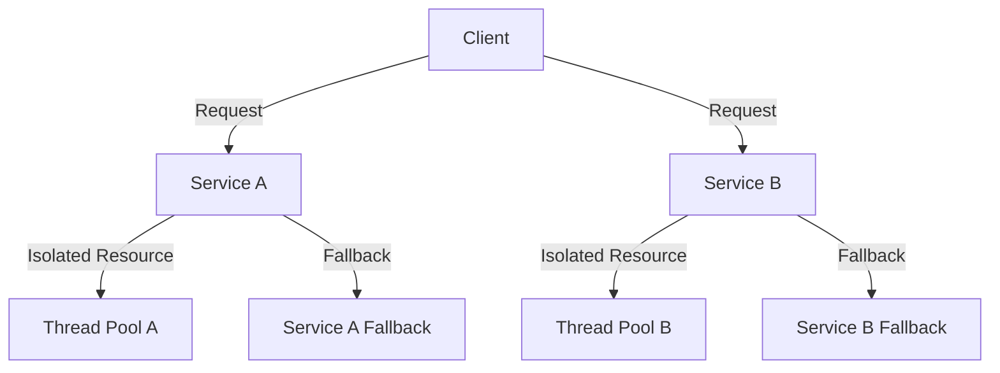

## 26.10.5 Bulkhead Pattern

### Intent

- **Description**: The Bulkhead Pattern is a resilience design pattern that aims to prevent failures in one part of a system from cascading to other parts. By isolating resources, it ensures that a failure in one component does not lead to a complete system failure, thereby enhancing the overall robustness and reliability of the application.

### Also Known As

- **Alternate Names**: Resource Isolation Pattern

### Motivation

In complex systems, especially those involving microservices or distributed architectures, a failure in one component can potentially bring down the entire system. The Bulkhead Pattern draws inspiration from ship bulkheads, which are watertight compartments that prevent water from flooding the entire vessel if one section is breached. Similarly, in software, bulkheads isolate different parts of the system to contain failures and maintain overall system integrity.

### Applicability

- **Guidelines**: Use the Bulkhead Pattern in systems where:
  - Different components or services have varying levels of criticality.
  - You want to ensure that non-critical failures do not impact critical services.
  - There is a need to manage resources efficiently and prevent resource exhaustion.
  - The system architecture involves microservices or distributed components.

### Structure

- **Diagram**:



- **Caption**: This diagram illustrates the Bulkhead Pattern, where Service A and Service B are isolated using separate thread pools, ensuring that a failure in one does not affect the other.

### Participants

- **Client**: Initiates requests to various services.
- **Service A/B**: Represents different services or components in the system.
- **Thread Pool A/B**: Isolated resources (e.g., thread pools) dedicated to each service.
- **Fallback**: Mechanism to handle failures gracefully.

### Collaborations

- **Interactions**: The client sends requests to multiple services. Each service operates within its isolated resource boundary (e.g., a dedicated thread pool). If a service fails, it triggers a fallback mechanism without affecting other services.

### Consequences

- **Analysis**:
  - **Benefits**:
    - **Isolation**: Prevents cascading failures by isolating resources.
    - **Resilience**: Enhances system resilience and reliability.
    - **Resource Management**: Efficiently manages resources by allocating them based on service criticality.
  - **Drawbacks**:
    - **Complexity**: Increases system complexity due to additional resource management.
    - **Overhead**: May introduce overhead in terms of resource allocation and management.

### Implementation

- **Implementation Guidelines**: To implement the Bulkhead Pattern in Java, consider using thread pools or process isolation techniques. Each service or component should have its dedicated resources, such as a separate thread pool, to ensure isolation.

- **Sample Code Snippets**:

```java
import java.util.concurrent.*;

public class BulkheadExample {

    // Thread pool for Service A
    private static final ExecutorService serviceAExecutor = Executors.newFixedThreadPool(5);

    // Thread pool for Service B
    private static final ExecutorService serviceBExecutor = Executors.newFixedThreadPool(5);

    public static void main(String[] args) {
        // Simulate requests to Service A
        for (int i = 0; i < 10; i++) {
            serviceAExecutor.submit(() -> {
                try {
                    System.out.println("Processing Service A request by " + Thread.currentThread().getName());
                    Thread.sleep(1000); // Simulate processing
                } catch (InterruptedException e) {
                    Thread.currentThread().interrupt();
                }
            });
        }

        // Simulate requests to Service B
        for (int i = 0; i < 10; i++) {
            serviceBExecutor.submit(() -> {
                try {
                    System.out.println("Processing Service B request by " + Thread.currentThread().getName());
                    Thread.sleep(1000); // Simulate processing
                } catch (InterruptedException e) {
                    Thread.currentThread().interrupt();
                }
            });
        }

        // Shutdown executors
        serviceAExecutor.shutdown();
        serviceBExecutor.shutdown();
    }
}
```

- **Explanation**: In this example, two services, A and B, are isolated using separate thread pools. Each service processes requests independently, ensuring that a failure in one does not impact the other.

### Sample Use Cases

- **Real-world Scenarios**:
  - **E-commerce Platforms**: Isolate payment processing from inventory management to ensure that a failure in inventory does not affect payment transactions.
  - **Microservices Architecture**: Use bulkheads to isolate different microservices, ensuring that a failure in one service does not cascade to others.
  - **Cloud Services**: Implement bulkheads to manage resource allocation and prevent resource exhaustion in cloud-based applications.

### Related Patterns

- **Connections**: The Bulkhead Pattern is often used in conjunction with other resilience patterns, such as the [Circuit Breaker Pattern]( "Circuit Breaker Pattern"), to enhance system reliability.

### Known Uses

- **Examples in Libraries or Frameworks**: The Bulkhead Pattern is commonly implemented in resilience libraries such as Netflix Hystrix and Resilience4j, which provide built-in support for resource isolation and fallback mechanisms.

### Trade-offs and Best Practices

- **Trade-offs**:
  - **Resource Allocation**: Carefully balance resource allocation to avoid underutilization or over-provisioning.
  - **Complexity vs. Resilience**: Weigh the added complexity against the resilience benefits.
  - **Monitoring and Tuning**: Regularly monitor and tune resource allocations to adapt to changing workloads.

- **Best Practices**:
  - **Prioritize Critical Services**: Allocate more resources to critical services to ensure their availability.
  - **Implement Fallbacks**: Use fallback mechanisms to handle failures gracefully.
  - **Monitor Resource Usage**: Continuously monitor resource usage to identify bottlenecks and optimize allocations.

### Exercises and Practice Problems

1. **Exercise**: Modify the provided code example to include a fallback mechanism for each service. Implement a simple logging mechanism to record when a fallback is triggered.

2. **Practice Problem**: Design a system architecture for a hypothetical online streaming service using the Bulkhead Pattern. Identify critical components and propose a resource isolation strategy.

3. **Challenge**: Implement a bulkhead pattern using process isolation instead of thread pools. Discuss the advantages and disadvantages of this approach compared to thread-based isolation.

### Conclusion

The Bulkhead Pattern is a powerful tool for enhancing system resilience and reliability. By isolating resources, it prevents failures from cascading and ensures that critical services remain available even in the face of component failures. Implementing this pattern requires careful consideration of resource allocation and monitoring, but the benefits in terms of system robustness and maintainability are significant.

## Test Your Knowledge: Bulkhead Pattern in Java Quiz



### What is the primary purpose of the Bulkhead Pattern?

- [x] To isolate system resources and prevent cascading failures.
- [ ] To enhance system performance by optimizing resource usage.
- [ ] To simplify system architecture by reducing components.
- [ ] To improve user interface responsiveness.

> **Explanation:** The Bulkhead Pattern is designed to isolate resources and prevent failures in one part of the system from affecting others, thereby enhancing resilience.

### Which Java feature is commonly used to implement the Bulkhead Pattern?

- [x] Thread pools
- [ ] Reflection
- [ ] Serialization
- [ ] Annotations

> **Explanation:** Thread pools are often used to isolate resources in Java, allowing different components to operate independently.

### In which scenario is the Bulkhead Pattern particularly effective?

- [x] In systems with varying levels of service criticality.
- [ ] In single-threaded applications.
- [ ] In systems with no external dependencies.
- [ ] In applications with static resource requirements.

> **Explanation:** The Bulkhead Pattern is effective in systems where different components have varying criticality levels, ensuring that non-critical failures do not impact critical services.

### What is a potential drawback of implementing the Bulkhead Pattern?

- [x] Increased system complexity
- [ ] Reduced system resilience
- [ ] Decreased resource utilization
- [ ] Simplified error handling

> **Explanation:** Implementing the Bulkhead Pattern can increase system complexity due to additional resource management and isolation mechanisms.

### Which of the following is a best practice when using the Bulkhead Pattern?

- [x] Prioritize resource allocation for critical services.
- [ ] Use a single thread pool for all services.
- [ ] Avoid monitoring resource usage.
- [ ] Implement fallbacks only for non-critical services.

> **Explanation:** Prioritizing resource allocation for critical services ensures their availability and enhances system resilience.

### How does the Bulkhead Pattern relate to the Circuit Breaker Pattern?

- [x] Both enhance system resilience by handling failures.
- [ ] Both simplify system architecture.
- [ ] Both focus on improving user experience.
- [ ] Both reduce system resource usage.

> **Explanation:** Both the Bulkhead and Circuit Breaker Patterns enhance system resilience by managing failures and preventing cascading effects.

### What is a common use case for the Bulkhead Pattern?

- [x] Isolating microservices in a distributed architecture.
- [ ] Enhancing single-threaded application performance.
- [ ] Simplifying database interactions.
- [ ] Improving user interface design.

> **Explanation:** The Bulkhead Pattern is commonly used to isolate microservices, ensuring that failures in one service do not affect others.

### What is the inspiration behind the Bulkhead Pattern?

- [x] Ship bulkheads that prevent flooding.
- [ ] Electrical circuit breakers.
- [ ] Computer memory partitions.
- [ ] Network firewalls.

> **Explanation:** The Bulkhead Pattern is inspired by ship bulkheads, which are watertight compartments that prevent flooding from spreading.

### Which library provides built-in support for the Bulkhead Pattern?

- [x] Resilience4j
- [ ] JUnit
- [ ] Hibernate
- [ ] Log4j

> **Explanation:** Resilience4j is a library that provides built-in support for resilience patterns, including the Bulkhead Pattern.

### True or False: The Bulkhead Pattern can be implemented using process isolation.

- [x] True
- [ ] False

> **Explanation:** The Bulkhead Pattern can be implemented using process isolation, where each component runs in a separate process, providing even greater isolation.



By mastering the Bulkhead Pattern, Java developers and software architects can significantly enhance the resilience and reliability of their applications, ensuring robust and maintainable systems in the face of failures.
