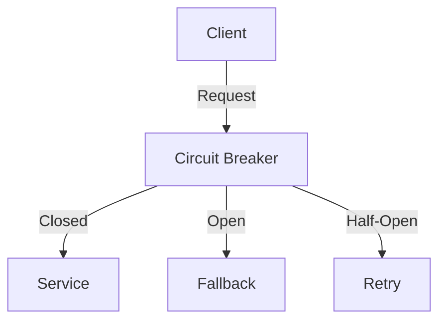
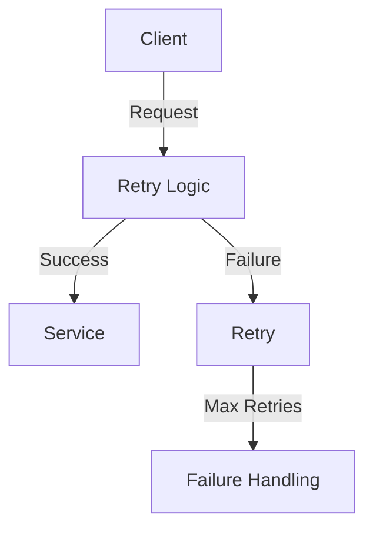

## 26.10 Exception Handling and Resilience Patterns

In the realm of software development, the ability to handle exceptions and build resilient systems is paramount. This section delves into the intricacies of exception handling in Java and explores resilience patterns that enhance the robustness of applications. By mastering these concepts, experienced Java developers and software architects can create systems that gracefully handle failures and maintain functionality under adverse conditions.

### General Principles of Exception Handling in Java

Exception handling is a fundamental aspect of Java programming, allowing developers to manage runtime errors effectively. Understanding the principles of exception handling is crucial for building robust applications.

#### Understanding Exceptions

In Java, exceptions are events that disrupt the normal flow of a program. They are objects that represent an error or unexpected behavior. Java categorizes exceptions into two main types:

- **Checked Exceptions**: These are exceptions that are checked at compile-time. They must be either caught or declared in the method signature using the `throws` keyword. Examples include `IOException` and `SQLException`.

- **Unchecked Exceptions**: These exceptions are not checked at compile-time. They are subclasses of `RuntimeException` and include errors such as `NullPointerException` and `ArrayIndexOutOfBoundsException`.

#### Best Practices for Exception Handling

1. **Use Specific Exceptions**: Always catch the most specific exception first. This ensures that the exception handling logic is precise and relevant to the error encountered.

2. **Avoid Catching `Throwable`**: Catching `Throwable` can lead to catching errors that should not be handled, such as `OutOfMemoryError`. Instead, catch specific exceptions or `Exception` if necessary.

3. **Log Exceptions**: Always log exceptions with meaningful messages. This aids in debugging and provides insight into the application's behavior during failures.

4. **Do Not Swallow Exceptions**: Avoid empty catch blocks. Swallowing exceptions can hide errors and make debugging difficult.

5. **Use Finally Blocks**: Utilize `finally` blocks to release resources, such as closing files or database connections, ensuring that resources are freed regardless of whether an exception occurs.

6. **Rethrow Exceptions**: If an exception cannot be handled meaningfully, consider rethrowing it or wrapping it in a custom exception to provide additional context.

7. **Custom Exceptions**: Create custom exceptions to represent specific error conditions in your application. This enhances clarity and allows for more granular exception handling.

#### Example of Exception Handling in Java

```java
import java.io.BufferedReader;
import java.io.FileReader;
import java.io.IOException;

public class FileProcessor {

    public void processFile(String filePath) {
        BufferedReader reader = null;
        try {
            reader = new BufferedReader(new FileReader(filePath));
            String line;
            while ((line = reader.readLine()) != null) {
                // Process each line
                System.out.println(line);
            }
        } catch (IOException e) {
            System.err.println("Error reading file: " + e.getMessage());
        } finally {
            try {
                if (reader != null) {
                    reader.close();
                }
            } catch (IOException e) {
                System.err.println("Error closing reader: " + e.getMessage());
            }
        }
    }
}
```

### Resilience Patterns for Robust Applications

Resilience patterns are design strategies that enable applications to withstand failures and continue operating. These patterns are essential for building systems that are fault-tolerant and reliable.

#### Circuit Breaker Pattern

- **Category**: Resilience Pattern

##### Intent

- **Description**: The Circuit Breaker pattern prevents an application from repeatedly trying to execute an operation that is likely to fail, allowing it to recover and avoid cascading failures.

##### Motivation

- **Explanation**: In distributed systems, remote calls can fail due to network issues or service unavailability. The Circuit Breaker pattern helps manage these failures by "breaking" the circuit after a threshold of failures is reached, preventing further attempts until the service is deemed healthy again.

##### Applicability

- **Guidelines**: Use this pattern when dealing with remote service calls or operations that are prone to failure. It is particularly useful in microservices architectures.

##### Structure



- **Caption**: The Circuit Breaker pattern structure showing the states: Closed, Open, and Half-Open.

##### Participants

- **Client**: Initiates the request.
- **Circuit Breaker**: Monitors the success and failure of requests and changes states accordingly.
- **Service**: The target of the request.
- **Fallback**: An alternative action when the circuit is open.

##### Collaborations

- **Interactions**: The client sends a request to the circuit breaker. If the circuit is closed, the request is forwarded to the service. If open, a fallback is executed. In the half-open state, a limited number of requests are allowed to test the service's health.

##### Consequences

- **Analysis**: The Circuit Breaker pattern improves system stability by preventing repeated failures. However, it may introduce latency due to state transitions and requires careful configuration of thresholds and timeouts.

##### Implementation

- **Implementation Guidelines**: Implement a state machine to manage the circuit states and transitions. Use metrics to determine when to open or close the circuit.

- **Sample Code Snippets**:

```java
public class CircuitBreaker {
    private enum State { CLOSED, OPEN, HALF_OPEN }
    private State state = State.CLOSED;
    private int failureCount = 0;
    private final int threshold = 3;
    private final long timeout = 5000; // 5 seconds
    private long lastFailureTime = 0;

    public boolean allowRequest() {
        if (state == State.OPEN) {
            if (System.currentTimeMillis() - lastFailureTime > timeout) {
                state = State.HALF_OPEN;
            } else {
                return false;
            }
        }
        return true;
    }

    public void recordSuccess() {
        state = State.CLOSED;
        failureCount = 0;
    }

    public void recordFailure() {
        failureCount++;
        lastFailureTime = System.currentTimeMillis();
        if (failureCount >= threshold) {
            state = State.OPEN;
        }
    }
}
```

- **Explanation**: This code snippet demonstrates a simple circuit breaker implementation. The circuit transitions between states based on the number of failures and a timeout period.

##### Sample Use Cases

- **Real-world Scenarios**: Use the Circuit Breaker pattern in e-commerce applications to handle payment gateway failures or in microservices to manage service dependencies.

##### Related Patterns

- **Connections**: The Circuit Breaker pattern is often used in conjunction with the [Retry Pattern]( "Retry Pattern") to provide a comprehensive failure management strategy.

##### Known Uses

- **Examples in Libraries or Frameworks**: Netflix Hystrix is a popular library that implements the Circuit Breaker pattern.

#### Retry Pattern

- **Category**: Resilience Pattern

##### Intent

- **Description**: The Retry pattern attempts to recover from transient failures by retrying an operation a specified number of times before giving up.

##### Motivation

- **Explanation**: Transient failures, such as temporary network glitches, can often be resolved by retrying the operation. The Retry pattern provides a mechanism to handle these failures gracefully.

##### Applicability

- **Guidelines**: Use this pattern when dealing with operations that are prone to transient failures, such as network calls or database queries.

##### Structure



- **Caption**: The Retry pattern structure showing the retry logic and failure handling.

##### Participants

- **Client**: Initiates the request.
- **Retry Logic**: Manages the retry attempts and intervals.
- **Service**: The target of the request.
- **Failure Handling**: Handles the failure if retries are exhausted.

##### Collaborations

- **Interactions**: The client sends a request to the retry logic. If the operation fails, it is retried a specified number of times before invoking failure handling.

##### Consequences

- **Analysis**: The Retry pattern can improve reliability by overcoming transient failures. However, it may increase latency and resource consumption if not configured properly.

##### Implementation

- **Implementation Guidelines**: Implement exponential backoff to manage retry intervals and avoid overwhelming the service.

- **Sample Code Snippets**:

```java
public class RetryOperation {
    private final int maxRetries = 3;
    private final long delay = 1000; // 1 second

    public boolean executeWithRetry(Runnable operation) {
        int attempt = 0;
        while (attempt < maxRetries) {
            try {
                operation.run();
                return true;
            } catch (Exception e) {
                attempt++;
                if (attempt >= maxRetries) {
                    System.err.println("Operation failed after " + maxRetries + " attempts");
                    return false;
                }
                try {
                    Thread.sleep(delay * attempt); // Exponential backoff
                } catch (InterruptedException ie) {
                    Thread.currentThread().interrupt();
                }
            }
        }
        return false;
    }
}
```

- **Explanation**: This code snippet demonstrates a retry mechanism with exponential backoff. The operation is retried up to a maximum number of attempts with increasing delays.

##### Sample Use Cases

- **Real-world Scenarios**: Use the Retry pattern in cloud-based applications to handle transient network issues or in database operations to manage temporary connectivity problems.

##### Related Patterns

- **Connections**: The Retry pattern complements the [Circuit Breaker Pattern]( "Circuit Breaker Pattern") by providing a mechanism to retry operations before breaking the circuit.

##### Known Uses

- **Examples in Libraries or Frameworks**: Spring Retry is a framework that provides support for the Retry pattern in Java applications.

### Conclusion

Exception handling and resilience patterns are critical components of robust software design. By understanding and applying these patterns, Java developers and architects can build systems that gracefully handle failures and maintain functionality under adverse conditions. The Circuit Breaker and Retry patterns are just two examples of resilience strategies that can be employed to enhance application reliability.

### Key Takeaways

- **Exception Handling**: Use specific exceptions, log errors, and avoid swallowing exceptions to ensure effective error management.
- **Resilience Patterns**: Implement patterns like Circuit Breaker and Retry to manage failures and improve system robustness.
- **Practical Application**: Apply these patterns in real-world scenarios to build fault-tolerant and reliable applications.

### Exercises

1. Implement a custom exception in Java and demonstrate its usage in a sample application.
2. Modify the Circuit Breaker code example to include a fallback mechanism when the circuit is open.
3. Experiment with different retry intervals and observe the impact on application performance.

### Reflection

Consider how these patterns can be integrated into your current projects. What challenges might you face, and how can you overcome them? Reflect on the importance of resilience in software design and how it contributes to system reliability.

## Test Your Knowledge: Exception Handling and Resilience Patterns Quiz



### What is the primary purpose of the Circuit Breaker pattern?

- [x] To prevent repeated failures by breaking the circuit after a threshold is reached.
- [ ] To log exceptions in a centralized location.
- [ ] To retry operations a specified number of times.
- [ ] To handle transient network issues.

> **Explanation:** The Circuit Breaker pattern is designed to prevent repeated failures by breaking the circuit after a threshold is reached, allowing the system to recover.

### Which type of exception must be either caught or declared in the method signature in Java?

- [x] Checked Exception
- [ ] Unchecked Exception
- [ ] Runtime Exception
- [ ] Error

> **Explanation:** Checked exceptions must be either caught or declared in the method signature using the `throws` keyword.

### What is a common consequence of using the Retry pattern without proper configuration?

- [x] Increased latency and resource consumption
- [ ] Improved system stability
- [ ] Reduced error logging
- [ ] Enhanced security

> **Explanation:** Without proper configuration, the Retry pattern can lead to increased latency and resource consumption due to excessive retries.

### In the context of exception handling, what is the purpose of a `finally` block?

- [x] To release resources regardless of whether an exception occurs
- [ ] To catch specific exceptions
- [ ] To log error messages
- [ ] To retry failed operations

> **Explanation:** A `finally` block is used to release resources, such as closing files or database connections, regardless of whether an exception occurs.

### Which pattern is often used in conjunction with the Circuit Breaker pattern?

- [x] Retry Pattern
- [ ] Singleton Pattern
- [ ] Observer Pattern
- [ ] Factory Pattern

> **Explanation:** The Retry pattern is often used in conjunction with the Circuit Breaker pattern to provide a comprehensive failure management strategy.

### What is a key benefit of creating custom exceptions in Java?

- [x] Enhanced clarity and more granular exception handling
- [ ] Reduced code complexity
- [ ] Improved performance
- [ ] Simplified logging

> **Explanation:** Custom exceptions provide enhanced clarity and allow for more granular exception handling by representing specific error conditions.

### What is the main difference between checked and unchecked exceptions in Java?

- [x] Checked exceptions are checked at compile-time, while unchecked exceptions are not.
- [ ] Checked exceptions are runtime errors, while unchecked exceptions are compile-time errors.
- [ ] Checked exceptions are subclasses of `RuntimeException`, while unchecked exceptions are not.
- [ ] Checked exceptions cannot be caught, while unchecked exceptions can.

> **Explanation:** Checked exceptions are checked at compile-time and must be either caught or declared in the method signature, while unchecked exceptions are not.

### What is the role of the `allowRequest` method in the Circuit Breaker pattern?

- [x] To determine whether a request should be allowed based on the circuit's state
- [ ] To log error messages
- [ ] To retry failed operations
- [ ] To release resources

> **Explanation:** The `allowRequest` method determines whether a request should be allowed based on the circuit's state, preventing further attempts when the circuit is open.

### What is a potential drawback of the Circuit Breaker pattern?

- [x] It may introduce latency due to state transitions.
- [ ] It increases code complexity.
- [ ] It reduces system stability.
- [ ] It simplifies error handling.

> **Explanation:** The Circuit Breaker pattern may introduce latency due to state transitions, as it requires monitoring and managing the circuit's state.

### True or False: The Retry pattern is only applicable to network operations.

- [x] False
- [ ] True

> **Explanation:** The Retry pattern is applicable to any operation prone to transient failures, not just network operations. It can be used for database queries, file I/O, and more.



By mastering exception handling and resilience patterns, you can build robust Java applications that gracefully handle failures and maintain functionality under adverse conditions. Embrace these patterns to enhance your software design skills and create reliable systems.
