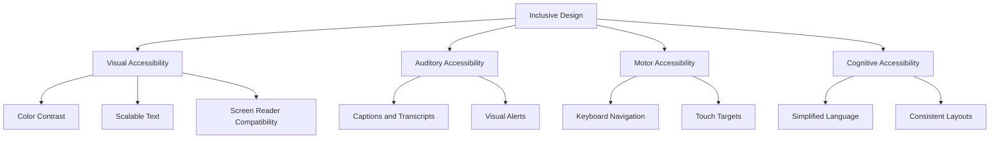

## 26.12.2 Inclusive Design Principles

### Introduction to Inclusive Design

Inclusive design is a design methodology that aims to create products and environments accessible to as many people as possible, regardless of their abilities or backgrounds. In the context of software engineering, inclusive design ensures that applications are usable by individuals with diverse needs, including those with disabilities. This approach not only enhances accessibility but also improves the overall user experience, making applications more robust and appealing to a broader audience.

#### Goals of Inclusive Design

The primary goals of inclusive design are to:

- **Enhance Accessibility**: Ensure that applications are usable by people with varying abilities, including those with visual, auditory, cognitive, or motor impairments.
- **Promote Usability**: Create intuitive and user-friendly interfaces that cater to a wide range of users.
- **Foster Diversity and Inclusion**: Recognize and accommodate the diverse needs of users from different cultural, linguistic, and socio-economic backgrounds.
- **Increase Market Reach**: By designing inclusively, developers can tap into a larger user base, including individuals who might otherwise be excluded.

### Accommodating Different User Needs

To accommodate different user needs, developers must consider various accessibility features and design practices. These include:

#### 1. Visual Accessibility

- **Color Contrast**: Ensure sufficient contrast between text and background colors to aid users with visual impairments. Tools like the [WebAIM Contrast Checker](https://webaim.org/resources/contrastchecker/) can help evaluate color contrast.
- **Scalable Text**: Allow users to adjust text size without breaking the layout. Use relative units like `em` or `rem` instead of fixed units like `px`.
- **Screen Reader Compatibility**: Ensure that applications are compatible with screen readers by providing alternative text for images and using semantic HTML elements.

#### 2. Auditory Accessibility

- **Captions and Transcripts**: Provide captions for video content and transcripts for audio content to assist users with hearing impairments.
- **Visual Alerts**: Use visual cues in addition to audio alerts to convey important information.

#### 3. Motor Accessibility

- **Keyboard Navigation**: Ensure that all interactive elements are accessible via keyboard navigation. Use the `tabindex` attribute to define a logical tab order.
- **Touch Targets**: Design touch targets that are large enough to be easily tapped by users with limited dexterity.

#### 4. Cognitive Accessibility

- **Simplified Language**: Use clear and concise language to make content understandable for users with cognitive impairments.
- **Consistent Layouts**: Maintain consistent layouts and navigation structures to reduce cognitive load.

### Guidelines for Designing Inclusive UIs

Designing inclusive user interfaces involves adhering to certain guidelines and best practices:

#### 1. User-Centered Design

- **User Research**: Conduct user research to understand the needs and preferences of diverse user groups. This can involve interviews, surveys, and usability testing.
- **Personas and Scenarios**: Develop personas and scenarios that represent a wide range of users, including those with disabilities.

#### 2. Flexibility and Customization

- **Customizable Interfaces**: Allow users to customize the interface to suit their preferences, such as adjusting font size, color schemes, and layout.
- **Responsive Design**: Implement responsive design techniques to ensure that applications work well on various devices and screen sizes.

#### 3. Feedback and Error Handling

- **Clear Feedback**: Provide clear and immediate feedback for user actions, such as form submissions or button clicks.
- **Error Messages**: Display informative error messages that guide users on how to correct mistakes.

#### 4. Testing and Iteration

- **Accessibility Testing**: Conduct accessibility testing using tools like [WAVE](https://wave.webaim.org/) or [Axe](https://www.deque.com/axe/) to identify and fix accessibility issues.
- **Iterative Design**: Adopt an iterative design process that incorporates user feedback and continuously improves the user experience.

### Benefits of Inclusivity

Embracing inclusive design principles offers several benefits:

- **Broader Audience**: By making applications accessible to a wider range of users, developers can increase their potential user base and market reach.
- **Improved User Experience**: Inclusive design enhances the overall user experience by making applications more intuitive and user-friendly.
- **Compliance with Regulations**: Many countries have legal requirements for accessibility, such as the Americans with Disabilities Act (ADA) in the United States. Inclusive design helps ensure compliance with these regulations.
- **Positive Brand Image**: Companies that prioritize inclusivity are often viewed more favorably by consumers, enhancing their brand reputation.

### Practical Applications and Real-World Scenarios

Inclusive design principles can be applied in various real-world scenarios:

#### 1. E-commerce Platforms

E-commerce platforms can benefit from inclusive design by ensuring that their websites are accessible to users with disabilities. This includes providing alternative text for product images, ensuring keyboard navigation, and offering multiple payment options.

#### 2. Educational Software

Educational software should accommodate students with diverse learning needs by offering customizable interfaces, providing captions for video lectures, and ensuring compatibility with assistive technologies.

#### 3. Public Sector Applications

Government websites and applications must be accessible to all citizens, including those with disabilities. This involves adhering to accessibility standards like the Web Content Accessibility Guidelines (WCAG).

### Code Example: Implementing Accessible Features in Java

Below is a Java code example demonstrating how to implement accessible features in a Swing application:

```java
import javax.swing.*;
import java.awt.*;

public class AccessibleApp {
    public static void main(String[] args) {
        SwingUtilities.invokeLater(() -> {
            JFrame frame = new JFrame("Accessible Application");
            frame.setDefaultCloseOperation(JFrame.EXIT_ON_CLOSE);
            frame.setSize(400, 300);

            // Create a label with accessible text
            JLabel label = new JLabel("Welcome to the Accessible App");
            label.setFont(new Font("Arial", Font.PLAIN, 16));
            label.setForeground(Color.BLACK);

            // Create a button with keyboard shortcut
            JButton button = new JButton("Click Me");
            button.setMnemonic('C'); // Alt + C to activate

            // Add components to the frame
            frame.setLayout(new FlowLayout());
            frame.add(label);
            frame.add(button);

            // Set frame visibility
            frame.setVisible(true);
        });
    }
}
```

**Explanation**: This code creates a simple Swing application with accessible features. The label uses a clear font and color, while the button includes a keyboard shortcut (Alt + C) for activation. Developers are encouraged to experiment with this code by adding more accessible features, such as tooltips or alternative text.

### Visualizing Inclusive Design

To better understand the structure of inclusive design, consider the following diagram:



**Caption**: This diagram illustrates the key components of inclusive design, highlighting the different types of accessibility and their associated features.

### Conclusion

Inclusive design is an essential aspect of modern software development, ensuring that applications are accessible and usable by people with diverse abilities and backgrounds. By adhering to inclusive design principles, developers can create applications that are not only compliant with accessibility standards but also offer a superior user experience. As the demand for accessible software continues to grow, embracing inclusivity will become increasingly important for reaching a broader audience and enhancing brand reputation.

### References and Further Reading

- [Web Content Accessibility Guidelines (WCAG)](https://www.w3.org/WAI/standards-guidelines/wcag/)
- [Oracle Java Documentation](https://docs.oracle.com/en/java/)
- [W3C Accessibility Guidelines](https://www.w3.org/WAI/)

---

## Test Your Knowledge: Inclusive Design Principles Quiz



### What is the primary goal of inclusive design?

- [x] To make applications accessible to as many people as possible.
- [ ] To enhance application performance.
- [ ] To reduce development costs.
- [ ] To increase application security.

> **Explanation:** The primary goal of inclusive design is to ensure that applications are accessible and usable by a diverse range of users, including those with disabilities.

### Which of the following is a key component of visual accessibility?

- [x] Color Contrast
- [ ] Audio Alerts
- [ ] Touch Targets
- [ ] Simplified Language

> **Explanation:** Color contrast is crucial for visual accessibility, helping users with visual impairments distinguish between text and background.

### What is the purpose of providing captions for video content?

- [x] To assist users with hearing impairments.
- [ ] To improve video quality.
- [ ] To enhance video speed.
- [ ] To reduce video size.

> **Explanation:** Captions help users with hearing impairments understand video content by providing a text alternative to audio.

### How can developers ensure keyboard navigation in applications?

- [x] By using the `tabindex` attribute.
- [ ] By increasing font size.
- [ ] By adding more images.
- [ ] By using complex layouts.

> **Explanation:** The `tabindex` attribute helps define a logical tab order, ensuring that all interactive elements are accessible via keyboard navigation.

### Which design approach involves creating customizable interfaces?

- [x] Flexibility and Customization
- [ ] User-Centered Design
- [ ] Error Handling
- [ ] Iterative Design

> **Explanation:** Flexibility and customization allow users to adjust the interface to suit their preferences, enhancing accessibility.

### What is a benefit of inclusive design?

- [x] Broader Audience
- [ ] Increased Development Time
- [ ] Higher Costs
- [ ] Reduced Usability

> **Explanation:** Inclusive design broadens the potential user base by making applications accessible to a wider range of users.

### What tool can be used for accessibility testing?

- [x] WAVE
- [ ] Photoshop
- [ ] Excel
- [ ] Notepad

> **Explanation:** WAVE is a tool that helps identify and fix accessibility issues in web applications.

### What is the role of user research in inclusive design?

- [x] To understand the needs and preferences of diverse user groups.
- [ ] To reduce application size.
- [ ] To increase application speed.
- [ ] To enhance security features.

> **Explanation:** User research helps developers understand the diverse needs of users, informing the design of inclusive applications.

### What is a common feature of auditory accessibility?

- [x] Captions and Transcripts
- [ ] Color Contrast
- [ ] Keyboard Navigation
- [ ] Simplified Language

> **Explanation:** Captions and transcripts provide text alternatives to audio content, aiding users with hearing impairments.

### True or False: Inclusive design only benefits users with disabilities.

- [ ] True
- [x] False

> **Explanation:** Inclusive design benefits all users by enhancing the overall user experience and making applications more intuitive and user-friendly.



---
