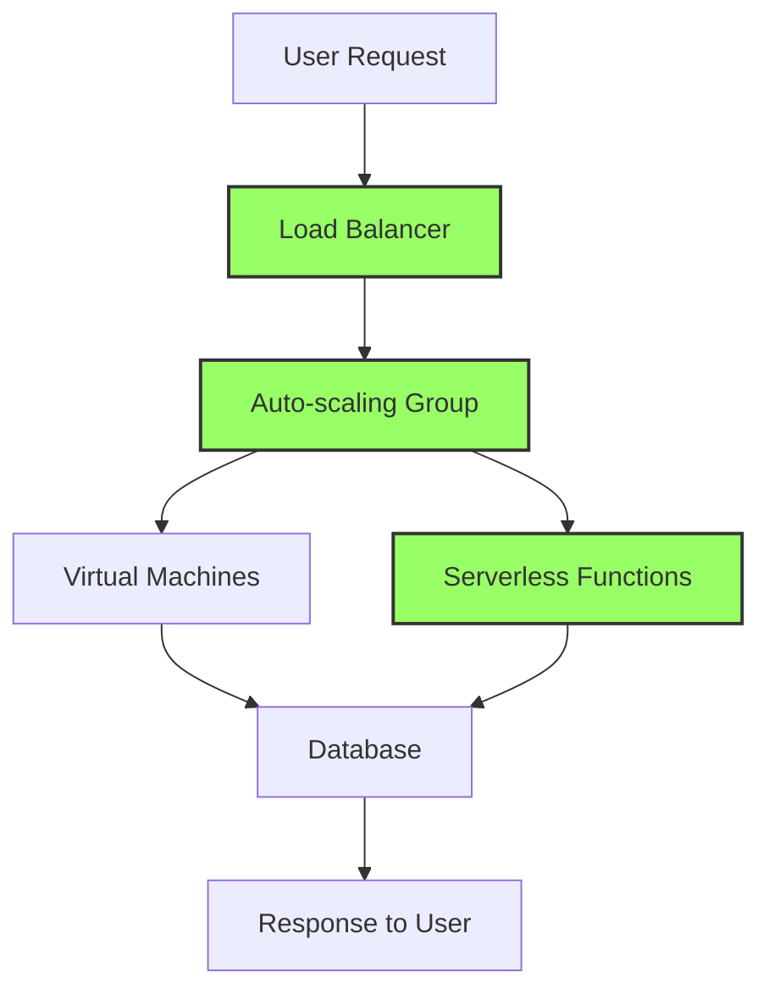

## 26.12.3 Environmental Impact of Software

### Introduction

In the modern era, software development is not only about creating functional and efficient applications but also about considering the broader impact on the environment. As software becomes increasingly integral to our daily lives, its environmental footprint grows. This section delves into the environmental considerations of software development, emphasizing practices that reduce energy consumption and waste. By understanding and implementing these practices, developers can contribute to a more sustainable future.

### The Energy Footprint of Software

#### Understanding Energy Consumption

Software applications, whether running on personal devices or massive data centers, consume energy. This energy consumption translates into a carbon footprint, contributing to global environmental challenges. The energy footprint of software is influenced by several factors, including:

- **Code Efficiency**: Inefficient code can lead to excessive CPU usage, increasing energy consumption.
- **Resource Utilization**: Applications that do not efficiently manage memory and processing power can lead to unnecessary energy use.
- **Server and Data Center Operations**: The infrastructure supporting software applications, such as servers and data centers, significantly impacts energy consumption.

#### Historical Context

The awareness of software's environmental impact has evolved over the years. Initially, the focus was primarily on functionality and performance. However, as the environmental implications of technology became more apparent, the industry began to prioritize energy efficiency and sustainability. This shift is evident in the rise of Green IT initiatives and the development of energy-efficient algorithms and architectures.

### Optimizing Applications for Energy Efficiency

#### Efficient Code Practices

Efficient coding is a fundamental practice for reducing the energy footprint of software. Here are some strategies to consider:

- **Algorithm Optimization**: Choose algorithms that minimize computational complexity. For example, prefer O(n log n) algorithms over O(n^2) when sorting large datasets.
- **Avoiding Redundancy**: Eliminate redundant calculations and data processing to reduce CPU cycles.
- **Memory Management**: Use memory efficiently to avoid excessive garbage collection and memory leaks.

##### Code Example: Optimizing a Sorting Algorithm

```java
import java.util.Arrays;

public class SortingOptimization {
    // Optimized merge sort algorithm
    public static void mergeSort(int[] array) {
        if (array.length < 2) {
            return;
        }
        int mid = array.length / 2;
        int[] left = Arrays.copyOfRange(array, 0, mid);
        int[] right = Arrays.copyOfRange(array, mid, array.length);

        mergeSort(left);
        mergeSort(right);
        merge(array, left, right);
    }

    private static void merge(int[] array, int[] left, int[] right) {
        int i = 0, j = 0, k = 0;
        while (i < left.length && j < right.length) {
            if (left[i] <= right[j]) {
                array[k++] = left[i++];
            } else {
                array[k++] = right[j++];
            }
        }
        while (i < left.length) {
            array[k++] = left[i++];
        }
        while (j < right.length) {
            array[k++] = right[j++];
        }
    }

    public static void main(String[] args) {
        int[] data = {5, 2, 9, 1, 5, 6};
        mergeSort(data);
        System.out.println("Sorted Array: " + Arrays.toString(data));
    }
}
```

**Explanation**: This example demonstrates an optimized merge sort algorithm, which is more efficient than a simple bubble sort, reducing the number of operations and thus energy consumption.

#### Server Utilization and Cloud Computing

Efficient server utilization and cloud computing strategies play a crucial role in minimizing the environmental impact of software:

- **Virtualization**: Use virtualization to maximize server utilization, reducing the need for additional physical servers.
- **Auto-scaling**: Implement auto-scaling to adjust resources based on demand, ensuring that servers are not running at full capacity unnecessarily.
- **Serverless Architectures**: Consider serverless computing to execute code only when needed, reducing idle server time.

##### Diagram: Cloud Computing Efficiency



**Caption**: This diagram illustrates a cloud computing architecture that uses load balancing, auto-scaling, and serverless functions to optimize resource utilization and reduce energy consumption.

### Reducing the Carbon Footprint

#### Awareness and Measurement

To effectively reduce the carbon footprint of software, developers must first be aware of it. Tools and metrics can help measure the energy consumption of applications, providing insights into areas for improvement. Consider the following:

- **Energy Profiling Tools**: Use tools like Intel's VTune Profiler or Java's JMH (Java Microbenchmark Harness) to analyze energy consumption.
- **Carbon Footprint Calculators**: Employ calculators to estimate the carbon emissions associated with software operations.

#### Sustainable Development Practices

Incorporate sustainable practices into the software development lifecycle:

- **Green Coding Standards**: Adopt coding standards that prioritize energy efficiency.
- **Sustainable Design Patterns**: Utilize design patterns that promote resource efficiency, such as the [Flyweight Pattern]( "Flyweight Pattern") for sharing objects.
- **Continuous Monitoring**: Implement continuous monitoring to track energy usage and make real-time adjustments.

### Real-World Applications and Case Studies

#### Case Study: Green Software Engineering at Scale

Consider a large-scale e-commerce platform that implemented energy-efficient practices:

- **Problem**: The platform experienced high energy consumption due to inefficient database queries and server overutilization.
- **Solution**: By optimizing database queries, implementing caching strategies, and using auto-scaling in their cloud infrastructure, the platform reduced its energy consumption by 30%.
- **Outcome**: The company not only lowered its operational costs but also reduced its carbon footprint, aligning with its sustainability goals.

#### Industry Examples

- **Google**: Google has been a pioneer in energy-efficient data centers, using AI to optimize cooling and reduce energy usage.
- **Microsoft**: Microsoft's Azure platform offers tools and services designed to help developers build sustainable applications.

### Encouraging Awareness and Action

#### Educating Developers

Education is key to fostering a culture of sustainability in software development. Encourage developers to:

- **Stay Informed**: Keep up with the latest research and best practices in sustainable software engineering.
- **Participate in Green Initiatives**: Engage in community efforts and initiatives focused on reducing the environmental impact of technology.

#### Organizational Policies

Organizations can support sustainable software development by:

- **Setting Sustainability Goals**: Establish clear goals and metrics for reducing the environmental impact of software.
- **Incentivizing Green Practices**: Offer incentives for teams that successfully implement energy-efficient practices.

### Conclusion

The environmental impact of software is a critical consideration for modern developers and organizations. By adopting efficient coding practices, optimizing server utilization, and leveraging cloud computing strategies, developers can significantly reduce the energy consumption and carbon footprint of their applications. As the industry continues to evolve, embracing sustainability will not only benefit the environment but also enhance the efficiency and cost-effectiveness of software solutions.

### Key Takeaways

- **Efficient Code**: Prioritize algorithm optimization and memory management to reduce energy consumption.
- **Server Utilization**: Use virtualization, auto-scaling, and serverless architectures to optimize resource use.
- **Awareness**: Measure and monitor energy usage to identify areas for improvement.
- **Sustainable Practices**: Incorporate green coding standards and design patterns into the development process.

### Reflection

Consider how you can apply these practices to your own projects. What steps can you take to reduce the environmental impact of your software? How can you encourage your team or organization to prioritize sustainability?

---

## Test Your Knowledge: Environmental Impact of Software Quiz



### Which of the following practices helps reduce the energy consumption of software applications?

- [x] Algorithm optimization
- [ ] Increasing server capacity
- [ ] Using more memory
- [ ] Ignoring code redundancy

> **Explanation:** Algorithm optimization reduces computational complexity, leading to lower energy consumption.

### What is a key benefit of using serverless architectures?

- [x] Reduces idle server time
- [ ] Increases server costs
- [ ] Requires more physical servers
- [ ] Decreases application performance

> **Explanation:** Serverless architectures execute code only when needed, reducing idle server time and energy usage.

### How can developers measure the energy consumption of their applications?

- [x] Using energy profiling tools
- [ ] By estimating manually
- [ ] By increasing server load
- [ ] By reducing application features

> **Explanation:** Energy profiling tools provide insights into the energy consumption of applications, helping identify areas for improvement.

### What is the primary goal of sustainable software development?

- [x] Reducing the environmental impact of software
- [ ] Increasing application complexity
- [ ] Maximizing server usage
- [ ] Minimizing development time

> **Explanation:** Sustainable software development aims to reduce the environmental impact of software through efficient practices.

### Which of the following is an example of a sustainable design pattern?

- [x] Flyweight Pattern
- [ ] Singleton Pattern
- [x] Observer Pattern
- [ ] Factory Pattern

> **Explanation:** The Flyweight Pattern promotes resource efficiency by sharing objects, while the Observer Pattern can reduce unnecessary updates.

### What role does continuous monitoring play in sustainable software development?

- [x] Tracks energy usage for real-time adjustments
- [ ] Increases application complexity
- [ ] Reduces server capacity
- [ ] Eliminates the need for optimization

> **Explanation:** Continuous monitoring helps track energy usage, allowing for real-time adjustments to improve efficiency.

### How can organizations support sustainable software development?

- [x] Setting sustainability goals
- [ ] Ignoring energy consumption
- [x] Incentivizing green practices
- [ ] Increasing server capacity

> **Explanation:** Organizations can support sustainability by setting goals and incentivizing practices that reduce environmental impact.

### What is a common tool used for energy profiling in Java applications?

- [x] Java Microbenchmark Harness (JMH)
- [ ] Java Development Kit (JDK)
- [ ] Java Runtime Environment (JRE)
- [ ] Java Virtual Machine (JVM)

> **Explanation:** JMH is a tool used for benchmarking and profiling Java applications, providing insights into energy consumption.

### Why is it important to eliminate redundant calculations in code?

- [x] To reduce CPU cycles and energy consumption
- [ ] To increase application complexity
- [ ] To maximize server usage
- [ ] To decrease code readability

> **Explanation:** Eliminating redundant calculations reduces CPU cycles, leading to lower energy consumption and improved efficiency.

### True or False: Virtualization reduces the need for additional physical servers.

- [x] True
- [ ] False

> **Explanation:** Virtualization maximizes server utilization, reducing the need for additional physical servers and energy consumption.


