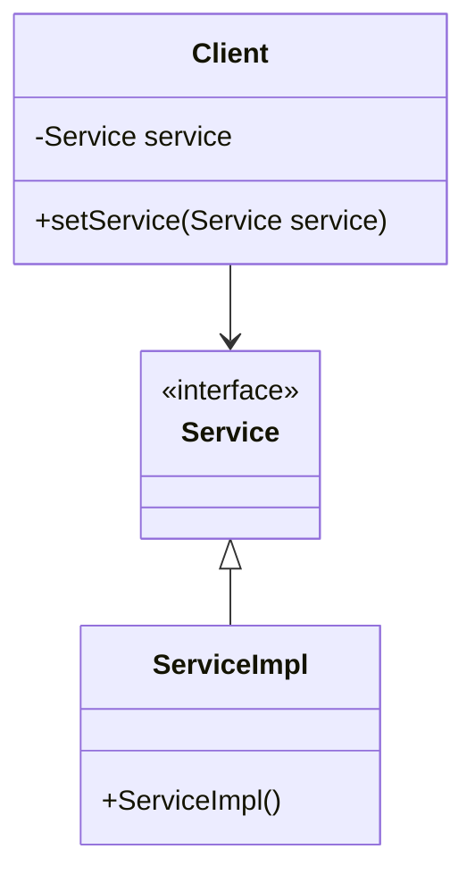
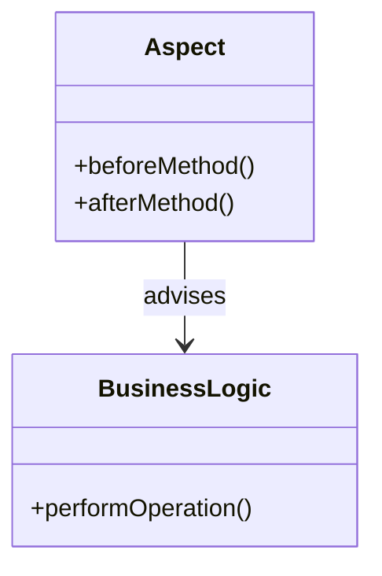
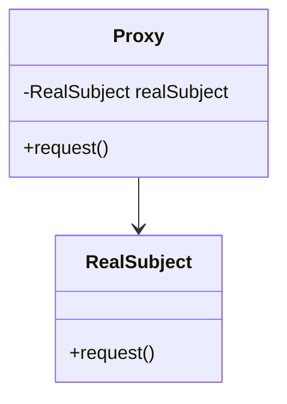
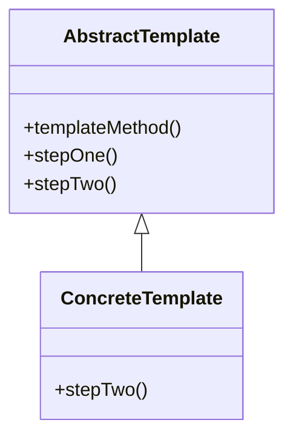
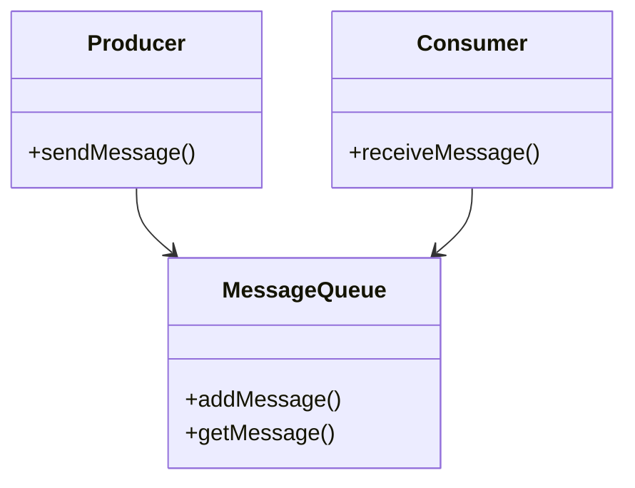
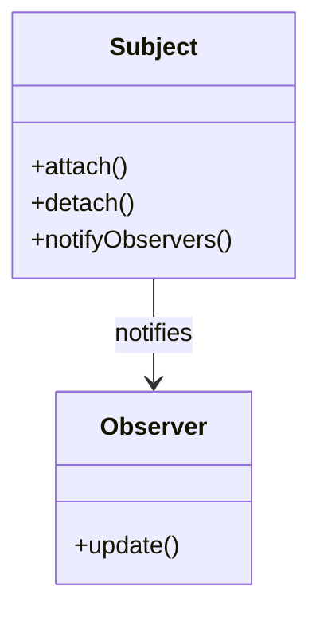

## 27.2 Design Patterns in Popular Java Frameworks

In the realm of Java development, frameworks like Spring, Hibernate, and Apache Kafka are pivotal in building robust and scalable applications. These frameworks leverage design patterns extensively to solve common problems, enhance functionality, and ensure extensibility. Understanding these patterns not only provides insights into the frameworks' internal architectures but also empowers developers to use them more effectively.

### Spring Framework

The Spring Framework is renowned for its comprehensive infrastructure support for developing Java applications. It employs several design patterns to achieve its goals of flexibility and modularity.

#### Dependency Injection (DI) Pattern

**Intent**: The Dependency Injection pattern is a fundamental aspect of the Spring Framework, facilitating loose coupling between components by injecting dependencies at runtime.

**Structure**:



**Explanation**: The diagram illustrates how a `Client` class depends on a `Service` interface, with the actual implementation (`ServiceImpl`) being injected at runtime.

**Implementation**:

```java
public interface Service {
    void execute();
}

public class ServiceImpl implements Service {
    @Override
    public void execute() {
        System.out.println("Executing service...");
    }
}

public class Client {
    private Service service;

    public void setService(Service service) {
        this.service = service;
    }

    public void performTask() {
        service.execute();
    }
}

// Spring configuration using annotations
@Configuration
public class AppConfig {
    @Bean
    public Service service() {
        return new ServiceImpl();
    }

    @Bean
    public Client client() {
        Client client = new Client();
        client.setService(service());
        return client;
    }
}
```

**Explanation**: In this example, the `Client` class is decoupled from the `ServiceImpl` class, allowing for flexibility and easier testing. Spring's DI container manages the creation and injection of dependencies.

#### Aspect-Oriented Programming (AOP) Pattern

**Intent**: AOP in Spring allows for the separation of cross-cutting concerns, such as logging and transaction management, from the business logic.

**Structure**:



**Explanation**: The `Aspect` class contains methods that are executed before and after the `BusinessLogic` operations, without modifying the business logic itself.

**Implementation**:

```java
@Aspect
public class LoggingAspect {
    @Before("execution(* com.example.BusinessLogic.performOperation(..))")
    public void logBefore(JoinPoint joinPoint) {
        System.out.println("Before executing: " + joinPoint.getSignature().getName());
    }

    @After("execution(* com.example.BusinessLogic.performOperation(..))")
    public void logAfter(JoinPoint joinPoint) {
        System.out.println("After executing: " + joinPoint.getSignature().getName());
    }
}

public class BusinessLogic {
    public void performOperation() {
        System.out.println("Performing business logic operation...");
    }
}
```

**Explanation**: The `LoggingAspect` class uses annotations to define advice that runs before and after the `performOperation` method in the `BusinessLogic` class.

### Hibernate

Hibernate is a popular Object-Relational Mapping (ORM) framework that simplifies database interactions in Java applications. It employs several design patterns to achieve its objectives.

#### Proxy Pattern

**Intent**: Hibernate uses the Proxy pattern to implement lazy loading, which defers the loading of an object until it is needed.

**Structure**:



**Explanation**: The `Proxy` class controls access to the `RealSubject` class, loading it only when necessary.

**Implementation**:

```java
@Entity
public class Product {
    @Id
    @GeneratedValue(strategy = GenerationType.IDENTITY)
    private Long id;
    private String name;

    // Getters and setters
}

// Usage in a Hibernate session
Session session = sessionFactory.openSession();
Product product = session.load(Product.class, 1L); // Proxy object
System.out.println(product.getName()); // Triggers loading of the real object
```

**Explanation**: The `session.load` method returns a proxy object, and the actual database query is executed only when `getName` is called.

#### Template Pattern

**Intent**: The Template pattern in Hibernate is used to define the skeleton of an algorithm, deferring some steps to subclasses.

**Structure**:



**Explanation**: The `AbstractTemplate` class defines the `templateMethod`, which calls `stepOne` and `stepTwo`. The `ConcreteTemplate` class provides an implementation for `stepTwo`.

**Implementation**:

```java
public abstract class HibernateTemplate {
    public final void execute() {
        openSession();
        performOperation();
        closeSession();
    }

    protected abstract void performOperation();

    private void openSession() {
        System.out.println("Opening Hibernate session...");
    }

    private void closeSession() {
        System.out.println("Closing Hibernate session...");
    }
}

public class SaveOperation extends HibernateTemplate {
    @Override
    protected void performOperation() {
        System.out.println("Saving entity...");
    }
}
```

**Explanation**: The `HibernateTemplate` class provides a template method `execute`, which calls `performOperation`. The `SaveOperation` class implements `performOperation`.

### Apache Kafka

Apache Kafka is a distributed event streaming platform that uses design patterns to handle high-throughput, fault-tolerant, and scalable messaging.

#### Producer-Consumer Pattern

**Intent**: Kafka employs the Producer-Consumer pattern to decouple the production and consumption of messages.

**Structure**:



**Explanation**: The `Producer` sends messages to the `MessageQueue`, and the `Consumer` retrieves messages from the `MessageQueue`.

**Implementation**:

```java
public class KafkaProducerExample {
    private final KafkaProducer<String, String> producer;

    public KafkaProducerExample(Properties props) {
        this.producer = new KafkaProducer<>(props);
    }

    public void sendMessage(String topic, String key, String value) {
        producer.send(new ProducerRecord<>(topic, key, value));
    }
}

public class KafkaConsumerExample {
    private final KafkaConsumer<String, String> consumer;

    public KafkaConsumerExample(Properties props) {
        this.consumer = new KafkaConsumer<>(props);
    }

    public void receiveMessages(String topic) {
        consumer.subscribe(Collections.singletonList(topic));
        while (true) {
            ConsumerRecords<String, String> records = consumer.poll(Duration.ofMillis(100));
            for (ConsumerRecord<String, String> record : records) {
                System.out.println("Received message: " + record.value());
            }
        }
    }
}
```

**Explanation**: The `KafkaProducerExample` class sends messages to a Kafka topic, while the `KafkaConsumerExample` class retrieves messages from the topic.

#### Observer Pattern

**Intent**: Kafka's topic subscription mechanism is an example of the Observer pattern, where consumers are notified of new messages.

**Structure**:



**Explanation**: The `Subject` class maintains a list of `Observer` objects and notifies them of state changes.

**Implementation**:

```java
public class KafkaTopic {
    private final List<Consumer> consumers = new ArrayList<>();

    public void subscribe(Consumer consumer) {
        consumers.add(consumer);
    }

    public void publishMessage(String message) {
        for (Consumer consumer : consumers) {
            consumer.update(message);
        }
    }
}

public interface Consumer {
    void update(String message);
}

public class ConcreteConsumer implements Consumer {
    @Override
    public void update(String message) {
        System.out.println("Received update: " + message);
    }
}
```

**Explanation**: The `KafkaTopic` class acts as the subject, notifying subscribed `Consumer` objects of new messages.

### Conclusion

Understanding the design patterns employed by popular Java frameworks like Spring, Hibernate, and Apache Kafka provides valuable insights into their architectures. These patterns not only solve common problems but also enhance the frameworks' functionality and extensibility. By mastering these patterns, developers can leverage the full potential of these frameworks, leading to more robust and maintainable applications.

---

## Test Your Knowledge: Design Patterns in Java Frameworks Quiz



### Which design pattern is fundamental to the Spring Framework for managing dependencies?

- [x] Dependency Injection
- [ ] Singleton
- [ ] Factory
- [ ] Observer

> **Explanation:** The Dependency Injection pattern is central to Spring's architecture, allowing for loose coupling and easier management of dependencies.


### What is the primary benefit of using the Proxy pattern in Hibernate?

- [x] Lazy loading of objects
- [ ] Eager loading of objects
- [ ] Simplifying object creation
- [ ] Managing database connections

> **Explanation:** The Proxy pattern in Hibernate is used to implement lazy loading, deferring the loading of an object until it is needed.


### In Spring AOP, what is the purpose of an aspect?

- [x] To encapsulate cross-cutting concerns
- [ ] To manage database transactions
- [ ] To create objects
- [ ] To handle exceptions

> **Explanation:** Aspects in Spring AOP encapsulate cross-cutting concerns like logging and security, separating them from business logic.


### How does the Template pattern benefit Hibernate?

- [x] It defines a skeleton for algorithms, allowing customization of steps.
- [ ] It provides a way to create objects.
- [ ] It manages object persistence.
- [ ] It handles database connections.

> **Explanation:** The Template pattern in Hibernate defines a skeleton for algorithms, allowing subclasses to customize certain steps.


### What role does the Producer-Consumer pattern play in Apache Kafka?

- [x] It decouples message production and consumption.
- [ ] It manages database transactions.
- [ ] It handles object creation.
- [ ] It encapsulates cross-cutting concerns.

> **Explanation:** The Producer-Consumer pattern in Kafka decouples the production and consumption of messages, allowing for scalable and fault-tolerant messaging.


### Which pattern does Kafka use for its topic subscription mechanism?

- [x] Observer
- [ ] Singleton
- [ ] Factory
- [ ] Template

> **Explanation:** Kafka's topic subscription mechanism is an example of the Observer pattern, where consumers are notified of new messages.


### What is a key advantage of using design patterns in frameworks?

- [x] They provide reusable solutions to common problems.
- [ ] They increase code complexity.
- [ ] They reduce code readability.
- [ ] They limit extensibility.

> **Explanation:** Design patterns provide reusable solutions to common problems, enhancing code maintainability and extensibility.


### In the context of design patterns, what does "loose coupling" refer to?

- [x] Reducing dependencies between components
- [ ] Increasing dependencies between components
- [ ] Simplifying object creation
- [ ] Managing database connections

> **Explanation:** Loose coupling refers to reducing dependencies between components, making the system more flexible and easier to maintain.


### How does understanding design patterns help developers?

- [x] It enables them to use frameworks more effectively.
- [ ] It complicates the development process.
- [ ] It limits the use of frameworks.
- [ ] It reduces code quality.

> **Explanation:** Understanding design patterns helps developers use frameworks more effectively by providing insights into their architectures and best practices.


### True or False: The Singleton pattern is commonly used in Apache Kafka.

- [ ] True
- [x] False

> **Explanation:** The Singleton pattern is not commonly used in Apache Kafka, which relies more on patterns like Producer-Consumer and Observer.



---

By exploring the design patterns in popular Java frameworks, developers can gain a deeper understanding of how these frameworks operate and how to best utilize them in their own projects.
