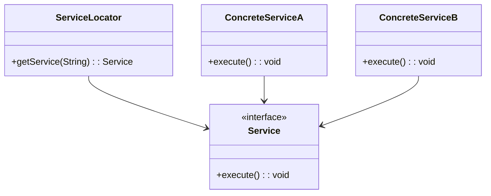
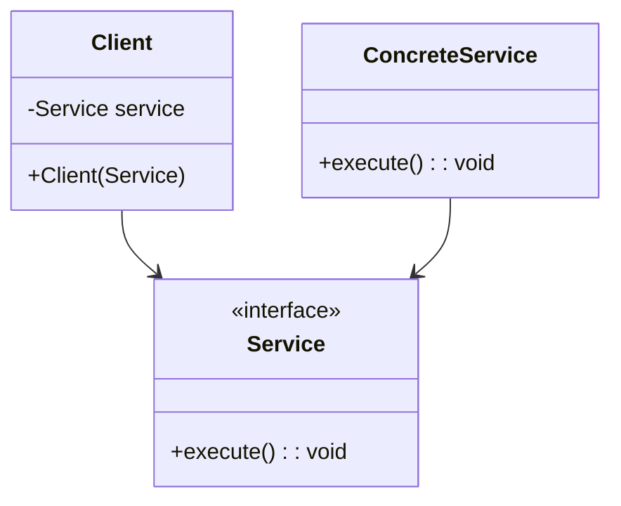
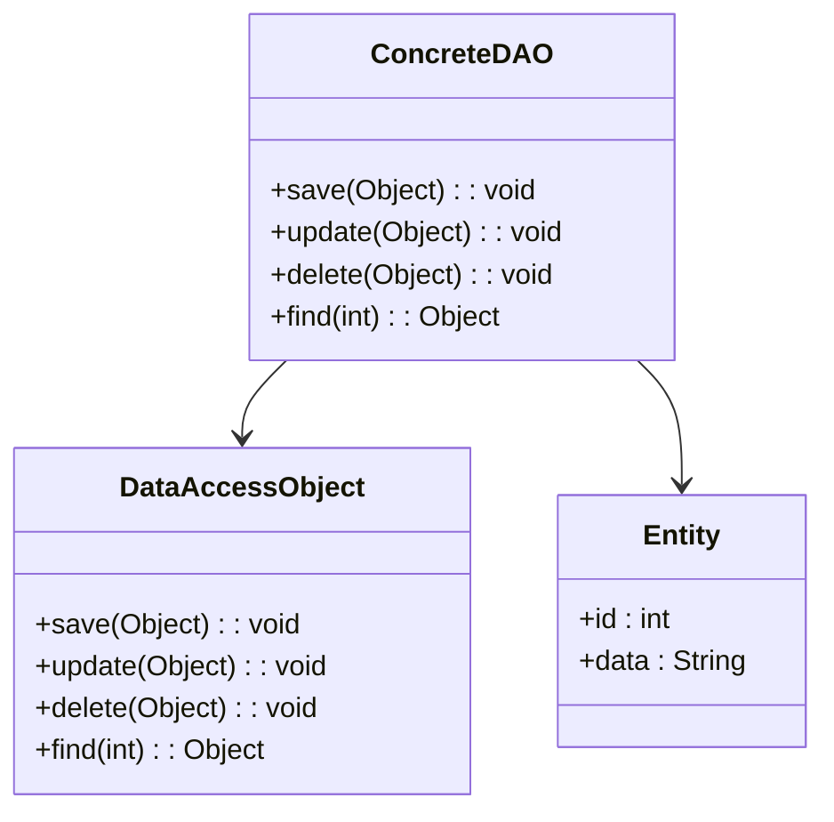

## 27.4 Design Patterns in Enterprise Applications

Enterprise applications are the backbone of many large organizations, providing critical services and functionality that support business operations. These applications often face unique challenges, such as the need for scalability, maintainability, and seamless integration with other systems. Design patterns play a crucial role in addressing these challenges by providing proven solutions to common problems. This section explores the application of design patterns in enterprise Java applications, focusing on patterns like Service Locator, Dependency Injection, and Data Access Object (DAO).

### Understanding Enterprise Application Requirements

Enterprise applications are characterized by their complexity and the need to support a large number of users and transactions. They often require:

- **Scalability**: The ability to handle increased load by adding resources.
- **Maintainability**: Ease of updating and modifying the application without introducing errors.
- **Integration**: Seamless interaction with other systems and services.
- **Security**: Protection of sensitive data and prevention of unauthorized access.
- **Performance**: Fast response times and efficient resource usage.

These requirements necessitate a robust architecture that can adapt to changing business needs and technological advancements.

### Common Design Patterns in Enterprise Applications

#### Service Locator Pattern

- **Category**: Architectural Pattern

##### Intent

- **Description**: The Service Locator pattern is used to decouple service consumers from the concrete implementations of services. It provides a centralized registry where services can be looked up, promoting loose coupling and flexibility.

##### Also Known As

- **Alternate Names**: None

##### Motivation

- **Explanation**: In large applications, managing dependencies between components can become cumbersome. The Service Locator pattern simplifies this by providing a single point of access for service retrieval, reducing the need for direct dependencies.

##### Applicability

- **Guidelines**: Use this pattern when you have multiple services that need to be accessed by various components, and you want to centralize service management.

##### Structure



- **Caption**: The Service Locator pattern structure, showing how services are retrieved through a centralized locator.

##### Participants

- **ServiceLocator**: The central registry that provides access to services.
- **Service**: The interface or abstract class that defines the service contract.
- **ConcreteServiceA, ConcreteServiceB**: Concrete implementations of the service interface.

##### Collaborations

- **Interactions**: The Service Locator provides the requested service to the client, which then uses the service without needing to know its concrete implementation.

##### Consequences

- **Analysis**: This pattern reduces the coupling between clients and services, making it easier to change service implementations. However, it can introduce a single point of failure and may complicate testing.

##### Implementation

- **Implementation Guidelines**: Ensure that the Service Locator is thread-safe and consider caching services to improve performance.

- **Sample Code Snippets**:

```java
// Service interface
public interface Service {
    void execute();
}

// Concrete service implementations
public class ConcreteServiceA implements Service {
    public void execute() {
        System.out.println("Executing Service A");
    }
}

public class ConcreteServiceB implements Service {
    public void execute() {
        System.out.println("Executing Service B");
    }
}

// Service Locator
public class ServiceLocator {
    private static Map<String, Service> services = new HashMap<>();

    static {
        services.put("ServiceA", new ConcreteServiceA());
        services.put("ServiceB", new ConcreteServiceB());
    }

    public static Service getService(String serviceName) {
        return services.get(serviceName);
    }
}

// Client code
public class Client {
    public static void main(String[] args) {
        Service service = ServiceLocator.getService("ServiceA");
        service.execute();
    }
}
```

- **Explanation**: This code demonstrates a simple Service Locator pattern where services are registered in a static block and retrieved by name.

##### Sample Use Cases

- **Real-world Scenarios**: Used in applications where services are dynamically loaded or need to be swapped at runtime.

##### Related Patterns

- **Connections**: Related to the Dependency Injection pattern, which also addresses dependency management but in a different way.

##### Known Uses

- **Examples in Libraries or Frameworks**: Often used in Java EE applications and frameworks like Spring.

#### Dependency Injection Pattern

- **Category**: Creational Pattern

##### Intent

- **Description**: Dependency Injection (DI) is a pattern that allows the creation of dependent objects outside of a class and provides those objects to a class through various means (constructor, setter, or interface injection).

##### Also Known As

- **Alternate Names**: Inversion of Control (IoC)

##### Motivation

- **Explanation**: DI promotes loose coupling by removing the responsibility of instantiating dependencies from the class itself, making the system more modular and testable.

##### Applicability

- **Guidelines**: Use DI when you want to decouple the creation of objects from their usage, especially in large systems where components have complex dependencies.

##### Structure



- **Caption**: The Dependency Injection pattern structure, showing how dependencies are injected into the client.

##### Participants

- **Client**: The class that requires the service.
- **Service**: The interface or abstract class that defines the service contract.
- **ConcreteService**: The concrete implementation of the service interface.

##### Collaborations

- **Interactions**: The client receives the service through injection, allowing it to use the service without knowing its concrete implementation.

##### Consequences

- **Analysis**: DI enhances testability and flexibility but can increase the complexity of configuration and setup.

##### Implementation

- **Implementation Guidelines**: Use frameworks like Spring to manage dependency injection, which provides powerful tools for configuration and lifecycle management.

- **Sample Code Snippets**:

```java
// Service interface
public interface Service {
    void execute();
}

// Concrete service implementation
public class ConcreteService implements Service {
    public void execute() {
        System.out.println("Executing Concrete Service");
    }
}

// Client class
public class Client {
    private Service service;

    // Constructor injection
    public Client(Service service) {
        this.service = service;
    }

    public void doSomething() {
        service.execute();
    }
}

// Main class
public class Main {
    public static void main(String[] args) {
        Service service = new ConcreteService();
        Client client = new Client(service);
        client.doSomething();
    }
}
```

- **Explanation**: This example demonstrates constructor injection, where the service is provided to the client at the time of instantiation.

##### Sample Use Cases

- **Real-world Scenarios**: Widely used in enterprise applications to manage dependencies and configurations.

##### Related Patterns

- **Connections**: Related to the Service Locator pattern but focuses on injecting dependencies rather than looking them up.

##### Known Uses

- **Examples in Libraries or Frameworks**: Core to frameworks like Spring and Google Guice.

#### Data Access Object (DAO) Pattern

- **Category**: Structural Pattern

##### Intent

- **Description**: The DAO pattern abstracts and encapsulates all access to the data source, providing a clean separation between business logic and data access code.

##### Also Known As

- **Alternate Names**: None

##### Motivation

- **Explanation**: By separating data access logic from business logic, the DAO pattern promotes maintainability and scalability, allowing changes to the data source without affecting business logic.

##### Applicability

- **Guidelines**: Use this pattern when you need to interact with a data source and want to isolate data access logic from the rest of the application.

##### Structure



- **Caption**: The DAO pattern structure, showing how data access is abstracted through a DAO interface.

##### Participants

- **DataAccessObject**: The interface that defines the data access operations.
- **ConcreteDAO**: The concrete implementation of the DAO interface.
- **Entity**: The data object that represents the data model.

##### Collaborations

- **Interactions**: The business logic interacts with the DAO to perform CRUD operations on the data source.

##### Consequences

- **Analysis**: The DAO pattern improves maintainability and testability but can introduce additional layers of abstraction.

##### Implementation

- **Implementation Guidelines**: Use ORM frameworks like Hibernate to simplify DAO implementation and manage database interactions.

- **Sample Code Snippets**:

```java
// Entity class
public class Entity {
    private int id;
    private String data;

    // Getters and setters
}

// DAO interface
public interface DataAccessObject {
    void save(Entity entity);
    void update(Entity entity);
    void delete(Entity entity);
    Entity find(int id);
}

// Concrete DAO implementation
public class ConcreteDAO implements DataAccessObject {
    public void save(Entity entity) {
        // Implementation for saving entity
    }

    public void update(Entity entity) {
        // Implementation for updating entity
    }

    public void delete(Entity entity) {
        // Implementation for deleting entity
    }

    public Entity find(int id) {
        // Implementation for finding entity
        return new Entity(); // Placeholder return
    }
}
```

- **Explanation**: This example shows a basic DAO implementation for managing `Entity` objects, with methods for CRUD operations.

##### Sample Use Cases

- **Real-world Scenarios**: Used in applications that require interaction with databases or other persistent storage systems.

##### Related Patterns

- **Connections**: Often used in conjunction with the Repository pattern to provide a higher level of abstraction.

##### Known Uses

- **Examples in Libraries or Frameworks**: Commonly used in Java EE applications and frameworks like Spring Data.

### Case Studies and Real-World Applications

#### Case Study 1: Improving Scalability with Service Locator

In a large e-commerce platform, the Service Locator pattern was implemented to manage various services such as payment processing, inventory management, and user authentication. By centralizing service access, the platform was able to scale efficiently, adding new services without disrupting existing functionality. This approach also facilitated the integration of third-party services, enhancing the platform's capabilities.

#### Case Study 2: Enhancing Maintainability with Dependency Injection

A financial services company adopted Dependency Injection to manage the complex dependencies in their trading application. By using Spring's DI framework, they were able to decouple components, making the system more modular and easier to maintain. This change significantly reduced the time required for updates and allowed for more flexible testing strategies.

#### Case Study 3: Streamlining Data Access with DAO

A healthcare provider implemented the DAO pattern to manage patient records and other critical data. By abstracting data access logic, they were able to switch from a legacy database system to a modern NoSQL solution without affecting the business logic. This transition improved data retrieval performance and enabled more sophisticated data analytics.

### The Importance of Architectural Patterns

In enterprise applications, architectural patterns provide a blueprint for system design, ensuring that the application can meet its requirements effectively. Patterns like Microservices, Event-Driven Architecture, and Layered Architecture are essential for building scalable, maintainable, and robust systems. They help manage complexity by defining clear boundaries and responsibilities, promoting best practices in software design.

### Conclusion

Design patterns are invaluable tools for addressing the challenges of enterprise application development. By understanding and applying patterns like Service Locator, Dependency Injection, and DAO, developers can create systems that are scalable, maintainable, and easy to integrate. These patterns not only solve common problems but also promote best practices, leading to more robust and efficient applications.

---

## Test Your Knowledge: Enterprise Java Design Patterns Quiz



### Which pattern provides a centralized registry for service lookup?

- [x] Service Locator
- [ ] Dependency Injection
- [ ] Data Access Object
- [ ] Singleton

> **Explanation:** The Service Locator pattern provides a centralized registry where services can be looked up, promoting loose coupling and flexibility.

### What is the primary benefit of Dependency Injection?

- [x] It promotes loose coupling by removing the responsibility of instantiating dependencies from the class itself.
- [ ] It provides a centralized registry for services.
- [ ] It abstracts and encapsulates data access.
- [ ] It improves database performance.

> **Explanation:** Dependency Injection promotes loose coupling by decoupling the creation of objects from their usage, making the system more modular and testable.

### In which scenario is the DAO pattern most applicable?

- [x] When you need to interact with a data source and want to isolate data access logic from the rest of the application.
- [ ] When you need to manage dependencies between components.
- [ ] When you need to provide a centralized registry for services.
- [ ] When you need to improve application security.

> **Explanation:** The DAO pattern is used to abstract and encapsulate all access to the data source, providing a clean separation between business logic and data access code.

### Which pattern is often used in conjunction with the Repository pattern?

- [x] Data Access Object
- [ ] Service Locator
- [ ] Dependency Injection
- [ ] Singleton

> **Explanation:** The DAO pattern is often used in conjunction with the Repository pattern to provide a higher level of abstraction for data access.

### What is a common drawback of the Service Locator pattern?

- [x] It can introduce a single point of failure.
- [ ] It increases the complexity of configuration.
- [ ] It tightly couples components.
- [ ] It reduces testability.

> **Explanation:** The Service Locator pattern can introduce a single point of failure and may complicate testing due to its centralized nature.

### Which pattern is core to frameworks like Spring?

- [x] Dependency Injection
- [ ] Service Locator
- [ ] Data Access Object
- [ ] Singleton

> **Explanation:** Dependency Injection is core to frameworks like Spring, which provide powerful tools for configuration and lifecycle management.

### What is the primary focus of the Dependency Injection pattern?

- [x] Injecting dependencies into a class rather than creating them within the class.
- [ ] Providing a centralized registry for services.
- [ ] Abstracting data access logic.
- [ ] Improving application security.

> **Explanation:** Dependency Injection focuses on injecting dependencies into a class, promoting loose coupling and enhancing testability.

### Which pattern is used to manage dependencies between components in a large application?

- [x] Service Locator
- [ ] Dependency Injection
- [ ] Data Access Object
- [ ] Singleton

> **Explanation:** The Service Locator pattern is used to manage dependencies between components by providing a centralized registry for service retrieval.

### What is a key advantage of using the DAO pattern?

- [x] It promotes maintainability by separating data access logic from business logic.
- [ ] It provides a centralized registry for services.
- [ ] It enhances testability by injecting dependencies.
- [ ] It improves application security.

> **Explanation:** The DAO pattern promotes maintainability by abstracting and encapsulating data access, allowing changes to the data source without affecting business logic.

### True or False: The Service Locator pattern is related to Dependency Injection but focuses on injecting dependencies rather than looking them up.

- [ ] True
- [x] False

> **Explanation:** The Service Locator pattern focuses on looking up services through a centralized registry, while Dependency Injection focuses on injecting dependencies into a class.



---
