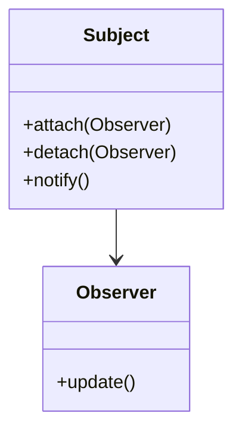
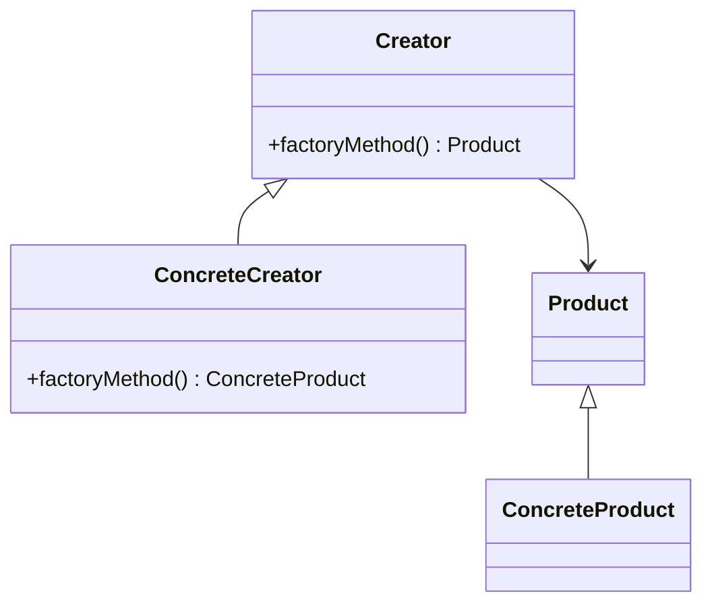
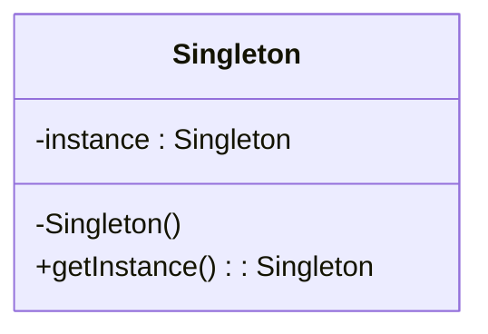

## 27.5 Integrating Multiple Patterns

In the realm of software design, integrating multiple design patterns within a single application is a sophisticated approach that addresses complex design challenges. This section delves into the practical integration of patterns such as Observer, Factory, and Singleton, illustrating their interactions and dependencies. By understanding how these patterns can work together, developers can create robust, maintainable, and efficient Java applications.

### Example Scenario: A Real-Time Stock Monitoring System

Consider a real-time stock monitoring system that requires the integration of multiple design patterns to handle various functionalities. The system needs to:

- Continuously receive stock price updates from a data feed.
- Notify multiple clients (e.g., desktop applications, mobile apps) about price changes.
- Manage different types of stock data sources (e.g., API, database).
- Ensure a single instance of the data feed manager is used throughout the application.

To address these requirements, we can integrate the Observer, Factory, and Singleton patterns.

### Observer Pattern

#### Intent

The **Observer Pattern** is used to create a subscription mechanism to allow multiple objects to listen and react to events or changes in another object.

#### Applicability

- Use when changes to one object require changes to others.
- Suitable for implementing distributed event-handling systems.

#### Structure



**Caption**: The Observer pattern structure showing the relationship between Subject and Observer.

#### Implementation

In our stock monitoring system, the Observer pattern can be used to notify clients about stock price updates.

```java
// Observer interface
interface StockObserver {
    void update(String stockSymbol, double price);
}

// Concrete Observer
class StockClient implements StockObserver {
    private String clientName;

    public StockClient(String clientName) {
        this.clientName = clientName;
    }

    @Override
    public void update(String stockSymbol, double price) {
        System.out.println(clientName + " received update: " + stockSymbol + " is now $" + price);
    }
}

// Subject interface
interface StockSubject {
    void attach(StockObserver observer);
    void detach(StockObserver observer);
    void notifyObservers();
}

// Concrete Subject
class StockData implements StockSubject {
    private Map<String, Double> stockPrices = new HashMap<>();
    private List<StockObserver> observers = new ArrayList<>();

    @Override
    public void attach(StockObserver observer) {
        observers.add(observer);
    }

    @Override
    public void detach(StockObserver observer) {
        observers.remove(observer);
    }

    @Override
    public void notifyObservers() {
        for (StockObserver observer : observers) {
            for (Map.Entry<String, Double> entry : stockPrices.entrySet()) {
                observer.update(entry.getKey(), entry.getValue());
            }
        }
    }

    public void setStockPrice(String stockSymbol, double price) {
        stockPrices.put(stockSymbol, price);
        notifyObservers();
    }
}
```

### Factory Pattern

#### Intent

The **Factory Pattern** provides an interface for creating objects in a superclass but allows subclasses to alter the type of objects that will be created.

#### Applicability

- Use when a class cannot anticipate the class of objects it must create.
- Suitable for managing and maintaining a group of related objects.

#### Structure



**Caption**: The Factory pattern structure showing the relationship between Creator and Product.

#### Implementation

In our system, the Factory pattern can be used to manage different types of stock data sources.

```java
// Product interface
interface StockDataSource {
    void connect();
}

// Concrete Products
class APIStockDataSource implements StockDataSource {
    @Override
    public void connect() {
        System.out.println("Connecting to API stock data source...");
    }
}

class DatabaseStockDataSource implements StockDataSource {
    @Override
    public void connect() {
        System.out.println("Connecting to Database stock data source...");
    }
}

// Creator
abstract class StockDataSourceFactory {
    abstract StockDataSource createDataSource();
}

// Concrete Creators
class APIStockDataSourceFactory extends StockDataSourceFactory {
    @Override
    StockDataSource createDataSource() {
        return new APIStockDataSource();
    }
}

class DatabaseStockDataSourceFactory extends StockDataSourceFactory {
    @Override
    StockDataSource createDataSource() {
        return new DatabaseStockDataSource();
    }
}
```

### Singleton Pattern

#### Intent

The **Singleton Pattern** ensures a class has only one instance and provides a global point of access to it.

#### Applicability

- Use when exactly one instance of a class is needed.
- Suitable for managing shared resources or configurations.

#### Structure



**Caption**: The Singleton pattern structure showing the single instance management.

#### Implementation

In our system, the Singleton pattern can be used to ensure a single instance of the data feed manager.

```java
// Singleton class
class DataFeedManager {
    private static DataFeedManager instance;

    private DataFeedManager() {
        // Private constructor to prevent instantiation
    }

    public static synchronized DataFeedManager getInstance() {
        if (instance == null) {
            instance = new DataFeedManager();
        }
        return instance;
    }

    public void startFeed() {
        System.out.println("Starting data feed...");
    }
}
```

### Integrating the Patterns

#### Interactions and Dependencies

- **Observer and Singleton**: The `StockData` class (Subject) can be managed by a Singleton to ensure a single source of truth for stock prices.
- **Factory and Singleton**: The `StockDataSourceFactory` can be used to create different data sources, while the Singleton ensures that the data feed manager coordinates these sources.
- **Observer and Factory**: The `StockClient` (Observer) can be dynamically created using a Factory, allowing for flexible client management.

#### Code Integration

```java
public class StockMonitoringSystem {
    public static void main(String[] args) {
        // Singleton instance of DataFeedManager
        DataFeedManager dataFeedManager = DataFeedManager.getInstance();
        dataFeedManager.startFeed();

        // Factory to create data sources
        StockDataSourceFactory apiFactory = new APIStockDataSourceFactory();
        StockDataSource apiSource = apiFactory.createDataSource();
        apiSource.connect();

        StockDataSourceFactory dbFactory = new DatabaseStockDataSourceFactory();
        StockDataSource dbSource = dbFactory.createDataSource();
        dbSource.connect();

        // Observer pattern to notify clients
        StockData stockData = new StockData();
        StockClient client1 = new StockClient("Client 1");
        StockClient client2 = new StockClient("Client 2");

        stockData.attach(client1);
        stockData.attach(client2);

        // Simulate stock price updates
        stockData.setStockPrice("AAPL", 150.00);
        stockData.setStockPrice("GOOGL", 2800.00);
    }
}
```

### Benefits and Potential Issues

#### Benefits

- **Modularity**: Each pattern addresses a specific concern, making the system modular and easier to maintain.
- **Scalability**: New data sources or clients can be added with minimal changes.
- **Reusability**: Patterns can be reused across different parts of the application or in other projects.

#### Potential Issues

- **Complexity**: Integrating multiple patterns can increase the complexity of the system, making it harder to understand and maintain.
- **Overhead**: Each pattern introduces its own overhead, which can impact performance if not managed carefully.

### Best Practices

- **Evaluate Necessity**: Ensure that each pattern is necessary and adds value to the system.
- **Document Interactions**: Clearly document how patterns interact to aid future maintenance.
- **Test Thoroughly**: Comprehensive testing is crucial to ensure that the integrated patterns work seamlessly together.

### Conclusion

Integrating multiple design patterns in a Java application is a powerful technique for solving complex design challenges. By carefully considering the interactions and dependencies between patterns like Observer, Factory, and Singleton, developers can create systems that are both flexible and robust. However, it's essential to balance the benefits with the potential complexity to avoid overcomplicating the design.

### Exercises

1. Modify the stock monitoring system to include a new type of stock data source using the Factory pattern.
2. Implement a new Observer that logs stock price changes to a file.
3. Refactor the Singleton implementation to use a double-checked locking mechanism for thread safety.

### Reflection

Consider how the integration of these patterns might apply to your current projects. What challenges could be addressed by combining multiple patterns? How can you ensure that the integration remains manageable and maintainable?

## Test Your Knowledge: Integrating Design Patterns Quiz



### Which pattern is best suited for ensuring a single instance of a class?

- [x] Singleton Pattern
- [ ] Observer Pattern
- [ ] Factory Pattern
- [ ] Strategy Pattern

> **Explanation:** The Singleton Pattern ensures that a class has only one instance and provides a global point of access to it.

### What is the primary role of the Observer pattern?

- [x] To notify multiple objects about changes in another object
- [ ] To create objects without specifying the exact class
- [ ] To ensure a class has only one instance
- [ ] To define a family of algorithms

> **Explanation:** The Observer Pattern is used to create a subscription mechanism to allow multiple objects to listen and react to events or changes in another object.

### How does the Factory pattern benefit object creation?

- [x] It provides an interface for creating objects, allowing subclasses to alter the type of objects created.
- [ ] It ensures a single instance of a class.
- [ ] It notifies multiple objects about changes.
- [ ] It defines a family of algorithms.

> **Explanation:** The Factory Pattern provides an interface for creating objects in a superclass but allows subclasses to alter the type of objects that will be created.

### What is a potential drawback of integrating multiple patterns?

- [x] Increased complexity
- [ ] Reduced modularity
- [ ] Decreased scalability
- [ ] Limited reusability

> **Explanation:** Integrating multiple patterns can increase the complexity of the system, making it harder to understand and maintain.

### Which patterns are integrated in the stock monitoring system example?

- [x] Observer, Factory, Singleton
- [ ] Observer, Strategy, Singleton
- [ ] Factory, Strategy, Singleton
- [ ] Observer, Factory, Strategy

> **Explanation:** The stock monitoring system example integrates the Observer, Factory, and Singleton patterns.

### How can the Factory pattern be used with the Observer pattern?

- [x] To dynamically create observers
- [ ] To ensure a single instance of observers
- [ ] To notify observers about changes
- [ ] To define a family of observer algorithms

> **Explanation:** The Factory Pattern can be used to dynamically create observers, allowing for flexible client management.

### What is a key benefit of using the Singleton pattern in the stock monitoring system?

- [x] It ensures a single instance of the data feed manager.
- [ ] It notifies clients about stock price updates.
- [ ] It creates different types of stock data sources.
- [ ] It defines a family of data feed algorithms.

> **Explanation:** The Singleton Pattern ensures a single instance of the data feed manager, providing a global point of access.

### What should be considered when integrating multiple patterns?

- [x] The necessity and value each pattern adds
- [ ] The number of patterns used
- [ ] The speed of implementation
- [ ] The number of classes involved

> **Explanation:** It's essential to ensure that each pattern is necessary and adds value to the system to avoid overcomplicating the design.

### How can complexity be managed when integrating multiple patterns?

- [x] By documenting interactions and testing thoroughly
- [ ] By using as many patterns as possible
- [ ] By minimizing the number of classes
- [ ] By avoiding documentation

> **Explanation:** Clearly documenting how patterns interact and conducting comprehensive testing are crucial to managing complexity.

### True or False: The Observer pattern can be used to manage shared resources.

- [ ] True
- [x] False

> **Explanation:** The Observer Pattern is used for event handling and notifying multiple objects about changes, not for managing shared resources.


