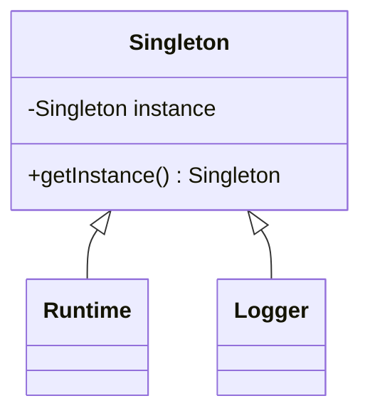

## 28.1 Singleton Pattern in `Runtime` and `Logger`

### Introduction to the Singleton Pattern

The Singleton pattern is a creational design pattern that ensures a class has only one instance and provides a global point of access to it. This pattern is particularly useful when exactly one object is needed to coordinate actions across the system. In Java, the Singleton pattern is often used in scenarios where a single instance is required to control access to resources or to maintain a consistent state across the application.

### Intent

- **Description**: The Singleton pattern restricts the instantiation of a class to one "single" instance. This is useful when exactly one object is needed to coordinate actions across the system.

### Also Known As

- **Alternate Names**: Single Instance

### Motivation

The Singleton pattern is crucial in scenarios where a single instance of a class must control access to resources or maintain a consistent state across an application. For example, in a logging framework, a single logger instance can manage log entries from various parts of an application, ensuring consistency and preventing conflicts.

### Applicability

- **Guidelines**: Use the Singleton pattern when:
  - There must be exactly one instance of a class, and it must be accessible to clients from a well-known access point.
  - The sole instance should be extensible by subclassing, and clients should be able to use an extended instance without modifying their code.

### Structure



- **Caption**: The diagram illustrates the Singleton pattern structure, showing the Singleton class with a private instance and a public method to access it.

### Participants

- **Singleton**: Declares a static method for getting the instance of the Singleton class.
- **Runtime**: A concrete implementation of the Singleton pattern in Java's standard library.
- **Logger**: Another implementation of the Singleton pattern, often used in logging frameworks.

### Collaborations

- **Interactions**: The Singleton class provides a static method that returns the same instance of the class to all clients. Both `Runtime` and `Logger` classes utilize this pattern to ensure a single instance is used throughout the application.

### Consequences

- **Analysis**: 
  - **Benefits**: 
    - Controlled access to the sole instance.
    - Reduced namespace pollution.
    - Permits refinement of operations and representation.
    - Allows a variable number of instances.
  - **Drawbacks**:
    - Can be difficult to test due to the global state.
    - May introduce hidden dependencies between classes.
    - Can lead to issues in multithreaded environments if not implemented correctly.

### Implementation in Java's `Runtime` Class

The `Runtime` class in Java is a classic example of the Singleton pattern. It provides a single instance that represents the runtime environment of the Java application.

#### Accessing the Singleton Instance

The `Runtime` class provides a static method `getRuntime()` to access the singleton instance.

```java
public class SingletonExample {
    public static void main(String[] args) {
        // Access the singleton instance of Runtime
        Runtime runtime = Runtime.getRuntime();
        
        // Example usage of the Runtime instance
        System.out.println("Available processors: " + runtime.availableProcessors());
        System.out.println("Free memory: " + runtime.freeMemory());
    }
}
```

- **Explanation**: The `getRuntime()` method returns the singleton instance of the `Runtime` class. This instance can be used to interact with the Java runtime environment, such as querying available processors or memory.

### Implementation in Logging Frameworks

The `java.util.logging.Logger` class is another example where the Singleton pattern is applied. Loggers are typically accessed through static methods that ensure a single instance is used for logging purposes.

#### Accessing Logger Instances

Loggers are accessed using the `Logger.getLogger(String name)` method, which returns a singleton instance associated with the specified name.

```java
import java.util.logging.Logger;

public class LoggerExample {
    private static final Logger logger = Logger.getLogger(LoggerExample.class.getName());

    public static void main(String[] args) {
        // Log a message using the singleton Logger instance
        logger.info("This is an info message.");
    }
}
```

- **Explanation**: The `getLogger()` method returns a singleton instance of the `Logger` class. This instance is used to log messages, ensuring consistency across the application.

### Advantages and Potential Issues

#### Advantages

- **Consistency**: Ensures that a single instance is used across the application, maintaining a consistent state.
- **Resource Management**: Simplifies resource management by providing a single point of access to shared resources.

#### Potential Issues

- **Testing Challenges**: Singletons can introduce global state, making unit testing difficult.
- **Hidden Dependencies**: May lead to hidden dependencies between classes, complicating maintenance.
- **Thread Safety**: In multithreaded environments, care must be taken to ensure thread safety.

### Best Practices for Implementing Singletons

- **Lazy Initialization**: Use lazy initialization to delay the creation of the singleton instance until it is needed.
- **Thread Safety**: Ensure thread safety by using synchronized methods or blocks, or by using the `volatile` keyword.
- **Avoid Reflection**: Prevent reflection from breaking the singleton pattern by throwing exceptions in constructors.
- **Consider Alternatives**: Evaluate alternatives such as dependency injection, which can reduce the need for singletons.

### Alternatives and Modern Considerations

With modern Java features and frameworks, the need for singletons can often be reduced. Dependency injection frameworks like Spring provide mechanisms to manage object lifecycles, reducing the need for singletons.

- **Dependency Injection**: Allows for more flexible and testable code by managing dependencies externally.
- **Service Locator Pattern**: Provides a centralized registry for locating services, which can be an alternative to singletons.

### Sample Use Cases

- **Runtime Environment**: Managing the runtime environment of a Java application.
- **Logging**: Providing a consistent logging mechanism across an application.

### Related Patterns

- **Factory Method**: Often used in conjunction with the Singleton pattern to create the singleton instance.
- **Service Locator**: Can be used as an alternative to the Singleton pattern for managing service instances.

### Known Uses

- **Java Standard Library**: The `Runtime` and `Logger` classes are well-known implementations of the Singleton pattern.
- **Logging Frameworks**: Many logging frameworks use the Singleton pattern to manage logger instances.

### Conclusion

The Singleton pattern is a powerful tool in the Java developer's toolkit, providing a way to ensure a single instance of a class is used throughout an application. While it offers many benefits, it also comes with potential pitfalls that must be carefully managed. By understanding the implementation and best practices, developers can effectively leverage the Singleton pattern in their applications.

## Test Your Knowledge: Singleton Pattern in Java Quiz



### What is the primary purpose of the Singleton pattern?

- [x] To ensure a class has only one instance and provide a global point of access to it.
- [ ] To create multiple instances of a class.
- [ ] To hide the implementation details of a class.
- [ ] To provide a way to create objects without specifying the exact class.

> **Explanation:** The Singleton pattern ensures that a class has only one instance and provides a global point of access to it.

### How is the Singleton pattern implemented in the `Runtime` class?

- [x] Using the `getRuntime()` method to provide access to the singleton instance.
- [ ] By creating multiple instances of the `Runtime` class.
- [ ] By using a public constructor.
- [ ] By using a private static method.

> **Explanation:** The `Runtime` class uses the `getRuntime()` method to provide access to its singleton instance.

### Why are Singleton instances beneficial in logging frameworks?

- [x] They ensure consistency and prevent conflicts by using a single logger instance.
- [ ] They allow multiple loggers to be created.
- [ ] They hide the implementation details of logging.
- [ ] They provide a way to create loggers without specifying the exact class.

> **Explanation:** Singleton instances ensure consistency and prevent conflicts by using a single logger instance across the application.

### What is a potential drawback of using the Singleton pattern?

- [x] It can introduce hidden dependencies between classes.
- [ ] It allows multiple instances of a class.
- [ ] It simplifies testing.
- [ ] It reduces namespace pollution.

> **Explanation:** The Singleton pattern can introduce hidden dependencies between classes, complicating maintenance.

### What is a best practice for implementing Singletons in Java?

- [x] Use lazy initialization and ensure thread safety.
- [ ] Use eager initialization and avoid thread safety.
- [ ] Use public constructors.
- [ ] Use multiple instances for flexibility.

> **Explanation:** Using lazy initialization and ensuring thread safety are best practices for implementing Singletons in Java.

### How can dependency injection reduce the need for Singletons?

- [x] By managing object lifecycles externally, allowing for more flexible and testable code.
- [ ] By creating multiple instances of a class.
- [ ] By hiding the implementation details of a class.
- [ ] By providing a way to create objects without specifying the exact class.

> **Explanation:** Dependency injection manages object lifecycles externally, reducing the need for Singletons and allowing for more flexible and testable code.

### What is a common use case for the Singleton pattern?

- [x] Managing the runtime environment of a Java application.
- [ ] Creating multiple instances of a class.
- [ ] Hiding the implementation details of a class.
- [ ] Providing a way to create objects without specifying the exact class.

> **Explanation:** A common use case for the Singleton pattern is managing the runtime environment of a Java application.

### What is an alternative to the Singleton pattern for managing service instances?

- [x] Service Locator Pattern
- [ ] Factory Method Pattern
- [ ] Observer Pattern
- [ ] Strategy Pattern

> **Explanation:** The Service Locator Pattern is an alternative to the Singleton pattern for managing service instances.

### Which Java feature can help ensure thread safety in Singleton implementations?

- [x] The `volatile` keyword
- [ ] The `transient` keyword
- [ ] The `synchronized` keyword
- [ ] The `final` keyword

> **Explanation:** The `volatile` keyword can help ensure thread safety in Singleton implementations by preventing instruction reordering.

### True or False: The Singleton pattern is always the best choice for managing shared resources.

- [ ] True
- [x] False

> **Explanation:** The Singleton pattern is not always the best choice for managing shared resources, as it can introduce hidden dependencies and complicate testing.


