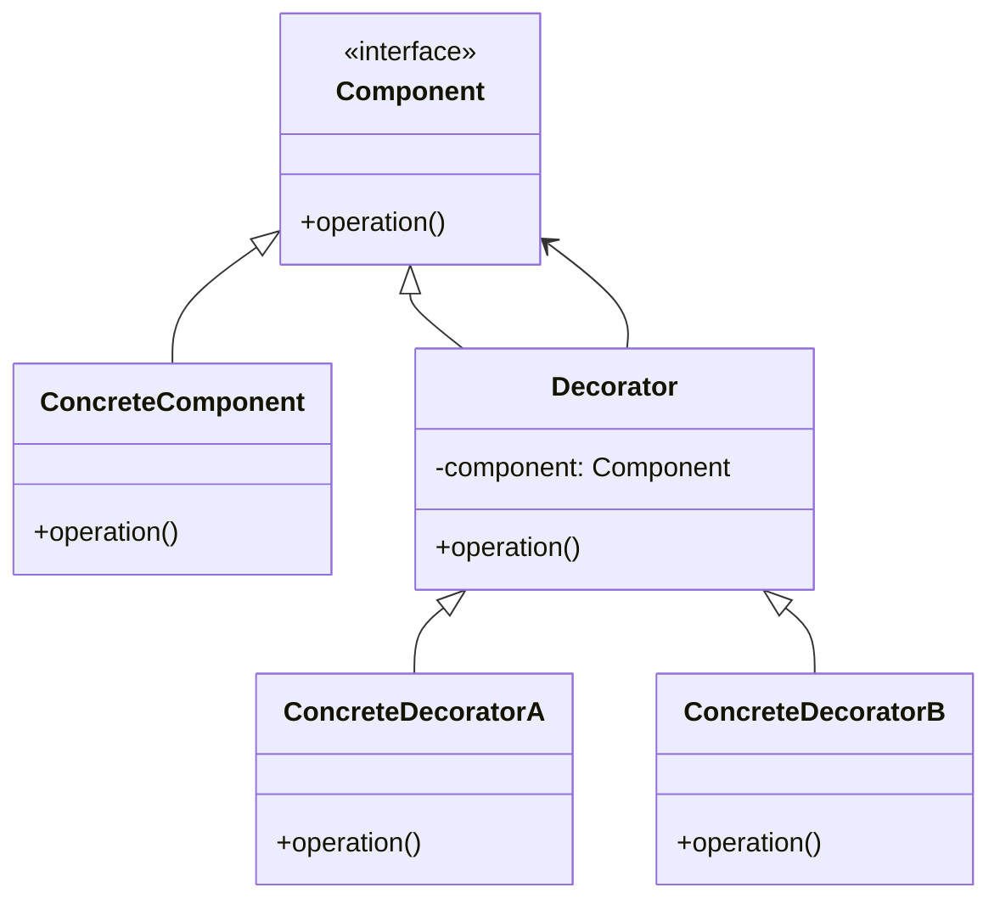

## 28.2 Decorator Pattern in I/O Streams

### Introduction

The **Decorator Pattern** is a structural design pattern that allows behavior to be added to individual objects, dynamically, without affecting the behavior of other objects from the same class. It provides a flexible alternative to subclassing for extending functionality. In Java, this pattern is prominently used in the I/O streams library, which includes classes like `InputStream`, `OutputStream`, `Reader`, and `Writer`. This section explores how the Decorator pattern is employed in Java's I/O streams, illustrating its practical applications and benefits.

### Intent of the Decorator Pattern

The primary intent of the Decorator pattern is to attach additional responsibilities to an object dynamically. Decorators provide a flexible alternative to subclassing for extending functionality. This pattern is particularly useful when you want to add features to objects without altering their structure or creating a complex hierarchy of subclasses.

### Structure of the Decorator Pattern

The Decorator pattern typically involves the following components:

- **Component**: An interface or abstract class defining the methods that will be implemented by concrete components and decorators.
- **ConcreteComponent**: A class that implements the Component interface. This is the object to which additional responsibilities can be attached.
- **Decorator**: An abstract class that implements the Component interface and contains a reference to a Component object. It delegates all operations to the component it decorates.
- **ConcreteDecorator**: A class that extends the Decorator class and adds responsibilities to the component.



*Diagram: The structure of the Decorator pattern, showing the relationships between components and decorators.*

### Decorator Pattern in Java I/O Streams

Java's I/O streams library is a classic example of the Decorator pattern in action. The `InputStream` and `OutputStream` classes, along with their subclasses, are designed to be decorated with additional functionality. This design allows developers to mix and match different functionalities by wrapping streams with decorators.

#### Wrapping Streams to Add Behavior

Consider the following example of using decorators in Java's I/O streams:

```java
import java.io.*;

public class DecoratorExample {
    public static void main(String[] args) {
        try {
            // Create a FileInputStream to read from a file
            FileInputStream fileInputStream = new FileInputStream("example.txt");

            // Wrap the FileInputStream with a BufferedInputStream for buffering
            BufferedInputStream bufferedInputStream = new BufferedInputStream(fileInputStream);

            // Wrap the BufferedInputStream with a DataInputStream for data conversion
            DataInputStream dataInputStream = new DataInputStream(bufferedInputStream);

            // Read data from the DataInputStream
            String data = dataInputStream.readUTF();
            System.out.println("Read data: " + data);

            // Close the streams
            dataInputStream.close();
        } catch (IOException e) {
            e.printStackTrace();
        }
    }
}
```

*Code Example: Demonstrating the use of decorators in Java I/O streams by wrapping a `FileInputStream` with `BufferedInputStream` and `DataInputStream`.*

In this example, a `FileInputStream` is wrapped with a `BufferedInputStream` to add buffering capabilities, and then further wrapped with a `DataInputStream` to enable reading of primitive data types. This demonstrates how multiple decorators can be chained together to enhance functionality.

#### Benefits of Using the Decorator Pattern in I/O Classes

The Decorator pattern offers several benefits when used in Java's I/O classes:

- **Flexibility**: It allows functionalities to be added or removed dynamically at runtime without altering the underlying object.
- **Mix and Match**: Developers can combine different decorators to achieve the desired functionality, promoting code reuse and reducing redundancy.
- **Open/Closed Principle**: The pattern adheres to the open/closed principle by allowing classes to be open for extension but closed for modification.

### Practical Usage of Decorators in I/O Operations

Let's explore a more complex example that demonstrates practical usage of decorators in I/O operations:

```java
import java.io.*;

public class AdvancedDecoratorExample {
    public static void main(String[] args) {
        try {
            // Create a FileOutputStream to write to a file
            FileOutputStream fileOutputStream = new FileOutputStream("output.txt");

            // Wrap the FileOutputStream with a BufferedOutputStream for buffering
            BufferedOutputStream bufferedOutputStream = new BufferedOutputStream(fileOutputStream);

            // Wrap the BufferedOutputStream with a DataOutputStream for data conversion
            DataOutputStream dataOutputStream = new DataOutputStream(bufferedOutputStream);

            // Write data to the DataOutputStream
            dataOutputStream.writeUTF("Hello, Decorator Pattern!");
            dataOutputStream.flush();

            // Close the streams
            dataOutputStream.close();
        } catch (IOException e) {
            e.printStackTrace();
        }
    }
}
```

*Code Example: Demonstrating the use of decorators in Java I/O streams by wrapping a `FileOutputStream` with `BufferedOutputStream` and `DataOutputStream`.*

In this example, a `FileOutputStream` is wrapped with a `BufferedOutputStream` to add buffering capabilities, and then further wrapped with a `DataOutputStream` to enable writing of primitive data types. This illustrates how decorators can be used to enhance output operations.

### Potential Pitfalls and Considerations

While the Decorator pattern provides significant flexibility, there are potential pitfalls and considerations to keep in mind:

- **Complexity**: Chaining multiple decorators can lead to complex and difficult-to-understand code. It's important to document the purpose of each decorator and the order in which they are applied.
- **Performance Overhead**: Each layer of decoration adds a small amount of overhead. In performance-critical applications, it's important to evaluate whether the benefits of decoration outweigh the performance costs.
- **Resource Management**: Properly managing resources, such as closing streams, is crucial to avoid resource leaks. Always ensure that the outermost decorator is closed, as it will propagate the close operation to the underlying streams.

### Recognizing and Leveraging the Decorator Pattern

Recognizing the Decorator pattern in existing code can help developers understand and extend functionality more effectively. When designing new systems, consider using the Decorator pattern to add flexibility and extensibility to your designs. This pattern is particularly useful when you need to add responsibilities to objects without altering their structure or creating a complex hierarchy of subclasses.

### Conclusion

The Decorator pattern is a powerful tool in the Java developer's toolkit, offering a flexible and dynamic way to extend functionality. By understanding and leveraging this pattern, developers can create more modular, maintainable, and reusable code. Java's I/O streams provide a practical example of the Decorator pattern in action, demonstrating its benefits and potential pitfalls. As you continue to explore design patterns, consider how the Decorator pattern can be applied to your own projects to enhance functionality and flexibility.

## Test Your Knowledge: Decorator Pattern in Java I/O Streams Quiz



### What is the primary intent of the Decorator pattern?

- [x] To add responsibilities to objects dynamically.
- [ ] To create a complex hierarchy of subclasses.
- [ ] To simplify object creation.
- [ ] To enforce a single instance of a class.

> **Explanation:** The Decorator pattern's primary intent is to add responsibilities to objects dynamically, providing a flexible alternative to subclassing.

### Which Java class is commonly used as a decorator for buffering in I/O streams?

- [x] BufferedInputStream
- [ ] FileInputStream
- [ ] DataInputStream
- [ ] ObjectInputStream

> **Explanation:** `BufferedInputStream` is commonly used as a decorator to add buffering capabilities to an input stream.

### How does the Decorator pattern adhere to the open/closed principle?

- [x] By allowing classes to be open for extension but closed for modification.
- [ ] By enforcing a single instance of a class.
- [ ] By simplifying object creation.
- [ ] By creating a complex hierarchy of subclasses.

> **Explanation:** The Decorator pattern adheres to the open/closed principle by allowing classes to be extended with new functionality without modifying existing code.

### What is a potential pitfall of using the Decorator pattern?

- [x] Increased complexity due to multiple layers of decoration.
- [ ] Inability to add new functionality.
- [ ] Lack of flexibility in design.
- [ ] Difficulty in creating subclasses.

> **Explanation:** A potential pitfall of the Decorator pattern is increased complexity due to multiple layers of decoration, which can make the code difficult to understand.

### Which of the following is a benefit of using the Decorator pattern in Java I/O streams?

- [x] Flexibility in adding and removing functionalities.
- [ ] Simplified object creation.
- [ ] Enforcing a single instance of a class.
- [ ] Creating a complex hierarchy of subclasses.

> **Explanation:** The Decorator pattern provides flexibility in adding and removing functionalities dynamically, which is a significant benefit in Java I/O streams.

### What should be done to avoid resource leaks when using decorated streams?

- [x] Ensure the outermost decorator is closed.
- [ ] Avoid using decorators altogether.
- [ ] Use only a single decorator.
- [ ] Rely on garbage collection.

> **Explanation:** To avoid resource leaks, ensure that the outermost decorator is closed, as it will propagate the close operation to the underlying streams.

### Which class in Java I/O streams is used to enable reading of primitive data types?

- [x] DataInputStream
- [ ] BufferedInputStream
- [ ] FileInputStream
- [ ] ObjectInputStream

> **Explanation:** `DataInputStream` is used to enable reading of primitive data types from an input stream.

### How can decorators be combined in Java I/O streams?

- [x] By chaining multiple decorators together.
- [ ] By creating a complex hierarchy of subclasses.
- [ ] By using a single decorator for all functionalities.
- [ ] By avoiding the use of decorators.

> **Explanation:** Decorators can be combined by chaining multiple decorators together, allowing for flexible and dynamic functionality.

### What is the role of the ConcreteDecorator in the Decorator pattern?

- [x] To add responsibilities to the component it decorates.
- [ ] To define the interface for objects that can have responsibilities added to them.
- [ ] To create a complex hierarchy of subclasses.
- [ ] To simplify object creation.

> **Explanation:** The role of the ConcreteDecorator is to add responsibilities to the component it decorates, extending its functionality.

### True or False: The Decorator pattern is only applicable to I/O streams in Java.

- [ ] True
- [x] False

> **Explanation:** False. The Decorator pattern is a general design pattern that can be applied to various contexts, not just I/O streams in Java.



By understanding the Decorator pattern and its application in Java's I/O streams, developers can enhance their ability to design flexible and maintainable software systems. This pattern exemplifies the power of composition over inheritance, allowing for dynamic behavior modification and adherence to the open/closed principle.
