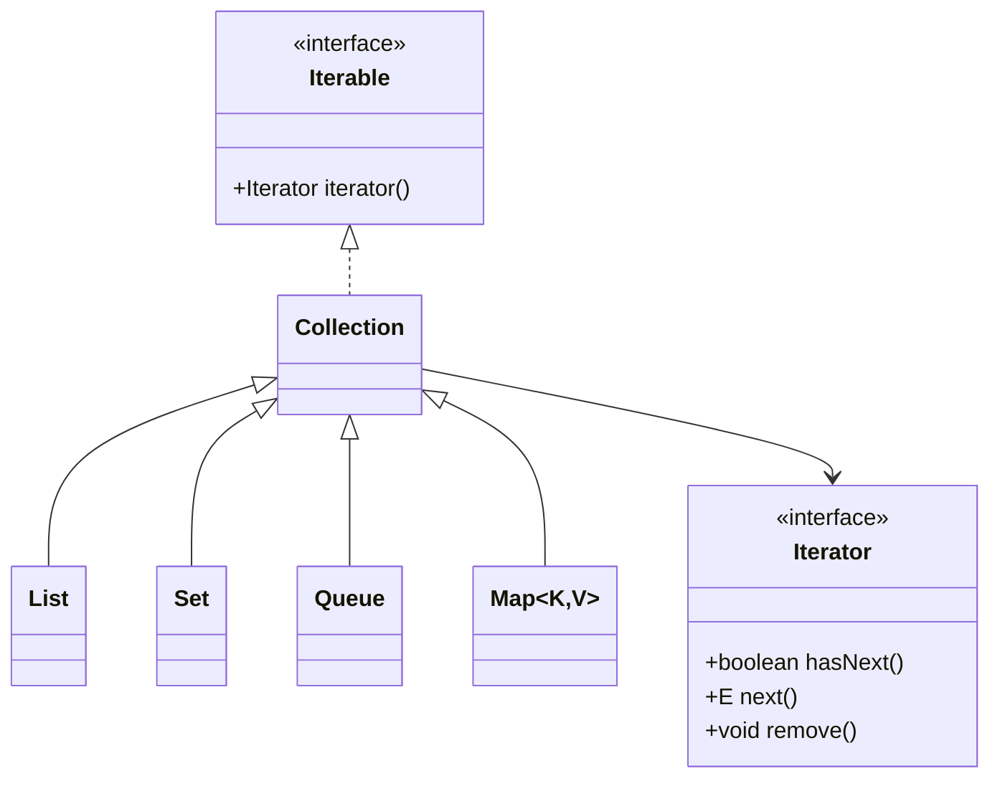

## 28.3 Iterator Pattern in Collections Framework

The **Iterator Pattern** is a fundamental design pattern in software engineering that provides a way to access the elements of an aggregate object sequentially without exposing its underlying representation. In Java, this pattern is implemented through the `Iterator` and `Iterable` interfaces, which are integral to the Collections Framework. This section delves into the Iterator Pattern's purpose, implementation in Java, and its practical applications, offering insights into best practices and advanced techniques for experienced Java developers and software architects.

### Intent

- **Description**: The Iterator Pattern aims to provide a uniform way to traverse elements within a collection, decoupling the traversal logic from the collection's internal structure. This separation of concerns enhances code maintainability and flexibility.

### Also Known As

- **Alternate Names**: Cursor

### Motivation

The need for a standard traversal mechanism arises from the diversity of data structures. Each collection type, whether a list, set, or map, has its own internal representation. The Iterator Pattern abstracts the traversal process, allowing developers to iterate over collections without needing to understand their internal workings. This abstraction is crucial in large-scale applications where collections may change frequently, and maintaining traversal logic separately from collection logic reduces complexity and potential errors.

### Applicability

- **Guidelines**: Use the Iterator Pattern when you need to traverse a collection without exposing its underlying structure. It is particularly useful when the collection's implementation may change, or when you want to provide multiple traversal strategies.

### Structure



- **Caption**: The diagram illustrates the relationship between the `Iterable` and `Iterator` interfaces and their implementation in Java's Collections Framework.

### Participants

- **Iterable**: An interface that defines a method `iterator()` to return an `Iterator`.
- **Iterator**: An interface providing methods `hasNext()`, `next()`, and `remove()` to traverse and modify collections.
- **Collection**: A root interface in the Java Collections Framework that extends `Iterable`.

### Collaborations

- **Interactions**: The `Iterable` interface provides an `iterator()` method that returns an `Iterator`. The `Iterator` interface methods are used to traverse the collection, with `hasNext()` checking for remaining elements, `next()` retrieving the next element, and `remove()` removing the current element.

### Consequences

- **Analysis**: The Iterator Pattern simplifies collection traversal and enhances flexibility by decoupling traversal logic from collection implementation. However, it introduces additional complexity in managing iterator state and handling concurrent modifications.

### Implementation

#### Implementation Guidelines

- Implement the `Iterable` interface in custom collections to provide an iterator.
- Use the `Iterator` interface methods to traverse collections safely.
- Consider implementing `ListIterator` for bidirectional traversal in lists.

#### Sample Code Snippets

```java
import java.util.ArrayList;
import java.util.Iterator;
import java.util.List;

public class IteratorExample {
    public static void main(String[] args) {
        List<String> names = new ArrayList<>();
        names.add("Alice");
        names.add("Bob");
        names.add("Charlie");

        // Using an Iterator to traverse the list
        Iterator<String> iterator = names.iterator();
        while (iterator.hasNext()) {
            String name = iterator.next();
            System.out.println(name);
        }
    }
}
```

- **Explanation**: This example demonstrates using an `Iterator` to traverse a list of names. The `hasNext()` method checks for remaining elements, and `next()` retrieves each element.

#### Enhanced For-Loop

The enhanced for-loop, or `for-each` loop, simplifies iteration over collections that implement the `Iterable` interface.

```java
for (String name : names) {
    System.out.println(name);
}
```

- **Explanation**: The `for-each` loop internally uses the `Iterator` interface, providing a concise syntax for iteration.

#### ListIterator

The `ListIterator` interface extends `Iterator`, offering additional methods for bidirectional traversal and modification.

```java
import java.util.ListIterator;

ListIterator<String> listIterator = names.listIterator();
while (listIterator.hasNext()) {
    String name = listIterator.next();
    System.out.println(name);
}

while (listIterator.hasPrevious()) {
    String name = listIterator.previous();
    System.out.println(name);
}
```

- **Explanation**: This example shows how to use `ListIterator` to traverse a list in both directions.

### Sample Use Cases

- **Real-world Scenarios**: The Iterator Pattern is widely used in Java's Collections Framework, enabling seamless iteration over various collection types like `ArrayList`, `HashSet`, and `HashMap`.

### Related Patterns

- **Connections**: The Iterator Pattern is often used in conjunction with the [Composite Pattern]( "Composite Pattern") to traverse complex data structures.

### Known Uses

- **Examples in Libraries or Frameworks**: The Java Collections Framework extensively uses the Iterator Pattern, providing iterators for all collection types.

### Best Practices

- **Implement Custom Iterators**: For user-defined collections, implement the `Iterable` interface to provide custom iterators, ensuring consistent traversal logic.
- **Handle Concurrent Modifications**: Be aware of fail-fast behavior in iterators, which throw `ConcurrentModificationException` if the collection is modified during iteration. Consider using `CopyOnWriteArrayList` or `ConcurrentHashMap` for concurrent access.

### Conclusion

The Iterator Pattern is a powerful tool in Java's Collections Framework, offering a standardized way to traverse collections. By decoupling traversal logic from collection implementation, it enhances code maintainability and flexibility. Understanding and leveraging this pattern is essential for developing robust and efficient Java applications.

## Test Your Knowledge: Iterator Pattern in Java Collections Quiz



### What is the primary purpose of the Iterator Pattern?

- [x] To provide a standard way to traverse elements of a collection without exposing its underlying representation.
- [ ] To improve the performance of collection operations.
- [ ] To simplify the creation of collections.
- [ ] To enhance the security of data within collections.

> **Explanation:** The Iterator Pattern is designed to provide a uniform way to traverse elements within a collection, decoupling the traversal logic from the collection's internal structure.

### Which interface in Java provides the `iterator()` method?

- [x] Iterable
- [ ] Iterator
- [ ] Collection
- [ ] List

> **Explanation:** The `Iterable` interface provides the `iterator()` method, which returns an `Iterator` for traversing the collection.

### What method in the `Iterator` interface checks for remaining elements?

- [x] hasNext()
- [ ] next()
- [ ] remove()
- [ ] checkNext()

> **Explanation:** The `hasNext()` method checks if there are more elements to iterate over in the collection.

### How does the enhanced for-loop (for-each loop) relate to the Iterator Pattern?

- [x] It internally uses the `Iterator` interface to traverse collections.
- [ ] It replaces the need for iterators entirely.
- [ ] It is unrelated to the Iterator Pattern.
- [ ] It only works with arrays, not collections.

> **Explanation:** The enhanced for-loop uses the `Iterator` interface internally to provide a concise syntax for iterating over collections.

### What additional functionality does `ListIterator` provide over `Iterator`?

- [x] Bidirectional traversal
- [ ] Faster iteration
- [x] Element modification
- [ ] Concurrent access

> **Explanation:** `ListIterator` allows bidirectional traversal and modification of elements, unlike the basic `Iterator`.

### What exception is thrown by fail-fast iterators when a collection is modified during iteration?

- [x] ConcurrentModificationException
- [ ] IllegalStateException
- [ ] NullPointerException
- [ ] UnsupportedOperationException

> **Explanation:** Fail-fast iterators throw `ConcurrentModificationException` if the collection is modified during iteration.

### Which collection type is suitable for concurrent access without throwing `ConcurrentModificationException`?

- [x] CopyOnWriteArrayList
- [ ] ArrayList
- [x] ConcurrentHashMap
- [ ] HashSet

> **Explanation:** `CopyOnWriteArrayList` and `ConcurrentHashMap` are designed for concurrent access, avoiding `ConcurrentModificationException`.

### What is a key benefit of using the Iterator Pattern?

- [x] Decoupling traversal logic from collection implementation
- [ ] Increasing collection size
- [ ] Enhancing data security
- [ ] Simplifying collection creation

> **Explanation:** The Iterator Pattern decouples traversal logic from the collection's implementation, enhancing flexibility and maintainability.

### What is the role of the `remove()` method in the `Iterator` interface?

- [x] To remove the last element returned by the iterator
- [ ] To clear the entire collection
- [ ] To add a new element to the collection
- [ ] To reset the iterator

> **Explanation:** The `remove()` method removes the last element returned by the iterator from the collection.

### True or False: The Iterator Pattern is only applicable to collections that implement the `List` interface.

- [ ] True
- [x] False

> **Explanation:** The Iterator Pattern is applicable to any collection that implements the `Iterable` interface, not just `List`.


