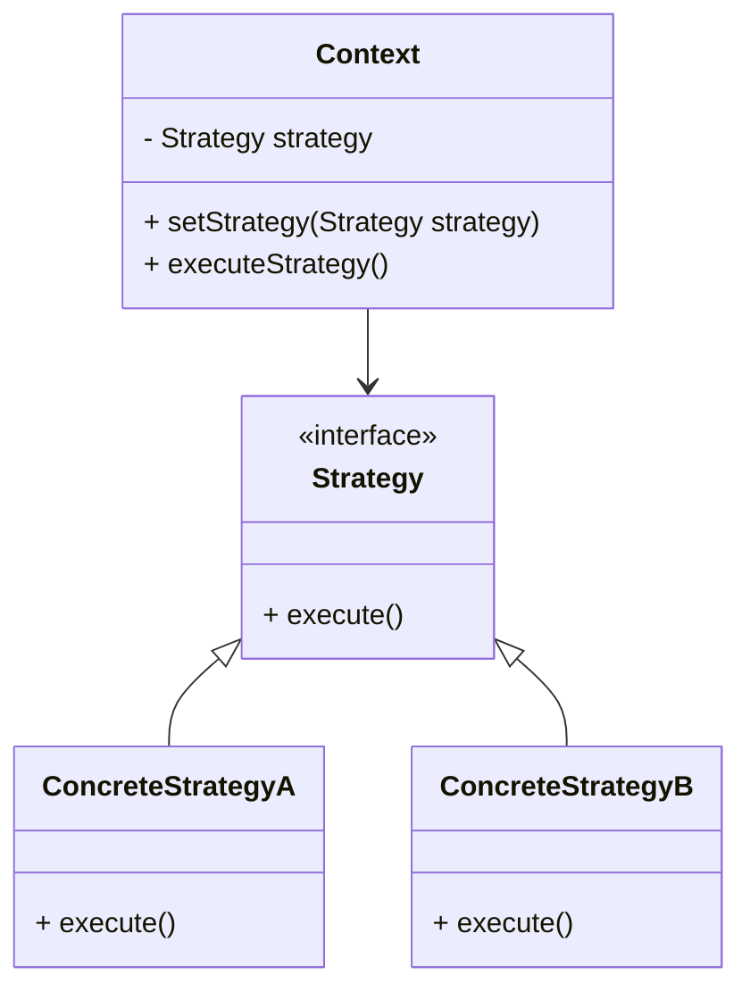

## 28.4 Strategy Pattern in Sorting Algorithms

### Introduction

The Strategy Pattern is a behavioral design pattern that enables selecting an algorithm's behavior at runtime. It defines a family of algorithms, encapsulates each one, and makes them interchangeable. This pattern allows the algorithm to vary independently from the clients that use it. In Java, the Strategy Pattern is prominently used in sorting algorithms through the `Comparator` interface, providing flexibility and extensibility in sorting operations.

### Strategy Pattern Overview

#### Intent

- **Description**: The Strategy Pattern aims to define a family of algorithms, encapsulate each one, and make them interchangeable. It allows the algorithm to be selected at runtime, promoting flexibility and reusability.

#### Also Known As

- **Alternate Names**: Policy Pattern

#### Motivation

The Strategy Pattern is particularly useful when multiple algorithms can be applied to a problem, and the choice of algorithm might change based on the context. For instance, sorting a list of objects can be done based on different criteria, such as name, age, or salary. By using the Strategy Pattern, one can switch between these sorting strategies without altering the objects being sorted.

#### Applicability

- **Guidelines**: Use the Strategy Pattern when:
  - You need to use different variants of an algorithm within an object and switch between them at runtime.
  - You want to avoid exposing complex, algorithm-specific data structures.
  - You have a class that defines many behaviors, and these behaviors can be represented as a set of algorithms.

### Structure



- **Caption**: The diagram illustrates the Strategy Pattern structure, where `Context` uses a `Strategy` interface to execute a strategy defined by `ConcreteStrategyA` or `ConcreteStrategyB`.

### Participants

- **Context**: Maintains a reference to a `Strategy` object and delegates the algorithm execution to the strategy object.
- **Strategy**: An interface common to all supported algorithms.
- **ConcreteStrategy**: Implements the algorithm using the `Strategy` interface.

### Collaborations

- The `Context` object delegates the execution of the algorithm to the `Strategy` object.
- The `Strategy` interface allows `Context` to interact with different algorithms interchangeably.

### Consequences

- **Benefits**:
  - **Flexibility**: Easily switch between different algorithms at runtime.
  - **Reusability**: Algorithms are encapsulated in separate classes, promoting reuse.
  - **Isolation of Code**: Algorithm-specific code is isolated from the client, reducing complexity.

- **Drawbacks**:
  - **Increased Number of Classes**: Each algorithm requires a separate class, potentially increasing the number of classes.
  - **Communication Overhead**: The context must communicate with the strategy, which can introduce overhead.

### Implementation in Java Sorting Algorithms

#### Comparator Interface as a Strategy

In Java, the `Comparator` interface acts as a strategy for sorting algorithms. It allows defining custom sorting logic that can be applied to collections. The `Comparator` interface provides a method `compare(T o1, T o2)` that compares two objects and returns an integer based on their order.

#### Using Comparator with Collections.sort()

The `Collections.sort()` method can take a list and a `Comparator` to sort the list according to the specified order. This allows for dynamic selection of sorting behavior at runtime.

```java
import java.util.*;

public class StrategyPatternExample {
    public static void main(String[] args) {
        List<String> names = Arrays.asList("Alice", "Bob", "Charlie");

        // Sort using natural order
        Collections.sort(names);
        System.out.println("Natural Order: " + names);

        // Sort using a custom comparator
        Collections.sort(names, new Comparator<String>() {
            @Override
            public int compare(String s1, String s2) {
                return s2.compareTo(s1); // Reverse order
            }
        });
        System.out.println("Reverse Order: " + names);
    }
}
```

- **Explanation**: The example demonstrates sorting a list of names using both natural order and a custom comparator for reverse order.

#### Creating Custom Comparators

Custom comparators can be created to define specific sorting criteria. For example, sorting a list of employees by salary or name.

```java
import java.util.*;

class Employee {
    String name;
    double salary;

    Employee(String name, double salary) {
        this.name = name;
        this.salary = salary;
    }

    @Override
    public String toString() {
        return name + ": " + salary;
    }
}

public class CustomComparatorExample {
    public static void main(String[] args) {
        List<Employee> employees = Arrays.asList(
            new Employee("Alice", 70000),
            new Employee("Bob", 50000),
            new Employee("Charlie", 60000)
        );

        // Sort by salary
        Collections.sort(employees, new Comparator<Employee>() {
            @Override
            public int compare(Employee e1, Employee e2) {
                return Double.compare(e1.salary, e2.salary);
            }
        });
        System.out.println("Sorted by Salary: " + employees);

        // Sort by name
        Collections.sort(employees, new Comparator<Employee>() {
            @Override
            public int compare(Employee e1, Employee e2) {
                return e1.name.compareTo(e2.name);
            }
        });
        System.out.println("Sorted by Name: " + employees);
    }
}
```

- **Explanation**: This example shows how to sort a list of `Employee` objects by salary and name using custom comparators.

#### Flexibility of Strategy Pattern

The Strategy Pattern provides flexibility in changing sorting algorithms without modifying the collection classes. By encapsulating sorting logic in separate comparator classes, one can easily switch between different sorting strategies.

#### Best Practices for Implementing Comparators

- **Handle Nulls**: Ensure comparators handle null values gracefully to avoid `NullPointerException`.
- **Consistency with equals()**: Ensure that the comparator is consistent with `equals()`, meaning that `compare(o1, o2) == 0` should imply `o1.equals(o2)` is `true`.
- **Use Lambda Expressions**: In Java 8 and later, use lambda expressions for concise comparator implementations.

```java
import java.util.*;

public class LambdaComparatorExample {
    public static void main(String[] args) {
        List<String> names = Arrays.asList("Alice", "Bob", "Charlie");

        // Sort using a lambda expression
        Collections.sort(names, (s1, s2) -> s1.compareTo(s2));
        System.out.println("Sorted using Lambda: " + names);
    }
}
```

- **Explanation**: The example demonstrates using a lambda expression to implement a comparator for sorting.

### Sample Use Cases

- **Real-world Scenarios**: The Strategy Pattern is used in various Java libraries and frameworks to provide flexible sorting mechanisms. For instance, sorting user data in a web application based on different criteria like age, registration date, or name.

### Related Patterns

- **Connections**: The Strategy Pattern is related to the [6.6 Singleton Pattern]( "Singleton Pattern") in that both patterns provide a way to manage behavior and state in a flexible manner. However, the Singleton Pattern focuses on ensuring a single instance, while the Strategy Pattern focuses on interchangeable algorithms.

### Known Uses

- **Examples in Libraries or Frameworks**: The Java Collections Framework extensively uses the Strategy Pattern through the `Comparator` interface to provide flexible sorting capabilities.

### Conclusion

The Strategy Pattern is a powerful tool in Java for implementing flexible and interchangeable sorting algorithms. By leveraging the `Comparator` interface, developers can define custom sorting logic and apply it dynamically at runtime. This pattern promotes clean, maintainable code and enhances the flexibility of Java applications.

### Exercises

1. Implement a custom comparator to sort a list of products by price and then by name.
2. Modify the `Employee` example to handle null values in the name field gracefully.
3. Use a lambda expression to sort a list of integers in descending order.

### Key Takeaways

- The Strategy Pattern allows for dynamic selection of algorithms at runtime.
- The `Comparator` interface in Java serves as a strategy for sorting.
- Custom comparators provide flexibility in defining sorting criteria.
- Best practices include handling nulls and ensuring consistency with `equals()`.
- Lambda expressions offer a concise way to implement comparators in Java 8 and later.

## Test Your Knowledge: Strategy Pattern in Java Sorting Algorithms



### What is the primary role of the Strategy Pattern in sorting algorithms?

- [x] To allow the selection of sorting behavior at runtime.
- [ ] To ensure a single instance of a sorting algorithm.
- [ ] To provide a default sorting order.
- [ ] To optimize sorting performance.

> **Explanation:** The Strategy Pattern enables the selection of sorting behavior at runtime by encapsulating different sorting algorithms.

### How does the `Comparator` interface serve as a strategy in Java?

- [x] It defines custom sorting logic that can be applied dynamically.
- [ ] It provides a default sorting order for collections.
- [ ] It ensures thread safety in sorting operations.
- [ ] It optimizes sorting performance.

> **Explanation:** The `Comparator` interface allows defining custom sorting logic, which can be applied to collections dynamically.

### Which method is used to sort a collection with a custom comparator in Java?

- [x] Collections.sort()
- [ ] Arrays.sort()
- [ ] List.sort()
- [ ] Set.sort()

> **Explanation:** The `Collections.sort()` method is used to sort a collection with a custom comparator.

### What is a best practice when implementing a comparator?

- [x] Ensure consistency with `equals()`.
- [ ] Use a single instance for all comparisons.
- [ ] Avoid handling null values.
- [ ] Optimize for performance over readability.

> **Explanation:** A best practice is to ensure that the comparator is consistent with `equals()`, meaning that `compare(o1, o2) == 0` should imply `o1.equals(o2)` is `true`.

### How can lambda expressions be used in comparator implementations?

- [x] To provide a concise way to define comparator logic.
- [ ] To ensure thread safety in sorting operations.
- [ ] To optimize sorting performance.
- [ ] To provide a default sorting order.

> **Explanation:** Lambda expressions offer a concise way to define comparator logic, making the code more readable and maintainable.

### What is a potential drawback of the Strategy Pattern?

- [x] Increased number of classes.
- [ ] Reduced flexibility in algorithm selection.
- [ ] Inconsistent sorting results.
- [ ] Decreased code readability.

> **Explanation:** A potential drawback of the Strategy Pattern is the increased number of classes, as each algorithm requires a separate class.

### Which Java feature introduced in Java 8 enhances comparator implementation?

- [x] Lambda expressions
- [ ] Streams API
- [ ] Modules
- [ ] Concurrency utilities

> **Explanation:** Lambda expressions, introduced in Java 8, enhance comparator implementation by providing a concise syntax for defining comparator logic.

### What is the benefit of using the Strategy Pattern for sorting?

- [x] Flexibility in changing sorting algorithms without modifying collection classes.
- [ ] Ensures a single instance of sorting logic.
- [ ] Provides a default sorting order.
- [ ] Optimizes sorting performance.

> **Explanation:** The Strategy Pattern provides flexibility in changing sorting algorithms without modifying the collection classes, promoting maintainability and reusability.

### How can null values be handled in a comparator?

- [x] By implementing custom logic to handle nulls gracefully.
- [ ] By ignoring null values.
- [ ] By throwing an exception.
- [ ] By using a default sorting order.

> **Explanation:** Null values can be handled in a comparator by implementing custom logic to handle them gracefully, avoiding `NullPointerException`.

### True or False: The Strategy Pattern is only applicable to sorting algorithms.

- [x] False
- [ ] True

> **Explanation:** False. The Strategy Pattern is applicable to any scenario where multiple algorithms can be applied and selected at runtime, not just sorting algorithms.



---
