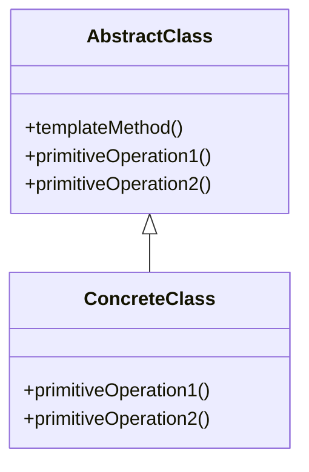

## 28.7 Template Method in Abstract Classes

### Introduction

The Template Method pattern is a behavioral design pattern that defines the skeleton of an algorithm in a method, deferring some steps to subclasses. This pattern allows subclasses to redefine certain steps of an algorithm without changing its structure. In Java, this is often implemented using abstract classes, where the abstract class provides the template method and concrete subclasses implement the abstract methods.

### Intent

- **Description**: The Template Method pattern aims to encapsulate the invariant parts of an algorithm in a method, allowing subclasses to implement the variable parts. This promotes code reuse and enforces a consistent algorithm structure across different implementations.

### Also Known As

- **Alternate Names**: Hook Method

### Motivation

The Template Method pattern is particularly useful when you have multiple classes that share a common algorithm structure but differ in specific steps. By using this pattern, you can avoid code duplication and ensure that the algorithm's structure remains consistent across different implementations.

### Applicability

- **Guidelines**: Use the Template Method pattern when you have an algorithm that can be broken down into steps, where some steps can be implemented in different ways by subclasses. This pattern is also useful when you want to enforce a specific sequence of operations.

### Structure



- **Caption**: The diagram illustrates the Template Method pattern, where `AbstractClass` defines the template method and `ConcreteClass` implements the primitive operations.

### Participants

- **AbstractClass**: Defines the template method and declares abstract primitive operations.
- **ConcreteClass**: Implements the primitive operations to carry out subclass-specific steps of the algorithm.

### Collaborations

- **Interactions**: The `AbstractClass` calls the template method, which in turn calls the primitive operations. The `ConcreteClass` provides specific implementations for these operations.

### Consequences

- **Analysis**: The Template Method pattern promotes code reuse and enforces a consistent algorithm structure. However, it can lead to an increase in the number of classes, and changes to the algorithm structure may require changes to multiple subclasses.

### Implementation

#### Implementation Guidelines

- Define the template method in an abstract class.
- Declare the steps of the algorithm as abstract methods.
- Implement the concrete steps in subclasses.

#### Sample Code Snippets

```java
// Abstract class with a template method
abstract class DataProcessor {
    // Template method
    public final void process() {
        readData();
        processData();
        writeData();
    }

    // Abstract methods to be implemented by subclasses
    abstract void readData();
    abstract void processData();
    abstract void writeData();
}

// Concrete class implementing the abstract methods
class CSVDataProcessor extends DataProcessor {
    @Override
    void readData() {
        System.out.println("Reading data from CSV file");
    }

    @Override
    void processData() {
        System.out.println("Processing CSV data");
    }

    @Override
    void writeData() {
        System.out.println("Writing data to CSV file");
    }
}

// Usage
public class TemplateMethodExample {
    public static void main(String[] args) {
        DataProcessor processor = new CSVDataProcessor();
        processor.process();
    }
}
```

- **Explanation**: In this example, `DataProcessor` defines a template method `process` that outlines the steps of reading, processing, and writing data. The `CSVDataProcessor` class provides specific implementations for these steps.

### Sample Use Cases

- **Real-world Scenarios**: The Template Method pattern is commonly used in frameworks and libraries where a consistent algorithm structure is required, but specific steps may vary. For example, in Java's `java.io` package, classes like `InputStream` use this pattern to define a common structure for reading data, while allowing subclasses to implement specific reading mechanisms.

### Related Patterns

- **Connections**: The Template Method pattern is often used in conjunction with the Factory Method pattern, where the factory method is used to create objects that are part of the algorithm.

### Known Uses

- **Examples in Libraries or Frameworks**: The `java.io.InputStream` class in Java is a classic example of the Template Method pattern. It defines the `read` method as a template method, while subclasses like `FileInputStream` and `ByteArrayInputStream` provide specific implementations for reading data.

### Benefits of the Template Method Pattern

1. **Code Reuse**: By defining the common algorithm structure in a single place, the Template Method pattern promotes code reuse and reduces duplication.

2. **Consistency**: The pattern enforces a consistent algorithm structure across different implementations, making the code easier to understand and maintain.

3. **Flexibility**: Subclasses can provide specific implementations for certain steps of the algorithm, allowing for flexibility and customization.

4. **Ease of Maintenance**: Changes to the algorithm structure can be made in the abstract class, without affecting the subclasses.

### Best Practices for Designing Abstract Classes

1. **Define a Clear Contract**: Clearly define the responsibilities of the abstract class and the methods that subclasses must implement.

2. **Use Final Methods**: Mark the template method as `final` to prevent subclasses from altering the algorithm structure.

3. **Provide Default Implementations**: Where possible, provide default implementations for methods that are not critical to the algorithm, allowing subclasses to override them if necessary.

4. **Document Extensively**: Provide detailed documentation for the abstract class and its methods to guide subclass implementations.

### Importance of Documentation

Documentation is crucial when using the Template Method pattern, as it guides developers in implementing the necessary steps in subclasses. It should clearly describe the purpose of the template method, the sequence of operations, and any constraints or requirements for subclass implementations.

### Conclusion

The Template Method pattern is a powerful tool for defining the skeleton of an algorithm in an abstract class, allowing subclasses to implement specific steps. By promoting code reuse and enforcing a consistent structure, this pattern is invaluable in creating robust and maintainable software systems. As with any design pattern, careful consideration and documentation are essential to ensure its effective application.

### Exercises

1. **Implement a Template Method Pattern**: Create an abstract class `DocumentProcessor` with a template method `processDocument`. Implement concrete subclasses for processing different types of documents, such as `PDFDocumentProcessor` and `WordDocumentProcessor`.

2. **Refactor Existing Code**: Identify a section of code in your current project that could benefit from the Template Method pattern. Refactor the code to use an abstract class with a template method.

3. **Explore Java Libraries**: Investigate other Java libraries or frameworks that use the Template Method pattern. Analyze how they implement the pattern and consider how you might apply similar techniques in your own projects.

### Summary

- The Template Method pattern defines the skeleton of an algorithm in an abstract class, allowing subclasses to implement specific steps.
- It promotes code reuse, consistency, and flexibility, while reducing duplication.
- Best practices include defining a clear contract, using final methods, providing default implementations, and documenting extensively.

### Reflection

Consider how the Template Method pattern can be applied to your own projects. What algorithms in your codebase could benefit from a consistent structure? How might this pattern improve code readability and maintainability? Reflect on these questions and explore opportunities to apply the Template Method pattern in your work.

## Test Your Knowledge: Template Method Pattern Quiz



### What is the primary purpose of the Template Method pattern?

- [x] To define the skeleton of an algorithm and allow subclasses to refine specific steps.
- [ ] To create objects without specifying the exact class.
- [ ] To provide a way to access elements of an aggregate object sequentially.
- [ ] To ensure a class has only one instance.

> **Explanation:** The Template Method pattern defines the skeleton of an algorithm in a method, allowing subclasses to redefine certain steps without changing the algorithm's structure.

### Which Java class is a classic example of the Template Method pattern?

- [x] java.io.InputStream
- [ ] java.util.ArrayList
- [ ] java.lang.String
- [ ] java.util.HashMap

> **Explanation:** The `java.io.InputStream` class uses the Template Method pattern to define a common structure for reading data, with subclasses providing specific implementations.

### What is a key benefit of using the Template Method pattern?

- [x] It promotes code reuse and enforces a consistent algorithm structure.
- [ ] It allows for dynamic method dispatch.
- [ ] It simplifies the creation of complex objects.
- [ ] It provides a way to iterate over a collection.

> **Explanation:** The Template Method pattern promotes code reuse by defining the common algorithm structure in a single place and enforces consistency across different implementations.

### In the Template Method pattern, what role does the abstract class play?

- [x] It defines the template method and declares abstract primitive operations.
- [ ] It provides concrete implementations for all methods.
- [ ] It acts as a factory for creating objects.
- [ ] It manages the lifecycle of objects.

> **Explanation:** The abstract class in the Template Method pattern defines the template method and declares abstract methods that subclasses must implement.

### What is a best practice when designing abstract classes for the Template Method pattern?

- [x] Use final methods to prevent subclasses from altering the algorithm structure.
- [ ] Avoid providing any default implementations.
- [ ] Allow subclasses to override the template method.
- [ ] Minimize documentation to reduce complexity.

> **Explanation:** Using final methods for the template method prevents subclasses from altering the algorithm structure, ensuring consistency.

### How does the Template Method pattern promote flexibility?

- [x] By allowing subclasses to provide specific implementations for certain steps of the algorithm.
- [ ] By enabling multiple inheritance.
- [ ] By allowing dynamic method dispatch.
- [ ] By providing a way to iterate over a collection.

> **Explanation:** The Template Method pattern promotes flexibility by allowing subclasses to implement specific steps of the algorithm, enabling customization.

### What is a potential drawback of the Template Method pattern?

- [x] It can lead to an increase in the number of classes.
- [ ] It makes code less reusable.
- [ ] It complicates the creation of objects.
- [ ] It reduces the flexibility of the algorithm.

> **Explanation:** The Template Method pattern can lead to an increase in the number of classes, as each variation of the algorithm may require a new subclass.

### Why is documentation important when using the Template Method pattern?

- [x] It guides developers in implementing the necessary steps in subclasses.
- [ ] It reduces the need for testing.
- [ ] It simplifies the algorithm structure.
- [ ] It eliminates the need for comments in code.

> **Explanation:** Documentation is crucial for guiding developers in implementing the necessary steps in subclasses, ensuring the pattern is applied correctly.

### What is a common use case for the Template Method pattern?

- [x] Frameworks and libraries where a consistent algorithm structure is required.
- [ ] Dynamic method dispatch in polymorphic systems.
- [ ] Creating complex objects with multiple parts.
- [ ] Iterating over collections in a specific order.

> **Explanation:** The Template Method pattern is commonly used in frameworks and libraries where a consistent algorithm structure is required, but specific steps may vary.

### True or False: The Template Method pattern allows subclasses to alter the algorithm structure.

- [x] False
- [ ] True

> **Explanation:** The Template Method pattern does not allow subclasses to alter the algorithm structure; it only allows them to implement specific steps.


