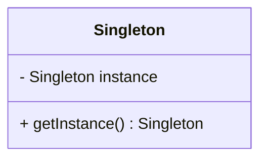
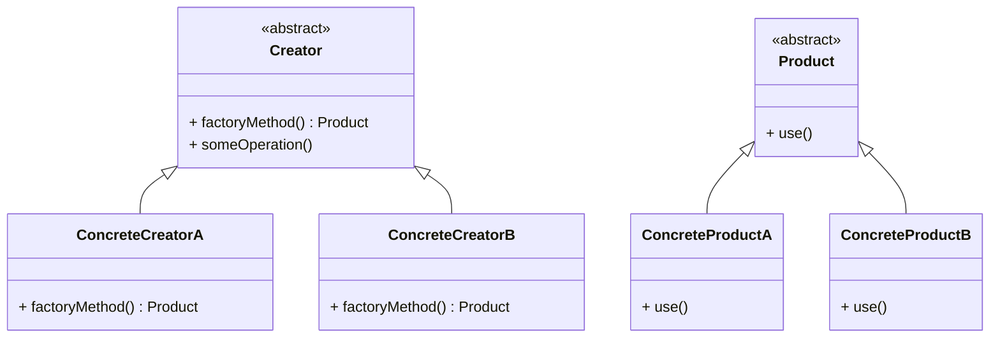
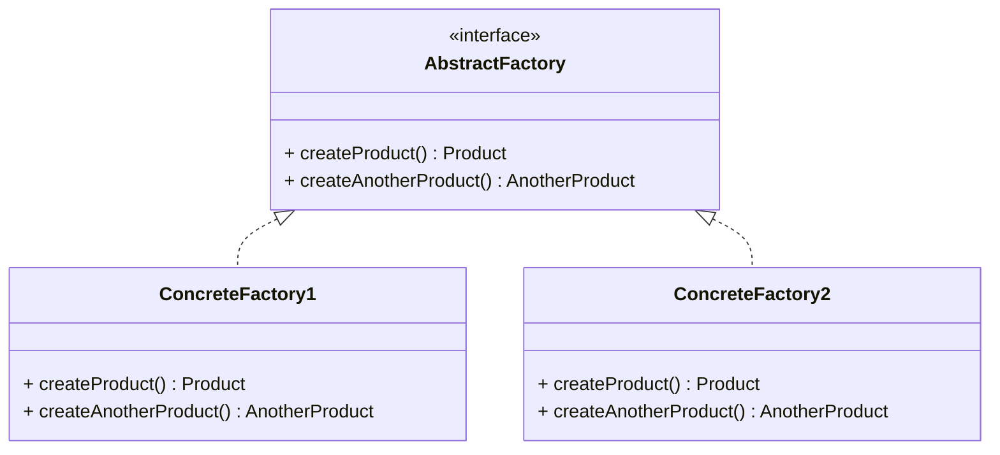

## 3.1 Overview of Creational Patterns

In the realm of object-oriented programming, the creation of objects is a fundamental task. However, as systems grow in complexity, so do the challenges associated with object creation. Creational design patterns provide solutions to these challenges, offering ways to manage object creation mechanisms effectively. This section will delve into the role of creational patterns, the common challenges they address, and provide an overview of the specific patterns we will explore in detail.

### The Role of Creational Design Patterns

Creational design patterns focus on the process of object creation. They abstract the instantiation process, making a system independent of how its objects are created, composed, and represented. By doing so, they provide a way to decouple a client from the objects it needs to instantiate, thereby enhancing flexibility and scalability.

### Challenges in Object Creation

Creating objects in software design is not always straightforward. Here are some common challenges:

- **Complexity**: As applications grow, the complexity of object creation can increase, especially when dealing with complex object hierarchies or dependencies.
- **Scalability**: Efficiently managing resources and ensuring that the system can handle an increasing number of objects without performance degradation is crucial.
- **Flexibility**: The ability to extend and modify object creation mechanisms without altering existing code is essential for maintainability.

### Controlling Object Creation

Controlling how objects are created can lead to more maintainable and performant code. Creational patterns provide various strategies to achieve this control, each with its own strengths and use cases. By selecting the appropriate pattern, developers can ensure that their code remains flexible and scalable.

### Summary of Creational Patterns

Let's briefly introduce the creational patterns that will be covered in this section:

1. **Singleton Pattern**: Ensures a class has only one instance and provides a global point of access to it. This pattern is useful when exactly one object is needed to coordinate actions across the system.

2. **Factory Method Pattern**: Defines an interface for creating an object, but lets subclasses alter the type of objects that will be created. This pattern promotes loose coupling by delegating the responsibility of instantiation to subclasses.

3. **Abstract Factory Pattern**: Provides an interface for creating families of related or dependent objects without specifying their concrete classes. This pattern is particularly useful when a system needs to be independent of how its objects are created.

4. **Builder Pattern**: Separates the construction of a complex object from its representation, allowing the same construction process to create different representations. This pattern is ideal for constructing complex objects with numerous optional parameters.

5. **Prototype Pattern**: Creates new objects by copying an existing object, known as the prototype. This pattern is useful when the cost of creating a new instance of an object is more expensive than copying an existing one.

6. **Object Pool Pattern**: Manages a pool of reusable objects, improving performance by reusing objects that are expensive to create. This pattern is beneficial in scenarios where object creation is costly and frequent.

7. **Dependency Injection Pattern**: Passes dependencies to a class instead of hard-coding them, promoting loose coupling and enhancing testability. This pattern is widely used in frameworks like Spring to manage object lifecycles and dependencies.

### Differentiating Creational Patterns

Each creational pattern offers a unique approach to object creation:

- **Singleton** focuses on restricting instantiation to a single object.
- **Factory Method** and **Abstract Factory** emphasize creating objects without specifying the exact class of object that will be created.
- **Builder** is concerned with constructing complex objects step by step.
- **Prototype** leverages cloning to create new objects.
- **Object Pool** optimizes resource usage by reusing objects.
- **Dependency Injection** separates the creation of a class's dependencies from the class itself.

### Selecting the Appropriate Pattern

Choosing the right creational pattern depends on the specific requirements and constraints of your project. Consider factors such as the complexity of object creation, the need for flexibility and scalability, and the importance of decoupling dependencies. By understanding the strengths and weaknesses of each pattern, you can make informed decisions that enhance your software design.

### Relatable Examples and Analogies

To make these concepts more relatable, consider the following analogy: Imagine you're building a house. The **Singleton** pattern ensures there's only one blueprint for the house. The **Factory Method** allows different subcontractors to build specific parts of the house without knowing the details of other parts. The **Abstract Factory** provides a kit that includes everything needed to build a house, regardless of style. The **Builder** pattern is like a construction manager who oversees the entire building process, ensuring each part is built correctly. The **Prototype** pattern allows you to create a new house by copying an existing one. The **Object Pool** is like a tool rental service, where you can borrow tools instead of buying new ones. Lastly, **Dependency Injection** is akin to having a supplier deliver materials directly to the site, rather than the builders having to source them themselves.

### Preparing for Deeper Dives

In the following subsections, we will explore each creational pattern in detail, providing code examples, use cases, and best practices. By the end of this section, you will have a comprehensive understanding of how to leverage these patterns to improve your software design.

### Code Examples

Let's explore some basic code examples to illustrate these patterns.

#### Singleton Pattern Example

```java
public class Singleton {
    private static Singleton instance;

    private Singleton() {
        // Private constructor to prevent instantiation
    }

    public static Singleton getInstance() {
        if (instance == null) {
            instance = new Singleton();
        }
        return instance;
    }
}
```

#### Factory Method Pattern Example

```java
abstract class Product {
    public abstract void use();
}

class ConcreteProductA extends Product {
    public void use() {
        System.out.println("Using ConcreteProductA");
    }
}

class ConcreteProductB extends Product {
    public void use() {
        System.out.println("Using ConcreteProductB");
    }
}

abstract class Creator {
    public abstract Product factoryMethod();

    public void someOperation() {
        Product product = factoryMethod();
        product.use();
    }
}

class ConcreteCreatorA extends Creator {
    public Product factoryMethod() {
        return new ConcreteProductA();
    }
}

class ConcreteCreatorB extends Creator {
    public Product factoryMethod() {
        return new ConcreteProductB();
    }
}
```

#### Abstract Factory Pattern Example

```java
interface AbstractFactory {
    Product createProduct();
    AnotherProduct createAnotherProduct();
}

class ConcreteFactory1 implements AbstractFactory {
    public Product createProduct() {
        return new ConcreteProduct1();
    }

    public AnotherProduct createAnotherProduct() {
        return new AnotherProduct1();
    }
}

class ConcreteFactory2 implements AbstractFactory {
    public Product createProduct() {
        return new ConcreteProduct2();
    }

    public AnotherProduct createAnotherProduct() {
        return new AnotherProduct2();
    }
}
```

#### Builder Pattern Example

```java
class Product {
    private String partA;
    private String partB;

    public void setPartA(String partA) {
        this.partA = partA;
    }

    public void setPartB(String partB) {
        this.partB = partB;
    }
}

abstract class Builder {
    protected Product product = new Product();

    public abstract void buildPartA();
    public abstract void buildPartB();
    public Product getResult() {
        return product;
    }
}

class ConcreteBuilder extends Builder {
    public void buildPartA() {
        product.setPartA("Part A");
    }

    public void buildPartB() {
        product.setPartB("Part B");
    }
}

class Director {
    private Builder builder;

    public Director(Builder builder) {
        this.builder = builder;
    }

    public Product construct() {
        builder.buildPartA();
        builder.buildPartB();
        return builder.getResult();
    }
}
```

#### Prototype Pattern Example

```java
interface Prototype {
    Prototype clone();
}

class ConcretePrototype implements Prototype {
    private String field;

    public ConcretePrototype(String field) {
        this.field = field;
    }

    public Prototype clone() {
        return new ConcretePrototype(field);
    }
}
```

#### Object Pool Pattern Example

```java
class PooledObject {
    // Represents an object in the pool
}

class ObjectPool {
    private List<PooledObject> available = new ArrayList<>();
    private List<PooledObject> inUse = new ArrayList<>();

    public PooledObject acquire() {
        if (available.isEmpty()) {
            available.add(new PooledObject());
        }
        PooledObject obj = available.remove(available.size() - 1);
        inUse.add(obj);
        return obj;
    }

    public void release(PooledObject obj) {
        inUse.remove(obj);
        available.add(obj);
    }
}
```

#### Dependency Injection Pattern Example

```java
interface Service {
    void execute();
}

class ConcreteService implements Service {
    public void execute() {
        System.out.println("Executing service");
    }
}

class Client {
    private Service service;

    public Client(Service service) {
        this.service = service;
    }

    public void doSomething() {
        service.execute();
    }
}
```

### Visualizing Creational Patterns

To better understand the relationships and processes involved in creational patterns, let's visualize some of them using Mermaid.js diagrams.

#### Singleton Pattern Diagram



#### Factory Method Pattern Diagram



#### Abstract Factory Pattern Diagram



### Try It Yourself

To deepen your understanding, try modifying the code examples above. For instance, add a new product type to the Factory Method pattern or implement a new concrete builder in the Builder pattern. Experiment with different scenarios to see how these patterns can be adapted to various requirements.

### Knowledge Check

Before we move on, let's pose a few questions to ensure you've grasped the concepts:

- What are the main challenges associated with object creation in software design?
- How do creational patterns help in managing these challenges?
- Can you identify scenarios where a specific creational pattern might be more suitable than others?

### Embrace the Journey

Remember, understanding creational patterns is just the beginning. As you progress, you'll learn how to apply these patterns to build robust, scalable, and maintainable software systems. Keep experimenting, stay curious, and enjoy the journey!

## Quiz Time!



### What is the primary focus of creational design patterns?

- [x] To abstract the instantiation process of objects
- [ ] To define the behavior of objects
- [ ] To manage the relationships between objects
- [ ] To optimize the performance of algorithms

> **Explanation:** Creational design patterns focus on abstracting the instantiation process of objects, making a system independent of how its objects are created.

### Which pattern ensures a class has only one instance?

- [x] Singleton
- [ ] Factory Method
- [ ] Abstract Factory
- [ ] Prototype

> **Explanation:** The Singleton pattern ensures that a class has only one instance and provides a global point of access to it.

### What is a key benefit of the Factory Method pattern?

- [x] It promotes loose coupling by delegating instantiation to subclasses.
- [ ] It allows for the creation of complex objects step by step.
- [ ] It manages a pool of reusable objects.
- [ ] It ensures a class has only one instance.

> **Explanation:** The Factory Method pattern promotes loose coupling by allowing subclasses to decide which class to instantiate.

### How does the Builder pattern differ from the Factory Method pattern?

- [x] Builder separates the construction of a complex object from its representation.
- [ ] Builder ensures a class has only one instance.
- [ ] Builder provides an interface for creating families of related objects.
- [ ] Builder uses cloning to create new objects.

> **Explanation:** The Builder pattern separates the construction of a complex object from its representation, allowing for different representations.

### Which pattern is useful when object creation is costly and frequent?

- [x] Object Pool
- [ ] Singleton
- [ ] Factory Method
- [ ] Dependency Injection

> **Explanation:** The Object Pool pattern is beneficial in scenarios where object creation is costly and frequent, as it manages a pool of reusable objects.

### What is the primary advantage of Dependency Injection?

- [x] It promotes loose coupling and enhances testability.
- [ ] It ensures a class has only one instance.
- [ ] It manages a pool of reusable objects.
- [ ] It allows for the creation of complex objects step by step.

> **Explanation:** Dependency Injection promotes loose coupling and enhances testability by passing dependencies to a class instead of hard-coding them.

### Which pattern uses cloning to create new objects?

- [x] Prototype
- [ ] Singleton
- [ ] Factory Method
- [ ] Builder

> **Explanation:** The Prototype pattern creates new objects by copying an existing object, known as the prototype.

### What is a common challenge in object creation that creational patterns address?

- [x] Complexity
- [ ] Security
- [ ] Data integrity
- [ ] User interface design

> **Explanation:** Creational patterns address the complexity of object creation, among other challenges.

### Which pattern provides an interface for creating families of related objects?

- [x] Abstract Factory
- [ ] Singleton
- [ ] Builder
- [ ] Prototype

> **Explanation:** The Abstract Factory pattern provides an interface for creating families of related or dependent objects without specifying their concrete classes.

### True or False: Creational patterns are only useful in large-scale applications.

- [ ] True
- [x] False

> **Explanation:** Creational patterns are useful in applications of all sizes, as they help manage object creation complexity and improve maintainability and scalability.


