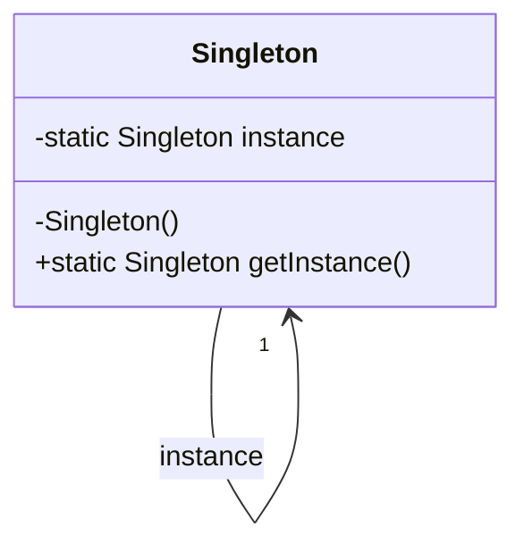

## 3.2.1 Implementing Singleton in Java

The Singleton Pattern is a creational design pattern that ensures a class has only one instance and provides a global point of access to it. This pattern is particularly useful when exactly one object is needed to coordinate actions across the system. In this section, we will explore how to implement the Singleton Pattern in Java, discuss its components, and highlight best practices and common pitfalls.

### Understanding the Singleton Pattern

Before diving into the implementation, let's understand the core concepts of the Singleton Pattern:

- **Single Instance**: The Singleton Pattern restricts the instantiation of a class to a single object.
- **Global Access**: It provides a global point of access to the instance, allowing it to be easily accessed from anywhere in the codebase.
- **Controlled Instantiation**: The pattern controls the instantiation process, typically using a private constructor and a static method.

### Key Components of a Singleton in Java

To implement a Singleton in Java, we need to utilize several key components:

1. **Private Constructor**: Prevents direct instantiation of the class from outside.
2. **Static Variable**: Holds the single instance of the class.
3. **Static Method**: Provides a global access point to the instance.

Let's explore each of these components in detail.

### Step-by-Step Implementation of Singleton in Java

#### Step 1: Define the Singleton Class

First, we define the class that will follow the Singleton Pattern. This class should have a private constructor to prevent instantiation from outside the class.

```java
public class Singleton {
    // Private constructor to prevent instantiation
    private Singleton() {
    }
}
```

#### Step 2: Create a Static Variable

Next, we declare a static variable to hold the single instance of the class. This variable is typically declared as `private static`.

```java
public class Singleton {
    // Static variable to hold the single instance
    private static Singleton instance;

    private Singleton() {
    }
}
```

#### Step 3: Provide a Static Method for Access

We then create a public static method that returns the instance of the class. This method checks if the instance is `null` and creates it if necessary. This is known as lazy initialization.

```java
public class Singleton {
    private static Singleton instance;

    private Singleton() {
    }

    // Static method to provide global access to the instance
    public static Singleton getInstance() {
        if (instance == null) {
            instance = new Singleton();
        }
        return instance;
    }
}
```

### Ensuring Thread Safety

In a multi-threaded environment, the above implementation can lead to issues where multiple threads create multiple instances of the Singleton class. To prevent this, we need to ensure thread safety.

#### Synchronized Method

One way to achieve thread safety is by synchronizing the `getInstance` method. This ensures that only one thread can execute this method at a time.

```java
public class Singleton {
    private static Singleton instance;

    private Singleton() {
    }

    // Synchronized method to ensure thread safety
    public static synchronized Singleton getInstance() {
        if (instance == null) {
            instance = new Singleton();
        }
        return instance;
    }
}
```

While this approach ensures thread safety, it can lead to performance issues due to the overhead of synchronization.

#### Double-Checked Locking

To improve performance, we can use the double-checked locking mechanism. This approach reduces the overhead of acquiring a lock by first checking if the instance is `null` without synchronization.

```java
public class Singleton {
    private static volatile Singleton instance;

    private Singleton() {
    }

    // Double-checked locking for thread safety and performance
    public static Singleton getInstance() {
        if (instance == null) {
            synchronized (Singleton.class) {
                if (instance == null) {
                    instance = new Singleton();
                }
            }
        }
        return instance;
    }
}
```

In this implementation, the `volatile` keyword ensures that changes to the instance variable are visible to all threads.

### Singleton Using Enum

Java provides a more elegant and thread-safe way to implement Singleton using an `enum`. This approach is simple and handles serialization automatically.

```java
public enum Singleton {
    INSTANCE;

    public void someMethod() {
        // Implement your logic here
    }
}
```

With this approach, the `INSTANCE` is inherently thread-safe and ensures a single instance.

### Common Mistakes to Avoid

When implementing the Singleton Pattern, it's essential to avoid common pitfalls:

- **Lazy Initialization without Synchronization**: This can lead to multiple instances being created in a multi-threaded environment.
- **Serialization Issues**: Without proper handling, serialization can create a new instance. The `enum` approach naturally handles this.
- **Reflection**: Reflection can be used to break the Singleton Pattern. To prevent this, throw an exception in the constructor if an instance already exists.

### Best Practices for Singleton Implementation

To ensure a robust Singleton implementation, adhere to the following best practices:

- **Use `enum` for Simplicity**: If your Singleton does not require lazy initialization, consider using an `enum`.
- **Handle Serialization**: Implement the `readResolve` method to prevent new instances during deserialization.
- **Prevent Reflection**: Use security measures to prevent reflection from creating new instances.
- **Consider Lazy Initialization**: Use lazy initialization only if necessary, as it can complicate the implementation.

### Try It Yourself

To better understand the Singleton Pattern, try modifying the code examples:

- Implement a Singleton class with eager initialization.
- Experiment with different synchronization techniques.
- Use reflection to attempt breaking the Singleton and implement a solution.

### Visualizing Singleton Pattern

To further clarify the Singleton Pattern, let's visualize the process using a class diagram.



This diagram illustrates the Singleton class with its static instance and the `getInstance` method.

### References and Further Reading

For more information on the Singleton Pattern and its implementation in Java, consider the following resources:

- [Java Design Patterns](https://www.oracle.com/java/technologies/javase/design-patterns.html)
- [Effective Java by Joshua Bloch](https://www.oreilly.com/library/view/effective-java-3rd/9780134686097/)

### Knowledge Check

To reinforce your understanding, consider the following questions:

- What are the key components of a Singleton class in Java?
- How does the `enum` approach simplify Singleton implementation?
- Why is thread safety important in Singleton implementation?

### Embrace the Journey

Remember, mastering design patterns like Singleton is a journey. As you continue to explore and implement these patterns, you'll gain a deeper understanding of their nuances and applications. Keep experimenting, stay curious, and enjoy the journey!

## Quiz Time!



### What is the primary purpose of the Singleton Pattern?

- [x] To ensure a class has only one instance
- [ ] To allow multiple instances of a class
- [ ] To provide a template for creating objects
- [ ] To encapsulate a request as an object

> **Explanation:** The Singleton Pattern ensures that a class has only one instance and provides a global point of access to it.

### Which keyword is used to prevent multiple threads from creating multiple instances of a Singleton class?

- [ ] transient
- [x] synchronized
- [ ] volatile
- [ ] static

> **Explanation:** The `synchronized` keyword is used to ensure that only one thread can execute a method or block of code at a time, preventing multiple instances in a Singleton class.

### What is a common issue with lazy initialization in Singleton implementation?

- [ ] It is always thread-safe
- [x] It can lead to multiple instances in a multi-threaded environment
- [ ] It uses too much memory
- [ ] It is not supported in Java

> **Explanation:** Lazy initialization without proper synchronization can lead to multiple instances being created in a multi-threaded environment.

### How does the `enum` approach simplify Singleton implementation?

- [x] It provides inherent thread safety and handles serialization automatically
- [ ] It allows multiple instances
- [ ] It requires complex synchronization
- [ ] It is not supported in Java

> **Explanation:** The `enum` approach provides inherent thread safety and handles serialization automatically, simplifying Singleton implementation.

### What is the role of the `volatile` keyword in the double-checked locking pattern?

- [x] To ensure visibility of changes to the instance variable across threads
- [ ] To prevent serialization
- [ ] To allow multiple instances
- [ ] To simplify code

> **Explanation:** The `volatile` keyword ensures that changes to the instance variable are visible to all threads, which is crucial in the double-checked locking pattern.

### Which method should be implemented to prevent new instances during deserialization?

- [ ] writeObject
- [ ] clone
- [x] readResolve
- [ ] finalize

> **Explanation:** The `readResolve` method can be implemented to ensure that the deserialized object is the same as the existing Singleton instance.

### What is a potential risk of using reflection with Singleton?

- [ ] It simplifies the implementation
- [x] It can break the Singleton property by creating new instances
- [ ] It enhances thread safety
- [ ] It is not supported in Java

> **Explanation:** Reflection can be used to access private constructors and create new instances, breaking the Singleton property.

### Which of the following is a best practice for implementing Singleton?

- [x] Use `enum` for simplicity if lazy initialization is not required
- [ ] Always use eager initialization
- [ ] Avoid using access modifiers
- [ ] Use multiple static variables

> **Explanation:** Using `enum` for Singleton implementation is a best practice when lazy initialization is not required, as it simplifies the implementation and ensures thread safety.

### What is the main advantage of using double-checked locking in Singleton implementation?

- [x] It reduces synchronization overhead while ensuring thread safety
- [ ] It allows multiple instances
- [ ] It simplifies code
- [ ] It is not supported in Java

> **Explanation:** Double-checked locking reduces synchronization overhead by first checking if the instance is `null` without synchronization, ensuring thread safety only when necessary.

### True or False: The Singleton Pattern is useful when multiple instances of a class are required.

- [ ] True
- [x] False

> **Explanation:** False. The Singleton Pattern is specifically designed to ensure that only one instance of a class is created.


