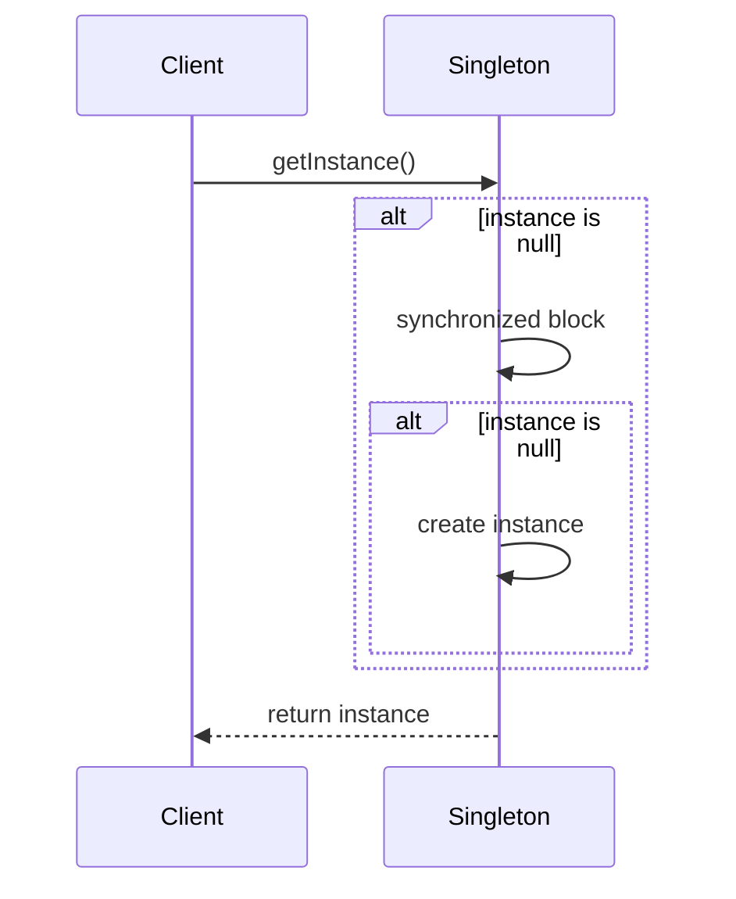

## 3.2.2 Thread-Safe Singleton Implementations

In the realm of software design patterns, the Singleton pattern holds a unique place due to its simplicity and utility. However, when it comes to multi-threaded environments, ensuring that a Singleton is thread-safe becomes a critical concern. In this section, we will delve into the intricacies of implementing thread-safe Singletons in Java, exploring various strategies and their implications.

### Why Thread Safety Matters

In a multi-threaded application, multiple threads may attempt to create an instance of a Singleton class simultaneously. If not handled properly, this can lead to the creation of multiple instances, defeating the purpose of the Singleton pattern. Ensuring thread safety in Singleton implementations is crucial to maintain the integrity and consistency of the instance across different threads.

### Strategies for Thread-Safe Singleton Implementations

Let's explore several strategies to achieve thread safety in Singleton implementations, each with its own set of advantages and trade-offs.

#### 1. Synchronized Method

The simplest way to make a Singleton thread-safe is by synchronizing the method that creates the instance. This approach ensures that only one thread can execute the method at a time, preventing concurrent access issues.

```java
public class Singleton {
    private static Singleton instance;

    private Singleton() {
        // private constructor
    }

    public static synchronized Singleton getInstance() {
        if (instance == null) {
            instance = new Singleton();
        }
        return instance;
    }
}
```

**Pros:**
- Simple to implement.
- Ensures thread safety by locking the method.

**Cons:**
- Synchronization can lead to performance bottlenecks, especially if the method is called frequently.
- Every call to `getInstance()` is synchronized, even after the instance is created.

#### 2. Double-Checked Locking

Double-checked locking reduces the overhead of acquiring a lock by first checking if the instance is already created. This approach combines lazy initialization with synchronized access.

```java
public class Singleton {
    private static volatile Singleton instance;

    private Singleton() {
        // private constructor
    }

    public static Singleton getInstance() {
        if (instance == null) {
            synchronized (Singleton.class) {
                if (instance == null) {
                    instance = new Singleton();
                }
            }
        }
        return instance;
    }
}
```

**Pros:**
- Reduces synchronization overhead by checking the instance twice.
- Ensures thread safety with minimal performance impact.

**Cons:**
- More complex than a synchronized method.
- Requires the `volatile` keyword to prevent issues with instruction reordering.

#### 3. Eager Initialization

Eager initialization creates the Singleton instance at the time of class loading. This approach is inherently thread-safe as the instance is created before any thread accesses it.

```java
public class Singleton {
    private static final Singleton instance = new Singleton();

    private Singleton() {
        // private constructor
    }

    public static Singleton getInstance() {
        return instance;
    }
}
```

**Pros:**
- Simple and easy to implement.
- No synchronization is required, leading to better performance.

**Cons:**
- Instance is created even if it might not be used, potentially wasting resources.
- Not suitable for resource-intensive Singletons.

#### 4. Bill Pugh Singleton Implementation

This approach uses a static inner helper class to hold the Singleton instance. The instance is created when the inner class is loaded, ensuring lazy initialization and thread safety.

```java
public class Singleton {
    private Singleton() {
        // private constructor
    }

    private static class SingletonHelper {
        private static final Singleton INSTANCE = new Singleton();
    }

    public static Singleton getInstance() {
        return SingletonHelper.INSTANCE;
    }
}
```

**Pros:**
- Lazy initialization without synchronization.
- Thread-safe due to class loading mechanism.

**Cons:**
- Slightly more complex than eager initialization.
- Relies on the Java class loader mechanism.

### Performance Implications

Each of these strategies has different performance implications. The synchronized method is straightforward but can be a bottleneck. Double-checked locking improves performance but adds complexity. Eager initialization is fast but may lead to resource wastage. The Bill Pugh approach offers a balanced solution with lazy initialization and no synchronization overhead.

### Testing Thread-Safe Singleton Implementations

Testing Singleton implementations in a multi-threaded environment is crucial to ensure their correctness. Use tools like JUnit and concurrency testing frameworks to simulate concurrent access and verify that only one instance is created.

### Try It Yourself

Experiment with the different Singleton implementations provided. Try modifying the code to introduce intentional delays or simulate concurrent access using multiple threads. Observe how each implementation handles these scenarios and consider the trade-offs in terms of complexity and performance.

### Visualizing Singleton Implementations

To better understand the flow of control in these implementations, let's visualize the process using a sequence diagram for the Double-Checked Locking approach.



This diagram illustrates the sequence of operations in the Double-Checked Locking approach, highlighting the checks and synchronization involved.

### Conclusion

Choosing the right thread-safe Singleton implementation depends on the specific requirements of your application. Consider factors such as performance, resource usage, and complexity when making your decision. Remember, testing is essential to ensure that your Singleton behaves correctly under concurrent access.

### Key Takeaways

- Thread safety is crucial for Singleton implementations in multi-threaded environments.
- Various strategies exist, each with its own trade-offs in terms of performance and complexity.
- Testing is essential to verify the correctness of Singleton implementations.

## Quiz Time!



### Why is thread safety important for Singleton implementations?

- [x] To ensure only one instance is created in multi-threaded environments.
- [ ] To allow multiple instances to be created.
- [ ] To make the Singleton pattern more complex.
- [ ] To improve the performance of the Singleton.

> **Explanation:** Thread safety ensures that only one instance of the Singleton is created, even when multiple threads access it simultaneously.

### What is a major drawback of using synchronized methods for Singleton?

- [x] Performance bottlenecks due to synchronization.
- [ ] Complexity of implementation.
- [ ] Inability to ensure thread safety.
- [ ] Excessive memory usage.

> **Explanation:** Synchronization can lead to performance bottlenecks because it locks the method, preventing concurrent access.

### How does double-checked locking improve performance?

- [x] By reducing the need for synchronization after the instance is created.
- [ ] By using more memory.
- [ ] By creating multiple instances.
- [ ] By simplifying the code.

> **Explanation:** Double-checked locking reduces synchronization overhead by checking the instance twice, once outside and once inside the synchronized block.

### What is a disadvantage of eager initialization?

- [x] The instance is created even if not used.
- [ ] It requires complex synchronization.
- [ ] It cannot be implemented in Java.
- [ ] It is not thread-safe.

> **Explanation:** Eager initialization creates the instance at class loading time, which can lead to resource wastage if the instance is never used.

### Which Singleton implementation uses a static inner helper class?

- [x] Bill Pugh Singleton Implementation
- [ ] Eager Initialization
- [ ] Double-Checked Locking
- [ ] Synchronized Method

> **Explanation:** The Bill Pugh Singleton Implementation uses a static inner helper class to achieve lazy initialization and thread safety.

### What keyword is essential in double-checked locking?

- [x] volatile
- [ ] synchronized
- [ ] static
- [ ] final

> **Explanation:** The `volatile` keyword is essential to prevent instruction reordering and ensure visibility of changes to the instance variable.

### Which Singleton strategy is inherently thread-safe without synchronization?

- [x] Eager Initialization
- [ ] Double-Checked Locking
- [ ] Synchronized Method
- [ ] Lazy Initialization

> **Explanation:** Eager initialization is inherently thread-safe because the instance is created at class loading time, before any threads access it.

### What is a benefit of the Bill Pugh Singleton Implementation?

- [x] Lazy initialization without synchronization.
- [ ] Requires complex synchronization.
- [ ] Creates multiple instances.
- [ ] Uses excessive memory.

> **Explanation:** The Bill Pugh Singleton Implementation achieves lazy initialization without synchronization by using a static inner class.

### How can you test Singleton implementations in multi-threaded environments?

- [x] Use concurrency testing frameworks.
- [ ] Avoid testing in multi-threaded environments.
- [ ] Use single-threaded testing only.
- [ ] Test only the constructor.

> **Explanation:** Concurrency testing frameworks can simulate concurrent access and verify that only one instance is created.

### True or False: The Singleton pattern is always the best choice for managing shared resources.

- [ ] True
- [x] False

> **Explanation:** The Singleton pattern is not always the best choice; it depends on the specific requirements and context of the application.


