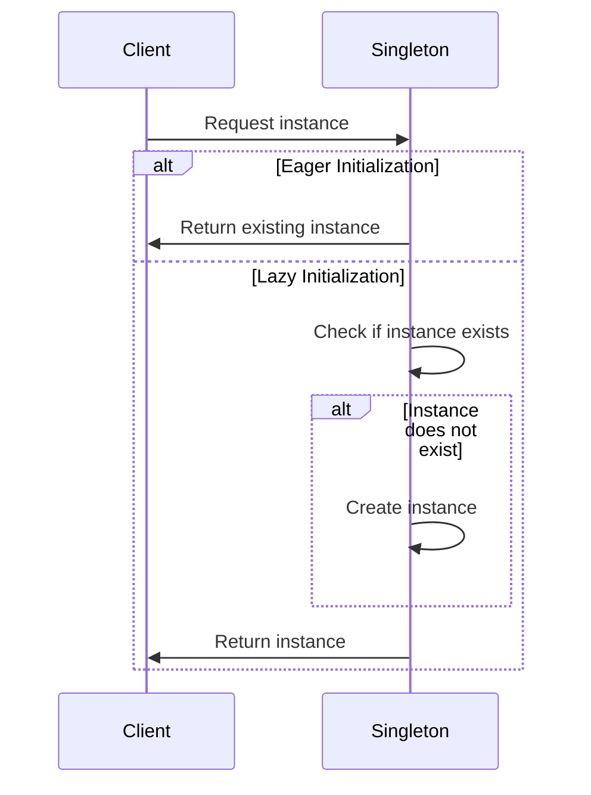

## 3.2.3 Lazy Initialization vs. Eager Initialization

In the realm of software design patterns, particularly within the context of the Singleton pattern, initialization strategies play a crucial role in determining the efficiency and performance of an application. Two primary strategies are commonly employed: Lazy Initialization and Eager Initialization. This section delves into these two approaches, providing a comprehensive understanding of their differences, advantages, disadvantages, and implementation in Java.

### Understanding Lazy Initialization

Lazy Initialization is a technique where the instantiation of an object is deferred until it is actually needed. This approach is particularly useful in scenarios where the cost of creating an instance is high, and the object might not be used at all during the application's lifecycle.

#### Advantages of Lazy Initialization

1. **Resource Efficiency**: By delaying the creation of the instance until it is required, lazy initialization can save resources, especially in applications where the Singleton instance is rarely used.
2. **Performance Optimization**: It reduces the application's startup time since the instance is not created during the initial loading phase.
3. **Flexibility**: It allows for more flexible initialization logic, which can be beneficial in complex applications where the Singleton's initialization depends on runtime parameters.

#### Disadvantages of Lazy Initialization

1. **Thread Safety Concerns**: Implementing lazy initialization in a multi-threaded environment can be challenging due to potential race conditions.
2. **Increased Complexity**: The implementation of lazy initialization is often more complex compared to eager initialization, requiring additional logic to ensure thread safety.
3. **Potential for Latency**: The first access to the Singleton instance may incur a performance hit due to the overhead of instance creation.

### Implementing Lazy Initialization in Java

Let's explore how to implement lazy initialization in Java using the Singleton pattern. We'll focus on ensuring thread safety, which is a critical aspect of this approach.

```java
public class LazySingleton {
    private static LazySingleton instance;

    private LazySingleton() {
        // Private constructor to prevent instantiation
    }

    public static synchronized LazySingleton getInstance() {
        if (instance == null) {
            instance = new LazySingleton();
        }
        return instance;
    }
}
```

In this example, we use the `synchronized` keyword to ensure that only one thread can execute the `getInstance` method at a time, thus preventing multiple threads from creating separate instances of the Singleton.

#### Double-Checked Locking

To improve performance, especially in scenarios where the Singleton instance is accessed frequently, we can use the Double-Checked Locking pattern. This approach reduces the overhead of acquiring a lock by first checking if the instance is already initialized.

```java
public class LazySingleton {
    private static volatile LazySingleton instance;

    private LazySingleton() {
        // Private constructor to prevent instantiation
    }

    public static LazySingleton getInstance() {
        if (instance == null) {
            synchronized (LazySingleton.class) {
                if (instance == null) {
                    instance = new LazySingleton();
                }
            }
        }
        return instance;
    }
}
```

Here, the `volatile` keyword ensures that changes to the `instance` variable are visible to all threads, preventing subtle bugs related to instruction reordering.

### Understanding Eager Initialization

Eager Initialization, on the other hand, involves creating the Singleton instance at the time of class loading. This approach is straightforward and eliminates the need for synchronization, making it inherently thread-safe.

#### Advantages of Eager Initialization

1. **Simplicity**: The implementation is simple and does not require additional synchronization logic, reducing the potential for errors.
2. **Thread Safety**: Since the instance is created at class loading time, eager initialization is inherently thread-safe.
3. **Predictable Performance**: The performance is consistent since the instance is always available when needed, without any initialization delay.

#### Disadvantages of Eager Initialization

1. **Resource Consumption**: The instance is created regardless of whether it is used, which can lead to unnecessary resource consumption, especially if the Singleton is resource-intensive.
2. **Lack of Flexibility**: It does not allow for dynamic initialization logic based on runtime conditions.

### Implementing Eager Initialization in Java

Eager initialization can be implemented in Java with minimal code, as shown in the following example:

```java
public class EagerSingleton {
    private static final EagerSingleton instance = new EagerSingleton();

    private EagerSingleton() {
        // Private constructor to prevent instantiation
    }

    public static EagerSingleton getInstance() {
        return instance;
    }
}
```

In this example, the Singleton instance is created when the class is loaded, ensuring that it is available immediately upon request.

### Choosing Between Lazy and Eager Initialization

The choice between lazy and eager initialization depends on several factors, including resource usage, application requirements, and performance considerations.

#### When to Use Lazy Initialization

- **Resource-Intensive Instances**: If the Singleton instance is resource-intensive and may not be used during the application's lifecycle, lazy initialization is preferable.
- **Conditional Initialization**: When the initialization logic depends on runtime parameters or conditions, lazy initialization provides the necessary flexibility.
- **Startup Performance**: In applications where startup time is critical, lazy initialization can help by deferring instance creation.

#### When to Use Eager Initialization

- **Simplicity and Safety**: If the Singleton instance is lightweight and the application can afford to create it at startup, eager initialization offers simplicity and inherent thread safety.
- **Predictable Access Patterns**: When the Singleton is frequently accessed and the overhead of lazy initialization is undesirable, eager initialization ensures consistent performance.

### Potential Pitfalls and Considerations

Both lazy and eager initialization have potential pitfalls that developers should be aware of when implementing the Singleton pattern.

#### Lazy Initialization Pitfalls

- **Race Conditions**: Without proper synchronization, lazy initialization can lead to race conditions and multiple instances being created.
- **Performance Overhead**: The initial access to the Singleton instance may incur a performance hit due to synchronization and instance creation.

#### Eager Initialization Pitfalls

- **Unnecessary Resource Usage**: Eager initialization can lead to wasted resources if the Singleton instance is never used.
- **Lack of Flexibility**: It does not allow for dynamic initialization logic, which can be a limitation in complex applications.

### Try It Yourself

To gain a deeper understanding of lazy and eager initialization, try modifying the provided code examples. Experiment with removing synchronization from the lazy initialization example and observe the potential issues that arise in a multi-threaded environment. Additionally, consider adding logging statements to track when the Singleton instance is created in both approaches.

### Visualizing Initialization Strategies

To further illustrate the differences between lazy and eager initialization, let's visualize the process using a sequence diagram.



In this diagram, we see that eager initialization immediately returns the existing instance, while lazy initialization involves checking for the instance's existence and creating it if necessary.

### References and Further Reading

For more information on the Singleton pattern and initialization strategies, consider exploring the following resources:

- [Oracle Java Documentation](https://docs.oracle.com/javase/tutorial/)
- [Effective Java by Joshua Bloch](https://www.oreilly.com/library/view/effective-java-3rd/9780134686097/)
- [Design Patterns: Elements of Reusable Object-Oriented Software by Erich Gamma, Richard Helm, Ralph Johnson, John Vlissides](https://www.oreilly.com/library/view/design-patterns-elements/0201633612/)

### Knowledge Check

To reinforce your understanding of lazy and eager initialization, consider the following questions:

1. What are the key differences between lazy and eager initialization?
2. How does the Double-Checked Locking pattern improve lazy initialization performance?
3. In what scenarios might eager initialization be preferred over lazy initialization?
4. What are the potential pitfalls of using lazy initialization in a multi-threaded environment?
5. How does the `volatile` keyword contribute to thread safety in lazy initialization?

### Embrace the Journey

Remember, choosing the right initialization strategy is just one aspect of implementing the Singleton pattern effectively. As you continue to explore design patterns, keep experimenting and adapting your approach to suit the unique needs of your applications. Stay curious, and enjoy the journey of mastering design patterns in Java!

## Quiz Time!



### What is a primary advantage of lazy initialization?

- [x] Resource efficiency
- [ ] Simplicity
- [ ] Immediate availability
- [ ] Predictable performance

> **Explanation:** Lazy initialization defers the creation of an instance until it is needed, saving resources if the instance is not used.

### Which keyword is used in Java to ensure visibility of changes across threads in lazy initialization?

- [x] volatile
- [ ] synchronized
- [ ] static
- [ ] final

> **Explanation:** The `volatile` keyword ensures that changes to a variable are visible to all threads, preventing instruction reordering issues.

### What is a disadvantage of eager initialization?

- [x] Unnecessary resource usage
- [ ] Complexity
- [ ] Thread safety concerns
- [ ] Performance overhead

> **Explanation:** Eager initialization creates the instance at class loading time, which can lead to wasted resources if the instance is never used.

### How does double-checked locking improve lazy initialization?

- [x] Reduces synchronization overhead
- [ ] Ensures immediate availability
- [ ] Simplifies implementation
- [ ] Eliminates the need for the `volatile` keyword

> **Explanation:** Double-checked locking reduces the need for synchronization after the instance is initialized, improving performance.

### In which scenario is eager initialization preferred?

- [x] When the instance is lightweight and frequently accessed
- [ ] When the instance is resource-intensive
- [ ] When initialization depends on runtime conditions
- [ ] When startup performance is critical

> **Explanation:** Eager initialization is preferred when the instance is lightweight and frequently accessed, providing consistent performance.

### What is a potential pitfall of lazy initialization?

- [x] Race conditions
- [ ] Unnecessary resource usage
- [ ] Lack of flexibility
- [ ] Complexity

> **Explanation:** Without proper synchronization, lazy initialization can lead to race conditions and multiple instances being created.

### What does the `synchronized` keyword do in lazy initialization?

- [x] Ensures only one thread can execute a method at a time
- [ ] Makes a variable visible to all threads
- [ ] Prevents instruction reordering
- [ ] Simplifies implementation

> **Explanation:** The `synchronized` keyword ensures that only one thread can execute a method at a time, preventing race conditions.

### Which initialization strategy is inherently thread-safe?

- [x] Eager initialization
- [ ] Lazy initialization
- [ ] Double-checked locking
- [ ] None of the above

> **Explanation:** Eager initialization is inherently thread-safe because the instance is created at class loading time, before any threads can access it.

### What is a key benefit of using lazy initialization in resource-intensive instances?

- [x] Saves resources by delaying instance creation
- [ ] Ensures immediate availability
- [ ] Simplifies implementation
- [ ] Provides consistent performance

> **Explanation:** Lazy initialization saves resources by delaying the creation of the instance until it is needed, which is beneficial for resource-intensive instances.

### True or False: Eager initialization allows for dynamic initialization logic based on runtime conditions.

- [ ] True
- [x] False

> **Explanation:** Eager initialization does not allow for dynamic initialization logic, as the instance is created at class loading time.


