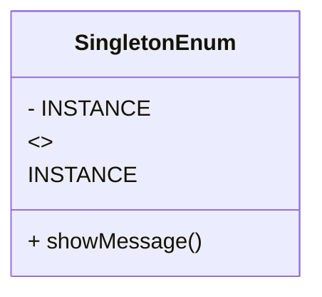

## 3.2.4 Singleton Using Enum

In the world of software design patterns, the Singleton pattern is a well-known solution for ensuring that a class has only one instance and provides a global point of access to it. While there are various ways to implement a Singleton in Java, using an enum is a particularly elegant and robust approach. This section will delve into how Java's enum type can be leveraged to implement a Singleton, providing a simple, thread-safe, and serialization-friendly solution.

### Understanding Enums in Java

Before we dive into the Singleton implementation, let's briefly revisit what enums are in Java. An enum (short for enumeration) is a special Java type used to define collections of constants. Enums were introduced in Java 5 as a type-safe way to represent fixed sets of constants.

```java
public enum Day {
    SUNDAY, MONDAY, TUESDAY, WEDNESDAY, THURSDAY, FRIDAY, SATURDAY
}
```

Enums are inherently singleton in nature, meaning each constant is a single instance of the enum type. This characteristic makes enums a perfect candidate for implementing the Singleton pattern.

### Implementing Singleton Using Enum

To implement a Singleton using an enum, you define an enum with a single element. This element represents the single instance of the class. Here's a simple example:

```java
public enum SingletonEnum {
    INSTANCE;

    public void showMessage() {
        System.out.println("Hello from Singleton using Enum!");
    }
}
```

In this example, `INSTANCE` is the single instance of `SingletonEnum`. You can access it using `SingletonEnum.INSTANCE` and call methods on it like any other object.

### Benefits of Using Enum for Singleton

#### 1. Simplicity

Using an enum to implement a Singleton is straightforward. You don't need to worry about synchronization, lazy initialization, or double-checked locking, which are common concerns in other Singleton implementations.

#### 2. Thread Safety

Enums in Java are inherently thread-safe. The Java Language Specification ensures that enum constants are instantiated only once in a Java program, making them naturally thread-safe.

#### 3. Serialization Support

Enums provide built-in serialization support. When an enum is serialized, Java ensures that the same instance is returned upon deserialization. This means you don't have to implement special handling for serialization, unlike other Singleton implementations where you might need to override `readResolve()`.

#### 4. Prevention of Multiple Instantiation

With enums, you cannot create additional instances using reflection. This is because the Java runtime prevents instantiation of enum types through reflection, which is a common pitfall in other Singleton implementations.

#### 5. Protection Against Reflection Attacks

Reflection can be used to break Singleton implementations by invoking private constructors. However, enums are immune to such attacks because the Java runtime prevents reflection from creating new instances of enum types.

### Code Example: Singleton Using Enum

Let's look at a more detailed example of a Singleton implemented using an enum:

```java
public enum DatabaseConnection {
    INSTANCE;

    private Connection connection;

    DatabaseConnection() {
        try {
            // Assume DriverManager is a class that manages database connections
            connection = DriverManager.getConnection("jdbc:myDriver:myDatabase");
        } catch (SQLException e) {
            e.printStackTrace();
        }
    }

    public Connection getConnection() {
        return connection;
    }

    public void closeConnection() {
        try {
            if (connection != null && !connection.isClosed()) {
                connection.close();
            }
        } catch (SQLException e) {
            e.printStackTrace();
        }
    }
}
```

In this example, `DatabaseConnection` is a Singleton that manages a database connection. The `INSTANCE` enum constant is the single instance of the `DatabaseConnection` class. The constructor initializes the database connection, and methods are provided to access and close the connection.

### Limitations and Considerations

While enums provide a robust way to implement Singletons, there are some limitations and considerations to keep in mind:

- **Flexibility**: Enums are less flexible than classes. For instance, if you need to extend a Singleton class, enums won't allow it since they cannot be subclassed.
- **Initialization**: Enums are initialized when the class is loaded, which may not be suitable for all use cases, especially if lazy initialization is desired.
- **Compatibility**: If you're working in an environment where Java 5 or later is not available, you cannot use enums.

### Try It Yourself

To get hands-on experience with Singleton using enums, try modifying the code example above:

- **Experiment with Methods**: Add more methods to the `DatabaseConnection` enum to perform database operations.
- **Test Serialization**: Serialize and deserialize the `DatabaseConnection.INSTANCE` to see how Java handles it.
- **Reflection Test**: Attempt to use reflection to create a new instance of the enum and observe the results.

### Visualizing Singleton Using Enum

To better understand how enums work as Singletons, let's visualize the process:



In this diagram, `SingletonEnum` is an enum with a single instance, `INSTANCE`. The `showMessage()` method is available to be called on this instance.

### Knowledge Check

- **Why are enums inherently thread-safe in Java?**
- **What makes enums immune to reflection attacks?**
- **How does Java ensure that enums are serialized correctly?**

### Conclusion

Using enums to implement the Singleton pattern in Java is a simple, effective, and robust approach. It eliminates many of the complexities and pitfalls associated with other Singleton implementations, such as thread safety, serialization, and reflection attacks. While there are some limitations, the benefits often outweigh them, making enums a preferred method for implementing Singletons in Java.

### References and Further Reading

- [Java Language Specification](https://docs.oracle.com/javase/specs/)
- [Effective Java by Joshua Bloch](https://www.oreilly.com/library/view/effective-java/9780134686097/)
- [Java Enums Tutorial](https://docs.oracle.com/javase/tutorial/java/javaOO/enum.html)

## Quiz Time!



### What is a key benefit of using enums for Singleton implementation in Java?

- [x] Enums are inherently thread-safe.
- [ ] Enums allow for multiple instances.
- [ ] Enums require complex synchronization.
- [ ] Enums are not serializable.

> **Explanation:** Enums in Java are inherently thread-safe because the Java Language Specification ensures that enum constants are instantiated only once.

### How does Java handle serialization of enums?

- [x] Java ensures that the same instance is returned upon deserialization.
- [ ] Java creates a new instance upon deserialization.
- [ ] Java does not support serialization of enums.
- [ ] Java requires custom serialization logic for enums.

> **Explanation:** Enums provide built-in serialization support, ensuring that the same instance is returned upon deserialization.

### Why are enums immune to reflection attacks?

- [x] The Java runtime prevents instantiation of enum types through reflection.
- [ ] Enums do not have constructors.
- [ ] Enums are not classes.
- [ ] Enums are final by default.

> **Explanation:** The Java runtime prevents instantiation of enum types through reflection, making them immune to reflection attacks.

### What is a limitation of using enums for Singleton implementation?

- [x] Enums cannot be subclassed.
- [ ] Enums are not thread-safe.
- [ ] Enums require complex initialization logic.
- [ ] Enums cannot be serialized.

> **Explanation:** Enums cannot be subclassed, which limits their flexibility compared to classes.

### What is a common pitfall in other Singleton implementations that enums prevent?

- [x] Multiple instantiation.
- [ ] Lack of serialization support.
- [ ] Complex synchronization.
- [ ] Lack of thread safety.

> **Explanation:** Enums prevent multiple instantiation, a common pitfall in other Singleton implementations.

### How can you access the single instance of a Singleton implemented using an enum?

- [x] Using the enum constant, e.g., `SingletonEnum.INSTANCE`.
- [ ] Using a static method.
- [ ] Using a constructor.
- [ ] Using reflection.

> **Explanation:** The single instance of a Singleton implemented using an enum is accessed using the enum constant, e.g., `SingletonEnum.INSTANCE`.

### What is a benefit of using enums for Singleton implementation regarding serialization?

- [x] Enums provide built-in serialization support.
- [ ] Enums cannot be serialized.
- [ ] Enums require custom serialization logic.
- [ ] Enums create new instances upon deserialization.

> **Explanation:** Enums provide built-in serialization support, ensuring that the same instance is returned upon deserialization.

### Why might enums not be suitable for all Singleton use cases?

- [x] Enums are initialized when the class is loaded.
- [ ] Enums require complex synchronization.
- [ ] Enums are not thread-safe.
- [ ] Enums cannot be serialized.

> **Explanation:** Enums are initialized when the class is loaded, which may not be suitable for use cases requiring lazy initialization.

### What is a key characteristic of enums that makes them suitable for Singleton implementation?

- [x] Enums are inherently singleton in nature.
- [ ] Enums allow for multiple instances.
- [ ] Enums require complex synchronization.
- [ ] Enums are not serializable.

> **Explanation:** Enums are inherently singleton in nature, meaning each constant is a single instance of the enum type.

### True or False: Enums in Java are immune to reflection attacks.

- [x] True
- [ ] False

> **Explanation:** True. The Java runtime prevents instantiation of enum types through reflection, making them immune to reflection attacks.


