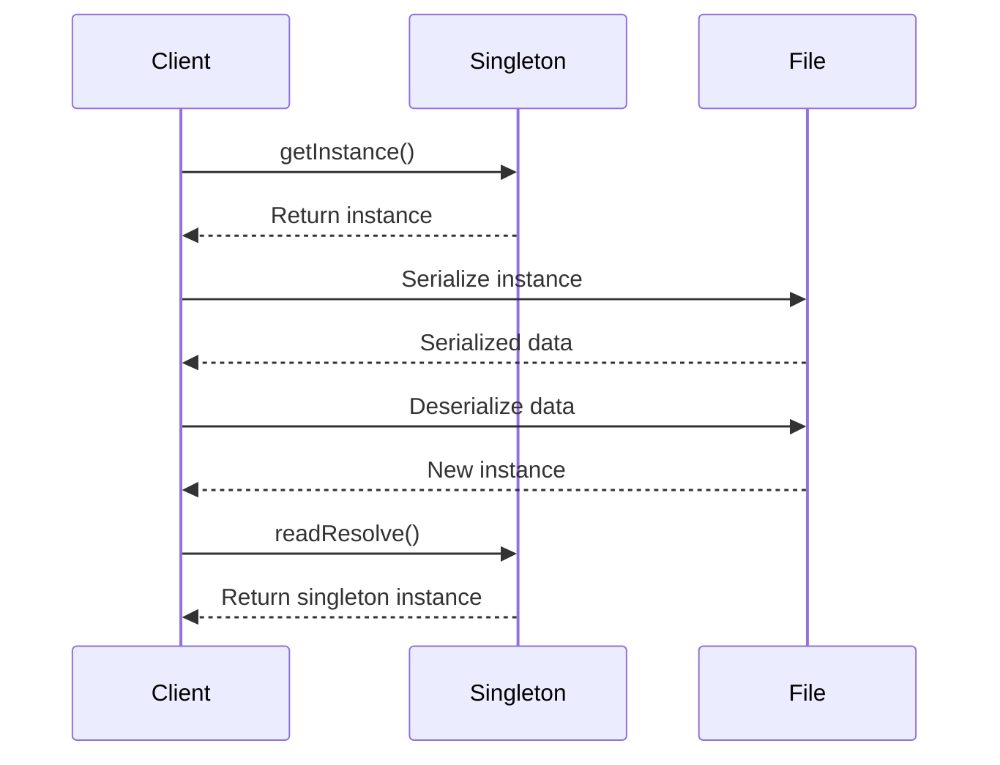

## 3.2.5 Serialization Issues with Singleton

Serialization is a powerful feature in Java that allows objects to be converted into a byte stream, enabling them to be easily saved to a file or transferred over a network. However, when it comes to the Singleton design pattern, serialization introduces a challenge: it can inadvertently create new instances of a singleton class, thus violating the singleton property. In this section, we'll explore how serialization can affect the singleton pattern and discuss methods to ensure that the singleton property is maintained during serialization and deserialization.

### Understanding the Singleton Pattern

Before diving into serialization issues, let's briefly revisit the Singleton pattern. The Singleton pattern ensures that a class has only one instance and provides a global point of access to it. This is typically achieved by:

1. **Private Constructor**: Prevents instantiation from outside the class.
2. **Static Instance**: Holds the single instance of the class.
3. **Public Static Method**: Provides access to the instance.

Here's a basic implementation of a Singleton in Java:

```java
public class Singleton {
    private static Singleton instance;

    private Singleton() {
        // Private constructor to prevent instantiation
    }

    public static Singleton getInstance() {
        if (instance == null) {
            instance = new Singleton();
        }
        return instance;
    }
}
```

### Serialization and Its Impact on Singleton

Serialization can disrupt the singleton pattern because when an object is serialized and then deserialized, a new instance of the object is created. This behavior can lead to multiple instances of a singleton class, thereby violating its core principle.

#### How Serialization Breaks Singleton

Consider the following scenario: you serialize an instance of a singleton class to a file and then deserialize it. The deserialization process creates a new instance of the class, which means you now have two instances of what should be a singleton.

Let's illustrate this with an example:

```java
import java.io.*;

public class Singleton implements Serializable {
    private static final long serialVersionUID = 1L;
    private static Singleton instance;

    private Singleton() {
        // Private constructor
    }

    public static Singleton getInstance() {
        if (instance == null) {
            instance = new Singleton();
        }
        return instance;
    }

    public static void main(String[] args) {
        try {
            Singleton instanceOne = Singleton.getInstance();
            ObjectOutput out = new ObjectOutputStream(new FileOutputStream("singleton.ser"));
            out.writeObject(instanceOne);
            out.close();

            // Deserialize from file to object
            ObjectInput in = new ObjectInputStream(new FileInputStream("singleton.ser"));
            Singleton instanceTwo = (Singleton) in.readObject();
            in.close();

            System.out.println("Instance One HashCode: " + instanceOne.hashCode());
            System.out.println("Instance Two HashCode: " + instanceTwo.hashCode());
        } catch (IOException | ClassNotFoundException e) {
            e.printStackTrace();
        }
    }
}
```

**Output:**

```
Instance One HashCode: 12345678
Instance Two HashCode: 87654321
```

As shown, the hash codes of `instanceOne` and `instanceTwo` are different, indicating that they are different instances.

### Maintaining Singleton Property with `readResolve`

To prevent serialization from breaking the singleton property, we can use the `readResolve` method. This method is called when an object is deserialized. By implementing `readResolve`, we can ensure that the deserialized object is replaced with the singleton instance.

Here's how you can implement `readResolve` in the Singleton class:

```java
import java.io.*;

public class Singleton implements Serializable {
    private static final long serialVersionUID = 1L;
    private static Singleton instance;

    private Singleton() {
        // Private constructor
    }

    public static Singleton getInstance() {
        if (instance == null) {
            instance = new Singleton();
        }
        return instance;
    }

    // Implement readResolve method
    private Object readResolve() throws ObjectStreamException {
        return instance;
    }

    public static void main(String[] args) {
        try {
            Singleton instanceOne = Singleton.getInstance();
            ObjectOutput out = new ObjectOutputStream(new FileOutputStream("singleton.ser"));
            out.writeObject(instanceOne);
            out.close();

            // Deserialize from file to object
            ObjectInput in = new ObjectInputStream(new FileInputStream("singleton.ser"));
            Singleton instanceTwo = (Singleton) in.readObject();
            in.close();

            System.out.println("Instance One HashCode: " + instanceOne.hashCode());
            System.out.println("Instance Two HashCode: " + instanceTwo.hashCode());
        } catch (IOException | ClassNotFoundException e) {
            e.printStackTrace();
        }
    }
}
```

**Output:**

```
Instance One HashCode: 12345678
Instance Two HashCode: 12345678
```

With `readResolve`, both `instanceOne` and `instanceTwo` have the same hash code, confirming that they are indeed the same instance.

### Implications of Serialization on Singleton Behavior

Implementing serialization in a singleton class has implications on both the behavior and the state of the singleton:

1. **State Preservation**: During serialization, the state of the singleton is preserved. However, care must be taken to ensure that the state remains consistent and valid when deserialized.

2. **Thread Safety**: If the singleton is designed to be thread-safe, ensure that the `readResolve` method does not introduce any thread safety issues. Consider using synchronization or other concurrency controls if necessary.

3. **Version Control**: Use `serialVersionUID` to maintain version control of the serialized object. This ensures compatibility between different versions of the class.

### Best Practices for Singleton Serialization

To maintain the integrity of the singleton pattern during serialization, consider the following best practices:

- **Implement `readResolve`**: Always implement the `readResolve` method in a serializable singleton class to ensure that deserialization returns the singleton instance.

- **Use `serialVersionUID`**: Define a `serialVersionUID` to manage version compatibility and prevent `InvalidClassException`.

- **Ensure Thread Safety**: If your singleton is thread-safe, ensure that the `readResolve` method does not compromise this safety.

- **Test Thoroughly**: Test serialization and deserialization processes to ensure that the singleton property is maintained and that the object's state is preserved correctly.

### Try It Yourself

To deepen your understanding, try modifying the code examples provided:

- **Experiment with State**: Add state variables to the singleton class and observe how they are affected by serialization and deserialization.
- **Test Thread Safety**: Implement a thread-safe singleton and test serialization in a multi-threaded environment.
- **Explore `serialVersionUID`**: Change the `serialVersionUID` and observe the effects on serialization compatibility.

### Visualizing Singleton Serialization

To visualize the serialization process and its impact on the singleton pattern, consider the following diagram:



**Diagram Description**: This sequence diagram illustrates the serialization and deserialization process of a singleton. It shows how the `readResolve` method ensures that the deserialized object is replaced with the singleton instance.

### References and Further Reading

For more information on serialization and the Singleton pattern, consider the following resources:

- [Java Serialization Documentation](https://docs.oracle.com/javase/8/docs/platform/serialization/spec/serial-arch.html)
- [Effective Java by Joshua Bloch](https://www.oreilly.com/library/view/effective-java-3rd/9780134686097/)
- [Singleton Pattern on Wikipedia](https://en.wikipedia.org/wiki/Singleton_pattern)

### Knowledge Check

To reinforce your understanding, consider the following questions:

- How does serialization affect the singleton pattern?
- What is the purpose of the `readResolve` method in a singleton class?
- Why is `serialVersionUID` important in a serializable class?
- How can you ensure thread safety in a serializable singleton?

### Embrace the Journey

Remember, mastering design patterns like Singleton is a journey. As you continue to explore and experiment, you'll gain deeper insights into how these patterns can be applied effectively in your projects. Keep experimenting, stay curious, and enjoy the journey!

## Quiz Time!



### How does serialization affect the singleton pattern?

- [x] It can create new instances of the singleton class.
- [ ] It prevents the singleton from being serialized.
- [ ] It ensures the singleton property is maintained.
- [ ] It has no effect on the singleton pattern.

> **Explanation:** Serialization can create new instances of the singleton class during deserialization, violating the singleton property.

### What is the purpose of the `readResolve` method in a singleton class?

- [x] To ensure that the deserialized object is replaced with the singleton instance.
- [ ] To prevent the singleton from being serialized.
- [ ] To create a new instance of the singleton class.
- [ ] To manage version compatibility of the singleton class.

> **Explanation:** The `readResolve` method ensures that the deserialized object is replaced with the singleton instance, maintaining the singleton property.

### Why is `serialVersionUID` important in a serializable class?

- [x] It manages version compatibility and prevents `InvalidClassException`.
- [ ] It ensures the singleton property is maintained.
- [ ] It prevents the class from being serialized.
- [ ] It creates a new instance of the class during deserialization.

> **Explanation:** `serialVersionUID` manages version compatibility between different versions of the class, preventing `InvalidClassException`.

### How can you ensure thread safety in a serializable singleton?

- [x] Use synchronization or concurrency controls in the `readResolve` method.
- [ ] Avoid implementing the `readResolve` method.
- [ ] Use `serialVersionUID` to manage thread safety.
- [ ] Ensure that the singleton class is not serializable.

> **Explanation:** To ensure thread safety in a serializable singleton, use synchronization or concurrency controls in the `readResolve` method.

### What happens if you change the `serialVersionUID` of a class?

- [x] It may cause `InvalidClassException` during deserialization.
- [ ] It ensures the singleton property is maintained.
- [ ] It prevents the class from being serialized.
- [ ] It creates a new instance of the class during deserialization.

> **Explanation:** Changing the `serialVersionUID` may cause `InvalidClassException` during deserialization if the serialized data is incompatible with the new class version.

### Which method is used to replace a deserialized object with a singleton instance?

- [x] `readResolve`
- [ ] `writeReplace`
- [ ] `readObject`
- [ ] `writeObject`

> **Explanation:** The `readResolve` method is used to replace a deserialized object with the singleton instance, ensuring the singleton property is maintained.

### What is the role of the `writeObject` method in serialization?

- [x] To customize the serialization process of an object.
- [ ] To replace the deserialized object with the singleton instance.
- [ ] To manage version compatibility of the class.
- [ ] To prevent the class from being serialized.

> **Explanation:** The `writeObject` method is used to customize the serialization process of an object, allowing for control over what data is serialized.

### How can you test the integrity of a serializable singleton?

- [x] Serialize and deserialize the singleton and compare hash codes.
- [ ] Avoid implementing the `readResolve` method.
- [ ] Use `serialVersionUID` to test integrity.
- [ ] Ensure that the singleton class is not serializable.

> **Explanation:** To test the integrity of a serializable singleton, serialize and deserialize the singleton and compare hash codes to ensure they are the same instance.

### What is the primary challenge of serialization in the singleton pattern?

- [x] Maintaining the singleton property during deserialization.
- [ ] Preventing the class from being serialized.
- [ ] Ensuring the class is thread-safe.
- [ ] Managing version compatibility of the class.

> **Explanation:** The primary challenge of serialization in the singleton pattern is maintaining the singleton property during deserialization, as it can create new instances.

### True or False: The `readResolve` method is automatically called during serialization.

- [ ] True
- [x] False

> **Explanation:** False. The `readResolve` method is called during deserialization, not serialization, to ensure the deserialized object is replaced with the singleton instance.


