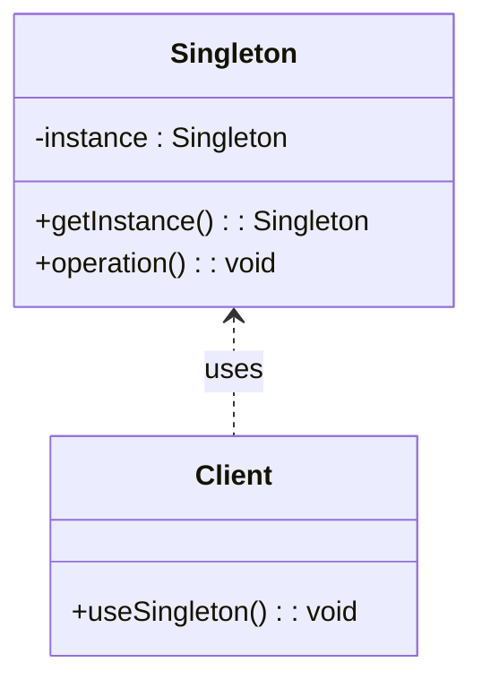

## 3.2.6 Use Cases and Examples

The Singleton pattern is a creational design pattern that ensures a class has only one instance and provides a global point of access to it. This pattern is particularly useful in scenarios where a single instance of a class is required to coordinate actions across a system. In this section, we will explore practical use cases where the Singleton pattern is effectively applied, such as configuration managers, logging mechanisms, caching, and thread pools. We will also discuss the impact of using the Singleton pattern on application design and resource management, providing code snippets to illustrate its usage.

### Configuration or Settings Managers

**Why Use Singleton?**

Configuration managers are a classic example of where the Singleton pattern shines. In most applications, there is a need to access configuration settings from various parts of the application. These settings might include database connection strings, API keys, or user preferences. Having a single instance of a configuration manager ensures consistency and prevents the overhead of reloading configuration data multiple times.

**Example Code**

```java
public class ConfigurationManager {
    private static ConfigurationManager instance;
    private Properties configProperties;

    private ConfigurationManager() {
        // Load configuration properties from a file
        configProperties = new Properties();
        try (InputStream input = new FileInputStream("config.properties")) {
            configProperties.load(input);
        } catch (IOException ex) {
            ex.printStackTrace();
        }
    }

    public static ConfigurationManager getInstance() {
        if (instance == null) {
            synchronized (ConfigurationManager.class) {
                if (instance == null) {
                    instance = new ConfigurationManager();
                }
            }
        }
        return instance;
    }

    public String getProperty(String key) {
        return configProperties.getProperty(key);
    }
}
```

**Impact on Application Design**

Using a Singleton for configuration management centralizes the control of configuration data, making it easier to manage and update. It also reduces the risk of inconsistent data across different parts of the application.

### Logging Mechanisms

**Why Use Singleton?**

Logging is another domain where the Singleton pattern is beneficial. A logging mechanism typically needs to be accessed from various parts of an application. Ensuring a single instance of the logger prevents the creation of multiple log files or streams, which could lead to confusion and inefficiency.

**Example Code**

```java
public class Logger {
    private static Logger instance;
    private BufferedWriter logWriter;

    private Logger() {
        try {
            logWriter = new BufferedWriter(new FileWriter("app.log", true));
        } catch (IOException e) {
            e.printStackTrace();
        }
    }

    public static Logger getInstance() {
        if (instance == null) {
            synchronized (Logger.class) {
                if (instance == null) {
                    instance = new Logger();
                }
            }
        }
        return instance;
    }

    public void log(String message) {
        try {
            logWriter.write(message);
            logWriter.newLine();
            logWriter.flush();
        } catch (IOException e) {
            e.printStackTrace();
        }
    }
}
```

**Impact on Application Design**

A Singleton logger ensures that all logging activities are centralized, making it easier to manage log files and maintain a consistent logging format. It also simplifies the process of changing the logging destination or format, as these changes need to be made in only one place.

### Caching

**Why Use Singleton?**

Caching is a technique used to store frequently accessed data in memory to improve application performance. A Singleton cache manager can be used to store and retrieve cached data, ensuring that the cache is consistent and accessible from anywhere in the application.

**Example Code**

```java
public class CacheManager {
    private static CacheManager instance;
    private Map<String, Object> cache;

    private CacheManager() {
        cache = new HashMap<>();
    }

    public static CacheManager getInstance() {
        if (instance == null) {
            synchronized (CacheManager.class) {
                if (instance == null) {
                    instance = new CacheManager();
                }
            }
        }
        return instance;
    }

    public void put(String key, Object value) {
        cache.put(key, value);
    }

    public Object get(String key) {
        return cache.get(key);
    }
}
```

**Impact on Application Design**

A Singleton cache manager reduces the need for redundant data retrieval operations, improving application performance. It also simplifies the management of cached data, as all caching operations are centralized.

### Thread Pools

**Why Use Singleton?**

Thread pools are used to manage a pool of worker threads that can be reused to execute tasks. A Singleton thread pool manager ensures that there is only one pool of threads, preventing the overhead of creating and destroying threads repeatedly.

**Example Code**

```java
import java.util.concurrent.ExecutorService;
import java.util.concurrent.Executors;

public class ThreadPoolManager {
    private static ThreadPoolManager instance;
    private ExecutorService executorService;

    private ThreadPoolManager() {
        executorService = Executors.newFixedThreadPool(10);
    }

    public static ThreadPoolManager getInstance() {
        if (instance == null) {
            synchronized (ThreadPoolManager.class) {
                if (instance == null) {
                    instance = new ThreadPoolManager();
                }
            }
        }
        return instance;
    }

    public void executeTask(Runnable task) {
        executorService.execute(task);
    }

    public void shutdown() {
        executorService.shutdown();
    }
}
```

**Impact on Application Design**

Using a Singleton for thread pool management ensures efficient use of system resources by reusing threads. It also simplifies task management, as tasks can be submitted to a single, centralized pool.

### Critical Assessment of Singleton Pattern

While the Singleton pattern offers several benefits, it is important to critically assess its use in application design. The Singleton pattern can lead to issues such as:

- **Global State**: Singletons introduce a global state into an application, which can make it difficult to manage dependencies and testability.
- **Concurrency**: Implementing a thread-safe Singleton can be complex and error-prone.
- **Dependency Management**: Over-reliance on Singletons can lead to tightly coupled code, making it difficult to change or extend functionality.

**When to Use Singleton**

- When a single instance of a class is required to coordinate actions across the system.
- When the class is stateless or has a small state that does not change frequently.
- When the class is not involved in complex interactions with other classes.

**When to Avoid Singleton**

- When the class has a large state that changes frequently.
- When the class is involved in complex interactions with other classes.
- When testability and flexibility are priorities.

### Try It Yourself

To deepen your understanding of the Singleton pattern, try modifying the code examples provided:

- **Configuration Manager**: Add a method to reload the configuration properties at runtime.
- **Logger**: Implement a method to change the log file destination.
- **Cache Manager**: Add a method to clear the cache.
- **Thread Pool Manager**: Experiment with different thread pool sizes and observe the impact on application performance.

### Visualizing Singleton Pattern

To better understand the Singleton pattern, let's visualize the relationship between the Singleton class and its clients.



**Diagram Description**: This class diagram illustrates the Singleton pattern. The `Singleton` class has a private static instance and a public static method `getInstance()` to access the single instance. The `Client` class uses the Singleton instance to perform operations.

### References and Links

- [Oracle Java Documentation](https://docs.oracle.com/javase/tutorial/java/concepts/index.html)
- [Design Patterns: Elements of Reusable Object-Oriented Software](https://en.wikipedia.org/wiki/Design_Patterns) by Erich Gamma, Richard Helm, Ralph Johnson, and John Vlissides
- [Java Concurrency in Practice](https://jcip.net/) by Brian Goetz

## Quiz Time!



### Which of the following is a common use case for the Singleton pattern?

- [x] Configuration managers
- [ ] User interface components
- [ ] Database entities
- [ ] Network sockets

> **Explanation:** Configuration managers are a common use case for the Singleton pattern because they require a single instance to manage application settings consistently.


### What is a potential drawback of using the Singleton pattern?

- [x] It introduces a global state
- [ ] It simplifies dependency management
- [ ] It improves testability
- [ ] It enhances flexibility

> **Explanation:** The Singleton pattern introduces a global state, which can complicate dependency management and reduce testability.


### In the context of logging, why is the Singleton pattern beneficial?

- [x] It centralizes logging activities
- [ ] It allows multiple log files
- [ ] It increases logging complexity
- [ ] It requires multiple instances

> **Explanation:** The Singleton pattern centralizes logging activities, ensuring consistency and simplifying log management.


### How does a Singleton cache manager improve application performance?

- [x] By reducing redundant data retrieval operations
- [ ] By increasing memory usage
- [ ] By duplicating cached data
- [ ] By complicating cache management

> **Explanation:** A Singleton cache manager improves performance by reducing redundant data retrieval operations, thus speeding up access to frequently used data.


### Which of the following is NOT a benefit of using a Singleton thread pool manager?

- [ ] Efficient use of system resources
- [ ] Simplified task management
- [x] Increased thread creation
- [ ] Centralized task submission

> **Explanation:** A Singleton thread pool manager does not increase thread creation; instead, it reuses threads to manage tasks efficiently.


### When should you avoid using the Singleton pattern?

- [x] When testability and flexibility are priorities
- [ ] When a single instance is needed
- [ ] When the class is stateless
- [ ] When the class has a small state

> **Explanation:** Avoid using the Singleton pattern when testability and flexibility are priorities, as it can lead to tightly coupled code.


### What is a key feature of the Singleton pattern?

- [x] It ensures a class has only one instance
- [ ] It allows multiple instances of a class
- [ ] It decentralizes control
- [ ] It complicates resource management

> **Explanation:** The Singleton pattern ensures that a class has only one instance, providing a global point of access.


### In a Singleton pattern, what is the purpose of the `getInstance()` method?

- [x] To provide access to the single instance
- [ ] To create multiple instances
- [ ] To delete the instance
- [ ] To reset the instance

> **Explanation:** The `getInstance()` method provides access to the single instance of the Singleton class.


### What is the impact of using a Singleton for configuration management?

- [x] Centralized control of configuration data
- [ ] Increased risk of inconsistent data
- [ ] Decentralized configuration management
- [ ] Increased complexity in updating configurations

> **Explanation:** Using a Singleton for configuration management centralizes control, reducing the risk of inconsistent data.


### True or False: The Singleton pattern is always the best choice for managing shared resources.

- [ ] True
- [x] False

> **Explanation:** False. While the Singleton pattern is useful for managing shared resources, it is not always the best choice due to potential drawbacks like global state and reduced testability.


